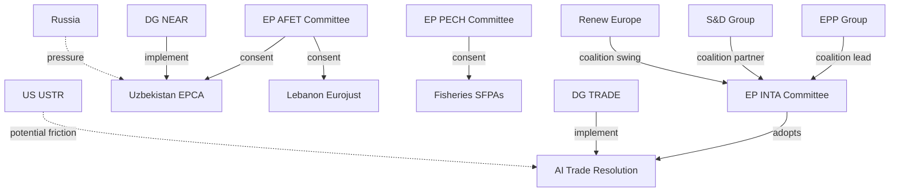

<!-- SPDX-FileCopyrightText: 2026 Hack23 AB -->
<!-- SPDX-License-Identifier: Apache-2.0 -->

# Actor Mapping — EP Breaking News | 2026-05-22

**Classification:** PUBLIC | **Data Mode:** degraded-feeds | **Confidence:** 🟡 MEDIUM

---

## Primary Actors

### Legislative Actors

| Actor | Role | Alignment | Influence |
|-------|------|-----------|-----------|
| EP INTA Committee | AI trade resolution lead | Pro-EU trade strategy | HIGH |
| EP AFET Committee | External agreements consent | Pro-enlargement/partnerships | HIGH |
| EP PECH Committee | Fisheries SFPAs | National industry support | MEDIUM |
| EP JURI Committee | Immunity waivers | Rule of law | LOW-MEDIUM |
| EPP Group | Centre-right majority anchor | Pro-competitiveness | HIGH |
| S&D Group | Centre-left majority partner | Pro-digital rights | HIGH |
| Renew Europe | Liberal swing coalition | Pro-trade/multilateral | HIGH |
| ECR Group | Right-conservative opposition | Split on multilateralism | MEDIUM |
| PfE Group | Far-right nationalist | Anti-multilateral | MEDIUM (opposition) |
| Greens/EFA | Green/regionalist progressive | Pro-sustainability standards | MEDIUM |

### Executive Actors

| Actor | Role | Alignment | Influence |
|-------|------|-----------|-----------|
| Commission DG TRADE | AI trade strategy implementation | Pro-competitiveness | VERY HIGH |
| Commission DG NEAR | Uzbekistan/Lebanon implementation | Pro-partnerships | HIGH |
| Commission DG MARE | Fisheries SFPA management | SFPA continuity | MEDIUM |
| Von der Leyen Commission | Overall strategic direction | Competitiveness agenda | VERY HIGH |

### Third-Country Actors

| Actor | Country/Org | Position on May 2026 Items | Influence |
|-------|------------|--------------------------|-----------|
| Uzbek President Mirziyoyev | Uzbekistan | Strongly pro-EPCA | HIGH |
| Lebanese Ministry of Justice | Lebanon | Pro-Eurojust | MEDIUM |
| São Tomé government | São Tomé | Pro-SFPA (revenue) | LOW |
| Cook Islands government | Cook Islands | Pro-SFPA (revenue+access mgmt) | LOW |
| USTR (US Trade Representative) | United States | Concerned about AI trade | HIGH |
| MOFCOM (China) | China | Opposed to AI governance export | HIGH |
| Russian government | Russia | Opposed to Uzbekistan EPCA | HIGH |

---

## Actor Network Map

---

## Actor Influence-Position Matrix

| Actor | Position Strength | Alignment with EU Output | Strategic Threat |
|-------|-----------------|-------------------------|-----------------|
| DG TRADE | Very High | Must implement | Non-response risk |
| EPP Group | Very High | Supportive | None |
| US USTR | High | Concerned/opposed | Trade friction |
| Russia | High | Strongly opposed | EPCA disruption |
| China | High | Opposed (AI) | Standards competition |
| Uzbek government | High | Supportive | Implementation gaps |
| S&D Group | High | Supportive | Conditionality demands |
| Lebanese MoJ | Medium | Supportive | Stability risk |
| Fisheries states | Low | Supportive | None |
