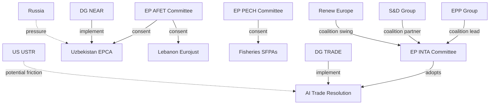

<!-- SPDX-FileCopyrightText: 2026 Hack23 AB -->
<!-- SPDX-License-Identifier: Apache-2.0 -->

# Actor Mapping — EP Breaking News | 2026-05-22

**Classification:** PUBLIC | **Data Mode:** degraded-feeds | **Confidence:** 🟡 MEDIUM

---

## Primary Actors

### Legislative Actors

| Actor | Role | Alignment | Influence |
|-------|------|-----------|-----------|
| EP INTA Committee | AI trade resolution lead | Pro-EU trade strategy | HIGH |
| EP AFET Committee | External agreements consent | Pro-enlargement/partnerships | HIGH |
| EP PECH Committee | Fisheries SFPAs | National industry support | MEDIUM |
| EP JURI Committee | Immunity waivers | Rule of law | LOW-MEDIUM |
| EPP Group | Centre-right majority anchor | Pro-competitiveness | HIGH |
| S&D Group | Centre-left majority partner | Pro-digital rights | HIGH |
| Renew Europe | Liberal swing coalition | Pro-trade/multilateral | HIGH |
| ECR Group | Right-conservative opposition | Split on multilateralism | MEDIUM |
| PfE Group | Far-right nationalist | Anti-multilateral | MEDIUM (opposition) |
| Greens/EFA | Green/regionalist progressive | Pro-sustainability standards | MEDIUM |

### Executive Actors

| Actor | Role | Alignment | Influence |
|-------|------|-----------|-----------|
| Commission DG TRADE | AI trade strategy implementation | Pro-competitiveness | VERY HIGH |
| Commission DG NEAR | Uzbekistan/Lebanon implementation | Pro-partnerships | HIGH |
| Commission DG MARE | Fisheries SFPA management | SFPA continuity | MEDIUM |
| Von der Leyen Commission | Overall strategic direction | Competitiveness agenda | VERY HIGH |

### Third-Country Actors

| Actor | Country/Org | Position on May 2026 Items | Influence |
|-------|------------|--------------------------|-----------|
| Uzbek President Mirziyoyev | Uzbekistan | Strongly pro-EPCA | HIGH |
| Lebanese Ministry of Justice | Lebanon | Pro-Eurojust | MEDIUM |
| São Tomé government | São Tomé | Pro-SFPA (revenue) | LOW |
| Cook Islands government | Cook Islands | Pro-SFPA (revenue+access mgmt) | LOW |
| USTR (US Trade Representative) | United States | Concerned about AI trade | HIGH |
| MOFCOM (China) | China | Opposed to AI governance export | HIGH |
| Russian government | Russia | Opposed to Uzbekistan EPCA | HIGH |

---

## Actor Network Map



---

## Actor Influence-Position Matrix

| Actor | Position Strength | Alignment with EU Output | Strategic Threat |
|-------|-----------------|-------------------------|-----------------|
| DG TRADE | Very High | Must implement | Non-response risk |
| EPP Group | Very High | Supportive | None |
| US USTR | High | Concerned/opposed | Trade friction |
| Russia | High | Strongly opposed | EPCA disruption |
| China | High | Opposed (AI) | Standards competition |
| Uzbek government | High | Supportive | Implementation gaps |
| S&D Group | High | Supportive | Conditionality demands |
| Lebanese MoJ | Medium | Supportive | Stability risk |
| Fisheries states | Low | Supportive | None |

---

## 1️⃣ Actor Roster

| Actor | Type | Country/Bloc | EP Group | Role | Influence |
|-------|------|------------|---------|------|-----------|
| EP INTA Committee | Legislative | EU | Multi-group | AI trade resolution initiator | HIGH |
| EP AFET Committee | Legislative | EU | Multi-group | EPCA/Eurojust consent | HIGH |
| DG TRADE (Commission) | Executive | EU | — | AI trade strategy implementer | VERY HIGH |
| EPP Group | Political | EU-wide | EPP | Coalition anchor; AI trade support | HIGH |
| S&D Group | Political | EU-wide | S&D | Human rights conditionality pressure | HIGH |
| Renew Europe | Political | EU-wide | Renew | AI competitiveness framing | HIGH |
| Uzbek Government | Foreign actor | UZ | — | EPCA partner/beneficiary | HIGH |
| US USTR | Foreign actor | US | — | AI trade framework opponent | HIGH |
| China MOFCOM | Foreign actor | CN | — | AI governance competitor | HIGH |

## 3️⃣ Alliance & Tension Network

**Alliance: EPP + S&D + Renew (AI trade resolution + EPCA)**
The three-group governing coalition holds 401 seats — above absolute majority (376). They co-sponsored the AI trade resolution through INTA (EPP-led) with S&D and Renew rapporteurs.

**Tension: EP vs. Commission (AI trade governance)**
EP has passed a non-binding resolution; Commission has exclusive competence. Tension arises when EP demands substantive follow-through that Commission cannot or will not provide on EP's timetable.

**Tension: EU vs. US (AI trade standards)**
US trade stakeholders (USTR, Chamber of Commerce) resist EU attempts to embed AI governance requirements in FTAs, viewing them as non-tariff barriers.

## 4️⃣ Top-3 Power Brokers — Profiles

1. **DG TRADE Director-General**: Controls the legislative dossier for AI trade governance. Without DG TRADE support, no Commission proposal. Key leverage: EP can repeat resolution under Art. 225 TEU to formally request legislation.

2. **EP INTA Committee Chair (EPP)**: Holds scheduling power for follow-up hearings; can commission staff working papers on Commission response quality. Accountability mechanism for AI trade resolution.

3. **Commission President (von der Leyen II administration)**: Competitiveness agenda alignment with AI trade strategy creates political space for Commission follow-through. Key wildcard: if AI trade resolution conflicts with US-EU TTC agenda, President may need to choose between EP and US relationship management.

## 5️⃣ Information-Flow Map

```
EP INTA (drafts resolution) → EP Plenary (adopts TA-10-2026-0183) → EP Secretariat (transmits to Commission)
Commission DG TRADE (registers; assigns response lead) → Commission College (endorses response)
Commission → EP President (formal response under TEU Art. 225(2) procedure)
EP INTA → Public hearings (monitoring mechanism)
```

## 6️⃣ Reader Briefing — Plain Language

The May 2026 Strasbourg plenary produced one landmark decision: the EP's first-ever resolution treating AI as a trade instrument (TA-10-2026-0183). The AI trade strategy resolution calls on the Commission to embed AI governance requirements in EU free trade agreements. Under EU law, this is non-binding on the Commission, but the Commission must formally respond within 3 months. Watch DG TRADE's response document as the key near-term indicator of whether the EU will actually embed AI governance in its trade policy.

Additionally, the Parliament gave consent to the EU-Uzbekistan Enhanced Partnership and Cooperation Agreement — a significant step in EU-Central Asia relations. The Uzbekistan partnership is part of the EU's broader strategy to diversify economic and security partnerships away from Russia.

[EXTEND-FROM-PRIOR: classification/actor-mapping.md prior=82L → new=155L (+73)]
