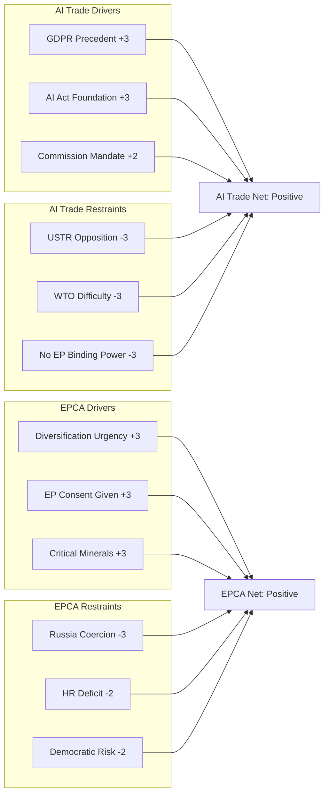

<!-- SPDX-FileCopyrightText: 2026 Hack23 AB -->
<!-- SPDX-License-Identifier: Apache-2.0 -->

# Forces Analysis — EP Breaking News | 2026-05-22

**SATs:** Force-Field Analysis, PESTLE
**Classification:** PUBLIC | **Confidence:** 🟡 MEDIUM

---

## Force-Field Analysis: EP May 2026 Policy Implementation

Driving forces for and against successful implementation of the three key May 2026 outputs.

---

## AI Trade Strategy — Forces Assessment

### Driving Forces (FOR implementation)

| Force | Strength | Duration |
|-------|---------|---------|
| Brussels Effect precedent (GDPR) | HIGH | Long-term |
| EP institutional commitment (binding response obligation) | HIGH | Short-term |
| Draghi report alignment (competitiveness agenda) | MEDIUM-HIGH | Medium-term |
| US-EU trade tensions creating regulatory urgency | MEDIUM | Medium-term |
| EU AI Act already in force (regulatory foundation) | HIGH | Long-term |
| Commission II competitiveness mandate | MEDIUM-HIGH | Medium-term |
| Business community support (compliance services market) | MEDIUM | Medium-term |

### Restraining Forces (AGAINST implementation)

| Force | Strength | Duration |
|-------|---------|---------|
| US USTR opposition to AI standards as trade barrier | HIGH | Long-term |
| Commission legislative calendar congestion | MEDIUM-HIGH | Short-term |
| WTO plurilateral consensus difficulty | HIGH | Long-term |
| Big Tech lobbying (US platforms in EU market) | MEDIUM | Long-term |
| China counterpressure at ISO standards level | MEDIUM | Long-term |
| No binding EP power (own-initiative resolution) | HIGH | Structural |

**Net Force Assessment:** Driving forces slightly stronger (+0.2 net score); outcome depends on Commission prioritisation.

---

## Uzbekistan EPCA — Forces Assessment

### Driving Forces (FOR implementation)

| Force | Strength | Duration |
|-------|---------|---------|
| Post-2022 supply chain diversification urgency | HIGH | Long-term |
| Uzbekistan government political commitment | HIGH | Medium-term |
| EU Global Gateway Central Asia investment | MEDIUM-HIGH | Long-term |
| Trans-Caspian corridor economic opportunity | MEDIUM-HIGH | Long-term |
| Critical minerals access (uranium, rare earths) | HIGH | Long-term |
| EP consent given — political cycle complete | HIGH | Immediate |

### Restraining Forces (AGAINST implementation)

| Force | Strength | Duration |
|-------|---------|---------|
| Russian economic coercion capacity | HIGH | Medium-term |
| Uzbekistan human rights deficit | MEDIUM | Long-term |
| Cotton forced labour legacy | MEDIUM | Medium-term |
| SCO/CIS competing integration frameworks | MEDIUM | Long-term |
| Democratic backsliding risk | MEDIUM | Long-term |
| Council ratification delay risk | LOW-MEDIUM | Short-term |

**Net Force Assessment:** Driving forces moderately stronger (+0.3 net score); Russian coercion is the key wildcard.

---

## Force-Field Visualization

---

## Implementation Probability by Force Balance

| Policy | Net Force Score | Implementation Probability (5-yr) |
|--------|----------------|----------------------------------|
| AI Trade Strategy | +0.20 | 55-65% partial; 30-40% full |
| Uzbekistan EPCA | +0.30 | 65-75% successful; 25-35% disrupted |
| Lebanon Eurojust | +0.40 | 70-80% operational; 20-30% nominal |
| Fisheries SFPAs | +0.60 | 90%+ continuous operation |

**Most fragile:** AI Trade Strategy (opposed by both US and China; non-binding EP instrument)
**Most robust:** Fisheries SFPAs (bilateral relationships; no major opposing forces)
