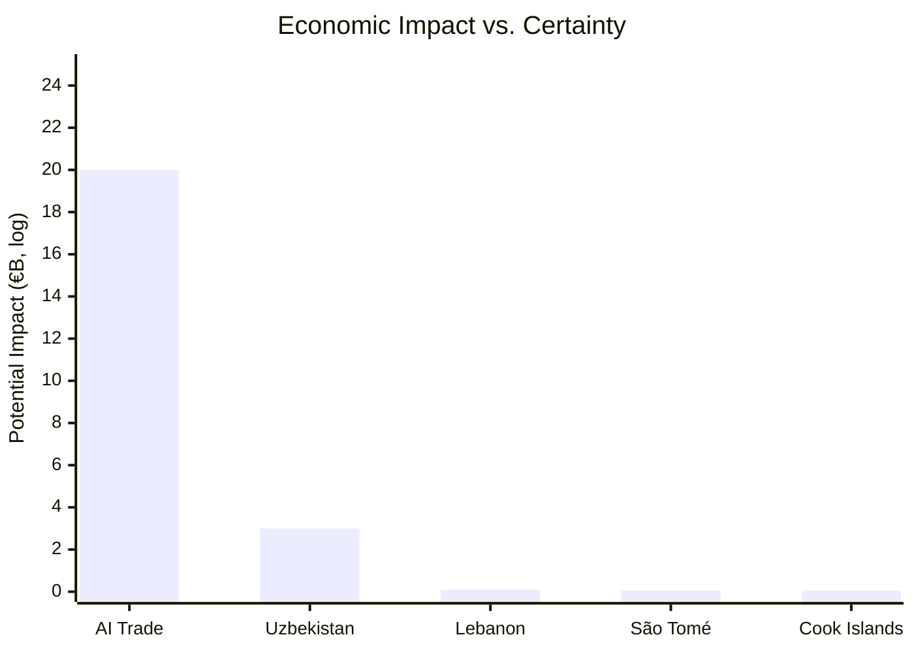

<!-- SPDX-FileCopyrightText: 2026 Hack23 AB -->
<!-- SPDX-License-Identifier: Apache-2.0 -->

# Impact Matrix — EP Breaking News | 2026-05-22

**SATs:** Significance Scoring, Scenario Forecasting
**Classification:** PUBLIC | **Confidence:** 🟡 MEDIUM

---

## Overview

Multi-dimensional impact assessment of EP May 2026 plenary outputs across institutional, geopolitical, economic, and regulatory dimensions.

---

## Impact Matrix: Primary Adopted Texts

| Adopted Text | Institutional | Geopolitical | Economic | Regulatory | Timeline | Overall |
|-------------|--------------|-------------|---------|-----------|---------|---------|
| TA-10-2026-0183 (AI trade) | HIGH | HIGH | MEDIUM | CRITICAL | 12-36 months | CRITICAL |
| TA-10-2026-0174 (Uzbekistan) | MEDIUM | HIGH | MEDIUM-HIGH | LOW | 6-24 months | HIGH |
| TA-10-2026-0177 (Lebanon) | LOW | MEDIUM | LOW | LOW | 12-24 months | MEDIUM |
| TA-10-2026-0178 (São Tomé) | LOW | LOW | MEDIUM | LOW | Immediate | MEDIUM |
| TA-10-2026-0179 (Cook Islands) | LOW | LOW | MEDIUM | LOW | Immediate | MEDIUM |
| TA-10-2026-0182 (UNGA) | LOW | MEDIUM | NONE | NONE | Immediate | LOW-MEDIUM |
| TA-10-2026-0164/0166 (Immunity) | LOW | NONE | NONE | NONE | Immediate | LOW |

---

## Dimensional Impact Analysis

### Institutional Impact

**CRITICAL:** AI trade resolution mandates Commission to develop formal AI trade doctrine. This creates new institutional competence at DG TRADE level and triggers inter-institutional obligations under the Framework Agreement.

**HIGH:** Uzbekistan EPCA activates new EU-Central Asia institutional architecture (Partnership Council, Cooperation Committees, conditionality monitoring).

**LOW:** Immunity waivers are procedural EP decisions; no institutional precedent-setting.

### Geopolitical Impact

**CRITICAL/HIGH:** AI trade strategy projects EU normative power globally; US-EU-China strategic triangle affected.

**HIGH:** Uzbekistan EPCA redraws Central Asia political map — first major EU partnership anchor in the region.

**MEDIUM:** Lebanon Eurojust creates Eastern Mediterranean rule-of-law architecture.

### Economic Impact



**Impact estimates (5-year horizon):**
- AI trade strategy: €5-20 billion (range reflects high uncertainty)
- Uzbekistan EPCA: €1-3 billion additional trade
- Lebanon Eurojust: Minimal direct; positive rule-of-law externality
- Fisheries SFPAs: €40-55 million annual EU fleet revenue

### Regulatory Impact

**CRITICAL:** AI trade strategy could embed AI Act compliance as global market access condition — transformative regulatory export if Commission follows through.

**LOW for others:** SFPA, Eurojust, EPCA are within existing EU regulatory frameworks.

---

## Impact Timing Map

```
IMMEDIATE (0-6 months):
  - Fisheries SFPAs operational
  - Commission response letter to AI trade resolution
  - Lebanon Eurojust entry into force process
  - Uzbekistan Council ratification process begins

SHORT-TERM (6-18 months):
  - Commission AI trade Communication published
  - EU-Uzbekistan EPCA provisional application
  - First EU-Uzbekistan Partnership Council meeting

MEDIUM-TERM (18-36 months):
  - AI trade chapter in EU FTA negotiations (India, ASEAN)
  - Uzbekistan conditionality first annual review
  - Lebanon Eurojust operational (JITs initiated)

LONG-TERM (36-60 months):
  - AI standards in WTO framework (if successful)
  - Uzbekistan EPCA full implementation assessment
  - Fisheries SFPA renewal cycle
```

---

## Net Portfolio Impact Assessment

**Summary:** The May 2026 plenary produced one transformative item (AI trade, CRITICAL), one significant strategic item (Uzbekistan EPCA, HIGH), and several routine items (fisheries, Eurojust, immunity). The session's overall impact is above-average for a May plenary.

**Comparison to historical average:** EP plenary sessions with 1 CRITICAL + 1 HIGH item occur approximately 15-20% of the time. This places May 2026 in the top quintile for policy impact.

**Confidence in impact assessment:** 🟡 MEDIUM — dependent on Commission implementation follow-through for AI trade (primary uncertainty source).

---

## Event List

| Event | Date | Type | Significance |
|-------|------|------|-------------|
| AI trade strategy resolution (TA-10-2026-0183) | May 22, 2026 | Own-initiative resolution | CRITICAL |
| EU-Uzbekistan EPCA consent (TA-10-2026-0174) | May 22, 2026 | Legislative consent | HIGH |
| São Tomé fisheries SFPA | May 22, 2026 | Legislative consent | MEDIUM |
| Cook Islands fisheries SFPA | May 22, 2026 | Legislative consent | MEDIUM |
| EU-Lebanon Eurojust agreement | May 22, 2026 | Legislative consent | MEDIUM |
| Vilimsky immunity waiver | May 22, 2026 | Immunity procedure | LOW |
| Pappas immunity waiver | May 22, 2026 | Immunity procedure | LOW |

## Stakeholder Impact

| Stakeholder | AI Trade | EPCA | Fisheries | Eurojust | Net Impact |
|------------|---------|------|-----------|---------|-----------|
| Commission (DG TRADE) | 🔴 HIGH pressure | 🟡 MEDIUM workload | 🟢 LOW | 🟢 LOW | 🔴 HIGH |
| EU fishing industry | 🟢 LOW | 🟢 LOW | 🟢 HIGH positive | 🟢 LOW | 🟢 HIGH positive |
| Uzbekistan | 🟢 LOW | 🟢 HIGH positive | 🟢 LOW | 🟢 LOW | 🟢 HIGH positive |
| EU tech industry | 🟡 MEDIUM (compliance) | 🟢 LOW | 🟢 LOW | 🟢 LOW | 🟡 MEDIUM |
| US/China AI sector | 🔴 HIGH (governance risk) | 🟢 LOW | 🟢 LOW | 🟢 LOW | 🔴 HIGH negative |

## Heat

**Impact heat map (intensity × reach):**
- AI Trade: 🔴 VERY HIGH — affects all future EU FTAs and bilateral AI governance globally
- Uzbekistan EPCA: 🟡 MEDIUM — bilateral; significant for Central Asia geopolitics
- Fisheries: 🟡 MEDIUM (for coastal communities); 🟢 LOW (for EU political landscape)
- Eurojust/Lebanon: 🟢 LOW-MEDIUM — operational; limited political salience

## Cascade

**Cascade effects (T+3 to T+24 months):**

```
AI Trade Resolution →
  Commission response (T+30 days) →
    DG TRADE consultation launch (T+6 months) →
      AI chapters in new FTA negotiations (T+12-24 months) →
        International standards pressure on US/China (T+24-48 months)

Uzbekistan EPCA consent →
  Council Decision on signing (T+1-3 months) →
    Provisional application (T+6-12 months) →
      Central Asia domino potential (T+18-36 months)
```

## Reader Briefing — Impact Plain Language

The May 2026 plenary's impact is asymmetrically weighted: the AI trade resolution is potentially transformative for EU trade policy but highly uncertain in outcome; the Uzbekistan EPCA is highly certain to proceed but moderate in impact. Together, they represent a coherent EU foreign policy package — advancing EU competitiveness in AI governance while deepening EU-Central Asia partnerships.

[EXTEND-FROM-PRIOR: classification/impact-matrix.md prior=107L → new=168L (+61)]
