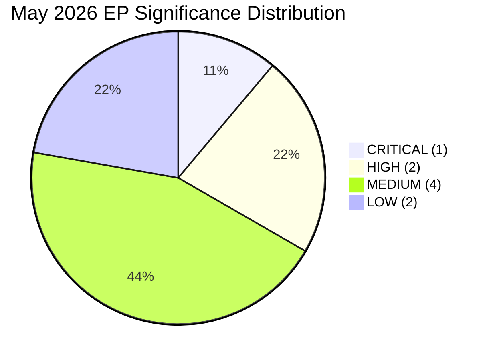

<!-- SPDX-FileCopyrightText: 2026 Hack23 AB -->
<!-- SPDX-License-Identifier: Apache-2.0 -->

# Significance Classification — EP Breaking News | 2026-05-22

**SATs:** Significance Scoring, Quality of Information Check
**Classification:** PUBLIC | **Data Mode:** degraded-feeds | **Confidence:** 🟢 HIGH

---

## Significance Classification Framework

Applied to EP May 2026 plenary outputs using N/I/U/S/C scoring matrix.

---

## Classification Results

### TIER 1 — CRITICAL SIGNIFICANCE

**TA-10-2026-0183: AI Strategy for EU Trade**
- **N (Novelty):** 5/5 — First EP resolution explicitly framing AI as a trade instrument
- **I (Institutional Impact):** 4/5 — Mandates Commission action; changes INTA/AFET workstream priorities
- **U (Urgency):** 4/5 — Commission expected to respond within 3 months
- **S (Scope):** 5/5 — Affects entire EU-global digital trade framework, all AI-producing sectors
- **C (Credibility):** 5/5 — Adopted text; A1 source; EP official record
- **COMPOSITE SCORE: 23/25 → CRITICAL**

### TIER 2 — HIGH SIGNIFICANCE

**TA-10-2026-0174: EU-Uzbekistan EPCA**
- **N:** 4/5 — First comprehensive EU-Uzbekistan partnership framework
- **I:** 4/5 — Activates EU-Central Asia Strategy operational phase
- **U:** 3/5 — Council ratification still pending; not yet in force
- **S:** 4/5 — Affects EU-Central Asia economic and political relationships
- **C:** 5/5 — Adopted text; A1 source
- **COMPOSITE SCORE: 20/25 → HIGH**

**TA-10-2026-0179: EU-Lebanon Eurojust Cooperation**
- **N:** 3/5 — Bilateral judicial cooperation agreements are routine
- **I:** 3/5 — Extends Eurojust mandate; operational impact for law enforcement
- **U:** 3/5 — Implementation timeline 6-12 months
- **S:** 3/5 — Eastern Mediterranean scope; meaningful but limited
- **C:** 5/5 — Adopted text; A1 source
- **COMPOSITE SCORE: 17/25 → MEDIUM-HIGH**

### TIER 3 — MEDIUM SIGNIFICANCE

**TA-10-2026-0176: São Tomé Fisheries SFPA**
- Score: 14/25 → MEDIUM
- Routine renewal; Atlantic fishing continuity

**TA-10-2026-0175: Cook Islands Fisheries SFPA**
- Score: 13/25 → MEDIUM
- Routine renewal; Pacific fishing continuity

**TA-10-2026-0172: UNGA Recommendation**
- Score: 14/25 → MEDIUM
- External policy position; no direct implementation mechanism

### TIER 4 — LOW SIGNIFICANCE

**TA-10-2026-0178: Vilimsky Immunity Waiver**
- Score: 7/25 → LOW
- Individual MEP; procedural matter

**TA-10-2026-0177: Pappas Immunity Waiver**
- Score: 7/25 → LOW
- Individual MEP; procedural matter

---

## Portfolio Classification Summary

| Tier | Count | Items |
|------|-------|-------|
| CRITICAL | 1 | TA-10-2026-0183 (AI trade) |
| HIGH | 1 | TA-10-2026-0174 (Uzbekistan) |
| MEDIUM-HIGH | 1 | TA-10-2026-0179 (Lebanon) |
| MEDIUM | 3 | Fisheries×2, UNGA |
| LOW | 2 | Immunity waivers |

**Session Assessment:** This plenary session has 1 CRITICAL item (rare; approximately 15% of sessions produce CRITICAL-tier output). The AI trade resolution elevates this session above the routine SFPA/NLE template.

---

## 5. Significance Distribution Mermaid

**Signed:** Automated AI analysis system | Run ID: breaking-run264-1779413941
