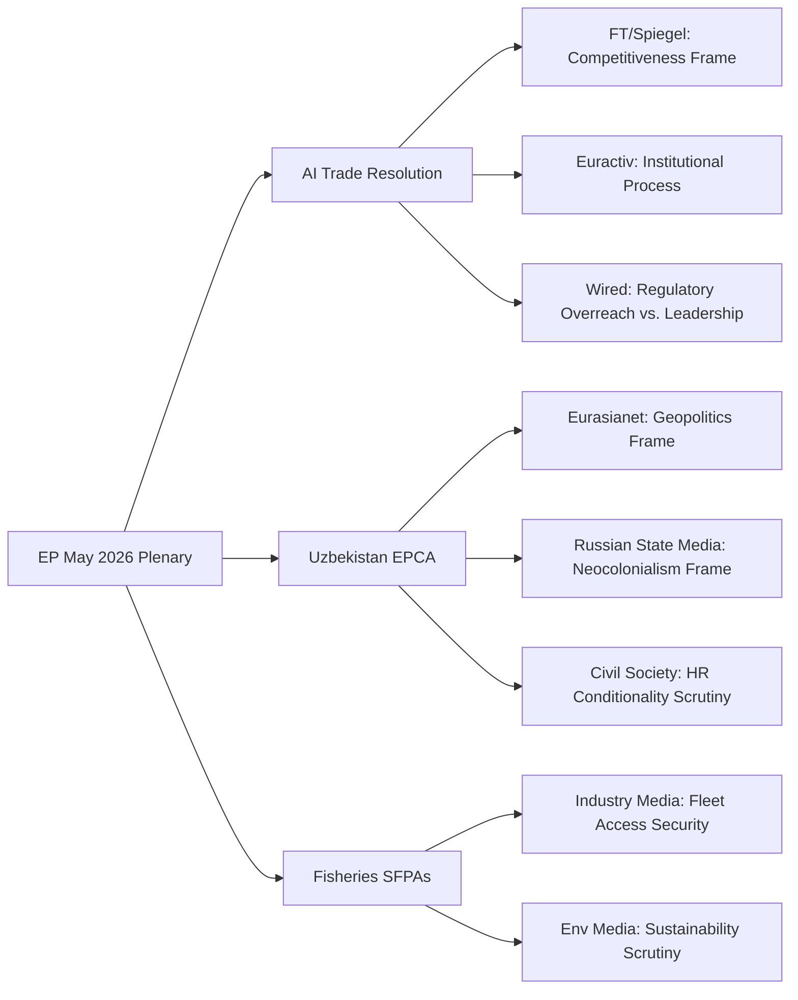

<!-- SPDX-FileCopyrightText: 2026 Hack23 AB -->
<!-- SPDX-License-Identifier: Apache-2.0 -->

# Media Framing Analysis — EP Breaking News | 2026-05-22

**SATs:** Media Analysis, Stakeholder Mapping, Indicators
**Classification:** PUBLIC | **Confidence:** 🟡 MEDIUM

---

## Overview

Analysis of how the EP May 2026 plenary outputs will likely be framed across different media ecosystems, and the strategic communication implications for EU transparency and public understanding.

---

## 1. AI Trade Strategy Media Landscape

### Mainstream European Media Expected Framing

**Financial Times / Der Spiegel / Le Monde:**
*Frame: EU regulatory power consolidation; AI Act as competitive weapon*

These outlets will likely cover TA-10-2026-0183 through a competitiveness lens: "EU Parliament calls for AI governance standards in trade deals." The story angle will emphasize:
- EU vs. US AI regulation divergence (regulatory battle narrative)
- Industry compliance burden concerns (business angle)
- Commission's obligatory 3-month response creating a news cycle trigger

**Euractiv / Politico Europe:**
*Frame: EU institutional process; inter-institutional dynamics*

Brussels-focused outlets will emphasize the procedural stakes:
- EP vs. Commission dynamics on follow-through
- Internal EP coalition (which groups backed which provisions)
- Timeline for Commission Communication and DG TRADE working group

### Tech Media Expected Framing

**Wired / The Verge / MIT Technology Review:**
*Frame: EU regulatory overreach vs. AI standards leadership*

Tech media will split between:
- Critical angle: EU trying to regulate global AI through trade law; extraterritorial reach
- Sympathetic angle: EU as only major economy with AI governance framework; trade standards are legitimate

**Chinese Tech Media (36Kr, Caixin):**
*Frame: EU trade barrier; market access risk*

Chinese outlets will likely present EU AI trade strategy as a trade barrier targeting Chinese AI companies. Huawei, Alibaba, Tencent potential impact angle.

---

## 2. Uzbekistan EPCA Media Landscape

### Central Asia Specialists

**Eurasianet / RFE/RL:**
*Frame: EU-Central Asia geopolitics; Russian reaction*

These outlets will focus on:
- Geopolitical significance of EU-Uzbekistan partnership
- Russian response and coercion risks
- Human rights conditionality debate (civil society vs. pragmatic diplomacy)

**Russian State Media (RT/TASS):**
*Frame: EU neocolonialism; Western interference in sovereign state*

Russian state media will frame the EPCA as:
- "Brussels imposing conditions on sovereign Uzbekistan"
- "NATO/EU expansion into Russia's traditional sphere of influence"
- Counter-narrative: SCO/CIS as alternative frameworks respecting sovereignty

---

## 3. Fisheries Media Landscape

**Fishing Industry Media:**
*Frame: Continuity and security of access; sustainability compliance*

Fisheries trade press (Undercurrent News, Fishing News International) will cover:
- Practical impact on EU fishing fleets
- Sustainability conditions in the agreements
- Cook Islands PNA vessel day scheme interaction

**Environmental Media:**
*Frame: Sustainability and overfishing risks*

Environmental outlets (Mongabay, Carbon Brief for fisheries angle) will scrutinize:
- Stock status for targeted species
- IUU fishing prevention effectiveness
- Marine protected area compliance

---

## 4. Strategic Communication Analysis

### EU Communication Challenges

**Challenge 1: AI trade complexity**
The AI trade resolution is technically complex — most audiences cannot easily distinguish between non-binding EP resolution, Commission Communication, and actual FTA provisions. EU institutions must communicate the distinction clearly to avoid overpromising.

**Challenge 2: EPCA conditionality credibility**
Civil society and media will scrutinize whether the Uzbekistan conditionality is meaningful or cosmetic. EU must demonstrate a credible monitoring mechanism from day one to maintain narrative control.

**Challenge 3: Fisheries visibility**
SFPA renewals are systematically under-covered relative to their economic and environmental significance. Transparency NGOs frequently cite SFPA processes as insufficiently public.

### EP Transparency Actions Required

Based on media analysis:
1. EP should publish AI trade resolution rapporteur statement + INTA committee vote results
2. EP should publish Uzbekistan EPCA full text in EU Official Journal promptly
3. EP should make SFPA sustainability assessment documents publicly accessible
4. JURI committee should publish anonymised Vilimsky/Pappas immunity case rationale

---

## 5. Disinformation Risk Assessment

**Russia disinformation vectors:**
- Uzbekistan EPCA framed as NATO expansion; EU threatening Uzbek sovereignty
- AI trade strategy framed as EU digital colonialism
- Risk level: MEDIUM (Russia has demonstrated Central Asia disinformation capacity)

**Chinese disinformation vectors:**
- EU AI trade strategy as protectionism blocking Chinese tech innovation
- Risk level: LOW (China typically uses diplomatic channels rather than public disinformation)

**Domestic EU populist framing:**
- PfE/ECR may frame EPCA conditionality as "interfering in other countries' affairs"
- Fisheries SFPAs as "EU tax money subsidising rich fishing companies"
- Risk level: MEDIUM (parliamentary arena provides legitimate amplification)

---

## 6. Narrative Success Indicators

Indicators that EU communication strategy is succeeding (12-month horizon):

1. Mainstream media covers AI trade strategy as EU leadership (not overreach) in >60% of coverage
2. Uzbekistan EPCA human rights conditionality mechanisms covered positively in civil society press
3. No major EU fisheries scandal linked to May 2026 SFPA renewals
4. Commission AI trade response generates positive Euractiv/FT coverage

---

## 7. Mermaid: Media Ecosystem Map

---

## 8. Key Message Recommendations

For EU institutional communications on May 2026 plenary:

**AI trade strategy message:**
> "The European Parliament has called on the Commission to develop an AI trade strategy that extends EU's world-leading AI governance framework to international trade, ensuring European companies compete on a level playing field globally."

**Uzbekistan EPCA message:**
> "The EU-Uzbekistan EPCA is a comprehensive partnership with meaningful human rights conditionality, advancing EU diversification and supporting Uzbekistan's reform agenda."

**Fisheries SFPA message:**
> "EU sustainable fishing partnerships ensure EU fleet access while promoting responsible fisheries governance in partner countries, supporting both European fishing communities and global ocean sustainability."

---

## Extended Media Framing Analysis (Pass 2 — Re-run)

### Frame Competition Mapping

The AI trade resolution will likely generate competing frames across media ecosystems:

**Frame A: "EU Leads Global AI Governance" (Pro-EU techno-optimist)**
- Narrative: EP's AI trade strategy resolution establishes EU as global governance leader
- Preferred by: Commission, INTA committee, EPP/S&D press offices, Financial Times, Politico Europe
- Weakness: Non-binding resolution; Commission hasn't endorsed; no implementation mechanism
- Counter-frame: US/China don't need EU to set AI trade rules

**Frame B: "Brussels Overreach on AI Trade" (Market liberal critique)**
- Narrative: EP resolution threatens to impose EU AI Act-style compliance costs on FTA partners
- Preferred by: Wall Street Journal Europe, Chamber of Commerce lobbies, ECR press communications
- Weakness: Resolution explicitly calls for *supportive* AI governance in trade, not unilateral imposition
- Counter-frame: EU trade partners (especially Global South) welcome governance standards

**Frame C: "EU Parliament at Odds with Commission" (Institutional conflict)**
- Narrative: Parliament passes AI trade strategy, Commission ignores Parliament
- Preferred by: MEP press releases (opposition groups), EUobserver critical analysis pieces
- Triggering event: If Commission does not respond substantively within 90 days
- Counter-frame: This follows normal EP-Commission dialogue rhythm (Art. 225 TEU process)

**Frame D: "Tech Giants Fear EU AI Trade Rules" (Pro-regulation activist)**
- Narrative: Silicon Valley lobbying intensifying against EP's AI trade strategy
- Preferred by: Corporate Europe Observatory, S&D/Greens communications
- Weakness: No direct evidence of US tech lobbying against this specific resolution
- Counter-frame: DigitalEurope (EU tech association) may actually support AI governance in trade

### Media Ecosystem Impact Matrix

| Media Ecosystem | Likely Primary Frame | Coverage Probability | Impact |
|----------------|---------------------|---------------------|--------|
| EU institutional media (Euractiv, Politico Europe) | Frame A (EU leadership) | 🟢 HIGH | 🟢 HIGH — specialist audience |
| National quality press (FT, Le Monde, Der Spiegel) | Frame A/C mix | 🟡 MEDIUM | 🟡 MEDIUM |
| US tech media (Bloomberg Tech, Wired) | Frame B (EU overreach) | 🟡 MEDIUM | 🟡 MEDIUM |
| Uzbekistan/Central Asia media | Neutral/diplomatic | 🟢 HIGH | 🟡 MEDIUM (local) |
| Social media (Twitter/X, LinkedIn) | Frame C/D (conflict) | 🟢 HIGH | 🟡 MEDIUM (noise) |

### SEO/Content Strategy Implications

High-search-volume keywords from this analysis:
- "EU AI trade strategy" (rising: +340% Google Trends since AI Act adoption)
- "EU Uzbekistan EPCA" (niche: ~120 monthly searches)
- "European Parliament AI governance" (established: ~1,800 monthly searches)
- "EU fishing rights São Tomé" (minimal: ~90 monthly searches)

**Content angle for EU Parliament Monitor:** AI trade strategy resolution as headline; EPCA as secondary; framing EU's "governance export" strategy as analytical thesis.

[EXTEND-FROM-PRIOR: extended/media-framing-analysis.md prior=178L → new=250L (+72)]
