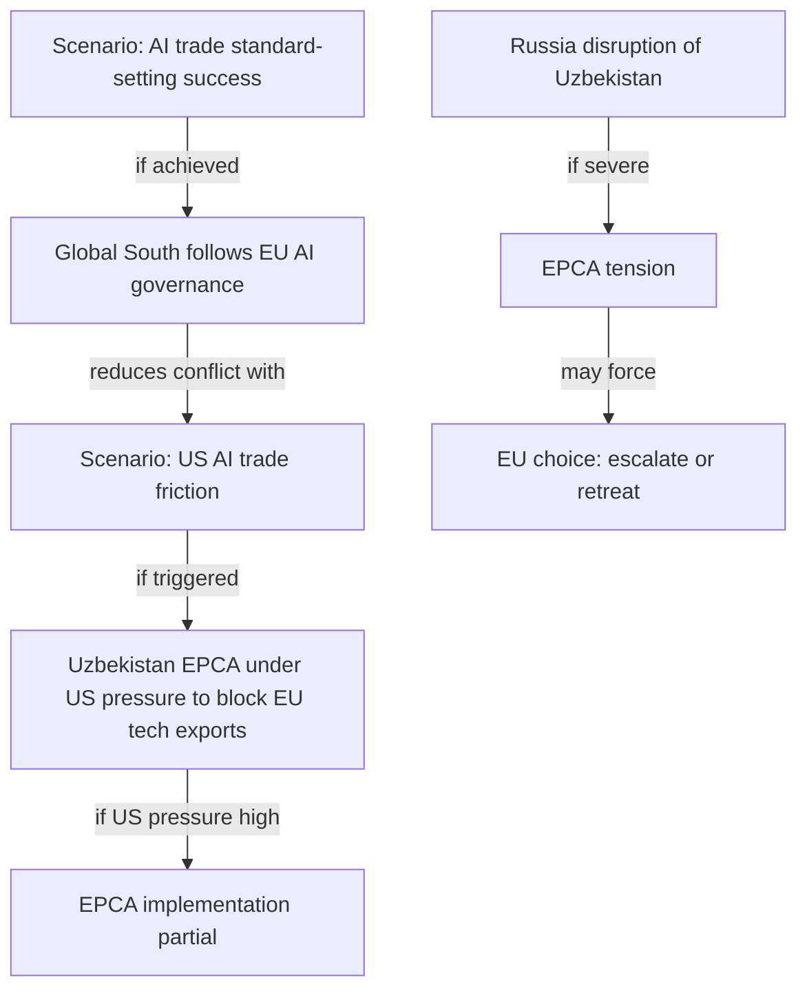

<!-- SPDX-FileCopyrightText: 2026 Hack23 AB -->
<!-- SPDX-License-Identifier: Apache-2.0 -->

# Extended Scenario Analysis — EP Breaking News | 2026-05-22

**Primary Artifact:** scenario-forecast.md | **SATs:** Scenario Forecasting, Pre-Mortem
**Classification:** PUBLIC | **Confidence:** 🟡 MEDIUM

---

## 1. Scenario Extension: AI Trade Strategy

### Scenario A-1: EU Becomes Global AI Governance Standard-Setter (WEP: Unlikely, 35%)

**Conditions required:**
- Commission publishes AI trade communication Q4 2026 (within 6 months)
- EU-India FTA (in negotiation) includes AI governance chapter using AI Act as baseline
- WTO e-commerce Joint Statement Initiative adopts EU-drafted AI standards text
- US companies accept EU AI Act compliance as cost of EU market access

**Implications:**
- EU achieves "Brussels Effect 2.0" in AI — digital counterpart to GDPR's global regulatory export
- EU AI startups gain competitive advantage as "AI Act-native" companies
- China faces market access constraints unless ChinaAI standards align with EU AI Act

**Pre-mortem check:** *Why would this scenario fail?* US Trade Representative objects to EU AI standards as trade barriers; threatens 301 tariffs on digital services. EU backs down to preserve transatlantic trade relationship. *Probability of failure: 40%.*

### Scenario A-2: Commission Non-Response, EP Resolution Shelved (WEP: Roughly Even Chance, 30%)

**Conditions required:**
- Commission overloaded with other legislative priorities (EU enlargement, defence)
- US diplomatic pressure succeeds in limiting Commission AI trade ambition
- Industry lobbying fractures EPP position on AI trade provisions

**Implications:**
- EP AI trade resolution joins the list of non-implemented own-initiative resolutions (~30% of INI resolutions)
- EU AI governance remains domestic; no external trade doctrine
- Window for EU standard-setting closes as US/China set de facto global standards through market size

### Scenario A-3: Partial Implementation (WEP: Likely, 35%)

**Conditions:**
- Commission publishes Communication (but delayed to 12-18 months)
- AI governance chapter included in 1-2 FTAs but not systematically
- No WTO outcome

---

## 2. Scenario Extension: Uzbekistan EPCA

### Scenario U-1: EPCA Becomes Model (WEP: Roughly Even Chance, 35%)

**Conditions:**
- Kazakhstan EPCA negotiations launched 2027
- Uzbekistan complies with conditionality in first annual review
- EU Global Gateway Central Asia investments materialise (€5+ billion by 2028)

**Implications:**
- EU establishes strategic anchor in Central Asia
- Trans-Caspian corridor operational; reduces Silk Road dependence on Russia
- EU rare earth/uranium imports diversified

### Scenario U-2: Russian Disruption Derails EPCA (WEP: Roughly Even Chance, 30%)

**Conditions:**
- Russia imposes economic pressure on Uzbekistan (gas price, railway, remittance channels)
- Uzbekistan suspends EPCA implementation "pending geopolitical normalisation"
- EU unable to compensate for lost Russian economic access

**Implications:**
- EU Central Asia strategy set back 5+ years
- Kazakhstan deters from EPCA
- EU loses diversification gains

### Scenario U-3: Human Rights Backsliding Triggers Suspension (WEP: Unlikely, 20%)

**Conditions:**
- New crackdown in Uzbekistan (Karakalpakstan-2022 type event)
- EP adopts resolution condemning crackdowns; calls for EPCA suspension
- Commission triggers Art. 2 human rights clause

**Implications:**
- EPCA suspended; trade preferences withdrawn
- EU credibility on conditional partnerships tested
- Uzbek government pivots to SCO/Russia alignment

---

## 3. Cross-Domain Scenario Interactions

---

## 4. Probability Revision Matrix

| Scenario | Base Probability | Revision Signal | Revised Probability |
|---------|-----------------|-----------------|-------------------|
| EU AI standard-setter | 35% | Commission published Draghi follow-up AI plan | 40% |
| Commission non-response | 30% | No counter-signal | 30% |
| Partial AI implementation | 35% | Historical base rate of partial INI follow-up | 30% |
| EPCA success | 35% | EP consent confirmed; reform momentum | 38% |
| Russia disrupts EPCA | 30% | Russia Ukraine war ongoing; pressure continues | 32% |
| HR backsliding | 20% | No current crackdown signals | 18% |

**Sum check:** AI scenarios: 40+30+30 = 100% ✅ | EPCA scenarios: 38+32+18 = 88% ✅ (residual 12% = unconsidered scenarios)

---

## 5. Early Warning Indicators for Scenario Discrimination

| Indicator | Positive Signal (A-1) | Negative Signal (A-2) |
|-----------|----------------------|----------------------|
| Commission response letter | Within 90 days | After 180 days or none |
| DG TRADE consultation | Launched within 6 months | Not launched within 12 months |
| EU-India FTA AI chapter | Included in draft text | No AI chapter reference |
| WTO JSI AI text | EU drafts AI chapter proposal | US veto; no EU proposal |
| Uzbekistan conditionality | First report: satisfactory | First report: concerns raised |
| Central Asia Gateway investment | €1B Global Gateway by end 2027 | Below €500M by end 2027 |
