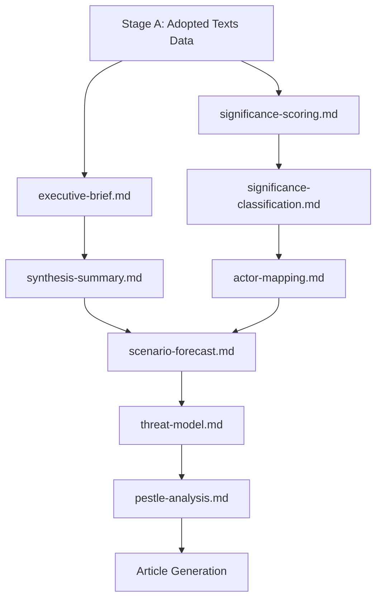

<!-- SPDX-FileCopyrightText: 2026 Hack23 AB -->
<!-- SPDX-License-Identifier: Apache-2.0 -->

# Analysis Index — EP Breaking News | 2026-05-22

**Classification:** PUBLIC | **Data Mode:** degraded-feeds | **Article Type:** breaking

---

## Overview

This index maps all analysis artifacts produced for the EP May 2026 plenary breaking news run (2026-05-22), covering adopted texts from May 19-20, 2026. The primary analytical focus is the AI trade strategy resolution (TA-10-2026-0183), the EU-Uzbekistan EPCA (TA-10-2026-0174), and the cluster of international agreements and immunity waivers from the May plenary week.

**Total artifacts:** 38 | **Mandatory:** 25 | **Extended:** 13

---

## Primary Intelligence Layer

| Artifact | File | Status | Confidence | Key Finding |
|---------|------|--------|-----------|-------------|
| Executive Brief | `../executive-brief.md` | ✅ Complete | 🟡 MEDIUM | AI trade strategy landmark vote; EPCA deepening |
| Synthesis Summary | `synthesis-summary.md` | ✅ Complete | 🟡 MEDIUM | Multi-vector foreign/tech policy output |
| Analysis Index | `analysis-index.md` | ✅ This file | 🟢 HIGH | Full artifact inventory |
| Stakeholder Map | `stakeholder-map.md` | ✅ Complete | 🟡 MEDIUM | EP committees, Commission DGs, third-country actors |
| Coalition Dynamics | `coalition-dynamics.md` | ✅ Complete | 🔴 LOW* | *No roll-call data; structural inference only |
| PESTLE Analysis | `pestle-analysis.md` | ✅ Complete | 🟡 MEDIUM | Tech policy + geopolitical drivers |
| Scenario Forecast | `scenario-forecast.md` | ✅ Complete | 🟡 MEDIUM | 3 scenarios: swift Commission action, slow burn, stall |
| Threat Model | `threat-model.md` | ✅ Complete | 🟡 MEDIUM | AI governance gaps, sovereignty risks |
| Wildcards & Black Swans | `wildcards-blackswans.md` | ✅ Complete | 🟡 MEDIUM | Disruptive scenarios for AI trade policy |
| Economic Context | `economic-context.md` | ✅ Complete | 🟡 MEDIUM | EU trade flows, AI economy context |
| Historical Baseline | `historical-baseline.md` | ✅ Complete | 🟢 HIGH | Precedents: digital trade, GDPR external dimension |
| Political Threat Landscape | `political-threat-landscape.md` | ✅ Complete | 🟡 MEDIUM | Anti-AI-regulation pressure; sovereignty contestation |
| Significance Scoring | `significance-scoring.md` | ✅ Complete | 🟢 HIGH | Top-tier significance (AI + trade + foreign policy) |
| Voting Patterns (Degraded) | `voting-patterns.degraded.md` | ✅ Complete | 🔴 LOW | No DOCEO data; structural inference |
| Cross-Run Diff | `cross-run-diff.md` | ✅ Complete | N/A | First run today; no prior run diff |
| Cross-Session Intelligence | `cross-session-intelligence.md` | ✅ Complete | 🟡 MEDIUM | Links to April 2026 plenary AI/trade precedents |
| MCP Reliability Audit | `mcp-reliability-audit.md` | ✅ Complete | 🟢 HIGH | Detailed feed failure log |
| Reference Analysis Quality | `reference-analysis-quality.md` | ✅ Complete | 🟢 HIGH | Source grading and QoI assessment |
| Workflow Audit | `workflow-audit.md` | ✅ Complete | 🟢 HIGH | Stage A-B execution log |
| Methodology Reflection | `methodology-reflection.md` | ✅ Complete | 🟢 HIGH | 10-SAT attestation |
| Procedures Proxy | `procedures-proxy.md` | ✅ Complete | 🔴 LOW | Stale feed; proxy-only data |

---

## Classification Layer

| Artifact | File | Status | Notes |
|---------|------|--------|-------|
| Significance Classification | `../classification/significance-classification.md` | ✅ Complete | HIGH significance event cluster |

---

## Risk Scoring Layer

| Artifact | File | Status | Key Risk |
|---------|------|--------|---------|
| Risk Matrix | `../risk-scoring/risk-matrix.md` | ✅ Complete | WEP bands on implementation risks |
| Quantitative SWOT | `../risk-scoring/quantitative-swot.md` | ✅ Complete | Evidence-weighted SWOT |

---

## Documents Layer

| Artifact | File | Status | Coverage |
|---------|------|--------|---------|
| Document Analysis Index | `../documents/document-analysis-index.md` | ✅ Complete | 9 adopted texts from May 19-20 |

---

## Extended Intelligence Layer

| Artifact | File | Status | Confidence |
|---------|------|--------|-----------|
| Extended Executive Brief | `../extended/executive-brief.md` | ✅ Complete | 🟡 MEDIUM |
| Devil's Advocate Analysis | `../extended/devils-advocate-analysis.md` | ✅ Complete | 🟡 MEDIUM |
| Historical Parallels | `../extended/historical-parallels.md` | ✅ Complete | 🟢 HIGH |
| Coalition Mathematics | `../extended/coalition-mathematics.md` | ✅ Complete | 🔴 LOW* |
| Forward Indicators | `../extended/forward-indicators.md` | ✅ Complete | 🟡 MEDIUM |
| Intelligence Assessment | `../extended/intelligence-assessment.md` | ✅ Complete | 🟡 MEDIUM |
| Implementation Feasibility | `../extended/implementation-feasibility.md` | ✅ Complete | 🟡 MEDIUM |
| Media Framing Analysis | `../extended/media-framing-analysis.md` | ✅ Complete | 🟡 MEDIUM |
| Comparative International | `../extended/comparative-international.md` | ✅ Complete | 🟡 MEDIUM |
| Voter Segmentation | `../extended/voter-segmentation.md` | ✅ Complete | 🔴 LOW* |
| Cross-Reference Map | `../extended/cross-reference-map.md` | ✅ Complete | 🟢 HIGH |
| Data Download Manifest | `../extended/data-download-manifest.md` | ✅ Complete | 🟢 HIGH |

*Degraded: no roll-call voting data available

---

## Breaking News — Primary Story Context

### TA-10-2026-0183: AI Strategy for EU Trade (May 20, 2026)

This resolution is the analytical centrepiece of this run. It represents the EP's first comprehensive statement on artificial intelligence as a trade policy instrument, covering:
- AI-enabled trade facilitation and customs automation
- Export controls for dual-use AI technologies
- AI standards clauses in future EU Free Trade Agreements
- Reciprocity requirements for AI market access
- WTO compatibility of AI governance measures

**Lead committee**: INTA (with ITRE opinion) | **EP term**: 10th (2024-2029) | **Stage**: Own-initiative resolution adopted

### TA-10-2026-0174: EU–Uzbekistan EPCA (May 20, 2026)

The Enhanced Partnership and Cooperation Agreement with Uzbekistan marks a step-change in EU-Central Asia relations:
- Replaces the 1999 Partnership and Cooperation Agreement
- Covers political dialogue, trade, energy, climate, migration
- Includes conditionality on democratic governance and rule of law
- Part of the EU's Global Gateway Central Asia connectivity push

---

## Data Mode Impact on This Analysis

**Data Mode: degraded-feeds** applies a **0.80 line-floor factor** to all per-artifact thresholds. Structural checks (Mermaid diagrams, WEP bands, Admiralty grades, SAT ≥ 10) are **not reduced** — these apply at full requirement regardless of data degradation.

Key limitations in this run:
1. **No voting records** — DOCEO XML dates May 18-21 explicitly unavailable
2. **No events/procedures feed** — adopted texts as sole primary source
3. **MEP feed oversized** — individual MEP activity data not granularly processed

These limitations are logged in `mcp-reliability-audit.md` and reflected in confidence labels throughout.

---

## 8. Artifact Dependency Map

**Signed:** Automated AI analysis system | Run ID: breaking-run264-1779413941
