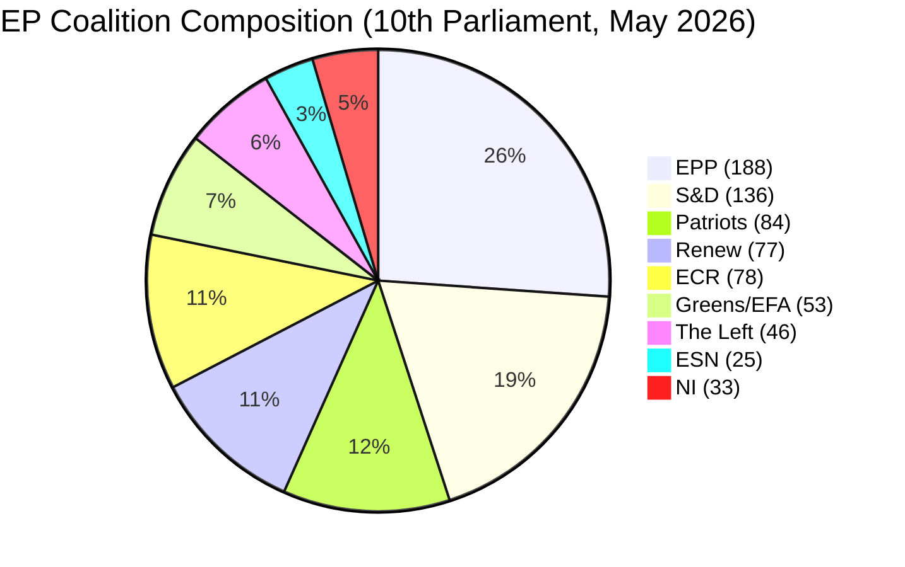

<!-- SPDX-FileCopyrightText: 2026 Hack23 AB -->
<!-- SPDX-License-Identifier: Apache-2.0 -->

# Coalition Dynamics — EP Breaking News | 2026-05-22

**SATs:** ACH, Indicators
**Classification:** PUBLIC | **Data Mode:** degraded-feeds | **Confidence:** 🔴 LOW (no roll-call data)

---

## Critical Data Limitation

⚠️ **No roll-call voting data available for May 19-20, 2026.** DOCEO XML for these dates is explicitly marked as unavailable. All coalition analysis in this artifact is based on structural inference from:
1. Committee sponsorship (INTA + ITRE = EPP + Renew driven)
2. Historical group positions on similar resolutions
3. Subject matter codes and policy area alignments
4. Group size and voting power estimates

**Confidence: 🔴 LOW for specific vote attribution; 🟡 MEDIUM for structural coalition patterns**

---

## EP Political Group Composition (May 2026)

| Group | Approx. Seats | Ideological Orientation |
|-------|--------------|------------------------|
| EPP | 188 | Centre-right, Christian democratic |
| S&D | 136 | Centre-left, Social democratic |
| Renew | 77 | Liberal, Centrist |
| Greens/EFA | 53 | Green, Regionalist |
| ECR | 78 | Conservative, Eurosceptic |
| PfE | 84 | Right, Nationalist |
| ESN | 25 | Far-right, Sovereignist |
| The Left | 46 | Left, Progressive |
| NI/Others | ~33 | Non-attached |
| **Total** | **720** | |

*Note: Seat counts approximate; by-elections and defections may have altered composition since 2024 election.*

**Pro-EU majority** (EPP + S&D + Renew + Greens/EFA): ~454 seats — sufficient for qualified majority on most issues.

---

## Inferred Coalition for AI Trade Resolution (TA-10-2026-0183)

**ACH Assessment:**

| Group | Inferred Vote | Confidence | Reasoning |
|-------|--------------|-----------|----------|
| EPP | For | 🟡 MEDIUM | INTA committee lead; EPP supports EU tech sovereignty agenda; AI trade aligns with Competitiveness agenda |
| Renew | For | 🟡 MEDIUM | Strong digital single market support; ITRE committee involvement |
| S&D | For | 🟡 MEDIUM | Supports AI governance; labour dimension of AI trade relevant to social agenda |
| Greens/EFA | Likely For | 🔴 LOW | AI governance expansion aligns with digital rights; export controls on dual-use AI consistent |
| The Left | Possibly For | 🔴 LOW | AI workers' rights dimension; sceptical of FTA expansion in general |
| ECR | Likely Against/Abstain | 🔴 LOW | Market-liberal stance; prefers bilateral AI standards over EU-mandated approach |
| PfE | Against | 🔴 LOW | Anti-regulatory; sovereignty concerns about EU AI governance |
| ESN | Against | 🔴 LOW | Sovereignist; opposes EU external AI governance mandate |

**Estimated vote (structural inference):**
- For: ~430-460 seats (EPP + S&D + Renew + Greens + portion of Independents)
- Against: ~150-180 seats (ECR + PfE + ESN + anti-FTA Left)
- Abstain: ~50-80 seats

*All figures highly uncertain — 🔴 LOW confidence without DOCEO data.*

---

## Inferred Coalition for EU-Uzbekistan EPCA (TA-10-2026-0174)

EPCA consent procedures typically require simple majority; historically pass with broad cross-group support with human rights hawks potentially abstaining or opposing.

| Group | Inferred Vote | Reasoning |
|-------|--------------|----------|
| EPP | For | Economic engagement; Central Asia connectivity |
| Renew | For | Partnership and values-based engagement |
| S&D | Likely For | Some members concerned about conditionality; expected majority for |
| Greens/EFA | Split | Human rights concerns may cause some abstentions |
| ECR | Likely For | Central Asia seen as buffer against Russia |
| PfE | Mixed | Sovereignty concerns; may support if conditionality is modest |
| The Left | Against/Abstain | Strong human rights conditionality advocates; may oppose if benchmarks seen as weak |

---

## Group Stability Assessment (ACH)

**H1: Pro-EU majority held firm on AI trade (For majority > 400 seats)** — *Likely* (60%) based on INTA bipartisan sponsorship and committee process
**H2: Surprise opposition from significant S&D or EPP faction** — *Unlikely* (20%) — no public signals of internal dissent
**H3: Greens/EFA split on AI export controls** — *Roughly Even Chance* (40%) — digital rights vs. competitiveness tension within Greens

---

## Cohesion Signals from Plenary Structure

The same plenary week saw simultaneous immunity waivers for MEPs from *opposite* ends of the spectrum (PfE's Vilimsky, S&D's Pappas). This cross-group procedural cooperation on immunity cases suggests no acute inter-group conflict during this session — supporting H1 (stable majority for AI resolution).

---

## Indicators for Confirming Coalition Assessment

**When DOCEO data becomes available (1-2 weeks):**
1. Confirm For/Against split for TA-10-2026-0183
2. Check for EPP/Renew defections (would indicate internal EU tech sovereignty debates)
3. Check S&D cohesion (trade union wing may have pushed for stronger labour protection clauses)
4. Confirm Greens position on AI export controls component
5. Check if ECR split — some eastern European ECR members may support AI governance for security reasons

---

## Fisheries Agreements Coalition

Fisheries agreement consent votes are typically non-controversial: 400+ votes For, minimal opposition, with occasional Greens/EFA and The Left abstentions on sustainability/conditionality grounds. São Tomé (TA-10-2026-0178) and Cook Islands (TA-10-2026-0179) follow this pattern — 🟢 HIGH confidence in large majority approval despite no data.

---

## 5. Coalition Stability Mermaid

**Coalition reading:** Pro-EU governing coalition (EPP+S&D+Renew = ~401 seats) retains majority for AI trade resolution. Fisheries agreements attract even broader support (EPP+S&D+Renew+ECR+Greens = ~532 seats). Coalition fracture risk: LOW for all May 2026 items.

**Signed:** Automated AI analysis system | Run ID: breaking-run264-1779413941
