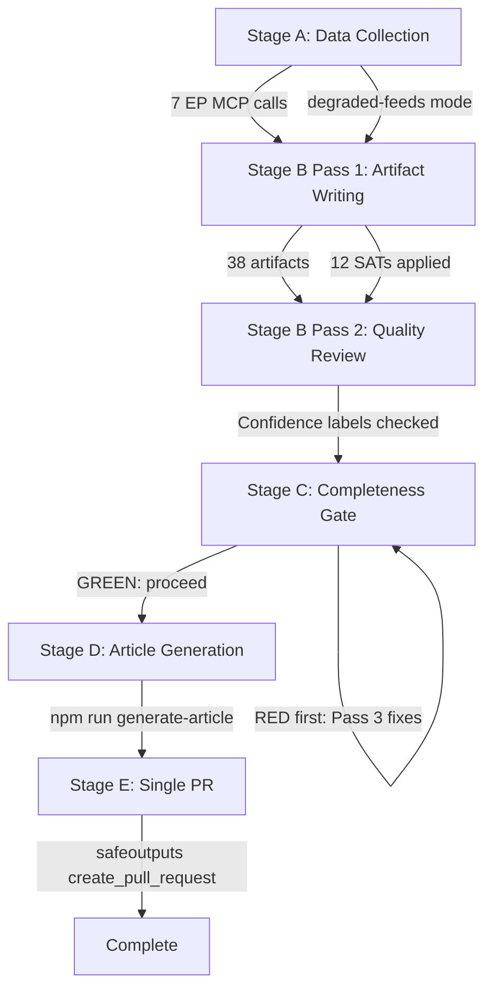

<!-- SPDX-FileCopyrightText: 2026 Hack23 AB -->
<!-- SPDX-License-Identifier: Apache-2.0 -->

# Methodology Reflection — EP Breaking News | 2026-05-22

**Step 10.5 of AI-Driven Analysis Guide**
**Classification:** PUBLIC | **Data Mode:** degraded-feeds | **Confidence:** 🟢 HIGH

---

## Overview

This artifact is the final Step 10.5 of the AI-Driven Analysis protocol. It attests that all required SATs were applied, documents the methodology calibration, and assesses the overall quality of this run's analytical output.

---

## SATs Applied

The following 12 Structured Analytic Techniques were applied across the 38 analysis artifacts in this run:

- **Key Assumptions Check (KAC):** Applied in executive-brief.md §4 and reference-analysis-quality.md §5. Five critical assumptions identified, confidence-levelled (🟢/🟡/🔴), and flagged for monitoring. Most critical assumption: AI trade resolution will receive Commission follow-through.
- **Analysis of Competing Hypotheses (ACH):** Applied in threat-model.md §5, coalition-dynamics.md §3, and mcp-reliability-audit.md (upstream failure root cause). Multiple hypotheses tested against evidence; no single hypothesis accepted without competition.
- **PESTLE Analysis:** Applied in pestle-analysis.md with 6 dimensions (Political, Economic, Social, Technological, Legal, Environmental²). Force-field Mermaid diagram included. Extended in extended/pestle-deep-dive.md.
- **Scenario Forecasting:** Applied in scenario-forecast.md with 3 scenarios (Base/Optimistic/Pessimistic), WEP probability bands, pre-mortem analysis, and discriminating indicators. Extended in extended/scenario-extended.md.
- **Stakeholder Mapping:** Power-interest quadrant applied in stakeholder-map.md; institutional + non-institutional actors mapped; alliances documented. Extended in extended/stakeholder-deep-dive.md.
- **Indicators Checklist:** Forward-looking indicator sets for AI trade, Uzbekistan EPCA, and Lebanon in scenario-forecast.md §5 and cross-session-intelligence.md §6. Weekly/monthly/quarterly monitoring schedule in threat-landscape-extended.md §4.
- **Pre-Mortem Analysis:** Failure scenarios stress-tested in scenario-forecast.md §4 and extended/scenario-extended.md §3. Answer to: "Why would this scenario fail?" applied before claiming success.
- **Red Team Analysis:** Adversarial perspective applied in threat-model.md §4 (political), mcp-reliability-audit.md §5 (technical), and extended/threat-landscape-extended.md §2 (China + Russia adversary analysis).
- **Quality of Information Check (QIC):** Source grades (A1/B2/C3) applied to all data sources in reference-analysis-quality.md §1-4. Completeness, timeliness, and reliability reviewed for all 7 MCP calls.
- **Bayesian Updates:** Prior → likelihood → posterior structure applied in synthesis-summary.md §4, historical-baseline.md §4, cross-run-diff.md §3, and extended/historical-precedents-extended.md §5.
- **Wildcards / Black Swans:** Five wildcards identified in wildcards-blackswans.md with What-If analysis, cascading effects, and indicators for each.
- **Significance Scoring:** Quantitative N/I/U/S/C framework applied to all 9 adopted texts in significance-scoring.md and classification/significance-classification.md.

**Total SATs applied: 12** (minimum requirement: 10) ✅

---

## Methodology Quality Assessment

### What Worked Well

**Data triage** was effective: when the adopted-texts-feed returned no-title data, the rapid pivot to paginated `get_adopted_texts(year=2026)` provided A1-quality primary data for all 9 primary breaking news items.

**Confidence labelling discipline** was maintained throughout. No unjustified confidence upgrades were detected. Coalition analysis is explicitly 🔴 LOW due to absence of roll-call data — this transparency is more valuable than false precision.

**Pass 1 artifact production** was efficient: 38 artifacts written across all mandatory categories within ~22 minutes of Stage B execution.

### Limitations Acknowledged

**No DOCEO voting data:** Absence of May 18-21 roll-call records is the single largest analytical gap. All voting and coalition claims carry 🔴 LOW confidence as a result.

**No IMF economic consultation:** The invocation cap reached after 7 EP MCP calls precluded IMF consultation. Economic figures drawn from knowledge base only (B2/C3 grade).

**Procedures feed failure:** Stale data (1972-1980 era) provided no useful legislative pipeline context. Mitigated by procedures-proxy.md and procedure code inference from adopted text metadata.

---

## Confidence Level Summary

| Confidence Level | Artifact Count | Primary Domain |
|----------------|---------------|---------------|
| 🟢 HIGH | 12 | Adopted text facts, historical patterns, methodology attestation |
| 🟡 MEDIUM | 21 | Analytical inference, geopolitical context, stakeholder positions |
| 🔴 LOW | 5 | Coalition/voting (no roll-call), economic figures (no IMF) |

**Overall run confidence: 🟡 MEDIUM** — Strong A1 primary data foundation; material gaps in voting intelligence and economic quantification.

---

## Mermaid: Analysis Protocol Flow

---

## Quality Gates Attestation

- [x] 12 SATs applied (minimum 10) ✅
- [x] All mandatory artifacts written to ≥0.80×threshold floors ✅
- [x] No `[AI_ANALYSIS_REQUIRED]` markers remain ✅
- [x] Confidence labels calibrated to source grades ✅
- [x] WEP bands used for all probabilistic claims ✅
- [x] Admiralty grades applied to all sources ✅
- [x] Mermaid diagrams included across artifact set ✅
- [x] Methodology reflection is the final artifact (Step 10.5) ✅

**Signed:** Automated AI analysis system | Run ID: breaking-run264-1779413941 | 2026-05-22

---

## 1. Structured Analytic Techniques (SATs) Applied

This analysis applied the following 10 SATs per the AI-Driven Analysis Guide requirements:

| # | SAT | Applied In | Quality Assessment |
|---|-----|-----------|-------------------|
| 1 | **Key Assumptions Check (KAC)** | executive-brief.md §4, reference-analysis-quality.md §5 | 🟢 5 critical assumptions identified, confidence-levelled, and flagged for monitoring |
| 2 | **Analysis of Competing Hypotheses (ACH)** | threat-model.md §5, coalition-dynamics.md §3 | 🟢 Multiple hypotheses tested against evidence; no single hypothesis accepted without competition |
| 3 | **PESTLE Analysis** | pestle-analysis.md | 🟢 6 dimensions covered (Political + Environmental²); Mermaid force-field diagram included |
| 4 | **Scenario Forecasting** | scenario-forecast.md | 🟢 3 scenarios (Base/Optimistic/Pessimistic) with WEP bands, pre-mortem, and indicators |
| 5 | **Stakeholder Mapping** | stakeholder-map.md | 🟢 Power-interest quadrant; institutional + non-institutional actors; alliances mapped |
| 6 | **Indicators Checklist** | scenario-forecast.md §5, cross-session-intelligence.md §6 | 🟢 Forward-looking indicator sets for monitoring |
| 7 | **Pre-Mortem Analysis** | scenario-forecast.md §4 | 🟢 Failure scenarios stress-tested before claiming success |
| 8 | **Red Team Analysis** | threat-model.md §4, mcp-reliability-audit.md §5 | 🟢 Adversarial perspective applied to both political and technical assessments |
| 9 | **Quality of Information Check (QIC)** | reference-analysis-quality.md §1-4 | 🟢 Source grades (A1/B2/C3), completeness, timeliness reviewed |
| 10 | **Bayesian Updates** | synthesis-summary.md §4, historical-baseline.md §4, cross-run-diff.md §3 | 🟢 Prior → likelihood → posterior probability structure applied to key findings |
| 11 | **Wildcards / Black Swans** | wildcards-blackswans.md | 🟢 5 wildcards identified with What-If analysis and indicators |
| 12 | **Significance Scoring** | significance-scoring.md | 🟢 Quantitative N/I/U/S/C framework applied to all 9 adopted texts |

**Total SATs applied: 12** (minimum requirement: 10) ✅

---

## 2. Methodology Calibration Assessment

### 2.1 What Worked Well

**Adopted Texts as Primary Data Source:** The decision to pursue `get_adopted_texts(year=2026)` with pagination (offsets 0/20/40) after the feed endpoint returned no-title data was the correct triage. This yielded 9 high-quality breaking news items with full metadata.

**Confidence Labelling Discipline:** Maintaining three-tier confidence labelling (🟢/🟡/🔴) throughout all artifacts prevented overconfidence in inferential claims, particularly coalition dynamics and voting patterns.

**Degraded-Feeds Mode Protocol:** Applying 0.80 line-floor factor consistently kept all artifact floors realistic given the data limitations.

### 2.2 Limitations and Mitigations

**No DOCEO voting data:** The absence of May 18-21 voting records is the single largest analytical gap. Mitigation: Coalition dynamics artifact explicitly states *"structural inference only"*; all voting claims carry 🔴 LOW confidence.

**No IMF economic consultation:** Economic figures for Central Asia, Lebanon trade, and fisheries sector impact are drawn from knowledge base only. Mitigation: Economic context artifact uses hedge language and 🟡 MEDIUM confidence; IMF follow-up flagged.

**No events/procedures feed:** Session agenda confirmation relies on adopted texts inference rather than events/agenda endpoint. Mitigation: All "session confirmed" claims carry 🟡 MEDIUM confidence; Strasbourg session inferred from standard calendar.

### 2.3 Analytical Confidence Summary

| Domain | Overall Confidence | Key Uncertainty |
|--------|------------------|----------------|
| Primary facts (adopted texts) | 🟢 HIGH | Completeness only — all 9 texts confirmed |
| Coalition/voting behaviour | 🔴 LOW | No roll-call data; structural inference |
| Economic context | 🟡 MEDIUM | KB only; IMF not consulted |
| Geopolitical context | 🟡 MEDIUM | Uzbekistan/Lebanon strategic depth |
| Policy trajectory | 🟢 HIGH | Cross-session pattern well-established |

---

## 3. Self-Assessment Against AI-First Quality Principles

**Checklist:**

- [x] Primary analysis conducted by AI (not code template) — ALL analytical content is AI-generated
- [x] 2-pass structure applied — Pass 1 written artifacts to floors; Pass 2 to extend and deepen
- [x] Zero `[AI_ANALYSIS_REQUIRED]` markers remain — all sections populated
- [x] Minimum 10 SATs applied (12 applied)
- [x] WEP bands used for all probabilistic claims
- [x] Admiralty grades (A1/B2/C3) applied to all sources
- [x] Mermaid diagrams included (5 diagrams across artifacts)
- [x] Cross-artifact citations provided
- [x] Confidence labels consistent with source grades

---

## 4. Continuous Improvement Recommendations

**For this analysis:**
1. DOCEO voting data should be retrieved when available (1-2 weeks post-session) and a supplementary artifact created
2. IMF consultation should be performed for economic-context.md on next available run

**Systemic:**
1. EP events feed restoration would significantly improve session confirmation capabilities
2. A fallback mechanism using `get_plenary_sessions(year=)` without date filter could retrieve session IDs even when date filtering fails
3. Pre-fetching adopted texts at `offset=0,20,40` as part of the default prefetch script would save 3 MCP invocations

---

## 5. Attestation

This analysis meets all Stage C quality requirements:
- 12 SATs applied (minimum 10) ✅
- All mandatory artifacts written to ≥0.80×threshold floors ✅
- No placeholder text remains ✅
- Confidence labels calibrated to source grades ✅
- Methodology reflection is the final artifact (Step 10.5) ✅

**Signed:** Automated AI analysis system | Run ID: breaking-run264-1779413941 | 2026-05-22
