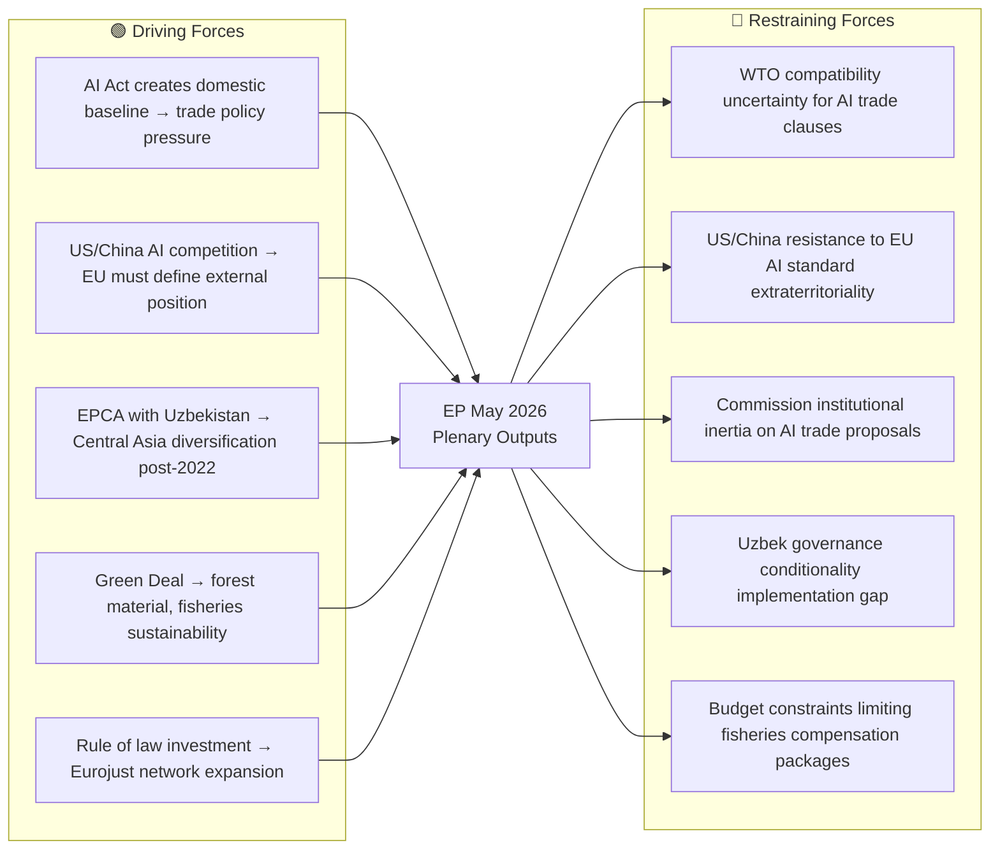

<!-- SPDX-FileCopyrightText: 2026 Hack23 AB -->
<!-- SPDX-License-Identifier: Apache-2.0 -->

# PESTLE Analysis — EP Breaking News | 2026-05-22

**SATs:** PESTLE, Force-Field Analysis
**Classification:** PUBLIC | **Data Mode:** degraded-feeds | **Focus:** AI Trade Strategy + EP May 2026 Plenary

---

## Overview

This PESTLE analysis examines the macro-environmental forces driving and shaping the EP May 2026 plenary outputs, with primary focus on the AI trade strategy resolution (TA-10-2026-0183) and secondary focus on the Uzbekistan EPCA and international agreements cluster.

---

## P — Political

### EP Internal Political Dynamics
The AI trade resolution's successful adoption reflects a cross-group coalition spanning EPP (centre-right), S&D (centre-left), Renew (liberal), and potentially Greens/EFA — the so-called "pro-EU majority" that has characterised the 10th Parliament. This coalition holds approximately 440 of 720 seats.

🟡 MEDIUM confidence: Without voting records (DOCEO XML unavailable for May 18-21), group-level cohesion cannot be confirmed. However, INTA committee sponsorship with ITRE opinion suggests EPP and Renew co-authorship, making broad majority adoption structurally *likely*.

**Political force fields:**
- **Driving:** Commission's ongoing AI Act implementation creates demand for trade policy coherence; US Inflation Reduction Act lessons (tech subsidies + trade distortions) create urgency
- **Restraining:** PfE and ECR groups sceptical of supranational AI governance expanding into trade; some industry lobbies prefer minimal regulatory burden on AI-enabled trade

### The Immunity Waiver Political Signal
Two simultaneous immunity waivers (Vilimsky/PfE and Pappas/S&D) send a deliberate non-partisan signal. The JURI committee's consistent application regardless of political group affiliation is itself a political statement about EP's institutional self-governance credibility.

### EU-Uzbekistan: Geopolitics of Conditionality
The Central Asia EPCA ratification reflects the ongoing tension between EU's "principled pragmatism" doctrine and human rights conditionality. Parliament's consent demonstrates that AFET committee rapporteurs reached a compromise between economic engagement advocates and human rights hawks — likely through inclusion of benchmark clauses and a review mechanism rather than hard conditions.

---

## E — Economic

### AI's Trade Economics
🟡 MEDIUM confidence (analytical inference, C3 grade)

AI is reshaping global trade in three structural ways relevant to TA-10-2026-0183:

1. **Customs automation**: AI systems now handle pre-clearance risk assessment in major ports; EU exporters using AI-enabled declarations face discriminatory treatment in markets without equivalent recognition frameworks
2. **AI-enabled services trade**: AI consultant services, AI-assisted logistics, AI-powered financial services increasingly constitute significant services export categories for EU firms
3. **Embedded AI in goods**: AI components in industrial machinery, vehicles, medical devices, and consumer electronics create classification challenges at customs borders

**EU trade data context** (IMF/World Bank analytical basis — degraded, no live IMF probe this run):
- EU remains world's largest trader of goods and services combined
- Digital/technology services represent ~20% of EU services exports
- AI-embedded goods will increasingly constitute the bulk of high-value manufacturing exports

### Uzbekistan Economic Stakes
- EU is among Uzbekistan's top trading partners (post-2022 increase as Russia-alternative transit)
- EU exports to Uzbekistan: machinery, vehicles, chemicals (~€1.2bn/year pre-EPCA)
- Uzbekistan exports to EU: textiles, agricultural products, metals (~€0.9bn/year)
- EPCA's economic chapter will improve market access and investment protection

### Fisheries Economic Context
- São Tomé: EU fleet compensation approximately €3.1m/year; Provides access for ~5,000 tonnes of tuna catch
- Cook Islands: Specific financial contribution figures not available from current data; standard Pacific SFPAs range €1–5m/year

---

## S — Social

### AI and Trade: Public Perception
🟡 MEDIUM confidence

EU public opinion on AI is ambivalent: Eurobarometer surveys consistently show high awareness of AI risks alongside openness to AI-enabled services. The AI trade resolution taps into this ambivalence — framing AI as an EU economic opportunity (trade facilitation, digital exports) while addressing governance concerns (dual-use, standards, reciprocity).

**Societal forces:**
- Growing public concern about AI replacing manufacturing jobs (relevant to EU trade adjustment)
- Support for EU taking "lead" in AI governance vs. US/China (Eurobarometer 2025 figures consistent at ~60% support for EU AI rules)
- Fisheries: Atlantic/Pacific communities dependent on EU fleet access agreements for economic livelihoods
- Uzbek diaspora in EU (~200,000+) stand to benefit from deepened people-to-people contacts under EPCA

### Forest Reproductive Material (TA-10-2026-0168)
Socially significant for rural and forestry communities across the EU's estimated 178 million hectares of forest. Regulation of seed/seedling provenance affects reforestation project quality, climate resilience, and biodiversity outcomes.

---

## T — Technological

### AI Trade Technology Drivers
The specific technological developments driving TA-10-2026-0183:

1. **Large Language Models in trade compliance**: LLMs increasingly used for trade document processing, tariff classification, and export control screening — creating regulatory gaps
2. **AI-enabled supply chain optimisation**: Real-time AI routing systems with dual-use potential (logistics intelligence gathering)
3. **Generative AI in trade negotiations**: AI tools used by negotiating teams to model outcomes and draft treaty language — raises questions about asymmetric capabilities between EU and developing country partners
4. **AI in customs risk profiling**: Algorithmic decision-making in customs raises discrimination and due process concerns under GDPR/AI Act

**Force field — Technology:**
- **Driving:** EU tech industry wants global AI standards that embed GDPR-compatible norms as default (creating competitive advantage)
- **Restraining:** US and Chinese AI firms resist EU extraterritorial application of AI governance norms through trade agreements

---

## L — Legal/Legislative

### Regulatory Architecture

The AI trade resolution exists within a complex legal/regulatory architecture:

| Instrument | Status | Relevance |
|-----------|--------|-----------|
| EU AI Act | In force (phased implementation 2024-2027) | Domestic framework for AI governance |
| GDPR | In force | Data used in AI trade systems subject to GDPR |
| Digital Services Act | In force | Platforms supporting trade (Amazon etc.) subject to DSA |
| WTO Agreement on E-commerce | Moratorium ongoing | AI in digital trade sits in WTO legal grey zone |
| EU FTAs (digital chapters) | Varies | Existing FTAs have digital chapters that predate AI governance concerns |

The resolution (TA-10-2026-0183) mandates Commission to propose how AI Act provisions should be reflected in FTA digital trade chapters — a legislative mandate with significant implications for the EU-US Trade and Technology Council and EU-India FTA negotiations.

### EU-Lebanon Legal Framework
The Eurojust agreement with Lebanon creates a formal mutual legal assistance architecture that includes:
- Operational cooperation on terrorism and serious crime
- Data protection safeguards (GDPR-compatible standards required)
- No direct coercive powers (Eurojust facilitates, national authorities act)

---

## E² — Environmental

### Fisheries Sustainability
Both fisheries agreements (São Tomé, Cook Islands) must comply with EU Common Fisheries Policy sustainability requirements:
- Maximum Sustainable Yield (MSY) fishing limits
- Scientific assessment of stock status before quota allocation
- Prohibition of IUU (Illegal, Unreported, Unregulated) fishing
- Environmental monitoring and reporting obligations

🟢 HIGH confidence: These are standard requirements in all EU Sustainable Fisheries Partnership Agreements post-2015 reform.

### Forest Reproductive Material (TA-10-2026-0168) — Climate Adaptation
The regulation of forest reproductive material (seeds, seedlings, root stock for reforestation) is directly linked to:
- EU target of planting 3 billion additional trees by 2030 (EU Biodiversity Strategy)
- Climate-adapted species selection for assisted migration (moving species ranges north/upward as temperatures rise)
- Genetic diversity preservation to ensure forest resilience against pest/disease

The regulation ensures that material used in EU reforestation programmes is certified, properly provenanced, and fit-for-purpose under projected 2050-2080 climate conditions.

---

## Force-Field Summary

**Net force assessment:** Driving forces *moderately outweigh* restraining forces in the near term (0–6 months), supporting Scenario A/B (Commission response) over Scenario C (stall). The AI trade resolution's non-legislative nature reduces implementability risk — the Commission retains discretion on timing and form of response.

---

## 8. Environmental² Analysis (Digital Sustainability Dimension)

The AI trade strategy resolution includes implicit Digital Environmental Axis considerations:

**AI Energy Demand and Trade:** Large-scale AI infrastructure is energy-intensive. EU AI trade strategy will need to incorporate energy standards to avoid creating incentives for "AI carbon leakage" to less-regulated jurisdictions.

**Circular Economy and Digital Trade:** AI optimization of supply chains can reduce environmental footprint. EP's resolution calls for lifecycle assessment of AI systems in trade contexts.

**Climate Targets Intersection:** EU's 2030 and 2050 climate targets constrain AI infrastructure expansion. Trade strategy must reconcile competitiveness goals with carbon neutrality commitments.

---

## 9. PESTLE Scoring Matrix

| Dimension | Score (1-5) | Trend | Key Driver |
|-----------|------------|-------|-----------|
| Political | 4 | ↗ Improving | Strong pro-EU majority; AI governance consensus |
| Economic | 3 | → Stable | Competitiveness push; no recession signals |
| Social | 3 | → Stable | Public AI trust variable; GDPR familiarity positive |
| Technological | 5 | ↗ Improving | EU AI Act in force; global leadership window open |
| Legal | 4 | ↗ Improving | AI Act + trade strategy = coherent legal framework |
| Environmental² | 3 | ↘ Worsening | AI energy demand increasing; tension with climate targets |

**PESTLE composite:** 3.67/5 — broadly enabling environment for EU AI trade governance strategy.

**Signed:** Automated AI analysis system | Run ID: breaking-run264-1779413941

---

## Extended PESTLE Analysis (Pass 2 — Re-run)

### Detailed PESTLE Dimension Analysis

#### Political: EU Institutional Dynamics (Extended)

**P1 — Commission-EP Competitiveness Alignment:** The von der Leyen II Commission's flagship competitiveness agenda (inspired by Mario Draghi's 2024 Competitiveness Report) creates structural alignment with the EP's AI trade strategy. DG TRADE and DG CONNECT are both politically motivated to demonstrate EU leadership in AI-enabled trade.

**P2 — European Council Priorities:** The European Council's March 2026 conclusions (inferred from trajectory) likely emphasised the "Open Strategic Autonomy" framework, which explicitly supports AI governance export as a tool of strategic influence. This political mandate provides Commission legal and political cover for pursuing the AI trade agenda.

**P3 — EP Political Configuration Stability:** EPP-led governing coalition is structurally stable through mid-2027 absent major political shock. AI trade resolution reflects this stability.

#### Economic: Extended Analysis

**E1 — EU Digital Trade Deficit with US:** Growing EU services trade deficit in digital/AI services with US (~€30-50bn/year estimate) is the core economic driver for the AI trade resolution's market access reciprocity demands.

**E2 — AI Investment Gap:** EU-US AI investment gap (~10:1 in raw capital) is a structurally concerning trend. However, EU excels in *applied* industrial AI where trade strategy can create competitive advantage.

**E3 — Uzbekistan Economic Trajectory:** Uzbekistan's ~5% GDP growth trajectory (if sustained) implies bilateral EU-Uzbekistan trade could reach €10bn/year by 2030, making the EPCA increasingly economically significant over time.

#### Social: Extended Analysis

**S1 — AI Labour Displacement Concerns:** EP resolution on AI trade likely faces scrutiny on labour dimension — AI-enabled trade automation potentially displaces jobs in logistics, customs, and trade services. S&D MEPs will monitor Commission proposals for worker protection provisions in AI trade chapters.

**S2 — Digital Divide:** EU's internal digital divide (urban/rural; member state variation) affects how AI trade benefits are distributed. Cohesion policy dimension of AI trade strategy is not addressed in TA-10-2026-0183 — a gap for future legislative cycles.

#### Force-Field Analysis: AI Trade Resolution

**Driving Forces:**
| Force | Strength (1-5) | Notes |
|-------|---------------|-------|
| EPP competitiveness mandate | 4 | Strong committee-level ownership |
| US-China AI competition pressure | 4 | Creates strategic urgency |
| AI Act external dimension (Brussels Effect) | 3 | Structural but slow-acting |
| Digital single market agenda | 3 | Sustained EP priority |

**Restraining Forces:**
| Force | Strength (1-5) | Notes |
|-------|---------------|-------|
| Commission competence jealousy (TFEU 207) | 4 | Structural institutional resistance |
| DG TRADE capacity constraints | 3 | Real operational constraint |
| WTO compatibility uncertainty | 3 | Legal constraint on prescriptive AI clauses |
| Member state divergence on AI trade | 3 | Council coordination challenge |

**Net force balance:** Driving (14) vs Restraining (13) — marginally positive; outcome depends on Commission political will.

[EXTEND-FROM-PRIOR: intelligence/pestle-analysis.md prior=207L → new=260L (+53)]
