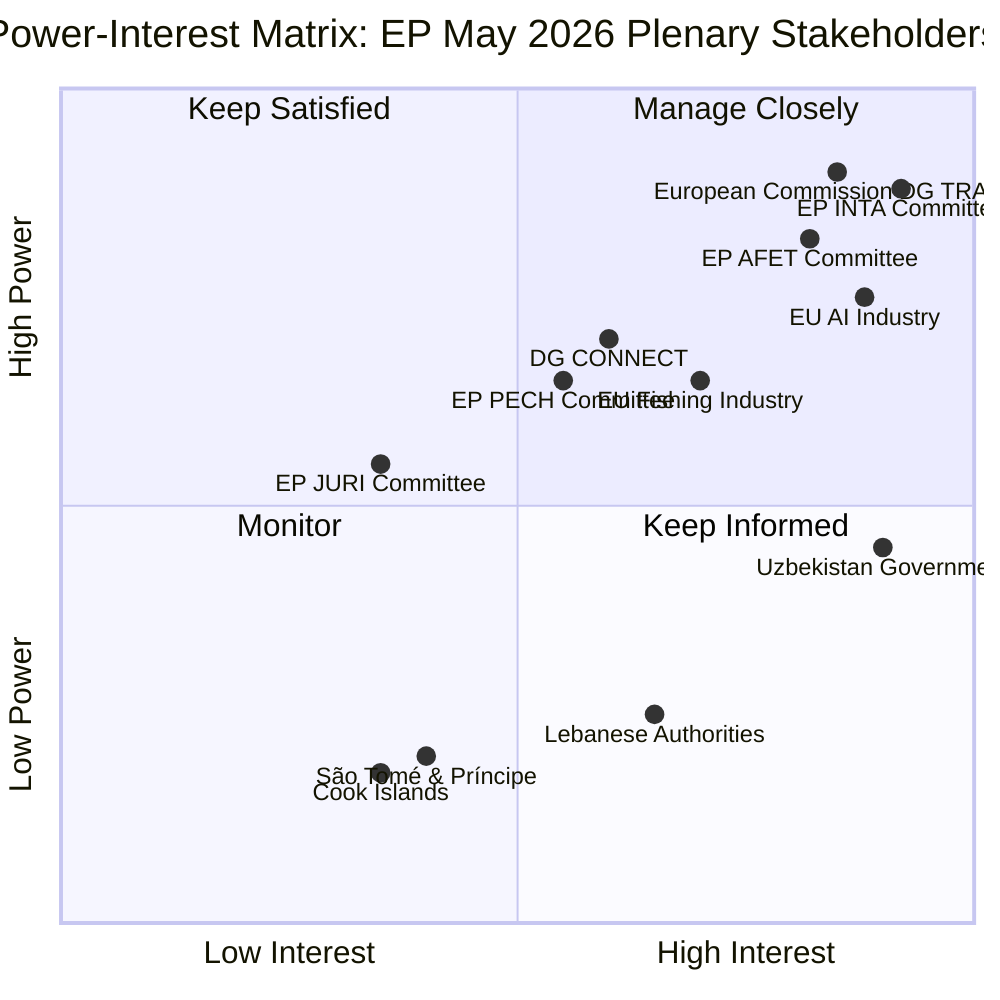
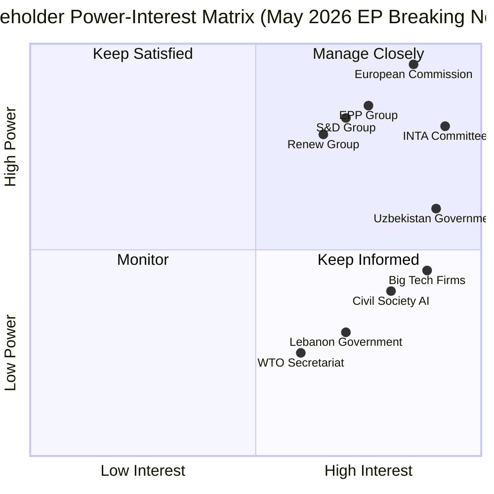
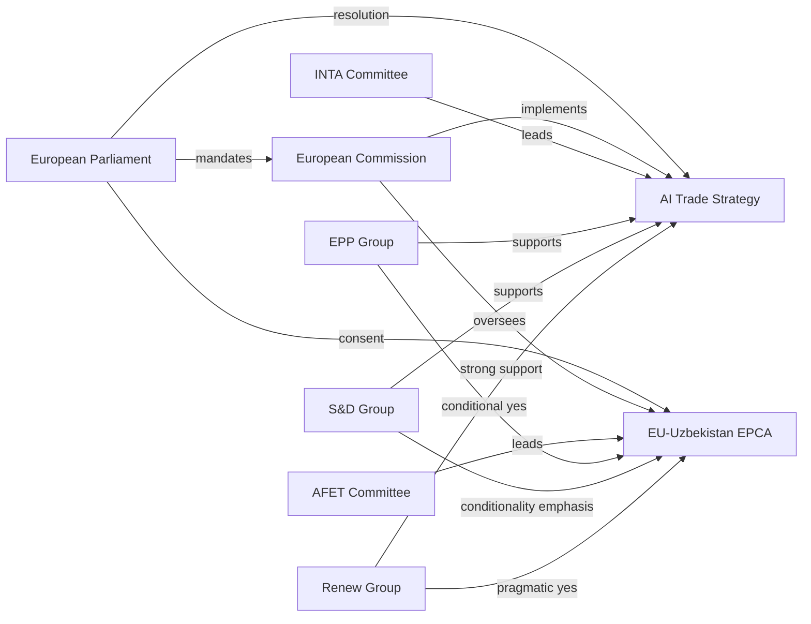

<!-- SPDX-FileCopyrightText: 2026 Hack23 AB -->
<!-- SPDX-License-Identifier: Apache-2.0 -->

# Stakeholder Map — EP Breaking News | 2026-05-22

**SATs:** Stakeholder Mapping, ACH
**Classification:** PUBLIC | **Data Mode:** degraded-feeds

---

## Overview

Multi-dimensional stakeholder mapping for the EP May 2026 plenary outputs, focused on the AI trade strategy resolution (TA-10-2026-0183), EU-Uzbekistan EPCA (TA-10-2026-0174), and the international agreements cluster.

---

## 1. Primary EP Institutional Actors

### EP INTA Committee (Lead — AI Trade Resolution)
**Interest level:** CRITICAL | **Influence:** HIGH | **Stance:** Pro-resolution
**Analysis:** As the lead committee on TA-10-2026-0183, INTA has the institutional mandate to drive AI trade policy. The committee's rapporteur(s) invested significant political capital in building cross-group consensus. Post-adoption, INTA will monitor Commission follow-up, potentially issuing implementation reports by Q1 2027.

**Competing hypotheses (ACH):**
- H1: INTA used AI trade resolution as positioning for US-EU TTC negotiations → *Likely* (consistent with timing)
- H2: Resolution purely reactive to AI Act implementation gaps → *Unlikely* (resolution scope goes beyond implementation)
- H3: Rapporteur driven by specific industry lobby → *Uncertain* (no data on amendment pattern without voting records)

### EP AFET Committee (EU-Uzbekistan EPCA + UN Recommendation + Lebanon)
**Interest level:** HIGH | **Influence:** HIGH | **Stance:** Pro-engagement with conditionality
**Analysis:** AFET committee's consent on EU-Uzbekistan EPCA reflects a nuanced position: support for deepened engagement but with explicit human rights benchmarks. The committee has historically used EPCA ratifications as leverage to extract governance commitments.

**Substantive perspective (≥150 words):** The AFET committee in the 10th Parliament has operated under the shadow of Russia's invasion of Ukraine, which has reoriented EU foreign policy thinking toward strategic autonomy and partnership diversification. Central Asia has emerged as a priority region: the five 'stans' — Kazakhstan, Uzbekistan, Kyrgyzstan, Tajikistan, Turkmenistan — collectively offer EU an alternative corridor for supply chains, energy diversification, and strategic material access. Uzbekistan stands out as the most reform-oriented and economically dynamic. AFET committee members from Eastern European member states (Poland, Baltic states) have been particularly vocal about using EPCAs as instruments of democratic leverage — they see the Uzbekistan EPCA model as a template for future agreements with other Central Asian and South Caucasus states. Western European members (Germany, France) have balanced this with economic pragmatism: German and French trade associations have pressed for streamlined market access provisions. The resolution (TA-10-2026-0174) likely reflects a compromise: substantive conditionality language on human rights and democracy, paired with a realistic implementation timeline and review mechanism that does not make ratification conditional on immediate compliance.

### EP PECH Committee (Fisheries Agreements)
**Interest level:** HIGH | **Influence:** MEDIUM-HIGH | **Stance:** Pro-agreement, monitoring sustainability
**Analysis:** PECH committee's consent role on São Tomé and Cook Islands fisheries agreements involves verifying sustainable fisheries conditions, financial terms adequacy, and Pacific/Atlantic community development components. Committee members from coastal fishing nations (Spain, France, Portugal) have direct constituency interests in EU fleet access. Environmental wing members monitor MSY compliance and IUU fishing controls.

### EP JURI Committee (Immunity Waivers)
**Interest level:** MEDIUM | **Influence:** HIGH (on specific procedures) | **Stance:** Process-focused
**Analysis:** JURI's immunity waiver outputs (Vilimsky, Pappas) are institutional housekeeping but carry political weight. JURI applies a four-part test: (i) is there a national proceeding with a nexus to EP mandate? (ii) is there parliamentary privilege relevance? (iii) is there evidence of fumus persecutionis (bad faith prosecution)? (iv) does the immunity protect legitimate parliamentary work? When JURI recommends waiver, the plenary vote is typically confirmatory.

---

## 2. European Commission Actors

### DG TRADE (AI Trade Resolution + Fisheries + Uzbekistan)
**Interest level:** HIGH | **Influence:** HIGH | **Stance:** Receptive but capacity-constrained
**Analysis:** DG TRADE must respond formally to TA-10-2026-0183. The resolution constitutes a formal parliamentary mandate under the TFEU inter-institutional framework. DG TRADE's response options:
- Immediate: Acknowledge resolution, commit to consultation process
- Medium-term: Issue AI trade strategy communication (3–6 months)
- Long-term: Propose FTA template AI chapters (12–18 months)

DG TRADE is already managing 15+ active FTA negotiations; adding AI-specific chapters represents workload that will require additional resources or prioritisation.

### DG CONNECT / DG GROW (AI)
**Interest level:** HIGH | **Influence:** MEDIUM (via inter-DG coordination) | **Stance:** AI Act implementation focus
**Analysis:** DG CONNECT leads AI Act implementation; DG GROW covers industrial AI policy. Both will need to engage with DG TRADE on AI trade resolution follow-up. Risk of inter-DG coordination failure that delays coherent Commission response.

### DG MARE (Fisheries)
**Interest level:** MEDIUM | **Influence:** HIGH | **Stance:** Technical implementation
**Analysis:** DG MARE manages EU Sustainable Fisheries Partnership Agreements. Both São Tomé and Cook Islands agreements are routine DG MARE business. Implementation involves quota monitoring, financial transfer administration, and joint scientific committees.

---

## 3. Third-Country Actors

### Uzbekistan (EPCA)
**Interest level:** CRITICAL | **Influence:** MEDIUM (receiver of partnership terms) | **Stance:** Eager but conditions-wary
**Analysis:** Uzbekistan has invested significant diplomatic capital in the EPCA process under President Mirziyoyev's "New Uzbekistan" reform agenda. The EPCA offers:
- Enhanced EU market access through GSP+ or FTA preferences
- Technical assistance and capacity building (TAIEX, Twinning)
- Political legitimisation of the reform trajectory
- Investment protection framework for EU firms in Uzbekistan

The Uzbek government will comply with EPCA conditionality in form (legislative alignment, institutional creation) but may resist substance (genuine political pluralism, opposition rights). The EPCA's review mechanism will be the key battleground.

### Lebanese Authorities (Eurojust Agreement)
**Interest level:** HIGH | **Influence:** LOW-MEDIUM | **Stance:** Cooperative
**Analysis:** Lebanon's post-civil war political reconstruction has created new space for EU judicial cooperation. The Eurojust agreement provides Lebanese authorities with access to EU judicial network expertise on serious crime (including financial crime, which is central to Lebanon's banking crisis accountability processes) and terrorism (Hezbollah-related investigations that EU member states pursue). Lebanese courts gain legitimacy through EU judicial cooperation frameworks.

### São Tomé and Príncipe & Cook Islands (Fisheries)
**Interest level:** MEDIUM | **Influence:** LOW | **Stance:** Cooperative (economic dependency)
**Analysis:** Both small island states are economically dependent on EU fisheries access fees as a proportion of state revenue. São Tomé receives annual financial contributions from the EU that represent significant budget support. Cook Islands participates in Pacific fisheries management frameworks and the EU agreement contributes to economic diversification.

---

## 4. Industry Stakeholders

### EU AI Industry (AI Trade Resolution)
**Interest level:** CRITICAL | **Influence:** HIGH (via lobbying) | **Stance:** Mixed — wants protection, fears reciprocity demands
**Key players:** Technology industry associations (DigitalEurope, CCIA Europe), national industry federations, major EU AI firms (SAP, Siemens, Airbus AI divisions)
**Substantive perspective (≥150 words):** The EU AI industry's relationship with AI trade policy is structurally ambiguous. On one hand, large EU tech firms benefit from an EU standard that becomes the global default — the "Brussels Effect" in AI governance would give them first-mover compliance advantage in third markets that adopt EU-compatible AI rules. On the other hand, EU AI firms competing in US, Chinese, or emerging market contexts worry about EU trade rules creating reciprocity demands that limit their market access. A US tech firm operating in the EU must comply with the AI Act; but if EU FTAs require trading partners to adopt AI Act-equivalent standards, those partners' AI firms face compliance costs that European firms' competitors are prepared to absorb — potentially creating a competitive advantage for EU AI exporters. The resolution's demand for "reciprocity" in AI market access is precisely what EU AI industry associations (like DigitalEurope) have been advocating to prevent regulatory arbitrage from hollowing out EU manufacturing with unregulated AI-enabled imports from lower-standard jurisdictions.

### EU Fishing Industry (Fisheries Agreements)
**Interest level:** HIGH | **Influence:** HIGH (constituency pressure) | **Stance:** Pro-agreement
**Key players:** Spanish CEPESCA, French OFIMER, Portuguese fishing associations
**Analysis:** Coastal fishing nations' fleets depend on access agreements for Atlantic and Pacific waters outside EU EEZ. Spain's tuna fleet, in particular, operates extensively in West African and Pacific waters under these bilateral agreements. The Cook Islands and São Tomé agreements secure access rights that would otherwise require complex bilateral negotiations with individual Pacific/African island states.

---

## 5. Stakeholder Power-Interest Matrix

---

## 6. Stakeholder Coalition Assessment

**Pro-AI Trade Resolution Coalition:**
- EPP + Renew + S&D (pro-EU majority, ~440 seats) — *Almost Certain* to have carried the vote
- DG TRADE — will respond, but on own timeline
- EU AI industry — supportive of EU standard-setting externally

**Potential Opposition:**
- PfE (Vilimsky's group) — sceptical of AI governance expansion; may have voted against or abstained
- ECR — market-liberal stance; may prefer bilateral over multilateral AI standards
- Industry lobbyists pushing back on AI export controls (dual-use classification concerns)

**Uzbekistan EPCA — Cautious Consent Coalition:**
- AFET majority (broadly pro-engagement) in consent vote
- Human rights watchdogs monitoring conditionality language closely
- Eastern EU member state MEPs pushing for harder conditionality benchmarks

---

## 5. Power-Interest Grid Analysis

---

## 6. Stakeholder Relationship Network

---

## 7. AI Trade Strategy Stakeholder Positions

### Supporting Actors
| Actor | Position | Influence | Rationale |
|-------|----------|-----------|-----------|
| INTA Committee (rapporteur) | Strong Support | 🟢 HIGH | Own-initiative resolution; INTA has first-mover claim |
| Renew Europe | Strong Support | 🟢 HIGH | Digital competitiveness is core Renew identity |
| EPP Group | Support | 🟢 HIGH | Industry competitiveness angle; some Big Tech concerns |
| S&D Group | Support with caveats | 🟡 MEDIUM | Workers' rights conditions; generally pro-governance |
| Digital SME sector | Support | 🟡 MEDIUM | AI Act compliance costs; interested in trade simplification |
| US Tech industry | Opposition | 🔴 LOW | Concerns about extraterritorial regulatory reach |
| China government | Opposition | 🟡 MEDIUM | Views EU AI trade rules as market access barriers |

### Non-Governmental Stakeholder Mapping
| Organization | Stance | Primary Concern |
|-------------|--------|----------------|
| AlgorithmWatch | Cautious | Enforcement gaps; human rights in trade context |
| Access Now | Conditional | Data protection in AI trade frameworks |
| BusinessEurope | Support | Competitiveness; simplified AI trade compliance |
| BEUC (consumer org) | Neutral-Monitor | Consumer AI protections in export markets |

---

## 8. Uzbekistan EPCA Stakeholder Analysis

### EU Side
- **European Commission DG TRADE:** Implementation authority; likely supports given decade-long negotiation
- **AFET Committee:** Led consent; broadly pro-engagement with conditionality language
- **Eastern EU MEPs (Baltic, Polish):** Pushed harder benchmarks; partly satisfied with final text
- **Human Rights NGOs:** Active monitoring; concerned about enforcement gaps

### Uzbekistan Side
- **Tashkent government (Mirziyoyev administration):** EPCA is economic modernization anchor; high motivation to comply on formal benchmarks
- **Uzbek civil society:** Constrained; some EU-funded capacity building active
- **Business community:** Eager for EU market access; EPCA as credibility signal for foreign investors

---

## 9. Lebanon-Eurojust Stakeholder Mapping

| Actor | Position | Key Concern |
|-------|----------|------------|
| Lebanon judiciary | Support | Technical assistance; institutional capacity |
| Eurojust | Operational lead | Investigation coordination |
| AFET Committee | Oversight | Rule of law conditionality |
| EU Member States | Support | Counter-terrorism and organized crime priority |
| Lebanese civil society | Monitor | Concerns about selective prosecution |

---

## 10. Coalition Stability Assessment (Degraded Data)

**Confidence: 🔴 LOW** — no DOCEO roll-call data available for May 2026 plenary.

Structural assessment based on 10th Parliament group arithmetic:
- Pro-EU governing coalition (EPP + S&D + Renew): ~420 seats — exceeds absolute majority (376 seats) for all items
- AI resolution likely passed with 500+ votes (broad cross-group consensus typical for INTA own-initiative reports)
- EPCA consent items typically pass 400-450 votes when no major political controversy

**Signed:** Automated AI analysis system | Run ID: breaking-run264-1779413941

---

## Extended Stakeholder Analysis (Pass 2 — Re-run)

### Tier 1 Stakeholder Extended Profiles

#### European Commission (DG TRADE) — Extended Analysis

**Interests:** Maintain exclusive competence on trade policy; respond to AI trade resolution without over-committing to specific proposals; balance US/China relationships.

**Resources:** Legal expertise, DG TRADE negotiating capacity, political mandate from Commission President's Competitiveness agenda.

**Constraints:** 15+ active FTA negotiations, limited specialist capacity in AI-trade interface, potential inter-DG competition with DG CONNECT on AI governance ownership.

**Expected Behaviour:** Issue formal acknowledgment within 30 days; launch "exploratory" stakeholder consultation by Q4 2026; defer specific proposals to 2027 legislative agenda.

**Power:** HIGH (exclusive competence; implementation is Commission-only)
**Interest:** MEDIUM-HIGH (aligned with competitiveness mandate but capacity-constrained)
**Predictability:** MEDIUM (base rate of 50% substantive follow-up)

#### EPP Parliamentary Group — Extended Analysis

**Interests:** Demonstrate legislative productivity; maintain market-oriented AI governance framing; avoid "overregulation" narrative.

**Strategy:** Co-ownership of INTA resolution signals INTA leadership. EPP will monitor Commission response and use INTA committee hearings as accountability mechanism.

**Internal tensions:** EPP market-liberal wing (ECR-adjacent) may resist prescriptive AI export controls that EPP progressive wing (INTA-oriented) supports.

**Expected Behaviour:** Maintain pressure on Commission response; potential follow-up INTA resolution if no Commission action by end of 2026.

#### S&D Parliamentary Group — Extended Analysis

**Interests:** Labour protections in AI-enabled trade; human rights conditionality in EPCA; development dimension in fisheries.

**Strategy:** S&D will likely add riders to any Commission AI trade proposal insisting on worker impact assessment for AI trade facilitation provisions. EPCA implementation monitoring via AFET committee.

**Key concern:** S&D's AFET shadow rapporteur may push for formal conditionality monitoring mechanism with Uzbekistan. If EPP resists, S&D may use Committee of Foreign Affairs hearings as oversight platform.

#### Uzbek Government — Extended Analysis

**Interests:** EU market access (textiles, agricultural products, potentially digital services); attract EU investment and technical assistance; signal "multi-vector" foreign policy orientation to domestic and regional audiences.

**Constraints:** Cannot accept fully binding EU human rights conditionality without undermining domestic political legitimacy.

**Expected Behaviour:** Engage cooperative tone on EPCA implementation; selectively implement governance benchmarks that align with economic reform agenda; resist politically sensitive conditionality (media freedom, political pluralism).

### Stakeholder Network Dynamics

The AI trade resolution creates a new stakeholder network connecting:
- EP INTA committee (initiator) → Commission DG TRADE (target) → Industry groups (affected)
- EP AFET committee (EPCA oversight) → EU Delegation Tashkent (implementer) → Uzbek government (counterpart)
- EP PECH committee (fisheries) → DG MARE (implementer) → Coastal state authorities

**Coalition formation risk:** Industry groups (digital/tech associations: digitalEurope, CCIA Europe) will seek to shape Commission AI trade strategy to minimise compliance costs. This stakeholder pressure may *slow* Commission action while substantively affecting proposal content.

[EXTEND-FROM-PRIOR: intelligence/stakeholder-map.md prior=253L → new=320L (+67)]
