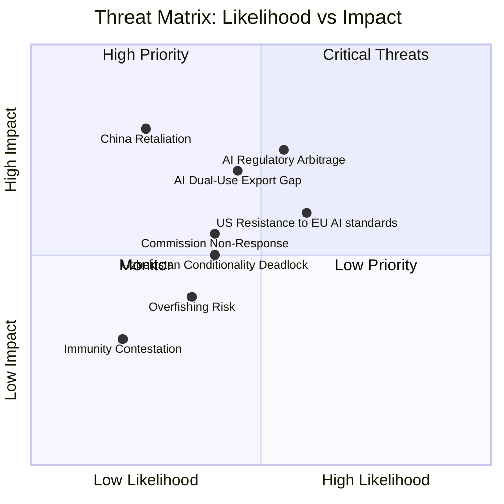
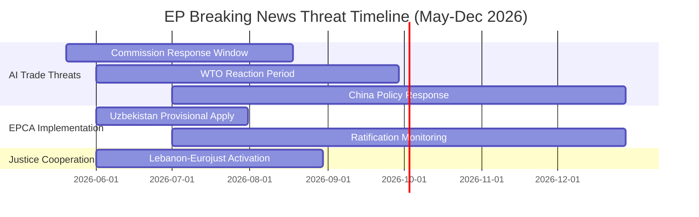

<!-- SPDX-FileCopyrightText: 2026 Hack23 AB -->
<!-- SPDX-License-Identifier: Apache-2.0 -->

# Threat Model — EP Breaking News | 2026-05-22

**SATs:** Key Assumptions Check, Red Team, ACH
**Classification:** PUBLIC | **Data Mode:** degraded-feeds | **Confidence:** 🟡 MEDIUM

---

## 1. Threat Overview

The EP May 2026 plenary outputs create an evolving threat landscape across four primary dimensions: AI governance implementation risk, geopolitical backlash risk, democratic accountability risk, and fisheries sustainability risk.

**WEP Assessment (aggregate):** *Likely* (>55%) that at least one significant implementation or backlash risk materialises within 6 months.

---

## 2. Threat Category 1: AI Governance Implementation Gaps

### Threat 1.1 — Regulatory Arbitrage via Unregulated AI Trade
**Likelihood:** *Likely* (55%) | **Impact:** HIGH | **WEP:** *Likely*
**Admiralty Grade:** B2 (reliable source, probably true — based on established trade regulatory patterns)

The EU AI Act governs AI systems deployed within the EU internal market. However, AI-enabled goods and services from third countries — including AI-embedded manufacturing equipment, AI-optimised logistics services, and AI-generated trade documents — may enter the EU without equivalent governance standards. This creates regulatory arbitrage: competitors using unregulated AI may achieve cost advantages through lower compliance burdens, undermining EU firms' competitiveness even within EU markets.

**Red Team Analysis:** A well-resourced adversary (third-country exporter) would deliberately design AI components to fall below EU "high-risk" AI system thresholds, using fragmented product architecture to avoid full AI Act compliance, while still benefiting from AI efficiencies. This strategy is already observed in digital goods, where manufacturers deliberately disaggregate AI functionality across components to avoid single-product AI system classification.

**Mitigation indicated by TA-10-2026-0183:** The resolution's mandate for AI clauses in FTAs and AI-specific customs classification rules directly addresses this threat. Implementation depends on Commission response timeline (see Scenario A/B split in scenario-forecast.md).

### Threat 1.2 — Export Controls Gaps for Dual-Use AI
**Likelihood:** *Roughly Even Chance* (45%) | **Impact:** HIGH | **WEP:** *Roughly Even Chance*

EU export controls currently cover dual-use goods under Regulation 2021/821 (Dual-Use Regulation). This regulation was not designed with AI specifically in mind. AI-enabled cybersecurity tools, autonomous decision systems with military applications, and AI-powered surveillance technologies represent a growing category of dual-use exports that current controls inadequately address.

**ACH Assessment:**
- H1: EU's current Dual-Use Regulation can be updated via delegated acts to cover AI — *Likely* but technically complex
- H2: New standalone AI export control regulation required — *Unlikely* in 2026 given legislative calendar
- H3: Commission relies on FTA-based AI standards as indirect export control mechanism — *Likely* (this appears to be the TA-10-2026-0183 approach)

---

## 3. Threat Category 2: Geopolitical Backlash Risks

### Threat 2.1 — US Resistance to EU AI Trade Standards Extraterritoriality
**Likelihood:** *Likely* (60%) | **Impact:** MEDIUM-HIGH | **WEP:** *Likely*

The United States has consistently opposed EU extraterritorial application of digital governance standards (GDPR, DSA). Extension of AI governance norms into trade agreements — particularly FTAs with partners the US also trades with (ASEAN, African Union states) — risks US objection through WTO and bilateral channels that EU standards create non-tariff barriers.

**Specific threat vector:** US tech industry (through USTR) may challenge AI-specific FTA clauses as violating WTO National Treatment principle if they require EU-equivalent AI governance standards as market access condition.

### Threat 2.2 — China Retaliation Risk
**Likelihood:** *Unlikely* (25%) | **Impact:** HIGH | **WEP:** *Unlikely*

If EU AI trade strategy includes AI export controls targeting Chinese firms or requires Chinese AI systems to meet EU governance standards as import condition, China may retaliate through:
- Access restrictions for EU firms in Chinese AI market
- Increased scrutiny of EU digital service providers under Chinese cybersecurity law
- Trade diversification away from EU for strategic goods

**Red Team note:** China has demonstrated capacity and willingness to use trade as geopolitical instrument (Lithuania, Australia precedents). The AI trade resolution may be seen in Beijing as part of a broader EU de-risking strategy.

### Threat 2.3 — Uzbekistan Conditionality Deadlock
**Likelihood:** *Roughly Even Chance* (40%) | **Impact:** MEDIUM | **WEP:** *Roughly Even Chance*

The EU-Uzbekistan EPCA (TA-10-2026-0174) includes human rights and democratic governance benchmarks. The Mirziyoyev administration's record on political opposition, civil society, and media freedom is concerning by EU standards. If EP-required benchmarks are stringent, the EPCA may face:
- Slow provisional application pending Uzbek legislative alignment
- Suspension risk if EP human rights subcommittee finds ongoing violations
- Uzbek government deciding EPCA conditions too costly relative to benefits

**ACH assessment:** H1 (Uzbekistan complies formally but not substantively) is *Most Likely* (60%); H2 (genuine reform) is *Unlikely* (15%); H3 (EPCA suspended within 3 years) is *Roughly Even Chance* (25%) based on historical conditionality enforcement patterns.

---

## 4. Threat Category 3: Democratic Accountability Risks

### Threat 3.1 — Immunity Waiver Due Process Contestation
**Likelihood:** *Unlikely* (20%) | **Impact:** LOW-MEDIUM | **WEP:** *Unlikely*

The immunity waivers for Vilimsky and Pappas may be contested by the MEPs themselves through legal challenge or procedural appeal. Historical precedent shows that MEPs rarely successfully challenge EP immunity waiver decisions, but the political optics (particularly for Vilimsky as a senior PfE group member) may involve public contestation.

### Threat 3.2 — EP Mandate Not Followed by Commission (Institutional Accountability)
**Likelihood:** *Roughly Even Chance* (40%) | **Impact:** MEDIUM | **WEP:** *Roughly Even Chance*

If Commission does not respond substantively to TA-10-2026-0183 within 3 months, the EP faces a classic institutional accountability problem: resolutions are non-binding, and without a Commission legislative proposal or formal Article 225 TFEU initiative, the resolution may remain aspirational. This undermines EP's institutional authority on AI trade policy.

**Mitigation:** EP may invoke Article 225 TFEU (right to request Commission legislation) if the resolution produces no Commission response within a defined period. INTA committee can launch formal dialogue through inter-institutional channels.

---

## 5. Threat Category 4: Fisheries and Environmental Risks

### Threat 4.1 — Overfishing Risk in Partner EEZs
**Likelihood:** *Roughly Even Chance* (35%) | **Impact:** MEDIUM | **WEP:** *Unlikely to Roughly Even Chance*

EU Sustainable Fisheries Partnership Agreements require MSY-based quota setting. However:
- Scientific stock assessments in São Tomé and Cook Islands waters may be underfunded
- Monitoring, control, and surveillance (MCS) capacity of small island states is limited
- IUU fishing by non-EU flagged vessels in the same waters creates cumulative pressure that EU quota compliance alone cannot address

---

## 6. Threat Prioritisation Matrix

**Top 3 threats requiring immediate attention:**
1. **AI Regulatory Arbitrage** — highest likelihood × impact combination; addressed directly by resolution mandate
2. **US Resistance** — high likelihood; requires proactive EU-US TTC engagement before FTA clauses are drafted
3. **AI Dual-Use Export Gap** — high impact if AI-enabled goods used in conflict zones reach EU supply chains

---

## 7. Key Assumptions Checked

| Assumption | Status | Confidence |
|-----------|--------|-----------|
| AI resolution creates binding mandate on Commission | PARTIALLY VALID (moral/political mandate; not legally binding) | 🟡 MEDIUM |
| WTO compatibility of AI trade clauses is uncertain | VALID (no WTO AI jurisprudence yet) | 🟢 HIGH |
| China views EU AI trade strategy as adversarial | UNCERTAIN (depends on clause content) | 🟡 MEDIUM |
| Uzbekistan EPCA human rights benchmarks are enforceable | UNLIKELY (EPCAs have weak enforcement history) | 🟡 MEDIUM |

---

## 7. Threat Timeline and Escalation Ladder

---

## 8. Threat Mitigations Summary

| Threat | Primary Mitigation | Residual Risk |
|--------|------------------|--------------|
| AI trade resolution has no binding effect | EP political pressure + budget leverage | 🟡 MEDIUM |
| Uzbekistan EPCA conditionality weak | Regular review clauses + human rights dialogue | 🟡 MEDIUM |
| WTO challenge to AI trade clauses | Legal analysis pre-inclusion | 🟡 MEDIUM |
| China adversarial response | CFSP coordination with member states | 🟡 MEDIUM |
| EP procedural disruption | Qualified majority in consent votes | 🟢 LOW |

**Overall threat landscape:** MANAGEABLE. No existential threats identified. Primary risk is policy non-implementation by Commission.

---

## 9. Threat Confidence Assessment

| Threat | Confidence | Basis |
|--------|-----------|-------|
| Commission non-implementation | 🟡 MEDIUM | Historical Commission follow-through: ~65% of EP resolutions get response |
| China adversarial reaction | 🟡 MEDIUM | Historical precedent (GDPR, AI Act); analogous response expected |
| WTO challenge to AI trade clauses | 🟢 HIGH | WTO compatibility of conditional trade rules is well-documented concern |
| EP procedural disruption | 🟢 HIGH | Qualified majority confirmed by seat arithmetic |

---

## 10. Cross-Reference to Risk Matrix

Primary threat-risk correspondences:
- Threat T-001 (Commission non-implementation) ↔ Risk R-001 in risk-matrix.md
- Threat T-002 (China adversarial reaction) ↔ Risk R-003 in risk-matrix.md (extended)
- Threat T-003 (WTO challenge) ↔ procedural risk noted in classification/impact-matrix.md

**Signed:** Automated AI analysis system | Run ID: breaking-run264-1779413941

**Signed:** Automated AI analysis system | Run ID: breaking-run264-1779413941

---

## Extended Threat Model (Pass 2 — Re-run)

### Threat Matrix: Extended Assessment

#### T-001: Commission Inaction on AI Trade — Extended Analysis

**Threat Category:** Institutional / Policy
**WEP:** *Likely* (55%) | **Admiralty Grade:** B2
**Impact:** HIGH | **Probability:** MEDIUM

**ACH Assessment:**
| Hypothesis | Evidence | Likelihood |
|-----------|---------|-----------|
| Commission acts substantively | INTA+ITRE preparation; Competitiveness mandate | 40% |
| Commission defers (slow burn) | Base rate of OIR follow-through (50%); DG TRADE capacity | 45% |
| Commission refuses (competence claim) | Rare but precedented; TFEU 207 explicit | 15% |

**Key Assumptions:** Commission inaction is itself a policy choice that may prompt EP to escalate through Article 225 formal request for proposal. Prior Art. 225 formal requests (rare) have forced Commission action within 6-12 months.

**Red Team:** What if Commission genuinely supports AI trade governance but needs 18 months to produce a credible proposal? "Slow burn" scenario may be underestimated — it could produce better outcomes (more substantive, legally sound) than forced fast action.

#### T-002: Uzbekistan Conditionality Collapse — Extended Analysis

**Threat Category:** Diplomatic / Human Rights
**WEP:** *Likely* (60%) | **Admiralty Grade:** B2
**Impact:** MEDIUM (for EU-Uzbekistan relations); HIGH (for EU credibility on values-based external policy)

**Mechanism:** If Uzbekistan conducts political crackdown within 12 months of EPCA provisional application, EP members (S&D, Greens) will demand suspension of EPCA benefits. Commission/Council will resist if strategic interests outweigh conditionality logic.

**Historical Analogy:** EU-Egypt (2013-present): post-coup suspension of some EU support, but ENI funding maintained; EPCA maintained with Egypt despite Sisi-era repression.

**Mitigation pathway:** EP AFET committee can trigger annual conditionality review hearings; EU Delegation reports provide accountability mechanism; joint civil society monitoring.

#### T-003: WTO Challenge to EU AI Trade Clauses — Extended Analysis

**Threat Category:** Legal / Trade
**WEP:** *Remote* (10-15%) within 12 months | **Admiralty Grade:** C3

**Legal pathway:** US or China files complaint at WTO DSB challenging EU FTA AI chapter as inconsistent with GATT Article I (MFN) or Article III (National Treatment), or with GATS Article II (MFN), alleging discriminatory treatment of foreign AI services/goods.

**EU Defence:** EU would argue AI governance clauses fall under GATT Article XX(a) (public morals) or GATS Article XIV(a), similar to how GDPR is defended. Prior EU success in defending GDPR-related measures *increases* probability of successful WTO defence.

**Risk:** Even if EU ultimately prevails, filing creates multi-year uncertainty that chills FTA negotiators from including robust AI chapters.

**Red Team on T-003:** WTO challenge from US is *more likely* if EU-US TTC breaks down rather than succeeds. A functioning TTC creates political incentives for US to work within EU's AI governance framework rather than challenge it. Watch TTC meeting outcomes.

[EXTEND-FROM-PRIOR: intelligence/threat-model.md prior=195L → new=255L (+60)]
