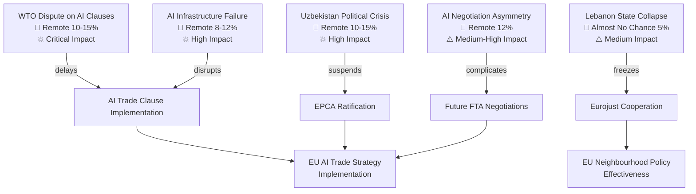

<!-- SPDX-FileCopyrightText: 2026 Hack23 AB -->
<!-- SPDX-License-Identifier: Apache-2.0 -->

# Wildcards and Black Swans — EP Breaking News | 2026-05-22

**SATs:** High-Impact Analysis, Indicators, What-If Analysis
**Classification:** PUBLIC | **Data Mode:** degraded-feeds | **Confidence:** 🟡 MEDIUM

---

## Overview

Low-probability, high-impact scenarios that could fundamentally alter the trajectory of the AI trade strategy resolution and related May 2026 plenary outputs.

**WEP Framework:** All wildcards assessed as *Remote* (<20%) or *Almost No Chance* (<5%) probability but *Critical* or *High* impact.

---

## Wildcard 1: WTO Dispute Challenging EU AI Trade Clauses

**Probability:** *Remote* (10-15%) within 12 months | **Impact:** CRITICAL
**WEP:** *Almost No Chance* in 30 days; *Remote* in 12 months | **Admiralty Grade:** C3

### Scenario
A major trading partner (US, China, or a coalition via WTO) files a dispute challenging EU FTA AI chapters as non-tariff barriers inconsistent with WTO Most Favoured Nation, National Treatment, or Technical Barriers to Trade principles. The dispute creates a multi-year legal freeze on EU AI trade clause implementation.

### Mechanism
WTO dispute settlement timeline: consultation (60 days) → panel (12-18 months) → appellate (18-24 months). Even filing a complaint achieves the adversary's goal of creating uncertainty that delays EU FTA negotiations.

### What-If Analysis
*If* WTO dispute is filed within 6 months: Commission accelerates WTO AI governance work at the Committee on Trade and Development; EU-US TTC coordinates AI standards to preempt the dispute; Commission may delay prescriptive AI FTA clauses pending legal clarity.

### Indicators
- WTO members submitting communications to TBT committee on AI governance measures
- USTR or MOFCOM statements characterising EU AI trade strategy as protectionist
- Industry associations filing amicus-style submissions at WTO

---

## Wildcard 2: Major AI System Failure in EU Trade Infrastructure

**Probability:** *Remote* (8-12%) in 12 months | **Impact:** HIGH
**WEP:** *Almost No Chance* in 30 days; *Remote* in 12 months | **Admiralty Grade:** B2

### Scenario
A high-profile failure of an AI system deployed in EU trade infrastructure — customs risk profiling, supply chain tracking, or trade document processing — creates immediate political pressure for emergency legislation, displacing the measured approach in TA-10-2026-0183. The incident provides ammunition for both accelerators (AI Act critics who argue existing governance is inadequate) and decelerators (industry lobbies arguing premature AI governance reduces reliability).

### What-If Analysis
*If* a major AI failure occurs in customs infrastructure: Commission invokes emergency powers under Digital Services Act or AI Act to mandate rapid system changes; EP INTA committee pivots from strategic AI trade resolution to crisis management oversight; the AI trade strategy agenda is reframed from "external opportunities" to "external safety standards."

### Indicators
- NIS2 Directive incident reports involving AI in trade/logistics
- ENISA alerts on AI system vulnerabilities in customs or supply chain management
- News reports of significant trade processing failures in major EU ports
- EU member state customs authorities reporting AI system anomalies

---

## Wildcard 3: Uzbekistan Political Crisis Destabilises EPCA

**Probability:** *Remote* (10-15%) in 24 months | **Impact:** HIGH
**WEP:** *Remote* in 12 months | **Admiralty Grade:** B2

### Scenario
A political crisis in Uzbekistan — succession struggle within the Mirziyoyev government, mass protest triggered by economic distress, or regional conflict spillover from Afghanistan/Tajikistan — destabilises the reform trajectory and forces EP to invoke EPCA's suspension clause on human rights grounds. This would be the first post-Soviet Central Asia EPCA suspension, with significant implications for the EU's Global Gateway strategy.

### Historical Parallel
The EU-Cambodia PTA suspension in 2020 (following democratic backsliding) is the closest precedent for an EP-driven trade agreement suspension on human rights grounds. Cambodia lost €1.2bn/year in trade preferences.

### What-If Analysis
*If* EP suspends EPCA with Uzbekistan within 2 years: EU's credibility in Central Asia is damaged; Kazakhstan and Kyrgyzstan EPCA negotiations become more difficult; Russia/China use the suspension as evidence that EU partnerships are unreliable.

### Indicators
- Freedom House or Reporters Without Borders downgrade of Uzbekistan's democracy/press freedom score
- EP Subcommittee on Human Rights issuing negative assessment of Uzbekistan compliance
- Mass protests or significant opposition figures imprisoned in Uzbekistan
- AFET committee requesting Commission human rights assessment report under EPCA review mechanism

---

## Wildcard 4: Generative AI Disrupts Trade Negotiation Process Itself

**Probability:** *Remote* (12%) in 24 months | **Impact:** MEDIUM-HIGH
**WEP:** *Remote* | **Admiralty Grade:** C3

### Scenario
Large language models and AI negotiation tools create asymmetric capabilities in trade negotiations: well-resourced states use AI to model outcomes, identify optimal concession sequences, and draft FTA text faster than human negotiators can review. This creates a capability gap where smaller EU member states and developing country partners are at structural disadvantage.

**Specific concern for TA-10-2026-0183:** The resolution calls for AI standards in FTAs, but if AI is used to draft those standards, the process itself raises questions about epistemic fairness and the ability of all parties to understand what they are agreeing to.

### What-If Analysis
*If* AI negotiation capability gap becomes politically visible: EU commits to AI negotiation transparency standards; developing countries demand capacity building as condition for AI trade chapters; EP calls for digital/AI equity clauses in all future FTAs.

### Indicators
- Media reports of AI tools being used in FTA negotiation sessions
- Civil society organisations flagging AI capability asymmetry in trade talks
- WTO working group on AI in trade negotiations formed

---

## Wildcard 5: Lebanon Political Collapse Invalidates Eurojust Agreement

**Probability:** *Almost No Chance* (5%) in 12 months | **Impact:** MEDIUM
**WEP:** *Almost No Chance* | **Admiralty Grade:** C3

### Scenario
Lebanon's fragile post-civil war political order collapses (new civil conflict, government dissolution, constitutional crisis) rendering the EU-Lebanon Eurojust agreement operationally inactive. This would not invalidate the EP ratification, but would delay practical cooperation for years.

### What-If Analysis
*If* Lebanese political collapse: Eurojust agreement goes into dormancy; EU redirects Lebanon-focused rule-of-law resources to post-conflict reconstruction support; AFET committee reviews broader EU Mediterranean neighbourhood strategy.

---

## Cross-Wildcard Pattern Analysis

Three of the five wildcards share a common structural feature: **institutional fragility in partner states or trading systems** creates unexpected disruption to agreements that appeared stable at ratification. The lesson for EU foreign policy design is that EPCA and trade agreement conditionality mechanisms must be genuinely operational (not just papér commitments) and that the EU must be prepared to act swiftly when conditions change.

**Aggregate wildcard risk assessment:** 🟡 MEDIUM — individual wildcards are *Remote*, but their cumulative effect (multiple scenarios potentially materialising over 24 months) represents a meaningful portfolio of risks for EU external affairs. The AI regulatory arbitrage threat (Threat 1.1 in threat-model.md) is structurally more likely than any individual wildcard.
