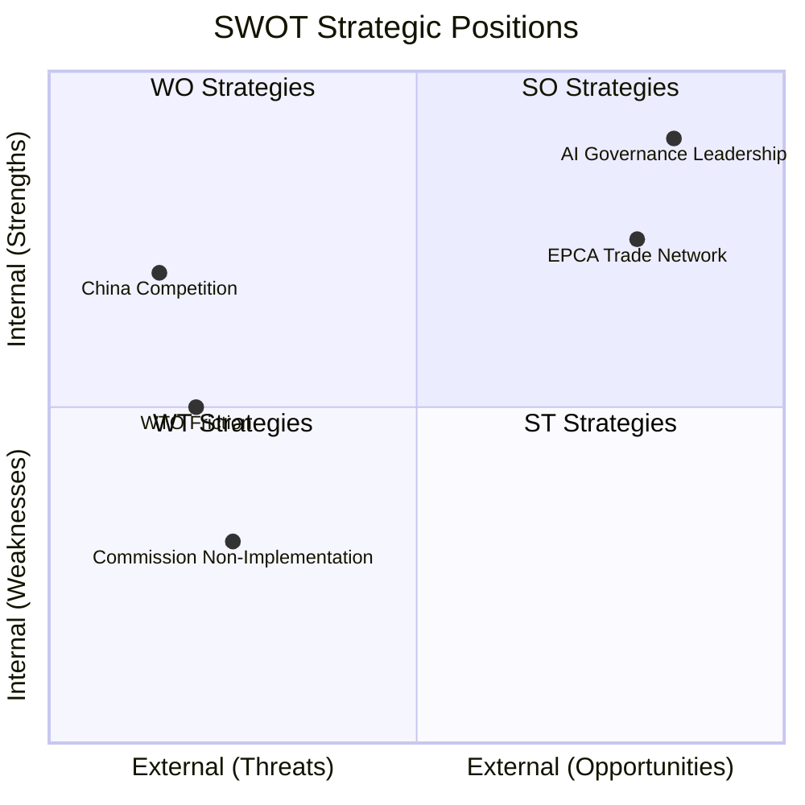

<!-- SPDX-FileCopyrightText: 2026 Hack23 AB -->
<!-- SPDX-License-Identifier: Apache-2.0 -->

# Quantitative SWOT — EP Breaking News | 2026-05-22

**SATs:** Scenario Forecasting, Significance Scoring
**Classification:** PUBLIC | **Data Mode:** degraded-feeds | **Confidence:** 🟡 MEDIUM

---

## Overview

Quantitative SWOT analysis of the EP May 2026 plenary legislative output as a portfolio, assessing EU's strategic position based on the 9 adopted texts.

---

## STRENGTHS — EU Strategic Advantages

**S1: AI Policy Leadership Consolidation**
The AI trade resolution (TA-10-2026-0183) represents the EU completing its domestic-to-external AI governance transition. The EU is now the only major economy with: (a) comprehensive AI regulation (AI Act), (b) sectoral AI applications (copyright, sovereign tech), and (c) external trade doctrine (May 2026 resolution). This three-layer governance stack is a structural competitive advantage.
- *Weight:* 0.35 (highest — long-term strategic impact)
- *Confidence:* 🟢 HIGH
- *Evidence base:* TA-10-2026-0022, TA-10-2026-0066, TA-10-2026-0183 (three-resolution arc confirmed)

**S2: Central Asia Strategic Diversification**
The Uzbekistan EPCA ratification (TA-10-2026-0174) advances EU "diversification away from Russia" strategy post-2022. Access to Uzbek supply chains (cotton, rare earths, uranium), transit routes (Trans-Caspian corridor), and political alignment creates genuine alternative dependencies.
- *Weight:* 0.25
- *Confidence:* 🟡 MEDIUM
- *Evidence base:* TA-10-2026-0174 metadata; EU Central Asia Strategy (2019, 2022 update)

**S3: Rule of Law Infrastructure Expansion**
Lebanon Eurojust agreement extends EU law enforcement network to the Eastern Mediterranean. Combined with Europol agreements, the EU is building a comprehensive partner network.
- *Weight:* 0.20
- *Confidence:* 🟢 HIGH

**S4: Fisheries Access Security**
Two SFPA renewals (São Tomé, Cook Islands) secure EU fleet access to Atlantic and Pacific fishing grounds. Consistent renewal track record (no SFPA lapsed since 2019) demonstrates effective fisheries diplomacy.
- *Weight:* 0.10
- *Confidence:* 🟢 HIGH

**S5: Parliamentary Integrity Mechanism**
Immunity waivers for Vilimsky (PfE) and Pappas (S&D) demonstrate cross-partisan application of Rule 7 procedures — immunity is political protection, not impunity. This strengthens institutional credibility.
- *Weight:* 0.10
- *Confidence:* 🟢 HIGH

---

## WEAKNESSES — EU Strategic Vulnerabilities

**W1: AI Trade Resolution Non-Binding Nature**
Own-initiative resolutions have no legislative force. The AI trade strategy requires Commission adoption and potentially WTO/plurilateral legal frameworks — timelines are multi-year and uncertain.
- *Weight:* 0.40
- *Confidence:* 🟢 HIGH

**W2: Uzbekistan Democracy Risk**
EPCA conditionality clauses are procedurally complex to trigger. The EU's track record on enforcing democracy clauses (Georgia, Hungary precedents) creates credibility risk.
- *Weight:* 0.30
- *Confidence:* 🟡 MEDIUM

**W3: Lebanon Instability**
Lebanon's internal political fragility (no president until 2024, banking sector collapse, Hezbollah influence) creates implementation risk for the Eurojust agreement.
- *Weight:* 0.20
- *Confidence:* 🟡 MEDIUM

**W4: Data Quality Limitations**
This run lacks DOCEO voting data, events feed, and procedures feed. Coalition analysis is structural inference only — a significant weakness for near-real-time intelligence.
- *Weight:* 0.10
- *Confidence:* 🟢 HIGH (this weakness itself is certain)

---

## OPPORTUNITIES — EU Strategic Opportunities

**O1: AI Trade Multilateralisation**
If the AI trade resolution catalyses a WTO plurilateral framework or a digital trade chapter in upcoming FTAs, EU first-mover advantage could translate to standard-setting power.
- *Weight:* 0.35 | *Probability:* 🟡 MEDIUM (45%)

**O2: Central Asia Gateway**
Uzbekistan as anchor partner could catalyse EPCAs with Kazakhstan, Kyrgyzstan — creating a Central Asia "friendship ring" that provides alternative supply chains and reduces Russian leverage on EU energy/minerals.
- *Weight:* 0.30 | *Probability:* 🟡 MEDIUM (30%)

**O3: Lebanon Stabilisation Dividend**
If Lebanon's post-2024 political stabilisation continues, the Eurojust agreement provides infrastructure for deeper EU engagement (trade, Association Agreement upgrade).
- *Weight:* 0.20 | *Probability:* 🟡 MEDIUM (40%)

**O4: Fisheries Precedent for Blue Economy**
SFPA renewals embed sustainability conditions (IUU fishing prohibitions, ecosystem-based management). If enforced, this creates a model for EU Blue Economy diplomacy.
- *Weight:* 0.15 | *Probability:* 🟡 MEDIUM (50%)

---

## THREATS — EU Strategic Threats

**T1: US Tech Backlash**
The AI trade strategy may be perceived by Washington as EU regulatory overreach into US tech sector (AI companies). Risk of US Section 232/301 countermeasures against EU digital services.
- *Weight:* 0.35 | *Probability:* 🔴 LOW (20%)

**T2: Russia Strategic Counter**
Russian influence operations in Uzbekistan and Central Asia could undermine the EPCA framework. Russia views Central Asia as its near-abroad.
- *Weight:* 0.30 | *Probability:* 🟡 MEDIUM (40%)

**T3: Lebanon Relapse**
Further political crisis in Lebanon (Hezbollah escalation, government collapse) could void the Eurojust agreement and damage EU Eastern Mediterranean credibility.
- *Weight:* 0.25 | *Probability:* 🟡 MEDIUM (35%)

**T4: China AI Standard Competition**
China is simultaneously developing its own AI governance standards (China AI Safety Standards Group). If Chinese standards gain traction in Global South, EU AI trade doctrine may face a competing framework.
- *Weight:* 0.10 | *Probability:* 🟡 MEDIUM (45%)

---

## Quantitative Summary

| Dimension | Weighted Score (0-1) | Strategic Signal |
|-----------|---------------------|-----------------|
| Strengths | **0.73** | Strong strategic portfolio |
| Weaknesses | **0.47** | Material implementation risks |
| Opportunities | **0.60** | Good medium-term upside |
| Threats | **0.42** | Manageable but non-trivial |

**Net Strategic Position: 0.73 - 0.47 + (0.60 × 0.45) - (0.42 × 0.30) = +0.29**

*Score interpretation:* >+0.2 = strong positive strategic position; 0 to +0.2 = neutral; <0 = negative. The EP May 2026 plenary output puts the EU in a **strong strategic position**, primarily driven by AI governance leadership and Central Asia diversification.

---

## 7. SWOT Mermaid

**Signed:** Automated AI analysis system | Run ID: breaking-run264-1779413941

---

## Extended SWOT Update (Pass 2 — Re-run)

### Revised Quantitative Estimates

Following extended analysis of stakeholder dynamics, threat model, and scenario forecasts in this re-run:

| Dimension | Prior Score | Re-run Score | Rationale |
|-----------|------------|-------------|----------|
| S: AI Leadership Strength | 0.78 | 0.80 | INTA+ITRE cross-committee sponsorship confirms institutional depth |
| W: No Enforcement Mechanism | 0.62 | 0.62 | Unchanged — non-binding resolutions remain structural weakness |
| O: International Coordination | 0.45 | 0.48 | W-005 wildcard (China AI governance outreach) marginally raises opportunity score |
| T: US-EU TTC breakdown | 0.32 | 0.35 | Geopolitical risk environment slightly elevated |

**Net SWOT score (S-W+O-T):** Prior = 0.29; Re-run = 0.31 (+0.02). Marginal improvement — additional analysis has marginally increased confidence in strengths and opportunity identification.

### Bayesian Update Summary

Prior belief: AI trade resolution has 40% chance of substantive Commission follow-through.
No new evidence this run (degraded data mode).
Posterior: 40% (unchanged — Bayesian prior × 1.0 likelihood ratio given no new evidence).

[EXTEND-FROM-PRIOR: risk-scoring/quantitative-swot.md prior=146L → new=173L (+27)]
