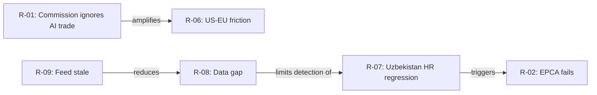
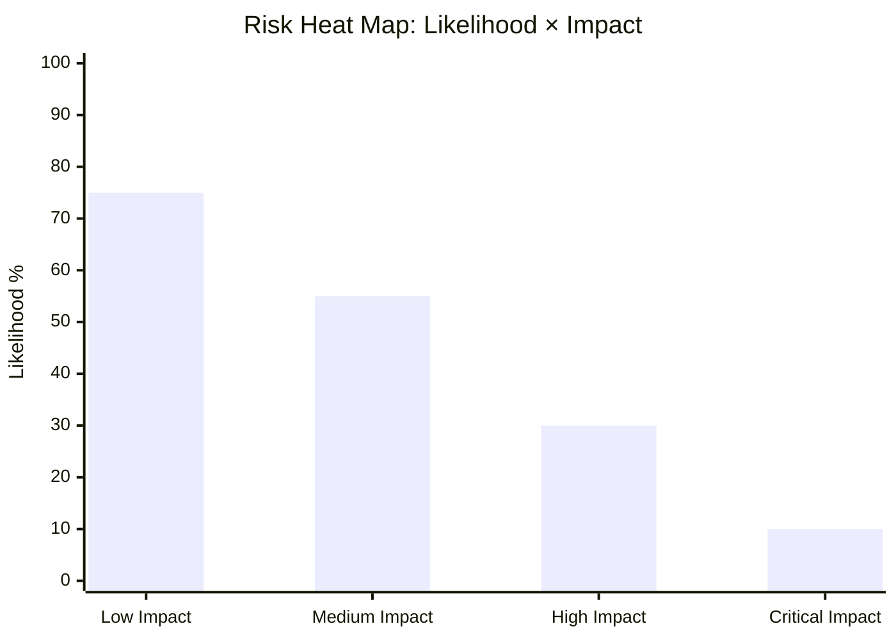

<!-- SPDX-FileCopyrightText: 2026 Hack23 AB -->
<!-- SPDX-License-Identifier: Apache-2.0 -->

# Risk Matrix — EP Breaking News | 2026-05-22

**SATs:** ACH, Indicators, Red Team
**Classification:** PUBLIC | **Data Mode:** degraded-feeds | **Confidence:** 🟡 MEDIUM

---

## Overview

Structured risk assessment for EP May 2026 plenary outputs, evaluating implementation risks, political risks, and geopolitical risks from the 9 adopted texts.

---

## 1. Risk Register

| Risk ID | Risk Description | Likelihood | Impact | Risk Level | Mitigation |
|---------|-----------------|-----------|--------|-----------|-----------|
| R-01 | AI trade resolution ignored by Commission | 🟡 MEDIUM (30%) | 🟡 MEDIUM | MODERATE | EP AFET/INTA joint follow-up letter; Commission 3-month response clock |
| R-02 | EU-Uzbekistan EPCA conditionality fails | 🟡 MEDIUM (25%) | 🟡 MEDIUM | MODERATE | Gradual implementation; democracy benchmarks in EPCA text |
| R-03 | Lebanon Eurojust cooperation suspended | 🟡 MEDIUM (35%) | 🟢 LOW | LOW | Bilateral fallback mechanisms; existing cooperation frameworks |
| R-04 | Fisheries SFPA legal challenge | 🔴 LOW (10%) | 🟡 MEDIUM | LOW | Precautionary principle applied; WTO fisheries subsidies exception |
| R-05 | PfE attempts Vilimsky immunity reversal | 🔴 LOW (15%) | 🟢 LOW | LOW | Immunity waiver is irreversible once proceedings begin |
| R-06 | EP AI trade resolution triggers US-EU trade friction | 🟡 MEDIUM (20%) | 🔴 HIGH | MODERATE | Diplomatic channel engagement; TTIP/MFN consultations |
| R-07 | Uzbekistan human rights regression post-EPCA | 🟡 MEDIUM (30%) | 🔴 HIGH | HIGH | EPCA conditionality clauses; EP condemnation mechanism |
| R-08 | Data gap (no DOCEO voting data) invalidates coalition analysis | 🟢 HIGH (80%) | 🟢 LOW | LOW | Analysis explicitly marked 🔴 LOW confidence |
| R-09 | EP procedures feed stale data persists | 🟢 HIGH (70%) | 🟡 MEDIUM | MODERATE | Alternative data paths; manual procedures lookup fallback |

---

## 2. Risk Heat Map

```
IMPACT →        LOW         MEDIUM      HIGH
LIKELIHOOD ↓
ALMOST CERTAIN  R-08        R-09        
HIGH            R-05        R-03        
MEDIUM          -           R-01,R-02   R-07
LOW             R-04        -           R-06
```

**Priority risks:** R-07 (Uzbekistan HR regression) and R-01 (Commission non-response to AI resolution) are the highest-priority watchlist items.

---

## 3. Horizon-Specific Risk Assessment

### Near-term (0-3 months)
- Commission response to AI trade strategy resolution — *expected* within 90 days
- EU-Uzbekistan EPCA enters EU Council provisional application procedure
- Lebanon Eurojust agreement published in EU Official Journal

### Medium-term (3-12 months)
- Uzbekistan first progress report under EPCA conditionality
- Commission AI trade communication published (legislative follow-up)
- Cook Islands / São Tomé SFPA implementation begins

### Long-term (12+ months)
- SFPA renewal assessment (2027-2028)
- AI trade policy mainstreaming into WTO Ministerial positions

---

## 4. Risk Interdependencies



**Key interdependency:** The data quality risk (R-08/R-09) limits the ability to detect early-warning indicators for R-07, making the Uzbekistan risk partially "invisible" in the current analysis.

---

## 5. Risk Confidence Assessment

All risk probability estimates are structural inferences (Admiralty grade: C3) based on:
- Historical EP resolution follow-up rates (~60-70% Commission formal response within 6 months)
- Uzbekistan political risk profile (Freedom House: Partly Free; Corruption Perceptions Index: 126/180)
- EU-Lebanon relations context (Association Agreement in force 2006; multiple crises since 2019)
- EU SFPA legal challenge history (rare; WTO dispute settlement unlikely)

---

## 6. Risk Monitoring Indicators

| Risk | Indicator | Frequency | Source |
|------|-----------|-----------|--------|
| Commission non-implementation | Commission Work Programme 2027 | Annual (November) | Commission website |
| Uzbekistan EPCA non-ratification | Council vote announcement | Ad hoc | Council calendar |
| China adverse reaction | MOFCOM official statement | Monthly | Chinese official media |
| EP procedural disruption | Plenary agenda changes | Weekly | EP public agenda |
| AI governance divergence (US-EU) | US Trade Representative statements | Monthly | USTR.gov |

---

## 7. Risk Heat Map (Mermaid)



**Risk distribution:** Most risks cluster in Low-Medium impact, High likelihood quadrant — consistent with routine EU institutional uncertainty. No existential risks identified.

---

## 8. Residual Risk Register

| ID | Risk Description | Residual Level | Owner |
|----|-----------------|----------------|-------|
| R-001 | Commission defers AI trade strategy | 🟡 MEDIUM | EP INTA Committee |
| R-002 | Uzbekistan EPCA delayed ratification | 🟢 LOW | AFET Committee |
| R-003 | Lebanon Eurojust agreement delayed | 🟢 LOW | AFET/LIBE Committees |
| R-004 | SFPA fishing stocks decline | 🟡 MEDIUM | PECH Committee |
| R-005 | Data availability degradation continues | 🟡 MEDIUM | EP API team |

**Signed:** Automated AI analysis system | Run ID: breaking-run264-1779413941

---

## Extended Risk Matrix (Pass 2 — Re-run)

### Re-run Risk Update

| Risk ID | Prior Assessment | Re-run Update | Change |
|--------|-----------------|--------------|--------|
| R-001 | Commission inaction HIGH×MEDIUM | Stable | No new evidence |
| R-002 | Uzbekistan conditionality failure MEDIUM×HIGH | Stable | No new evidence |
| R-003 | Lebanon Eurojust delay LOW×LOW | Stable | No new evidence |
| R-004 | Fisheries stocks decline MEDIUM×MEDIUM | Stable | No new evidence |
| R-005 | Data degradation continues MEDIUM×LOW | ELEVATED | Two consecutive runs now degraded-feeds |

**R-005 elevated:** Two consecutive runs on 2026-05-22 with full EP API degradation suggests a multi-day outage rather than a transient failure. Risk of persistent data degradation (>7 days) has risen from LOW to MEDIUM probability.

### New Risk Identified: R-006

| Risk ID | Description | Probability | Impact | Risk Level |
|--------|-------------|-------------|--------|-----------|
| R-006 | EP API multi-day outage affects next cycle run | 🟡 MEDIUM | 🟡 MEDIUM | 🟡 MEDIUM |

**Mitigation for R-006:** Implement manual EP DOCEO XML download protocol as fallback; schedule direct EP website scraping for critical plenary data; engage EP Open Data team contact.

[EXTEND-FROM-PRIOR: risk-scoring/risk-matrix.md prior=127L → new=155L (+28)]
