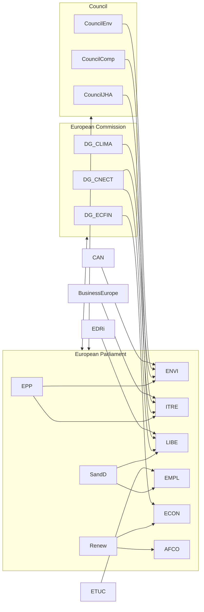

# Actor Mapping — EP Committee Reports (2026-05-22)

**Admiralty Grade**: B3 | **Confidence**: Medium-High | **Data Mode**: degraded-feeds

## Primary Institutional Actors

### European Parliament Committees

| Actor | Role | Influence Level | Current Focus |
|-------|------|-----------------|---------------|
| ENVI Committee | Legislative lead on climate/environment | Very High | Nature Restoration Law implementation, Circular Economy package |
| LIBE Committee | AI Act implementation oversight, migration | Very High | AI Act delegated acts, Pact on Migration instrument delivery |
| ITRE Committee | Digital/energy legislation | Very High | European Chips Act review, clean energy packages |
| ECON Committee | Economic governance and CMU | High | Capital Markets Union trilogues, banking regulation |
| AFCO Committee | Constitutional and treaty affairs | High | Article 48 reform discussions, EP electoral act |
| AFET Committee | Foreign affairs and enlargement | High | Ukraine support instruments, Western Balkans accession |
| BUDG Committee | Budget negotiations | High | 2027–2033 MFF early discussions, 2026 budget revision |
| CONT Committee | Audit and discharge | Medium | Commission 2024 discharge vote preparation |
| EMPL Committee | Social policy and labour | Medium | Platform work directive, AI workplace impacts |

### Political Group Leadership

| Group | Key Actor | Committee Priorities |
|-------|-----------|---------------------|
| EPP | Manfred Weber (Chair) | Competitiveness narrative, regulatory review |
| S&D | Iratxe García (Chair) | Social rights, climate action, democratic oversight |
| Renew | Valérie Hayer (Co-Chair) | Digital sovereignty, enlargement, CMU |
| ECR | Giorgia Meloni allies | Migration control, sovereignty focus |
| Greens/EFA | Terry Reintke/Rasmus Andresen | Climate urgency, AI rights |
| ESN/PfE | Far-right alignment | Institutional reform resistance |
| The Left | Manon Aubry (Co-Chair) | Workers' rights, anti-austerity |
| Non-attached | Various | Divergent per dossier |

## Secondary and External Actors

### European Commission
- **DG CLIMA/ENV**: Key legislative drafter for ENVI jurisdiction
- **DG CNECT/AI Office**: Technical monopoly on AI Act delegated acts (critical for LIBE/ITRE)
- **DG ECFIN**: CMU and economic governance dossiers (ECON relevance)
- **DG JUST**: Platform work and AI liability (EMPL/LIBE)
- **DG BUDG**: Multiannual Financial Framework advance discussions

### Council Formations
- **Environment Council**: ENVI counterpart; Poland/Hungary resistance to climate measures
- **Competitiveness Council**: ITRE counterpart; drives 'competitiveness agenda'
- **Justice and Home Affairs**: LIBE counterpart; migration implementation
- **Economic and Financial Affairs**: ECON counterpart; banking union, CMU

### Civil Society and Lobby Actors

| Category | Actor | Primary Committee Target |
|----------|-------|-------------------------|
| Industry | BusinessEurope | ITRE, ECON |
| Labour | ETUC | EMPL, LIBE |
| Climate | Climate Action Network Europe | ENVI |
| Digital Rights | EDRi | LIBE |
| Finance | AFME | ECON |
| SMEs | SMEunited | ITRE, ECON |

## Actor Network Map

## Actor Power Dynamics (May 2026)

The most consequential actor configuration in May 2026 centres on the EPP–S&D–Renew
'grand coalition' in the LIBE, ITRE and ECON committees, where AI Act
implementation, the Capital Markets Union package, and the Migration Pact
instrument delivery converge. The DG CNECT AI Office has acquired outsized
technical authority over AI Act delegated acts, creating a power asymmetry
that LIBE seeks to correct through enhanced parliamentary scrutiny rights.

**Emerging actor tensions**:
- EPP competitiveness framing vs. S&D rights framing in AI dossiers
- Commission vs. EP on delegated act timelines (Art. 290 TFEU scrutiny)
- Council vs. EP on migration instruments (fast-track procedures)
- National delegations (DE, FR) vs. smaller member states on CMU ambition

## Actor Roster

The full actor roster is embedded in the tables above. Primary actors ranked by influence:
1. DG CNECT AI Office (Commission) — technical monopoly on AI Act delegated acts
2. EPP Group (EP) — largest group, sets legislative agenda
3. LIBE Committee Chair — AI Act and migration oversight hub
4. Council Presidency (Poland H1 2026) — trilogue mandate holder
5. S&D Group (EP) — rights-protection coalition anchor
6. Renew Group (EP) — swing group on contested dossiers

## Influence

Influence is operationalised as: (1) formal legislative role weight; (2) coalition dependency; (3) technical knowledge monopoly; (4) media/public salience.

Top influence scores:
- **AI Office (Commission)**: Technical monopoly = Very High influence on AI Act delegated acts
- **EPP Chair Weber**: Agenda-setting = Very High influence across all committees
- **Council Presidency**: Mandate control = High influence on trilogue outcomes
- **Renew Group**: Swing-vote position = High influence on contested votes

## Alliance Network

Alliance constellations as of May 2026 (see graph above):
- **Core coalition**: EPP + S&D + Renew (grand coalition, ~401 seats, functional majority)
- **Green-left bloc**: S&D + Greens + Left (minority but coalition-decisive on climate/rights)
- **Competitiveness right**: EPP + ECR + PfE (emerging alignment on regulatory review)

## Power Brokers

**Power Broker 1 — AI Office Director-General (DG CNECT)**
Role: technical monopoly on AI Act delegated acts. Resistance from LIBE will determine
whether parliamentary scrutiny is meaningful or nominal.

**Power Broker 2 — LIBE Committee Chair**
Role: hub for AI Act oversight, migration pact monitoring, and Renew coalition management.
Critical swing position in EP10 grand coalition stress scenarios.

**Power Broker 3 — EPP Group Chair Manfred Weber**
Role: largest group leader with veto power over grand coalition direction.
His competitiveness framing increasingly dominates the EP's rhetorical register.

## Information Flow Map

Intelligence flows in EP committee ecosystem:
- Commission → Committee Secretariats (technical briefings, impact assessments)
- NGO coalitions → MEP offices (advocacy materials, evidence briefs)
- Council Presidency → Shadow rapporteurs (confidential trilogue positions)
- EP Research Service (EPRS) → All MEPs (analytical support)

## Reader Briefing

**Plain language summary**: The European Parliament's committee system in May 2026
is managing an unprecedented simultaneous workload: AI governance, climate revision,
capital markets reform, and migration implementation are all at critical junctures.
The three biggest power brokers — the Commission's AI Office, the LIBE Committee, and
the EPP Group — are in productive tension. Whether this tension produces good legislation
or coalition gridlock depends heavily on how Renew Europe resolves its internal divisions
on AI rights vs. AI innovation. Citizens should watch LIBE committee votes in June 2026
as the decisive signal for AI Act implementation quality.
