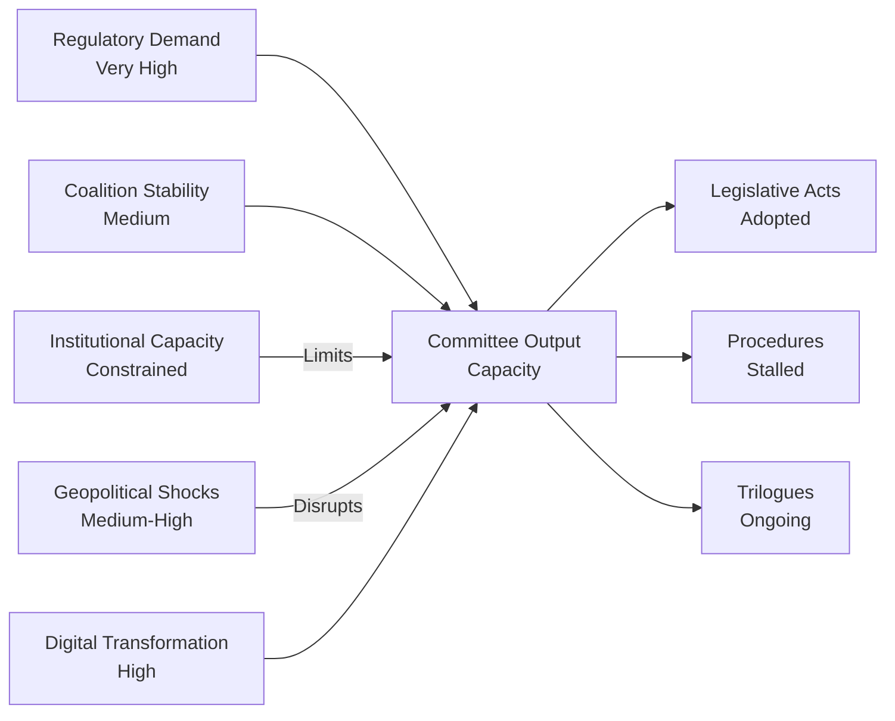

# Forces Analysis — EP Committee Reports (2026-05-22)

**Admiralty Grade**: B3 | **Confidence**: Medium-High | **Data Mode**: degraded-feeds

## Driving Forces Shaping EP Committee Activity

This forces analysis applies a structured analytical framework to identify the
macro-level forces driving and constraining EP committee legislative output
in May 2026.

## Five Forces Framework (Adapted for Parliamentary Context)

### Force 1 — Regulatory Demand (External Push)
**Strength**: Very High | **Trend**: Increasing

The EU regulatory environment faces unprecedented demand pressure from:
- AI Act implementation (2024–2025 phased obligations entering force)
- Green Deal revision under competitiveness pressure
- Capital Markets Union relaunch (post-Draghi Report recommendations)
- Migration Pact delivery (operational by 2026)
- Defence procurement and EDIP coordination

*Implication*: Committees face legislating backlog at historic levels. ITRE, LIBE, ENVI are
simultaneously handling flagship legislation at all stages of the pipeline.

### Force 2 — Political Coalition Stability (Internal)
**Strength**: Medium | **Trend**: Fragile-Stable

The EPP–S&D–Renew 'grand coalition' has held since the July 2024 inaugural
session but faces stress on three axes:
- AI regulation: EPP innovation-first vs. Greens/Left rights-first
- Climate: EPP competitiveness caveats vs. Greens urgency
- Migration: S&D humanitarian vs. EPP/ECR control emphasis

Coalition arithmetic requires ~375 votes for majority. Any two of the three
major groups can assemble a majority, creating competition rather than
automatic cohesion.

### Force 3 — Institutional Capacity Constraints
**Strength**: High | **Trend**: Worsening

EP committees operate under structural bottlenecks:
- 705 MEPs; 20 standing committees; limited plenary agenda slots
- Rapporteur assignment monopolises individual MEP time
- Pre-summer legislative sprint (May–July) concentrates deadlines
- Committee secretariat overloaded with simultaneous trilogues

*Constraint*: Committees cannot process every file optimally. Institutional
triage — some dossiers will slip post-summer.

### Force 4 — External Geopolitical Shocks
**Strength**: Medium-High | **Trend**: Elevated

Ukraine war, transatlantic trade tensions (US tariffs), and enlargement
negotiations (Ukraine, Moldova, Western Balkans) create real-time legislative
demands on AFET, BUDG, ECON, and AFCO:
- Defence spending directives require BUDG emergency procedures
- US tariff response requires INTA fast-track
- Enlargement reform requires AFCO treaty-change work

*Force amplifier*: geopolitical events can re-prioritise committee agendas at
short notice, displacing planned legislative work.

### Force 5 — Digital/Technical Transformation
**Strength**: High | **Trend**: Accelerating

AI Act delegated acts, Cyber Resilience Act implementation, Data Act and
Governance Act secondary legislation create a sustained technical-regulatory
workload in ITRE and LIBE that requires specialized expertise not uniformly
present across committee membership.

## PESTLE-Forces Cross-Reference

| PESTLE Domain | Primary Force | Secondary Force |
|---------------|--------------|----------------|
| Political | Coalition stability | Geopolitical shocks |
| Economic | Regulatory demand | CMU/competitiveness |
| Social | Migration | AI workplace impacts |
| Technological | Digital transformation | AI governance |
| Legal | Implementation backlog | Treaty reform |
| Environmental | Green Deal tension | Climate legislation |

## Force Vectors Visualisation

## Force Balance Assessment (May 2026)

**Net assessment**: The forces pushing for legislative output (regulatory demand, political
mandate) are substantially larger than the forces constraining it (coalition stress, capacity)
in the current pre-summer sprint. The critical variable is whether the EPP–S&D–Renew coalition
holds through the contentious AI Act delegated acts process in LIBE and ITRE. Fracture on
this dossier would reverberate across the entire May–July sprint.

**Confidence in assessment**: B3 (fairly reliable, not corroborated by current-week feed data)

## Issue Frame

**Issue**: Can the EP committee system deliver its legislative sprint agenda (AI Act,
CMU, Climate, Migration) before the July 2026 summer recess, while maintaining the
grand coalition coalition's structural cohesion?

**Stakes**: High. Failure to deliver on any of the three flagship dossiers (AI delegated
acts, CMU framework directive, Migration Pact instruments) would expose the EP to
criticism of institutional ineffectiveness and hand the Commission leverage in inter-
institutional power dynamics.

## Restraining Forces

1. **Institutional capacity ceiling** (Strength: High) — 20 committees, 705 MEPs,
   limited plenary slots. The mathematical impossibility of equal attention to all
   dossiers forces triage.

2. **Coalition fragility** (Strength: Medium) — EPP right-flank pressure on climate;
   S&D left-flank pressure on migration rights. Both constrain grand coalition margin.

3. **Council resistance** (Strength: Medium-High) — Council formations on environment
   and migration are more conservative than EP majorities. Trilogue delays likely.

4. **Technical complexity** (Strength: High) — AI Act delegated acts require specialist
   expertise. Most MEPs outside ITRE/LIBE are ill-equipped to evaluate technical details.

5. **Summer recess deadline** (Strength: High) — Hard stop at 15 July 2026. Any file
   not at trilogue mandate stage by then slips to September at earliest.

## Net Pressure

**Net assessment**: Driving forces (regulatory demand, political mandate, institutional
inertia toward delivery) exceed restraining forces on standard legislative business.
However, on the contested AI/climate/migration nexus, the net force balance is closer
to equipoise — outcomes genuinely uncertain.

## Intervention Points

**Lever 1: Renew Group internal coordination**
Renew's internal split between liberal-progressive (Macron allies) and liberal-
conservative (Central/Eastern Europe) is the single most leverageable intervention
point. If Renew reaches internal consensus early, the grand coalition solidifies.

**Lever 2: Commission delegated act timeline concessions**
If the Commission offers to extend scrutiny windows for AI Act delegated acts, it
can unlock LIBE/Renew support without a formal coalition crisis.

**Lever 3: Rapporteur workload rebalancing**
EP leadership could intervene to redistribute rapporteurship burdens, reducing
the bottleneck effect of a few heavily-burdened MEPs across concurrent trilogues.

## Reader Briefing

**Plain language**: The EP faces the classic legislative sprint problem — too much to do,
too little time. The forces pushing for delivery (the EU's regulatory agenda, political
group mandates, institutional momentum) are strong. But so are the forces holding
things back (coalition tensions, technical complexity, Council resistance). The key
force that could break the deadlock either way is Renew Europe. If they align internally,
the sprint succeeds. If they fracture on AI governance, expect a messy autumn session.
