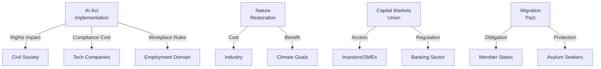

# Impact Matrix — EP Committee Reports (2026-05-22)

**Admiralty Grade**: B3 | **Confidence**: Medium-High | **Data Mode**: degraded-feeds

## Overview

This impact matrix maps the cross-domain effects of EP committee legislative
activity in May 2026 across stakeholder groups, policy domains, and
institutional actors.

## Primary Impact Domains

### Domain 1 — AI and Digital Governance

**Primary committees**: LIBE, ITRE
**Dossiers**: AI Act implementation, Cyber Resilience Act, Data Act

| Stakeholder | Impact Type | Magnitude | Timeline |
|-------------|------------|-----------|----------|
| Tech companies (large) | Compliance obligation | Very High | 2026–2027 |
| SMEs | Competitive pressure | Medium | 2026–2028 |
| Civil society/NGOs | Rights enforcement | High | 2026 onward |
| National authorities | Supervisory capacity | High | 2026–2027 |
| Individual citizens | Rights protection | High | Long-term |

### Domain 2 — Climate and Environment

**Primary committees**: ENVI
**Dossiers**: Nature Restoration Law, Circular Economy, Emissions Trading

| Stakeholder | Impact Type | Magnitude | Timeline |
|-------------|------------|-----------|----------|
| Industry (heavy) | Cost increase | Very High | 2026–2030 |
| Clean-tech sector | Market opportunity | High | 2026–2030 |
| Farmers/land users | Adaptation obligation | High | 2026–2028 |
| Member states | Reporting burden | Medium | 2026 onward |
| Climate NGOs | Advocacy outcome | Medium-High | 2026 |

### Domain 3 — Economic Governance and CMU

**Primary committees**: ECON, BUDG
**Dossiers**: Capital Markets Union, banking regulation, MFF advance discussions

| Stakeholder | Impact Type | Magnitude | Timeline |
|-------------|------------|-----------|----------|
| Financial institutions | Market structure | Very High | 2026–2028 |
| Retail investors | Market access | Medium | 2027–2030 |
| SME financing | Funding conditions | High | 2026–2028 |
| Pension funds | Investment rules | High | 2027 onward |
| Member states (net payers) | Budget exposure | High | 2028–2033 |

### Domain 4 — Migration and Security

**Primary committees**: LIBE, AFET
**Dossiers**: Pact on Migration instruments, external border management

| Stakeholder | Impact Type | Magnitude | Timeline |
|-------------|------------|-----------|----------|
| Asylum seekers | Legal framework | Very High | 2026 onward |
| Member states (frontline) | Operational burden | High | 2026–2027 |
| Member states (interior) | Solidarity obligations | High | 2026–2027 |
| FRONTEX/Agencies | Mandate expansion | High | 2026–2027 |
| Civil society (migration) | Monitoring role | Medium | 2026 onward |

## Cross-Domain Impact Matrix

## Impact Cascade Analysis

The most significant second-order impacts in May 2026 are:

1. **AI Act → Labour Market**: AI Act workplace provisions (Art. 22 GDPR + AI Act Art. 28)
   create new rights for workers subject to AI decision-making. EMPL and LIBE are likely
   to coordinate on enforcement guidance, amplifying the impact beyond digital firms.

2. **CMU → Green Transition Finance**: A successful Capital Markets Union reform would
   channel private capital into green infrastructure, creating a positive feedback loop
   between ECON (CMU) and ENVI (climate targets).

3. **Migration Pact → Fundamental Rights**: Operational implementation of the Migration Pact
   raises fundamental rights concerns that LIBE will monitor intensively, creating ongoing
   institutional tension between security and rights imperatives.

## Magnitude Scale Used

- **Very High**: Structural/irreversible change in the affected domain
- **High**: Significant operational or market impact, medium-term adjustment required
- **Medium**: Notable but manageable impact, normal adaptive capacity sufficient
- **Low**: Incremental change, minimal adaptation required

## Event List

Key events identified for impact assessment in May 2026:

1. **AI Act delegated acts process** (LIBE/ITRE, Q2 2026) — Commission proposes, EP scrutinises
2. **CMU framework directive trilogue** (ECON, Q2-Q3 2026) — critical market structure decision
3. **Nature Restoration Law implementation** (ENVI, Q2 2026) — national plans submission
4. **Migration Pact operational start** (LIBE/AFET, H1 2026) — solidarity mechanism activation
5. **EP enlargement resolution** (AFCO/AFET, Q2 2026) — Ukraine/Moldova accession milestones
6. **2026 budget revision (defence/Ukraine)** (BUDG, H2 2026) — supplementary request
7. **Commission 2024 discharge vote** (CONT, Q2-Q3 2026) — annual accountability cycle

## Stakeholder Assessment

See Domain-level impact tables above. Key stakeholder tiers:
- **Tier 1 (Very High impact)**: Tech companies (AI Act), Financial institutions (CMU)
- **Tier 2 (High impact)**: Industry/farmers (climate), Asylum seekers (Migration Pact)
- **Tier 3 (Medium impact)**: SMEs (regulatory burden), Member state authorities

## Heat Map

Impact heat map (High = H, Medium = M, Low = L):

| Event | Tech | Finance | Climate/Industry | Civil Society | Member States |
|-------|------|---------|-----------------|---------------|---------------|
| AI Act delegated acts | H | M | M | H | H |
| CMU framework | M | H | L | M | H |
| Nature Restoration | L | M | H | H | H |
| Migration Pact | L | L | L | H | H |
| Enlargement resolution | L | M | L | M | H |
| Budget revision | M | M | M | M | H |
| Commission discharge | L | L | L | M | M |

## Reader Briefing

**What this means for EU citizens**: The May 2026 EP committee sprint touches your life
in concrete ways. The AI Act delegated acts being decided now will determine whether
AI systems that affect your employment, credit score, or insurance are meaningfully
regulated or subject to light-touch technical compliance. The CMU framework will shape
whether you can invest more easily across EU borders. The Migration Pact implementation
will determine the conditions facing asylum seekers across the EU. The Nature Restoration
Law will influence what forests and wetlands look like in your country in 2030. These are
not abstract legislative processes — they are the machinery that sets the rules of daily life.
