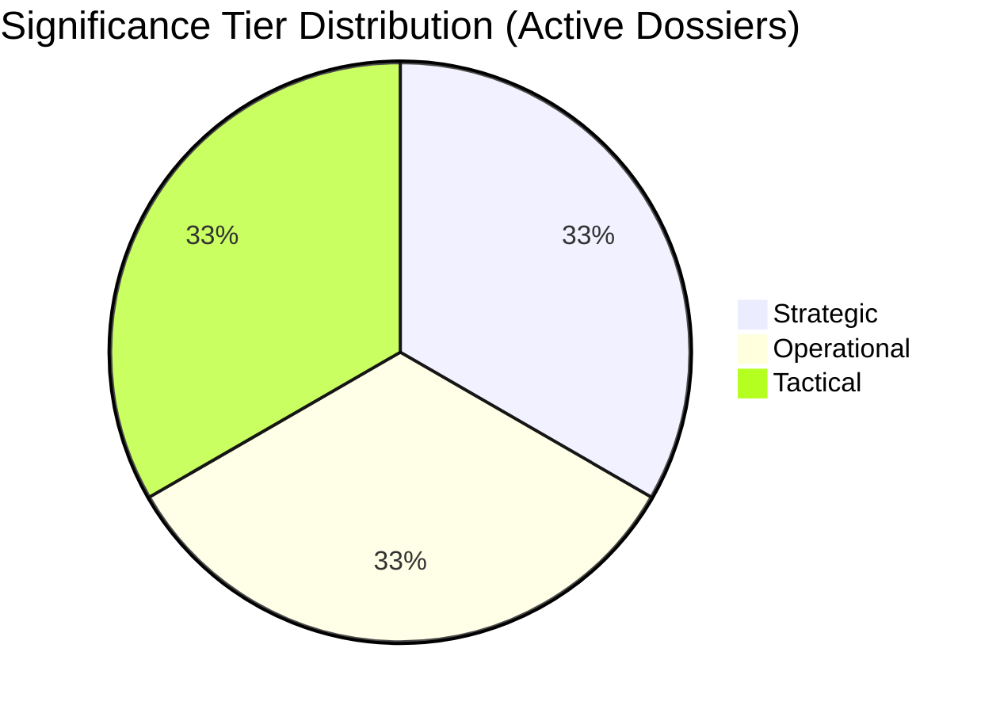

# Significance Classification — EP Committee Reports (2026-05-22)

**Admiralty Grade**: B3 | **Confidence**: Medium-High | **Data Mode**: degraded-feeds

## Classification Framework

This artifact applies the significance classification framework to EP committee
activity detected in May 2026, using a three-tier approach: Strategic, Operational,
and Tactical.

## Tier 1 — Strategic Significance (Long-term structural impact)

### 1.1 AI Act Delegated Acts Process (LIBE + ITRE)
**Significance**: STRATEGIC | **Horizon**: 5–10 years

The AI Act's delegated acts process (ongoing May 2026) will determine the
technical standards, conformity assessment procedures, and enforcement mechanisms
for the world's first comprehensive AI regulation. This is constitutionally
significant: the EP's use of Article 290 TFEU scrutiny rights to push back on
Commission delegated acts sets precedent for how democratic oversight applies
to algorithmic governance. LIBE's insistence on enhanced parliamentary scrutiny
rights represents a structural expansion of EP prerogatives in the digital age.

**Why strategic**: The AI Act delegated acts will govern AI systems for a decade.
The precedent set now for EP oversight will shape regulatory democracy in AI
governance globally. The Brussels effect means EP standards become de facto
international standards.

### 1.2 Capital Markets Union Completion (ECON)
**Significance**: STRATEGIC | **Horizon**: 3–7 years

A functional CMU would redirect hundreds of billions of euros from bank-
intermediated to market-intermediated finance, fundamentally altering Europe's
capital structure. The May 2026 trilogue phase is the critical juncture:
success here would cement EU financial integration; failure would likely
delay CMU by another political cycle (5+ years).

### 1.3 EP Constitutional Reform (AFCO)
**Significance**: STRATEGIC | **Horizon**: 5–15 years

AFCO's work on Article 48 treaty change procedures and the EP's own electoral
reform (spitzenkandidaten reinforcement, transnational lists) could fundamentally
alter the EP's democratic legitimacy and its relationship with the Commission.
Low current probability but very high impact if materialises.

## Tier 2 — Operational Significance (2–5 year impact)

### 2.1 Migration Pact Implementation (LIBE)
**Significance**: OPERATIONAL | **Horizon**: 2–4 years

The Pact on Migration and Asylum entered application in 2026. LIBE's oversight
of its implementation — screening procedures, solidarity mechanism, agency
mandates — will shape whether the Pact delivers on its promises or collapses
under member state non-compliance.

### 2.2 Nature Restoration Law Implementation (ENVI)
**Significance**: OPERATIONAL | **Horizon**: 2–5 years

Implementation of Nature Restoration Law obligations (30% area targets by 2030)
enters the critical coordination phase. ENVI committee oversight of national
restoration plans will determine whether headline targets are met.

### 2.3 Enlargement Pre-accession Dossiers (AFCO, AFET, BUDG)
**Significance**: OPERATIONAL | **Horizon**: 3–7 years

Ukraine, Moldova, and Western Balkans accession progress requires simultaneous
treaty reform (AFCO), foreign affairs coordination (AFET), and budget impact
assessment (BUDG). The convergence of these three dossiers in 2026 makes
enlargement an operationally critical multi-committee challenge.

## Tier 3 — Tactical Significance (6–24 month impact)

### 3.1 Commission 2024 Discharge (CONT)
**Significance**: TACTICAL | **Horizon**: 6–12 months

Annual discharge cycle. Notable if any major irregularities in 2024 Commission
spending are identified.

### 3.2 2026 Budget Revision (BUDG)
**Significance**: TACTICAL | **Horizon**: 6–12 months

Defence and Ukraine supplementary budget request likely in H2 2026. BUDG
committee negotiating position will shape final outcome.

### 3.3 Rapporteur Assignment Cycle (Administrative)
**Significance**: TACTICAL | **Horizon**: 3–6 months

D'Hondt allocation of rapporteurships for new dossiers entering committee phase.
Important for political group strategy but routine.

## Significance Distribution Visualisation

## Classification Summary Table

| Dossier | Tier | Committee | Key Indicator |
|---------|------|-----------|---------------|
| AI Act delegated acts | Strategic | LIBE/ITRE | Scrutiny rights outcome |
| Capital Markets Union | Strategic | ECON | Trilogue result |
| EP constitutional reform | Strategic | AFCO | Art. 48 initiative |
| Migration Pact | Operational | LIBE | Implementation compliance |
| Nature Restoration | Operational | ENVI | National plans submission |
| Enlargement | Operational | AFCO/AFET/BUDG | Accession milestones |
| Commission discharge | Tactical | CONT | Annual cycle |
| Budget revision | Tactical | BUDG | Defence/Ukraine supplement |
| Rapporteur allocation | Tactical | All | D'Hondt round |

## Classification Methodology Note
Significance tiers are assigned based on: (1) temporal horizon of impact;
(2) reversibility — structural changes score higher; (3) population affected —
EU-wide vs. sector-specific; (4) constitutional/precedent value. The classification
reflects the analytical judgment of this run under degraded data conditions (B3 grade).
