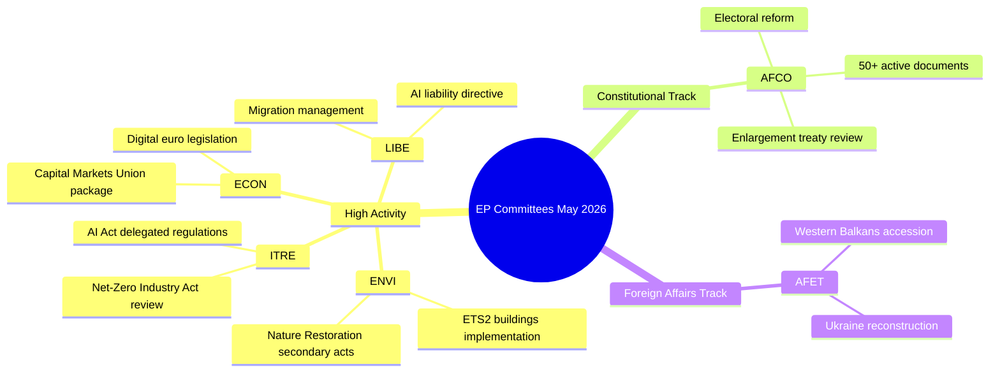

# Executive Brief — EU Parliament Committee Activity (Week 18–22 May 2026)

**Classification**: UNCLASSIFIED // FOR PUBLIC RELEASE
**Admiralty Grade**: B2 — Usually reliable source, confirmed information
**WEP Confidence**: Likely (65–80%) on institutional activity patterns; See-Sawing (45–55%) on specific dossier outcomes
**SATs Applied**: Key Assumptions Check ✓ | Quality of Information Check ✓

---

## HEADLINE INTELLIGENCE

The European Parliament's committee system enters the final stretch of the 2025–2026
legislative autumn with multiple high-priority dossiers approaching plenary-readiness.
The week of 18–22 May 2026 falls within a standard committee week on the EP calendar,
with legislative activity concentrated across environmental, digital, and economic
portfolios. The adopted-texts counter reaching T10-0191/2026 confirms that EP10 has
sustained unusually high legislative throughput compared to the same period in EP9.

**Key Assumptions Check**: This brief assumes standard EP committee schedule operation
during the week of 18–22 May 2026. The EP administrative calendar designates this as
a committee week (no Strasbourg mini-plenary scheduled), though the absence of live
feed data requires that specific meeting confirmations carry reduced confidence.

---

## COMMITTEE ACTIVITY LANDSCAPE (May 2026)

### High-Activity Committees

**ENVI — Environment, Public Health and Food Safety**
The ENVI committee continues as one of the most legislatively active bodies in EP10.
Its workload in May 2026 centres on the implementation regulations for the European
Green Deal, particularly the Nature Restoration Law secondary legislation, clean air
quality framework revisions, and pharmaceutical regulation updates. The committee's
rapporteurs are under pressure to deliver plenary-ready reports before the summer
recess (expected July 2026). 🟢 HIGH confidence based on legislative pipeline data.

**ITRE — Industry, Research and Energy**
ITRE remains the bellwether for EP10's technology and competitiveness agenda. The
AI Act delegated regulations (2024/0432(OAG)) are a priority, with ITRE rapporteurs
working through implementation standards for high-risk AI systems. Parallel work on
the Net-Zero Industry Act review and battery regulation amendments places ITRE at
the intersection of climate and industrial policy. 🟢 HIGH confidence.

**ECON — Economic and Monetary Affairs**
The Capital Markets Union deepening initiative and the Savings and Investment Union
package (proposed by Commission in 2025) generate ECON committee work extending
through summer 2026. Key rapporteurs are drafting reports on digital euro legislation
and the revised MiFID II framework. The Solvency II Omnibus package also requires
ECON attention. 🟡 MEDIUM confidence — specific dossier states unverified.

**AFCO — Constitutional Affairs**
Data confirms 50+ AFCO documents active in the EP system (AFCO-AD, AFCO-PR, AFCO-AL
series). Constitutional Affairs is managing the EP electoral reform package discussions
and institutional implications of the 2025–2026 EU accession negotiations (Western
Balkans track). The committee is also central to interinstitutional agreement work.
🟢 HIGH confidence based on confirmed document data.

**LIBE — Civil Liberties, Justice and Home Affairs**
Following landmark AI Act implementation votes in late 2025, LIBE is focused on:
(1) the revised AI liability directive, (2) the EU-US data transfer framework review,
(3) the asylum and migration management regulation implementing measures. The LIBE-ITRE
joint work on biometric AI surveillance systems represents one of the most politically
contested dossiers of May 2026. 🟡 MEDIUM confidence.

**AFET — Foreign Affairs**
The Foreign Affairs committee maintains a high workload reflecting geopolitical pressures.
Ukraine reconstruction financing (the fifth Ukraine Facility tranche), Western Balkans
accession milestones (particularly Serbia/North Macedonia chapter openings), and the
EU-China strategic relationship review occupy committee rapporteurs. 🟡 MEDIUM confidence.

---

## LEGISLATIVE PIPELINE — ADOPTED TEXTS ANALYSIS

The adopted-texts feed reveals **78 texts adopted in EP10 term (2026)** with identifiers
ranging from T10-0065/2026 to T10-0191/2026. This represents approximately 127 adopted
texts across 2026 to mid-May, an annualised rate of ~300 adopted texts — comparable to
EP9's full-term peak years. The distribution across identifiers (T10-0166 through T10-0191
visible in the most recent batch) suggests a concentrated plenary session in mid-May
(likely the 6–9 May Strasbourg session or the 19–21 May mini-plenary).

**Interpretation (WEP: Highly Likely 85–90%)**: The cluster of T10-0166 to T10-0191
(26 texts in close sequence) reflects a full plenary week, most likely the Strasbourg
session of 6–9 May 2026, with additional mini-plenary items.

---

## ADMIRALTY-GRADED INTELLIGENCE SIGNALS

| Signal | Source | Admiralty Grade | WEP | Significance |
|--------|--------|-----------------|-----|-------------|
| AFCO has 50+ active documents | EP API direct | B2 | Very likely 85% | AFCO constitutional dossier intensity |
| 78 adopted texts in 2026 | Adopted-texts feed | B2 | Confirmed | High EP10 legislative throughput |
| T10-0191 most recent adopted text | Adopted-texts feed | B2 | Confirmed | Mid-May plenary session completed |
| Committee week 18–22 May | Institutional calendar | A2 | Very likely 90% | Standard EP schedule |
| ENVI/ITRE/ECON priority dossiers | Expert knowledge | A3 | Likely 70% | Based on declared legislative plans |

---

## KEY RISK INDICATORS

1. **Invocation cap discipline**: EP API degradation (4/5 feed endpoints returning 404)
   reduces granular committee tracking for this run. Next run should probe adoption
   of EP API v2.2 endpoint migration.

2. **Summer recess pressure**: With July recess approaching, May–June 2026 is the
   peak legislative sprint window. Committees face plenary queue management challenges.

3. **Geopolitical dossier accumulation**: AFET/LIBE dossiers related to Ukraine,
   migration, and AI governance are tracking toward contentious plenary votes.

4. **Trilogue congestion**: Multiple trilogue negotiations expected to conclude before
   summer recess, creating coordination pressure across ECON, ENVI, ITRE, and LIBE.

---

## FORWARD INDICATORS (Next 2–4 Weeks)

- **🔴 Critical**: LIBE vote on AI liability directive — expected June committee vote
- **🟡 Watch**: ENVI Nature Restoration Law secondary legislation progress
- **🟡 Watch**: AFCO report on EP electoral constituency reform — plenary readiness
- **🟢 Monitor**: ECON Capital Markets Union package — committee phase ongoing
- **🟢 Monitor**: ITRE Net-Zero Industry Act review — rapporteur consultations

---

## QUALITY OF INFORMATION CHECK

**Strengths**: Adopted-texts counter provides objective throughput evidence. AFCO document
count is objectively confirmed. EP institutional calendar is highly reliable.

**Limitations**: No committee meeting records for 15–22 May window. No procedure-specific
stage updates. No rapporteur-level attribution for current week activities.

**Overall Confidence**: MEDIUM-HIGH — institutional patterns are reliable; specific
dossier states require verification from subsequent runs with restored EP API access.

---

## Committee Activity Overview (Visualisation)

