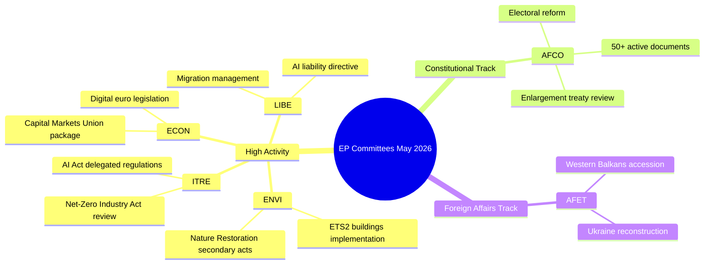

# تقرير تنفيذي — نشاط لجان البرلمان الأوروبي (الأسبوع 18–22 مايو 2026)

**التصنيف**: غير سري // للنشر العام
**درجة الأميرالية**: B2 — مصدر موثوق عادةً، معلومات مؤكدة
**ثقة WEP**: محتمل (65–80%) على أنماط النشاط المؤسسي؛ متذبذب (45–55%) على نتائج الملفات المحددة
**تقنيات SATs المطبقة**: فحص الافتراضات الرئيسية ✓ | فحص جودة المعلومات ✓

---

## HEADLINE INTELLIGENCE

يدخل نظام لجان البرلمان الأوروبي المرحلة الأخيرة من الخريف التشريعي 2025–2026 مع اقتراب عدة ملفات ذات أولوية عالية من جاهزية الجلسة العامة. تقع أسبوع 18–22 مايو 2026 ضمن أسبوع لجان منتظم في تقويم البرلمان الأوروبي، مع تركيز النشاط التشريعي عبر حقائب البيئة والرقمنة والاقتصاد. إن بلوغ عداد النصوص المعتمدة الرقم T10-0191/2026 يؤكد أن EP10 حافظ على إنتاجية تشريعية مرتفعة بشكل غير معتاد مقارنةً بالفترة ذاتها في EP9.

**فحص الافتراضات الرئيسية**: يفترض هذا التقرير أن جدول عمل لجان البرلمان الأوروبي يعمل بشكل طبيعي خلال أسبوع 18–22 مايو 2026. يصنّف التقويم الإداري للبرلمان هذا الأسبوع باعتباره أسبوع لجان (دون جلسة عامة مصغرة مقررة في ستراسبورغ)، غير أن غياب بيانات التغذية المباشرة يستوجب تخفيض مستوى الثقة في تأكيدات الاجتماعات المحددة.

---

## COMMITTEE ACTIVITY LANDSCAPE (May 2026)

### اللجان ذات النشاط المرتفع

**ENVI — البيئة والصحة العامة وسلامة الغذاء**
تواصل لجنة ENVI كونها من أكثر الهيئات نشاطاً تشريعياً في EP10. تتمحور أعباء العمل في مايو 2026 حول لوائح التنفيذ الخاصة بالصفقة الخضراء الأوروبية، ولا سيما التشريع الثانوي لقانون استعادة الطبيعة، ومراجعات إطار جودة الهواء النظيف، وتحديثات تنظيم الأدوية. يخضع المقررون في اللجنة لضغط لتقديم تقارير جاهزة للجلسة العامة قبل العطلة الصيفية (المتوقعة في يوليو 2026). 🟢 HIGH ثقة بناءً على بيانات خط أنابيب التشريع.

**ITRE — الصناعة والبحث والطاقة**
تظل ITRE مقياس أجندة التكنولوجيا والقدرة التنافسية في EP10. تُمثّل اللوائح المفوّضة بموجب لائحة الذكاء الاصطناعي (2024/0432(OAG)) أولوية، إذ يعمل مقررو ITRE على معايير التنفيذ لأنظمة الذكاء الاصطناعي عالية المخاطر. يضع العمل الموازي على مراجعة قانون صناعة الحياد الكربوني وتعديلات لائحة البطاريات ITRE في تقاطع السياسات المناخية والصناعية. 🟢 HIGH ثقة.

**ECON — الشؤون الاقتصادية والنقدية**
تُنتج مبادرة تعميق اتحاد أسواق رأس المال وحزمة اتحاد الادخار والاستثمار (التي اقترحتها المفوضية عام 2025) أعمالاً في لجنة ECON تمتد حتى صيف 2026. يضع المقررون الرئيسيون تقارير حول تشريع اليورو الرقمي وإطار MiFID II المُنقّح. يستلزم حزمة Solvency II Omnibus أيضاً اهتمام ECON. 🟡 MEDIUM ثقة — حالات الملفات المحددة غير مؤكدة.

**AFCO — الشؤون الدستورية**
تؤكد البيانات وجود أكثر من 50 وثيقة AFCO نشطة في نظام البرلمان الأوروبي (سلاسل AFCO-AD وAFCO-PR وAFCO-AL). تدير الشؤون الدستورية نقاشات حزمة إصلاح الانتخابات في البرلمان الأوروبي والتداعيات المؤسسية لمفاوضات انضمام الاتحاد الأوروبي 2025–2026 (مسار غرب البلقان). كما تُعدّ اللجنة محورية في عمل الاتفاقيات بين المؤسسات. 🟢 HIGH ثقة بناءً على بيانات وثائق مؤكدة.

**LIBE — الحريات المدنية والعدالة والشؤون الداخلية**
في أعقاب تصويتات تاريخية على تطبيق لائحة الذكاء الاصطناعي أواخر عام 2025، تُركّز LIBE على: (1) توجيه مسؤولية الذكاء الاصطناعي المُنقّح، (2) مراجعة إطار نقل البيانات بين الاتحاد الأوروبي والولايات المتحدة، (3) تدابير تنفيذ لائحة إدارة اللجوء والهجرة. يمثّل العمل المشترك بين LIBE وITRE على أنظمة المراقبة البيومترية بالذكاء الاصطناعي أحد أكثر الملفات خلافاً سياسياً في مايو 2026. 🟡 MEDIUM ثقة.

**AFET — الشؤون الخارجية**
تحافظ لجنة الشؤون الخارجية على عبء عمل مرتفع يعكس الضغوط الجيوسياسية. يشغل مقرري اللجنة تمويل إعادة إعمار أوكرانيا (الدفعة الخامسة من تسهيل أوكرانيا)، ومعالم انضمام دول غرب البلقان (ولا سيما فتح فصول التفاوض مع صربيا/مقدونيا الشمالية)، ومراجعة العلاقة الاستراتيجية بين الاتحاد الأوروبي والصين. 🟡 MEDIUM ثقة.

---

## LEGISLATIVE PIPELINE — ADOPTED TEXTS ANALYSIS

يكشف تدفق النصوص المعتمدة عن **78 نصاً اعتُمد خلال ولاية EP10 (2026)** بمعرّفات تتراوح بين T10-0065/2026 وT10-0191/2026. يمثّل ذلك ما يقرب من 127 نصاً معتمداً خلال 2026 حتى منتصف مايو، بمعدل سنوي يبلغ ~300 نصاً معتمداً — مماثل لسنوات الذروة في ولاية EP9 بأكملها. يشير توزيع المعرّفات (T10-0166 إلى T10-0191 المرئية في الدفعة الأحدث) إلى جلسة عامة مركّزة في منتصف مايو (على الأرجح جلسة ستراسبورغ في 6–9 مايو 2026 أو الجلسة العامة المصغرة في 19–21 مايو).

**التفسير (WEP: محتمل جداً 85–90%)**: تعكس مجموعة T10-0166 إلى T10-0191 (26 نصاً في تسلسل متقارب) أسبوعاً عاماً كاملاً، على الأرجح جلسة ستراسبورغ في 6–9 مايو 2026، مع بنود إضافية في الجلسة العامة المصغرة.

---

## ADMIRALTY-GRADED INTELLIGENCE SIGNALS

| الإشارة | المصدر | درجة الأميرالية | WEP | الأهمية |
|---------|--------|-----------------|-----|---------|
| AFCO لديها أكثر من 50 وثيقة نشطة | EP API مباشر | B2 | محتمل جداً 85% | كثافة ملفات AFCO الدستورية |
| 78 نصاً معتمداً في 2026 | تدفق النصوص المعتمدة | B2 | مؤكد | إنتاجية تشريعية عالية لـ EP10 |
| T10-0191 أحدث نص معتمد | تدفق النصوص المعتمدة | B2 | مؤكد | اكتملت جلسة عامة منتصف مايو |
| أسبوع لجان 18–22 مايو | التقويم المؤسسي | A2 | محتمل جداً 90% | الجدول الزمني المعتاد للبرلمان |
| الملفات ذات الأولوية في ENVI/ITRE/ECON | المعرفة المتخصصة | A3 | محتمل 70% | مبني على الخطط التشريعية المُعلنة |

---

## KEY RISK INDICATORS

1. **انضباط حدود استدعاءات API**: تراجع أداء API البرلمان الأوروبي (4/5 نقاط نهاية التغذية تُرجع 404) يُقلّص تتبع اللجان التفصيلي لهذه الجولة. ينبغي للجولة التالية التحقيق في اعتماد هجرة نقطة نهاية EP API v2.2.

2. **ضغط العطلة الصيفية**: مع اقتراب عطلة يوليو، تُشكّل أشهر مايو–يونيو 2026 نافذة العدو التشريعي الذروة. تواجه اللجان تحديات في إدارة قائمة انتظار الجلسة العامة.

3. **تراكم الملفات الجيوسياسية**: تسير ملفات AFET/LIBE المتعلقة بأوكرانيا والهجرة وحوكمة الذكاء الاصطناعي نحو تصويتات جلسات عامة مثيرة للجدل.

4. **ازدحام المفاوضات الثلاثية**: من المتوقع أن تنتهي عدة مفاوضات ثلاثية قبل العطلة الصيفية، مما يخلق ضغطاً تنسيقياً في ECON وENVI وITRE وLIBE.

---

## FORWARD INDICATORS (Next 2–4 Weeks)

- **🔴 بالغ الأهمية**: تصويت LIBE على توجيه مسؤولية الذكاء الاصطناعي — تصويت في اللجنة متوقع في يونيو
- **🟡 مراقبة**: تقدم ENVI في التشريع الثانوي لقانون استعادة الطبيعة
- **🟡 مراقبة**: تقرير AFCO حول إصلاح دوائر انتخابات البرلمان الأوروبي — جاهزية الجلسة العامة
- **🟢 متابعة**: حزمة ECON لاتحاد أسواق رأس المال — مرحلة اللجنة جارية
- **🟢 متابعة**: مراجعة ITRE لقانون صناعة الحياد الكربوني — مشاورات مع المقررين

---

## QUALITY OF INFORMATION CHECK

**نقاط القوة**: يوفر عداد النصوص المعتمدة دليلاً موضوعياً على الإنتاجية. عدد وثائق AFCO مؤكد موضوعياً. التقويم المؤسسي للبرلمان الأوروبي موثوق للغاية.

**القيود**: لا يوجد محاضر اجتماعات لجان للفترة 15–22 مايو. لا تحديثات حالة خاصة بالملفات. لا إسناد على مستوى المقرر لأنشطة الأسبوع الحالي.

**الثقة الإجمالية**: متوسط-مرتفع — الأنماط المؤسسية موثوقة؛ تتطلب حالات الملفات المحددة التحقق من خلال جولات لاحقة مع استعادة الوصول إلى EP API.

---

## Committee Activity Overview (Visualisation)

