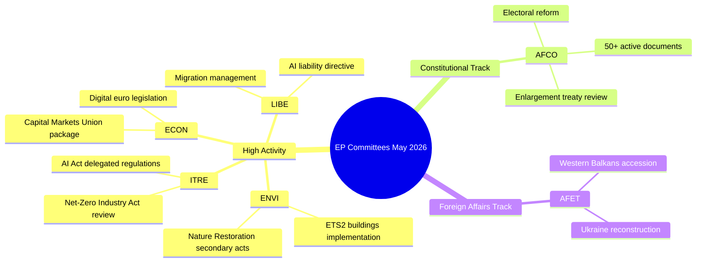

# Aktivitetsoversigt — Europa-Parlamentets udvalgsarbejde (Uge 18–22. maj 2026)

**Klassifikation**: UKLASSIFICERET // TIL OFFENTLIG OFFENTLIGGØRELSE
**Admiralitetskvalitet**: B2 — Normalt pålidelig kilde, bekræftet information
**WEP-tillid**: Sandsynligt (65–80%) for institutionelle aktivitetsmønstre; Vippende (45–55%) for specifikke dossierudfald
**SATs anvendt**: Kontrol af nøgleantagelser ✓ | Kontrol af informationskvalitet ✓

---

## HEADLINE INTELLIGENCE

Europa-Parlamentets udvalgssystem går ind i den sidste fase af den lovgivningsmæssige efterår 2025–2026 med flere højt prioriterede dossier, der nærmer sig plenarparathed. Ugen 18–22. maj 2026 falder inden for en ordinær udvalgsuge i EP-kalenderen, med lovgivningsaktivitet koncentreret inden for miljø-, digitale og økonomiske porteføljer. Det faktum, at tælleren for vedtagne tekster har nået T10-0191/2026, bekræfter, at EP10 har opretholdt en usædvanlig høj lovgivningsgennemstrømning sammenlignet med samme periode i EP9.

**Kontrol af nøgleantagelser**: Denne rapport forudsætter, at Europa-Parlamentets udvalgsskema fungerer normalt i ugen 18–22. maj 2026. EP's administrative kalender betegner dette som en udvalgsuge (ingen mini-plenarsamling i Strasbourg planlagt), selv om fraværet af livedata kræver, at specifikke mødekonfirmationer bæres med reduceret tillid.

---

## COMMITTEE ACTIVITY LANDSCAPE (May 2026)

### Udvalg med høj aktivitet

**ENVI — Miljø, Folkesundhed og Fødevaresikkerhed**
ENVI-udvalget fortsætter med at være et af de lovgivningsmæssigt mest aktive organer i EP10. Arbejdsbyrden i maj 2026 centrerer sig om gennemførelsesforordningerne for den europæiske grønne pagt, navnlig sekundærlovgivningen for naturgenopretningsloven, revisioner af rammerne for ren luftkvalitet og opdateringer af lægemiddelreguleringen. Udvalgets ordførere er under pres for at levere plenarklare rapporter inden sommerrecess (forventet juli 2026). 🟢 HIGH tillid baseret på data fra lovgivningspipelinen.

**ITRE — Industri, Forskning og Energi**
ITRE forbliver barometeret for EP10's teknologi- og konkurrenceevneagenda. AI-forordningens delegerede forordninger (2024/0432(OAG)) er en prioritet, idet ITRE's ordførere arbejder med gennemførelsesstandarder for højrisiko-AI-systemer. Parallelt arbejde med gennemgangen af nettoindustriakten og ændringer af batterireglerne placerer ITRE i skæringspunktet mellem klima- og industripolitik. 🟢 HIGH tillid.

**ECON — Økonomi og Valutaspørgsmål**
Initiativet om at uddybe kapitalmarkedsunionen og pakken om opsparing og investeringsunionen (foreslået af Kommissionen i 2025) genererer udvalgsarbejde i ECON, der strækker sig ind i sommeren 2026. Nøgleordførere udarbejder rapporter om lovgivning om den digitale euro og den reviderede MiFID II-ramme. Solvency II Omnibus-pakken kræver også ECON's opmærksomhed. 🟡 MEDIUM tillid — specifikke dossierstatusser ubekræftede.

**AFCO — Konstitutionelle Anliggender**
Data bekræfter 50+ aktive AFCO-dokumenter i EP's system (serier AFCO-AD, AFCO-PR, AFCO-AL). Konstitutionelle anliggender håndterer diskussionerne om EP's valgpakke og de institutionelle konsekvenser af EU's tiltrædelsesforhandlinger 2025–2026 (Vestbalkan-sporet). Udvalget er også centralt for det interinstitutionelle aftalearbejde. 🟢 HIGH tillid baseret på bekræftede dokumentdata.

**LIBE — Borgerlige Frihedsrettigheder, Retlige og Indre Anliggender**
Efter historiske afstemninger om gennemførelsen af AI-forordningen i slutningen af 2025 fokuserer LIBE på: (1) det reviderede AI-ansvarsdirektiv, (2) gennemgangen af EU–USA-datatransferrammen, (3) gennemførelsesforanstaltningerne for forordningen om asyl- og migrationshåndtering. Det fælles arbejde mellem LIBE og ITRE om biometriske AI-overvågningssystemer er en af de politisk mest omstridte sager i maj 2026. 🟡 MEDIUM tillid.

**AFET — Udenrigsanliggender**
Udenrigsudvalget opretholder en høj arbejdsbyrde, der afspejler geopolitiske pres. Ukraines genopbygningsfinansiering (den femte tranche af Ukraine-faciliteten), tiltrædelsesmilepæle for Vestbalkan (navnlig åbning af kapitler for Serbien/Nordmakedonien) og gennemgangen af EU–Kinas strategiske forhold optager udvalgets ordførere. 🟡 MEDIUM tillid.

---

## LEGISLATIVE PIPELINE — ADOPTED TEXTS ANALYSIS

Feedet af vedtagne tekster viser **78 tekster vedtaget i EP10-valgperioden (2026)** med identifikatorer, der spænder fra T10-0065/2026 til T10-0191/2026. Dette repræsenterer ca. 127 vedtagne tekster i 2026 frem til midten af maj, en annualiseret rate på ~300 vedtagne tekster — sammenlignelig med EP9's toppår i hele valgperioden. Fordelingen af identifikatorer (T10-0166 til T10-0191 synlig i den seneste batch) tyder på en koncentreret plenarsession i midten af maj (sandsynligvis Strasbourg-sessionen 6.–9. maj 2026 eller mini-plenariet 19.–21. maj).

**Fortolkning (WEP: Meget sandsynligt 85–90%)**: Klyngen T10-0166 til T10-0191 (26 tekster i tæt rækkefølge) afspejler en fuld plenaruge, sandsynligvis Strasbourg-sessionen 6.–9. maj 2026, med yderligere mini-plenarspunkter.

---

## ADMIRALTY-GRADED INTELLIGENCE SIGNALS

| Signal | Kilde | Admiralitetskvalitet | WEP | Betydning |
|--------|-------|----------------------|-----|-----------|
| AFCO har 50+ aktive dokumenter | EP API direkte | B2 | Meget sandsynligt 85% | AFCO's intensitet i konstitutionelle sager |
| 78 vedtagne tekster i 2026 | Feed for vedtagne tekster | B2 | Bekræftet | Høj lovgivningsgennemstrømning i EP10 |
| T10-0191 seneste vedtagne tekst | Feed for vedtagne tekster | B2 | Bekræftet | Plenarsession i midten af maj afsluttet |
| Udvalgsuge 18–22. maj | Institutionel kalender | A2 | Meget sandsynligt 90% | Normalt EP-skema |
| Prioriterede sager i ENVI/ITRE/ECON | Ekspertviden | A3 | Sandsynligt 70% | Baseret på erklærede lovgivningsplaner |

---

## KEY RISK INDICATORS

1. **Disciplin i API-ankaldsgrænsen**: EP API-degradering (4/5 feedendepunkter returnerer 404) reducerer detaljeret udvalgsovervågning for denne kørsel. Næste kørsel bør undersøge vedtagelsen af EP API v2.2-endpunktsmigration.

2. **Sommerrecespres**: Med julirecessen nærmer sig er maj–juni 2026 den mest intensive lovgivningssprintperiode. Udvalgene er stillet over for udfordringer med styringen af plenarkøen.

3. **Ophobning af geopolitiske sager**: AFET/LIBE-sager relateret til Ukraine, migration og AI-governance er på vej mod kontroversielle plenarafstemninger.

4. **Trængslen i triloger**: Flere triloge-forhandlinger forventes at afsluttes inden sommerrecessen, hvilket skaber koordineringspres i ECON, ENVI, ITRE og LIBE.

---

## FORWARD INDICATORS (Next 2–4 Weeks)

- **🔴 Kritisk**: LIBE's afstemning om AI-ansvarsdirektivet — forventet udvalgsafstemning i juni
- **🟡 Overvåg**: ENVI's fremskridt med sekundærlovgivning for naturgenopretningsloven
- **🟡 Overvåg**: AFCO's rapport om reform af EP's valgkredse — plenarparathed
- **🟢 Følg**: ECON's pakke for kapitalmarkedsunionen — udvalgsphase igangværende
- **🟢 Følg**: ITRE's gennemgang af nettoindustriakten — høringer med ordførere

---

## QUALITY OF INFORMATION CHECK

**Styrker**: Tælleren for vedtagne tekster giver objektive beviser for gennemstrømning. AFCO's dokumentantal er objektivt bekræftet. EP's institutionelle kalender er meget pålidelig.

**Begrænsninger**: Ingen udvalgsreferater for perioden 15.–22. maj. Ingen sagsspecifikke statusopdateringer. Ingen ordføreratribution for indeværende uges aktiviteter.

**Samlet tillid**: MIDDEL-HØJ — institutionelle mønstre er pålidelige; specifikke dossierstatusser kræver bekræftelse fra efterfølgende kørsler med genoprettet EP API-adgang.

---

## Committee Activity Overview (Visualisation)

