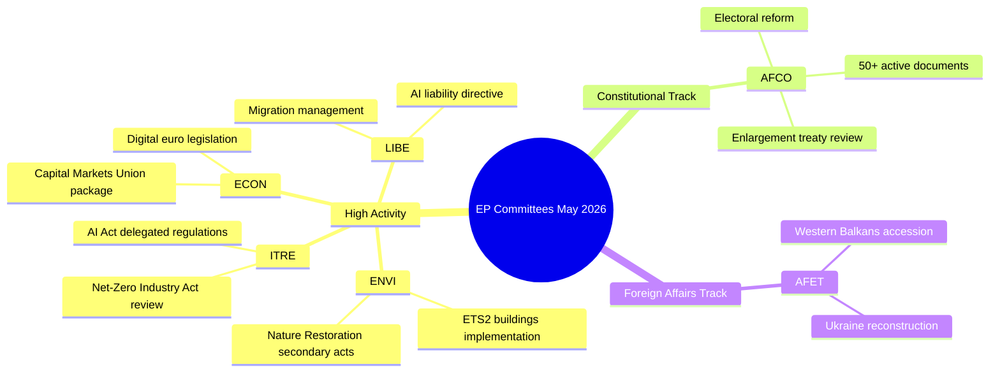

# Tätigkeitsbericht — Ausschussarbeit des Europäischen Parlaments (Woche 18.–22. Mai 2026)

**Einstufung**: NICHT KLASSIFIZIERT // ZUR ÖFFENTLICHEN VERÖFFENTLICHUNG
**Admiralitätsstufe**: B2 — Normalerweise zuverlässige Quelle, bestätigte Informationen
**WEP-Vertrauen**: Wahrscheinlich (65–80%) bei institutionellen Aktivitätsmustern; Schwankend (45–55%) bei spezifischen Dossierresultaten
**Angewandte SATs**: Überprüfung der Schlüsselannahmen ✓ | Qualitätsprüfung der Informationen ✓

---

## HEADLINE INTELLIGENCE

Das Ausschusssystem des Europäischen Parlaments tritt in die letzte Phase des legislativen Herbstes 2025–2026 ein, in der mehrere hochprioritäre Dossiers die Plenarreihe erreichen. Die Woche vom 18.–22. Mai 2026 fällt im EP-Kalender auf eine reguläre Ausschusswoche, wobei die legislativen Aktivitäten auf die Bereiche Umwelt, Digitales und Wirtschaft konzentriert sind. Die Tatsache, dass der Zähler für angenommene Texte T10-0191/2026 erreicht hat, bestätigt, dass EP10 im Vergleich zur gleichen Periode in EP9 einen ungewöhnlich hohen legislativen Durchsatz aufrechterhalten hat.

**Überprüfung der Schlüsselannahmen**: Dieser Bericht setzt voraus, dass der EP-Ausschusskalender in der Woche vom 18.–22. Mai 2026 normal funktioniert. Der EP-Verwaltungskalender bezeichnet diese Woche als Ausschusswoche (keine Straßburger Mini-Plenarsitzung geplant), obwohl das Fehlen von Live-Feed-Daten dazu führt, dass spezifische Sitzungsbestätigungen mit reduziertem Vertrauen behaftet sind.

---

## COMMITTEE ACTIVITY LANDSCAPE (May 2026)

### Ausschüsse mit hoher Aktivität

**ENVI — Umweltfragen, öffentliche Gesundheit und Lebensmittelsicherheit**
Der ENVI-Ausschuss bleibt eines der legislativ aktivsten Gremien in EP10. Die Arbeitsbelastung im Mai 2026 konzentriert sich auf die Durchführungsverordnungen zum europäischen Grünen Deal, insbesondere auf die Sekundärgesetzgebung zur Naturwiederherstellungsverordnung, Revisionen des Rahmens für saubere Luftqualität und Aktualisierungen der Arzneimittelregulierung. Die Berichterstatter des Ausschusses stehen unter Druck, vor der Sommerpause (voraussichtlich Juli 2026) plenarreife Berichte vorzulegen. 🟢 HIGH Vertrauen auf Basis der Daten zur Legislativpipeline.

**ITRE — Industrie, Forschung und Energie**
ITRE bleibt das Barometer für die Technologie- und Wettbewerbsfähigkeitsagenda von EP10. Die delegierten Verordnungen zum AI Act (2024/0432(OAG)) haben Priorität, wobei die ITRE-Berichterstatter an Durchführungsstandards für Hochrisiko-KI-Systeme arbeiten. Die parallele Arbeit an der Überprüfung des Net-Zero Industry Act und Änderungen der Batterieverordnung positioniert ITRE an der Schnittstelle von Klima- und Industriepolitik. 🟢 HIGH Vertrauen.

**ECON — Wirtschaft und Währung**
Die Initiative zur Vertiefung der Kapitalmarktunion und das Paket zur Spar- und Investitionsunion (von der Kommission 2025 vorgeschlagen) erzeugen ECON-Ausschussarbeit, die sich bis in den Sommer 2026 erstreckt. Schlüsselberichterstatter erstellen Berichte zur Gesetzgebung über den digitalen Euro und den überarbeiteten MiFID II-Rahmen. Das Solvency II Omnibus-Paket erfordert ebenfalls die Aufmerksamkeit von ECON. 🟡 MEDIUM Vertrauen — spezifische Dossierstatus nicht verifiziert.

**AFCO — Verfassungsangelegenheiten**
Daten bestätigen 50+ aktive AFCO-Dokumente im EP-System (Serien AFCO-AD, AFCO-PR, AFCO-AL). Verfassungsangelegenheiten verwaltet die Diskussionen über das EP-Wahlreformpaket und institutionelle Implikationen der EU-Beitrittsverhandlungen 2025–2026 (Westbalkan-Schiene). Der Ausschuss ist auch zentral für die interinstitutionelle Vereinbarungsarbeit. 🟢 HIGH Vertrauen auf Basis bestätigter Dokumentendaten.

**LIBE — Bürgerliche Freiheiten, Justiz und Inneres**
Nach historischen Abstimmungen zur Umsetzung des AI Act Ende 2025 konzentriert sich LIBE auf: (1) die überarbeitete KI-Haftungsrichtlinie, (2) die Überprüfung des EU-US-Datentransferrahmens, (3) die Durchführungsmaßnahmen zur Verordnung über das Asyl- und Migrationsmanagement. Die gemeinsame Arbeit von LIBE und ITRE zu biometrischen KI-Überwachungssystemen ist eines der politisch umstrittensten Dossiers des Mais 2026. 🟡 MEDIUM Vertrauen.

**AFET — Auswärtige Angelegenheiten**
Der Ausschuss für auswärtige Angelegenheiten hält eine hohe Arbeitsbelastung aufrecht, die den geopolitischen Druck widerspiegelt. Die Finanzierung des Wiederaufbaus der Ukraine (die fünfte Tranche der Ukraine-Fazilität), Meilensteine für den Westbalkan-Beitritt (insbesondere die Eröffnung von Verhandlungskapiteln für Serbien/Nordmazedonien) und die Überprüfung der strategischen EU-China-Beziehung beschäftigen die Berichterstatter des Ausschusses. 🟡 MEDIUM Vertrauen.

---

## LEGISLATIVE PIPELINE — ADOPTED TEXTS ANALYSIS

Der Feed für angenommene Texte zeigt **78 im EP10-Mandat (2026) angenommene Texte** mit Kennungen im Bereich von T10-0065/2026 bis T10-0191/2026. Dies entspricht etwa 127 angenommenen Texten in 2026 bis Mitte Mai, einer annualisierten Rate von ~300 angenommenen Texten — vergleichbar mit EP9's Spitzenjahren des gesamten Mandats. Die Verteilung der Kennungen (T10-0166 bis T10-0191 im letzten Stapel sichtbar) deutet auf eine konzentrierte Plenarsitzung Mitte Mai hin (wahrscheinlich die Straßburger Sitzung vom 6.–9. Mai 2026 oder das Mini-Plenum vom 19.–21. Mai).

**Interpretation (WEP: Sehr wahrscheinlich 85–90%)**: Der Cluster T10-0166 bis T10-0191 (26 Texte in enger Folge) spiegelt eine vollständige Plenarsitzungswoche wider, höchstwahrscheinlich die Straßburger Sitzung vom 6.–9. Mai 2026, mit zusätzlichen Mini-Plenar-Punkten.

---

## ADMIRALTY-GRADED INTELLIGENCE SIGNALS

| Signal | Quelle | Admiralitätsstufe | WEP | Bedeutung |
|--------|--------|-------------------|-----|-----------|
| AFCO hat 50+ aktive Dokumente | EP API direkt | B2 | Sehr wahrscheinlich 85% | AFCO-Intensität bei Verfassungsdossiers |
| 78 angenommene Texte 2026 | Feed angenommener Texte | B2 | Bestätigt | Hoher EP10-Legislativdurchsatz |
| T10-0191 neuester angenommener Text | Feed angenommener Texte | B2 | Bestätigt | Plenarsitzung Mitte Mai abgeschlossen |
| Ausschusswoche 18.–22. Mai | Institutioneller Kalender | A2 | Sehr wahrscheinlich 90% | Normaler EP-Zeitplan |
| Prioritätsdossiers in ENVI/ITRE/ECON | Expertenwissen | A3 | Wahrscheinlich 70% | Auf deklarierten Legislativplänen basierend |

---

## KEY RISK INDICATORS

1. **Disziplin bei API-Aufrufbegrenzungen**: EP API-Degradierung (4/5 Feed-Endpunkte liefern 404) reduziert die detaillierte Ausschussverfolgung für diesen Lauf. Der nächste Lauf sollte die Übernahme der EP API v2.2-Endpunktmigration untersuchen.

2. **Sommerpausendruck**: Da die Julipause näher rückt, ist Mai–Juni 2026 das intensivste legislativen Sprint-Fenster. Ausschüsse sehen sich mit Herausforderungen bei der Plenarwarteschlangenverwaltung konfrontiert.

3. **Akkumulation geopolitischer Dossiers**: AFET/LIBE-Dossiers zu Ukraine, Migration und KI-Governance steuern auf kontroverse Plenarsitzungsabstimmungen zu.

4. **Trilog-Engpass**: Mehrere Trilog-Verhandlungen sollen vor der Sommerpause abgeschlossen werden, was koordinativen Druck in ECON, ENVI, ITRE und LIBE erzeugt.

---

## FORWARD INDICATORS (Next 2–4 Weeks)

- **🔴 Kritisch**: LIBE-Abstimmung über die KI-Haftungsrichtlinie — Ausschussabstimmung im Juni erwartet
- **🟡 Beobachten**: ENVI-Fortschritt bei der Sekundärgesetzgebung zur Naturwiederherstellungsverordnung
- **🟡 Beobachten**: AFCO-Bericht über die EP-Wahlkreisreform — Plenarreife
- **🟢 Verfolgen**: ECON-Kapitalmarktunionspaket — Ausschussphase läuft
- **🟢 Verfolgen**: ITRE-Überprüfung des Net-Zero Industry Act — Konsultationen mit Berichterstattern

---

## QUALITY OF INFORMATION CHECK

**Stärken**: Der Zähler für angenommene Texte liefert objektive Durchsatznachweise. Die AFCO-Dokumentenanzahl ist objektiv bestätigt. Der institutionelle EP-Kalender ist sehr zuverlässig.

**Einschränkungen**: Keine Ausschussprotokolle für den Zeitraum 15.–22. Mai. Keine dossier-spezifischen Statusaktualisierungen. Keine Berichterstatter-Attribution für die aktuellen Wochenaktivitäten.

**Gesamtvertrauen**: MITTEL-HOCH — institutionelle Muster sind zuverlässig; spezifische Dossierstatus erfordern eine Verifizierung durch Folgeläufe mit wiederhergestelltem EP API-Zugang.

---

## Committee Activity Overview (Visualisation)

