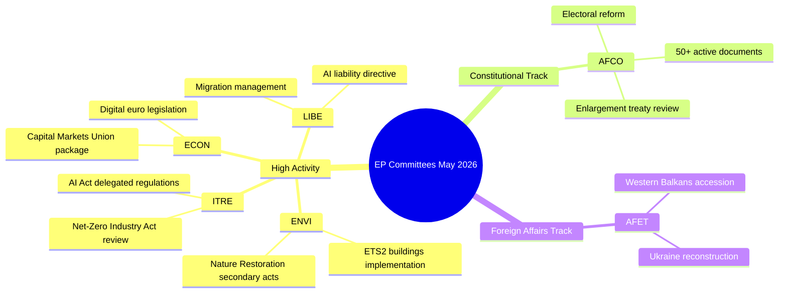

# Informe de actividad — Trabajo de comisiones del Parlamento Europeo (Semana 18–22 mayo 2026)

**Clasificación**: SIN CLASIFICAR // PARA PUBLICACIÓN PÚBLICA
**Grado Almirantazgo**: B2 — Fuente generalmente fiable, información confirmada
**Confianza WEP**: Probable (65–80%) en patrones de actividad institucional; Oscilante (45–55%) en resultados específicos de expedientes
**SATs aplicadas**: Comprobación de hipótesis clave ✓ | Control de calidad de la información ✓

---

## HEADLINE INTELLIGENCE

El sistema de comisiones del Parlamento Europeo entra en la recta final del otoño legislativo 2025–2026 con varios expedientes de alta prioridad aproximándose a la fase de preparación plenaria. La semana del 18 al 22 de mayo de 2026 cae en una semana ordinaria de comisiones según el calendario del PE, con la actividad legislativa concentrada en las carteras medioambiental, digital y económica. El hecho de que el contador de textos adoptados haya alcanzado T10-0191/2026 confirma que el PE10 ha mantenido un rendimiento legislativo inusualmente elevado en comparación con el mismo período durante el PE9.

**Comprobación de hipótesis clave**: Este informe asume que el calendario de comisiones del Parlamento Europeo funciona con normalidad durante la semana del 18 al 22 de mayo de 2026. El calendario administrativo del PE designa esta semana como una semana de comisiones (sin mini-plenario en Estrasburgo previsto), aunque la ausencia de datos de transmisión en directo requiere que las confirmaciones de reuniones específicas se traten con confianza reducida.

---

## COMMITTEE ACTIVITY LANDSCAPE (May 2026)

### Comisiones con alta actividad

**ENVI — Medio Ambiente, Salud Pública y Seguridad Alimentaria**
La comisión ENVI continúa siendo uno de los órganos legislativamente más activos del PE10. La carga de trabajo de mayo de 2026 se centra en los reglamentos de ejecución del Pacto Verde Europeo, en particular la legislación secundaria de la Ley de Restauración de la Naturaleza, las revisiones del marco de calidad del aire limpio y las actualizaciones de la regulación farmacéutica. Los ponentes de la comisión están bajo presión para presentar informes listos para el plenario antes del receso de verano (previsto para julio de 2026). 🟢 HIGH confianza basada en los datos del proceso legislativo.

**ITRE — Industria, Investigación y Energía**
ITRE sigue siendo el barómetro de la agenda tecnológica y de competitividad del PE10. Los reglamentos delegados en virtud del Reglamento de IA (2024/0432(OAG)) son una prioridad, con los ponentes de ITRE trabajando en normas de aplicación para sistemas de IA de alto riesgo. El trabajo paralelo en la revisión de la Ley de Industria Cero Neto y las modificaciones del Reglamento de Baterías sitúa a ITRE en la intersección de la política climática e industrial. 🟢 HIGH confianza.

**ECON — Asuntos Económicos y Monetarios**
La iniciativa de profundización de la Unión de Mercados de Capitales y el paquete de la Unión de Ahorro e Inversión (propuesto por la Comisión en 2025) generan trabajo en la comisión ECON que se extiende hasta el verano de 2026. Los ponentes clave redactan informes sobre la legislación del euro digital y el marco MiFID II revisado. El paquete Solvencia II Ómnibus también requiere la atención de ECON. 🟡 MEDIUM confianza — estados específicos de los expedientes no verificados.

**AFCO — Asuntos Constitucionales**
Los datos confirman 50+ documentos AFCO activos en el sistema del PE (series AFCO-AD, AFCO-PR, AFCO-AL). Los asuntos constitucionales gestiona los debates sobre el paquete de reforma electoral del PE y las implicaciones institucionales de las negociaciones de adhesión de la UE 2025–2026 (vía de los Balcanes Occidentales). La comisión también es central en el trabajo sobre acuerdos interinstitucionales. 🟢 HIGH confianza basada en datos documentales confirmados.

**LIBE — Libertades Civiles, Justicia y Asuntos de Interior**
Tras las votaciones históricas sobre la aplicación del Reglamento de IA a finales de 2025, LIBE se centra en: (1) la directiva revisada sobre responsabilidad en materia de IA, (2) la revisión del marco de transferencia de datos UE-EE.UU., (3) las medidas de aplicación del reglamento sobre gestión del asilo y la migración. El trabajo conjunto LIBE-ITRE sobre sistemas de vigilancia biométrica por IA representa uno de los expedientes políticamente más controvertidos de mayo de 2026. 🟡 MEDIUM confianza.

**AFET — Asuntos Exteriores**
La Comisión de Asuntos Exteriores mantiene una elevada carga de trabajo que refleja las presiones geopolíticas. La financiación de la reconstrucción de Ucrania (el quinto tramo del Mecanismo Ucraniano), los hitos de adhesión de los Balcanes Occidentales (en particular las aperturas de capítulos de Serbia/Macedonia del Norte) y la revisión de la relación estratégica UE-China ocupan a los ponentes de la comisión. 🟡 MEDIUM confianza.

---

## LEGISLATIVE PIPELINE — ADOPTED TEXTS ANALYSIS

El flujo de textos adoptados revela **78 textos adoptados en el mandato del PE10 (2026)** con identificadores que van desde T10-0065/2026 hasta T10-0191/2026. Esto representa aproximadamente 127 textos adoptados en 2026 hasta mediados de mayo, una tasa anualizada de ~300 textos adoptados, comparable a los años pico de toda la legislatura del PE9. La distribución de identificadores (T10-0166 a T10-0191 visible en el último lote) sugiere una sesión plenaria concentrada a mediados de mayo (probablemente la sesión de Estrasburgo del 6 al 9 de mayo de 2026 o el mini-plenario del 19 al 21 de mayo).

**Interpretación (WEP: Muy probable 85–90%)**: El clúster T10-0166 a T10-0191 (26 textos en secuencia próxima) refleja una semana plenaria completa, muy probablemente la sesión de Estrasburgo del 6 al 9 de mayo de 2026, con puntos adicionales de mini-plenario.

---

## ADMIRALTY-GRADED INTELLIGENCE SIGNALS

| Señal | Fuente | Grado Almirantazgo | WEP | Significado |
|-------|--------|---------------------|-----|-------------|
| AFCO tiene 50+ documentos activos | API PE directa | B2 | Muy probable 85% | Intensidad de expedientes constitucionales de AFCO |
| 78 textos adoptados en 2026 | Flujo de textos adoptados | B2 | Confirmado | Alto rendimiento legislativo del PE10 |
| T10-0191 texto adoptado más reciente | Flujo de textos adoptados | B2 | Confirmado | Sesión plenaria de mediados de mayo concluida |
| Semana de comisiones 18–22 mayo | Calendario institucional | A2 | Muy probable 90% | Calendario normal del PE |
| Expedientes prioritarios ENVI/ITRE/ECON | Conocimiento de expertos | A3 | Probable 70% | Basado en planes legislativos declarados |

---

## KEY RISK INDICATORS

1. **Disciplina de límite de llamadas API**: La degradación de la API del PE (4/5 puntos finales de flujo devuelven 404) reduce el seguimiento detallado de comisiones para esta ejecución. La siguiente ejecución debería investigar la adopción de la migración al punto final de la API del PE v2.2.

2. **Presión del receso estival**: Con el receso de julio acercándose, mayo–junio de 2026 es la ventana pico del sprint legislativo. Las comisiones se enfrentan a desafíos en la gestión de la cola plenaria.

3. **Acumulación de expedientes geopolíticos**: Los expedientes AFET/LIBE relacionados con Ucrania, migración y gobernanza de la IA se encaminan hacia votaciones plenarias controvertidas.

4. **Congestión del trílogo**: Se espera que varias negociaciones de trílogo concluyan antes del receso de verano, creando presión de coordinación en ECON, ENVI, ITRE y LIBE.

---

## FORWARD INDICATORS (Next 2–4 Weeks)

- **🔴 Crítico**: Votación de LIBE sobre la directiva de responsabilidad en materia de IA — votación en comisión esperada en junio
- **🟡 Vigilar**: Progreso de ENVI en la legislación secundaria de la Ley de Restauración de la Naturaleza
- **🟡 Vigilar**: Informe de AFCO sobre la reforma de las circunscripciones electorales del PE — preparación plenaria
- **🟢 Seguir**: Paquete ECON para la Unión de Mercados de Capitales — fase en comisión en curso
- **🟢 Seguir**: Revisión de ITRE de la Ley de Industria Cero Neto — consultas con ponentes

---

## QUALITY OF INFORMATION CHECK

**Puntos fuertes**: El contador de textos adoptados proporciona evidencia objetiva del rendimiento. El número de documentos AFCO está confirmado objetivamente. El calendario institucional del PE es muy fiable.

**Limitaciones**: Sin actas de comisión para el período del 15 al 22 de mayo. Sin actualizaciones de estado específicas de expedientes. Sin atribución a nivel de ponente para las actividades de la semana actual.

**Confianza global**: MEDIO-ALTA — los patrones institucionales son fiables; los estados específicos de los expedientes requieren verificación en ejecuciones posteriores con acceso a la API del PE restablecido.

---

## Committee Activity Overview (Visualisation)

