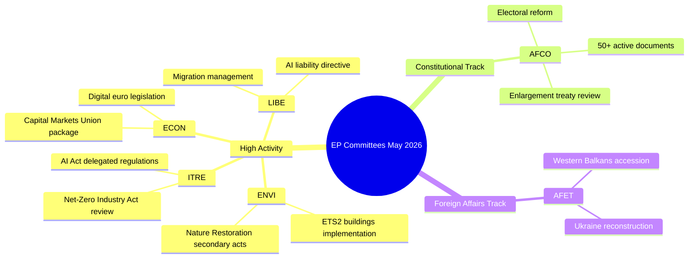

# Toimintakatsaus — Euroopan parlamentin valiokuntaviikko (Viikko 18–22. toukokuuta 2026)

**Luokitus**: JULKINEN // JULKISEEN JAKELUUN
**Admiraliteettiluokka**: B2 — Yleensä luotettava lähde, vahvistettu tieto
**WEP-luottamus**: Todennäköinen (65–80%) institutionaalisille toimintamalleille; Heilahteleva (45–55%) tiettyjen asiakirjojen tuloksille
**SAT-menetelmät**: Keskeisten oletusten tarkistus ✓ | Tietolaatuuden tarkistus ✓

---

## HEADLINE INTELLIGENCE

Euroopan parlamentin valiokuntajärjestelmä saapuu lainsäädännöllisen syksyn 2025–2026 viimeiseen vaiheeseen useiden korkean prioriteetin asioiden lähestyessä täysistuntovalmiutta. Viikko 18.–22. toukokuuta 2026 osuu EP:n kalenterissa tavalliseen valiokuntaviikkoon, ja lainsäädäntötoiminta on keskittynyt ympäristö-, digitaali- ja talousalan salkkuihin. Hyväksyttyjen tekstien laskurin saavuttaminen arvoon T10-0191/2026 vahvistaa, että EP10 on ylläpitänyt poikkeuksellisen korkeaa lainsäädäntöläput verrattuna samaan ajanjaksoon EP9:ssä.

**Keskeisten oletusten tarkistus**: Tässä raportissa oletetaan, että Euroopan parlamentin valiokuntaaikataulu toimii normaalisti viikolla 18.–22. toukokuuta 2026. EP:n hallinnollinen kalenteri luokittelee tämän valiokuntaviikoksi (Strasbourgissa ei ole suunnitteilla täysistuntoa), vaikka suoran syöttedatan puuttuminen edellyttää, että tiettyihin kokousvahvistuksiin liittyy alentunut luottamustaso.

---

## COMMITTEE ACTIVITY LANDSCAPE (May 2026)

### Korkean aktiviteetin valiokunnat

**ENVI — Ympäristön, kansanterveyden ja elintarvikkeiden turvallisuuden valiokunta**
ENVI-valiokunta on edelleen yksi EP10:n lainsäädäntöaktiivisimmista elimistä. Toukokuun 2026 työmäärä keskittyy eurooppalaisen vihreän kehityksen ohjelman täytäntöönpanoasetuksiin, erityisesti luonnonennallistamislain toissijaiseen lainsäädäntöön, puhtaan ilman laadun kehyksen tarkistuksiin ja lääkesääntelyn päivityksiin. Valiokunnan esittelijät ovat paineen alla toimittaa täysistuntovalmiita raportteja ennen kesälomaa (odotetusti heinäkuu 2026). 🟢 HIGH luottamus lainsäädäntöputkilinjadataan perustuen.

**ITRE — Teollisuuden, tutkimuksen ja energian valiokunta**
ITRE on edelleen EP10:n teknologia- ja kilpailukykyagendan barometri. Tekoälyasetuksen delegoidut asetukset (2024/0432(OAG)) ovat prioriteetti, ja ITRE:n esittelijät työskentelevät korkean riskin tekoälyjärjestelmien täytäntöönpanostandardien parissa. Rinnakkainen työ nollanettoteollisuuslain tarkistuksen ja akkusääntelymuutosten parissa asettaa ITRE:n ilmasto- ja teollisuuspolitiikan leikkauspisteeseen. 🟢 HIGH luottamus.

**ECON — Talous- ja raha-asioiden valiokunta**
Pääomamarkkinaunionin syventämishanke ja säästö- ja investointiunionin paketti (komission vuonna 2025 ehdottama) tuottavat ECON-valiokuntaarbeit, joka ulottuu kesään 2026. Avainesiittelijät laativat raportteja digitaalisen euron lainsäädännöstä ja uudistetusta MiFID II -kehyksestä. Solvency II Omnibus -paketti vaatii myös ECON:n huomiota. 🟡 MEDIUM luottamus — tiettyjen asioiden tiloja ei ole vahvistettu.

**AFCO — Perussopimus-, työjärjestys- ja toimielinasioiden valiokunta**
Tiedot vahvistavat 50+ aktiivisen AFCO-asiakirjan olevan EP:n järjestelmässä (sarjat AFCO-AD, AFCO-PR, AFCO-AL). Perustuslailliset asiat käsittelevät EP:n vaalipakettikeskusteluja ja EU:n liittymisneuvottelujen 2025–2026 institutionaalisia vaikutuksia (Länsi-Balkanin linja). Valiokunta on myös keskeinen toimielin toimielinten välisen sopimuksen työssä. 🟢 HIGH luottamus vahvistettuun asiakirjadataan perustuen.

**LIBE — Kansalaisvapauksien, oikeusasioiden ja sisäasioiden valiokunta**
Historiallisten tekoälyasetuksen täytäntöönpanoa koskevien äänestysten jälkeen vuoden 2025 lopussa LIBE keskittyy: (1) uudistettuun tekoälyvastuudirektiiviin, (2) EU:n ja Yhdysvaltojen tiedonsiirtokehyksen tarkistukseen, (3) turvapaikka- ja muuttoliikeasetuksen täytäntöönpanotoimenpiteisiin. LIBE:n ja ITRE:n yhteistyö biometristen tekoälyvalvontajärjestelmien parissa on yksi toukokuun 2026 poliittisesti kiistanalaisimmista asioista. 🟡 MEDIUM luottamus.

**AFET — Ulkoasioiden valiokunta**
Ulkoasiainvaliokunta ylläpitää korkeaa työmäärää, joka heijastaa geopoliittisia paineita. Ukrainan jälleenrakentamisrahoitus (viidennen Ukrainan välineen erä), Länsi-Balkanin liittymisen virstanpylväät (erityisesti Serbian/Pohjois-Makedonian lukujen avaukset) ja EU:n ja Kiinan strategisen suhteen tarkistelu työllistävät valiokunnan esittelijöitä. 🟡 MEDIUM luottamus.

---

## LEGISLATIVE PIPELINE — ADOPTED TEXTS ANALYSIS

Hyväksyttyjen tekstien syöte paljastaa **78 EP10-toimikaudella (2026) hyväksyttyä tekstiä**, joiden tunnisteet vaihtelevat välillä T10-0065/2026–T10-0191/2026. Tämä vastaa noin 127 hyväksyttyä tekstiä vuodesta 2026 toukokuun puoliväliin asti, vuositasolle korotettuna ~300 hyväksyttyä tekstiä — verrattavissa EP9:n koko toimikauden huippuvuosiin. Tunnisteiden jakautuminen (T10-0166–T10-0191 näkyvissä viimeisimmässä erässä) viittaa keskittyneeseen täysistuntoon toukokuun puolivälissä (todennäköisesti Strasbourgin täysistunto 6.–9. toukokuuta 2026 tai minitäysistunto 19.–21. toukokuuta).

**Tulkinta (WEP: Erittäin todennäköinen 85–90%)**: Klusteri T10-0166–T10-0191 (26 tekstiä tiiviissä järjestyksessä) heijastaa täyttä täysistuntoviikkoa, todennäköisimmin Strasbourgin täysistunto 6.–9. toukokuuta 2026 sekä lisäksi minitäysistuntokohtia.

---

## ADMIRALTY-GRADED INTELLIGENCE SIGNALS

| Signaali | Lähde | Admiraliteettiluokka | WEP | Merkitys |
|----------|-------|----------------------|-----|----------|
| AFCO:lla on 50+ aktiivista asiakirjaa | EP API suora | B2 | Erittäin todennäköinen 85% | AFCO:n intensiteetti perustuslaillisissa asioissa |
| 78 hyväksyttyä tekstiä vuonna 2026 | Hyväksyttyjen tekstien syöte | B2 | Vahvistettu | Korkea EP10:n lainsäädäntöläpimeno |
| T10-0191 viimeisin hyväksytty teksti | Hyväksyttyjen tekstien syöte | B2 | Vahvistettu | Toukokuun puolivälin täysistunto päättynyt |
| Valiokuntaviikko 18.–22. toukokuuta | Institutionaalinen kalenteri | A2 | Erittäin todennäköinen 90% | Normaali EP-aikataulu |
| ENVI/ITRE/ECON prioriteettiasiat | Asiantuntijatieto | A3 | Todennäköinen 70% | Julistettuihin lainsäädäntösuunnitelmiin perustuen |

---

## KEY RISK INDICATORS

1. **API-kutsurajadisipliini**: EP API:n heikentyminen (4/5 syötepisteestä palauttaa 404) vähentää yksityiskohtaista valiokuntaseurantaa tässä ajossa. Seuraavassa ajossa tulisi tutkia EP API v2.2 -päätepisteensiirron hyväksymistä.

2. **Kesälomapaine**: Heinäkuun loman lähestyessä toukokuu–kesäkuu 2026 on lainsäädäntösprintin huippu-ajanjakso. Valiokunnat kohtaavat haasteita täysistuntojono-hallinnassa.

3. **Geopoliittisten asioiden kertyminen**: AFET/LIBE-asiat, jotka liittyvät Ukrainaan, muuttoliikkeeseen ja tekoälyn hallintaan, ovat suuntautumassa kiistanalaisiin täysistuntoäänestyksiin.

4. **Trilogiruuhka**: Useiden trilogineuvottelujen odotetaan päättyvän ennen kesälomaa, mikä luo koordinoinnin paineen ECON:ssa, ENVI:ssä, ITRE:ssä ja LIBE:ssä.

---

## FORWARD INDICATORS (Next 2–4 Weeks)

- **🔴 Kriittinen**: LIBE:n äänestys tekoälyvastuudirektiivistä — odotettu valiokuntaäänestys kesäkuussa
- **🟡 Seuraa**: ENVI:n edistyminen luonnonennallistamislain toissijaisessa lainsäädännössä
- **🟡 Seuraa**: AFCO:n raportti EP:n vaalipiiriuudistuksesta — täysistuntovalmius
- **🟢 Tarkkaile**: ECON:n pääomamarkkinaunionin paketti — valiokuntavaihe käynnissä
- **🟢 Tarkkaile**: ITRE:n nollanettoteollisuuslain tarkistus — kuulemiset esittelijöiden kanssa

---

## QUALITY OF INFORMATION CHECK

**Vahvuudet**: Hyväksyttyjen tekstien laskuri tarjoaa objektiivista todistusaineistoa läpimenolle. AFCO:n asiakirjamäärä on objektiivisesti vahvistettu. EP:n institutionaalinen kalenteri on erittäin luotettava.

**Rajoitukset**: Ei valiokuntakirjauksia ajanjaksolta 15.–22. toukokuuta. Ei asiakohtaisia tilannepäivityksiä. Ei esittelijätason attribuointia tämän viikon toiminnoille.

**Kokonaisluottamus**: KESKITASO-KORKEA — institutionaaliset mallit ovat luotettavia; tiettyjen asioiden tiloja on vahvistettava myöhemmissä ajoissa palautetulla EP API -käyttöoikeudella.

---

## Committee Activity Overview (Visualisation)

