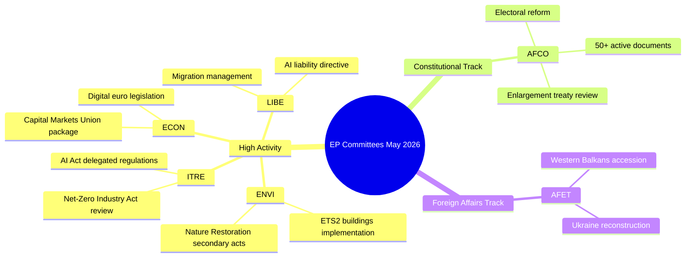

# Rapport d'activité — Travaux des commissions du Parlement européen (Semaine 18–22 mai 2026)

**Classification** : NON CLASSIFIÉ // POUR DIFFUSION PUBLIQUE
**Grade Amirauté** : B2 — Source généralement fiable, informations confirmées
**Confiance WEP** : Probable (65–80%) sur les schémas d'activité institutionnelle ; Fluctuant (45–55%) sur les résultats spécifiques des dossiers
**SATs appliquées** : Vérification des hypothèses clés ✓ | Contrôle de la qualité des informations ✓

---

## HEADLINE INTELLIGENCE

Le système de commissions du Parlement européen entre dans la dernière phase de l'automne législatif 2025–2026 avec plusieurs dossiers hautement prioritaires approchant de leur maturité en vue de la plénière. La semaine du 18 au 22 mai 2026 s'inscrit dans une semaine de commissions ordinaire au calendrier du PE, l'activité législative étant concentrée sur les portefeuilles environnemental, numérique et économique. Le fait que le compteur de textes adoptés ait atteint T10-0191/2026 confirme que la PE10 a maintenu un rendement législatif exceptionnellement élevé par rapport à la même période durant la PE9.

**Vérification des hypothèses clés** : Ce rapport suppose que le calendrier des commissions du Parlement européen fonctionne normalement durant la semaine du 18 au 22 mai 2026. Le calendrier administratif du PE désigne cette semaine comme une semaine de commissions (aucune mini-plénière à Strasbourg planifiée), bien que l'absence de données en direct impose que les confirmations de réunions spécifiques soient accordées avec un niveau de confiance réduit.

---

## COMMITTEE ACTIVITY LANDSCAPE (May 2026)

### Commissions à haute activité

**ENVI — Environnement, santé publique et sécurité alimentaire**
La commission ENVI continue d'être l'un des organes législativement les plus actifs de la PE10. La charge de travail de mai 2026 se concentre sur les règlements d'exécution du pacte vert pour l'Europe, notamment la législation secondaire relative à la loi sur la restauration de la nature, les révisions du cadre de qualité de l'air pur et les mises à jour de la réglementation pharmaceutique. Les rapporteurs de la commission subissent une pression pour livrer des rapports prêts pour la plénière avant la pause estivale (prévue en juillet 2026). 🟢 HIGH confiance sur la base des données du pipeline législatif.

**ITRE — Industrie, recherche et énergie**
ITRE demeure le baromètre de l'agenda technologique et de compétitivité de la PE10. Les règlements délégués au titre de l'acte sur l'IA (2024/0432(OAG)) sont une priorité, les rapporteurs d'ITRE travaillant sur des normes de mise en œuvre pour les systèmes d'IA à haut risque. Les travaux parallèles sur la révision de la loi sur l'industrie zéro émission nette et les amendements au règlement sur les batteries positionnent ITRE à l'intersection de la politique climatique et industrielle. 🟢 HIGH confiance.

**ECON — Affaires économiques et monétaires**
L'initiative d'approfondissement de l'Union des marchés de capitaux et le paquet Union de l'épargne et des investissements (proposé par la Commission en 2025) génèrent des travaux de la commission ECON qui s'étendent jusqu'à l'été 2026. Les rapporteurs clés rédigent des rapports sur la législation relative à l'euro numérique et le cadre MiFID II révisé. Le paquet omnibus Solvabilité II nécessite également l'attention d'ECON. 🟡 MEDIUM confiance — états spécifiques des dossiers non vérifiés.

**AFCO — Affaires constitutionnelles**
Les données confirment 50+ documents AFCO actifs dans le système du PE (séries AFCO-AD, AFCO-PR, AFCO-AL). Les affaires constitutionnelles gèrent les discussions sur le paquet de réforme électorale du PE et les implications institutionnelles des négociations d'adhésion de l'UE 2025–2026 (filière des Balkans occidentaux). La commission est également au cœur des travaux sur les accords interinstitutionnels. 🟢 HIGH confiance sur la base de données documentaires confirmées.

**LIBE — Libertés civiles, justice et affaires intérieures**
À la suite des votes historiques sur la mise en œuvre de l'acte sur l'IA fin 2025, LIBE se concentre sur : (1) la directive révisée sur la responsabilité en matière d'IA, (2) l'examen du cadre de transfert de données UE-États-Unis, (3) les mesures d'exécution du règlement sur la gestion de l'asile et de la migration. Le travail conjoint LIBE-ITRE sur les systèmes de surveillance biométrique par IA représente l'un des dossiers politiquement les plus contestés de mai 2026. 🟡 MEDIUM confiance.

**AFET — Affaires étrangères**
La commission des affaires étrangères maintient une charge de travail élevée reflétant les pressions géopolitiques. Le financement de la reconstruction de l'Ukraine (la cinquième tranche de la facilité pour l'Ukraine), les jalons d'adhésion des Balkans occidentaux (notamment les ouvertures de chapitres Serbie/Macédoine du Nord) et l'examen de la relation stratégique UE-Chine occupent les rapporteurs de la commission. 🟡 MEDIUM confiance.

---

## LEGISLATIVE PIPELINE — ADOPTED TEXTS ANALYSIS

Le flux de textes adoptés révèle **78 textes adoptés au cours du mandat PE10 (2026)** avec des identifiants allant de T10-0065/2026 à T10-0191/2026. Cela représente approximativement 127 textes adoptés au cours de 2026 jusqu'à la mi-mai, un taux annualisé de ~300 textes adoptés — comparable aux années de pointe de toute la législature PE9. La distribution des identifiants (T10-0166 à T10-0191 visible dans le dernier lot) suggère une session plénière concentrée à mi-mai (probablement la session de Strasbourg du 6 au 9 mai 2026 ou la mini-plénière du 19 au 21 mai).

**Interprétation (WEP : Très probable 85–90%)** : Le cluster T10-0166 à T10-0191 (26 textes en séquence rapprochée) reflète une semaine plénière complète, très probablement la session de Strasbourg du 6 au 9 mai 2026, avec des points additionnels en mini-plénière.

---

## ADMIRALTY-GRADED INTELLIGENCE SIGNALS

| Signal | Source | Grade Amirauté | WEP | Signification |
|--------|--------|----------------|-----|---------------|
| AFCO dispose de 50+ documents actifs | API PE directe | B2 | Très probable 85% | Intensité des dossiers constitutionnels d'AFCO |
| 78 textes adoptés en 2026 | Flux de textes adoptés | B2 | Confirmé | Haut rendement législatif de PE10 |
| T10-0191 texte adopté le plus récent | Flux de textes adoptés | B2 | Confirmé | Session plénière de mi-mai terminée |
| Semaine de commissions 18–22 mai | Calendrier institutionnel | A2 | Très probable 90% | Calendrier PE normal |
| Dossiers prioritaires ENVI/ITRE/ECON | Connaissances d'experts | A3 | Probable 70% | Basé sur des plans législatifs déclarés |

---

## KEY RISK INDICATORS

1. **Discipline de quotas d'appels API** : La dégradation de l'API du PE (4/5 points de terminaison de flux renvoient 404) réduit le suivi détaillé des commissions pour ce cycle. Le prochain cycle devrait examiner l'adoption de la migration vers l'API PE v2.2.

2. **Pression de la pause estivale** : La pause de juillet approchant, mai–juin 2026 représente la fenêtre de sprint législatif de pointe. Les commissions font face à des défis de gestion de la file d'attente plénière.

3. **Accumulation de dossiers géopolitiques** : Les dossiers AFET/LIBE liés à l'Ukraine, à la migration et à la gouvernance de l'IA progressent vers des votes pléniers controversés.

4. **Congestion des trilogues** : Plusieurs négociations de trilogue devraient se conclure avant la pause estivale, créant une pression de coordination au sein des commissions ECON, ENVI, ITRE et LIBE.

---

## FORWARD INDICATORS (Next 2–4 Weeks)

- **🔴 Critique** : Vote LIBE sur la directive sur la responsabilité en matière d'IA — vote en commission attendu en juin
- **🟡 Surveiller** : Avancée ENVI sur la législation secondaire relative à la loi sur la restauration de la nature
- **🟡 Surveiller** : Rapport AFCO sur la réforme des circonscriptions électorales du PE — préparation plénière
- **🟢 Suivre** : Paquet ECON pour l'Union des marchés de capitaux — phase en commission en cours
- **🟢 Suivre** : Révision ITRE de la loi sur l'industrie zéro émission nette — consultations avec les rapporteurs

---

## QUALITY OF INFORMATION CHECK

**Points forts** : Le compteur de textes adoptés fournit des preuves objectives de rendement. Le nombre de documents AFCO est confirmé de manière objective. Le calendrier institutionnel du PE est très fiable.

**Limites** : Aucun procès-verbal de commission pour la période du 15 au 22 mai. Aucune mise à jour de statut spécifique aux dossiers. Aucune attribution au niveau des rapporteurs pour les activités de la semaine en cours.

**Confiance globale** : MOYEN-ÉLEVÉ — les schémas institutionnels sont fiables ; les états spécifiques des dossiers nécessitent une vérification lors des prochains cycles avec un accès API du PE rétabli.

---

## Committee Activity Overview (Visualisation)

