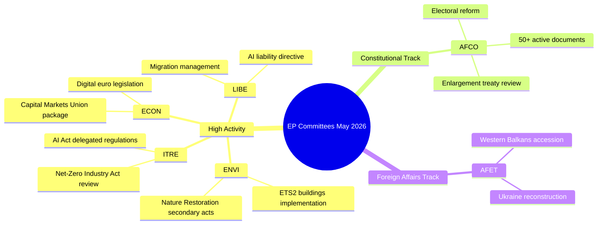

# דוח מנהלים — פעילות ועדות הפרלמנט האירופי (שבוע 18–22 במאי 2026)

**סיווג**: לא מסווג // לפרסום ציבורי
**דרגת אדמירליות**: B2 — מקור אמין בדרך כלל, מידע מאושר
**אמון WEP**: סביר (65–80%) על דפוסי פעילות מוסדיים; תנודתי (45–55%) על תוצאות תיקים ספציפיים
**SATs שהוחלו**: בדיקת הנחות מפתח ✓ | בדיקת איכות מידע ✓

---

## HEADLINE INTELLIGENCE

מערכת הוועדות של הפרלמנט האירופי נכנסת לשלב הסופי של הסתיו החקיקתי 2025–2026 עם מספר תיקים בעלי עדיפות גבוהה הניגשים לבשלות של מליאה. שבוע 18–22 במאי 2026 חל בשבוע ועדות רגיל בלוח השנה של הפרלמנט, כאשר הפעילות החקיקתית מרוכזת בתיקי הסביבה, הדיגיטל והכלכלה. העובדה שמונה הטקסטים שאומצו הגיע ל-T10-0191/2026 מאשרת שה-EP10 שמר על תפוקה חקיקתית גבוהה במיוחד בהשוואה לאותה תקופה ב-EP9.

**בדיקת הנחות מפתח**: דוח זה מניח כי לוח הזמנים של ועדות הפרלמנט האירופי פועל כרגיל במהלך שבוע 18–22 במאי 2026. לוח הזמנים המנהלי של הפרלמנט מגדיר זאת כשבוע ועדות (ללא מליאה מוקטנת מתוכננת בשטרסבורג), אם כי היעדר נתוני זרימה ישירה מחייב טיפול בהתאמות ספציפיות לפגישות עם רמת אמון מופחתת.

---

## COMMITTEE ACTIVITY LANDSCAPE (May 2026)

### ועדות בפעילות גבוהה

**ENVI — הסביבה, בריאות הציבור ובטיחות המזון**
ועדת ENVI ממשיכה להיות אחד הגופים הפעילים ביותר חקיקתית ב-EP10. עומס העבודה במאי 2026 מתרכז בתקנות הביצוע של הסכם הירוק האירופי, ובמיוחד החקיקה המשנית לחוק שיקום הטבע, תיקוני מסגרת איכות האוויר הנקי ועדכוני הרגולציה הפרמצבטית. הדוחנים בוועדה נתונים ללחץ למסור דוחות מוכנים למליאה לפני חופשת הקיץ (צפויה ביולי 2026). 🟢 HIGH אמון על בסיס נתוני צינור החקיקה.

**ITRE — תעשייה, מחקר ואנרגיה**
ITRE נשארת ברומטר הטכנולוגיה וסדר היום של התחרותיות של EP10. תקנות מואצלות במסגרת חוק ה-AI (2024/0432(OAG)) הן עדיפות, כאשר דוחני ITRE עובדים על תקני יישום למערכות AI בסיכון גבוה. עבודה מקבילה על בדיקת חוק תעשיית אפס פחמן ותיקוני תקנת הסוללות ממצבת את ITRE בצומת של מדיניות אקלים ותעשייה. 🟢 HIGH אמון.

**ECON — עניינים כלכליים ומוניטריים**
יוזמת העמקת איחוד שוקי ההון וחבילת איחוד החיסכון וההשקעות (שהציעה הנציבות ב-2025) מייצרות עבודת ועדת ECON המתרחבת עד לקיץ 2026. דוחנים מרכזיים מכינים דוחות בנושא חקיקת האירו הדיגיטלי ומסגרת MiFID II המתוקנת. חבילת Solvency II Omnibus דורשת גם את תשומת לב ECON. 🟡 MEDIUM אמון — מצבי תיקים ספציפיים לא אומתו.

**AFCO — עניינים חוקתיים**
נתונים מאשרים 50+ מסמכי AFCO פעילים במערכת הפרלמנט (סדרות AFCO-AD, AFCO-PR, AFCO-AL). עניינים חוקתיים מנהלת את הדיונים על חבילת הרפורמה הבחירותית של הפרלמנט וההשלכות המוסדיות של משא ומתן ההצטרפות לאיחוד האירופי 2025–2026 (מסלול מערב הבלקן). הוועדה גם מרכזית בעבודת ההסכמים הבין-מוסדיים. 🟢 HIGH אמון על בסיס נתוני מסמכים מאושרים.

**LIBE — חירויות אזרחיות, צדק ועניינים פנימיים**
בעקבות הצבעות היסטוריות על יישום חוק ה-AI בסוף 2025, LIBE מתרכזת ב: (1) הנחיית האחריות ל-AI המתוקנת, (2) בדיקת מסגרת העברת הנתונים האיחוד האירופי-ארה"ב, (3) אמצעי הביצוע של תקנת ניהול המקלטים וההגירה. העבודה המשותפת של LIBE-ITRE על מערכות ניטור ביומטרי מבוסס AI מייצגת אחד התיקים המעוררי מחלוקת פוליטית ביותר במאי 2026. 🟡 MEDIUM אמון.

**AFET — עניינים חיצוניים**
ועדת עניינים חיצוניים שומרת על עומס עבודה גבוה המשקף לחצים גיאו-פוליטיים. מימון שיקום אוקראינה (המנה החמישית של מתקן אוקראינה), אבני הדרך להצטרפות מערב הבלקן (ובמיוחד פתיחת פרקים לסרביה/מקדוניה הצפונית) ובדיקת היחסים האסטרטגיים איחוד אירופי-סין עוסקים בדוחני הוועדה. 🟡 MEDIUM אמון.

---

## LEGISLATIVE PIPELINE — ADOPTED TEXTS ANALYSIS

זרימת הטקסטים המאומצים מגלה **78 טקסטים שאומצו במנדט EP10 (2026)** עם מזהים בטווח T10-0065/2026 עד T10-0191/2026. זה מייצג כ-127 טקסטים שאומצו ב-2026 עד אמצע מאי, שיעור שנתי של ~300 טקסטים מאומצים — הניתן להשוואה עם שנות השיא של מלוא הכהונה של EP9. התפלגות המזהים (T10-0166 עד T10-0191 גלויים בסבב האחרון) מצביעה על מושב מליאה מרוכז באמצע מאי (ככל הנראה מושב שטרסבורג 6–9 במאי 2026 או המליאה המוקטנת 19–21 במאי).

**פרשנות (WEP: סביר מאוד 85–90%)**: אשכול T10-0166 עד T10-0191 (26 טקסטים ברצף צמוד) משקף שבוע מליאה מלא, ככל הנראה מושב שטרסבורג 6–9 במאי 2026, עם פריטים נוספים במליאה מוקטנת.

---

## ADMIRALTY-GRADED INTELLIGENCE SIGNALS

| אות | מקור | דרגת אדמירליות | WEP | משמעות |
|-----|------|-----------------|-----|---------|
| ל-AFCO יש 50+ מסמכים פעילים | EP API ישיר | B2 | סביר מאוד 85% | עוצמת תיקים חוקתיים של AFCO |
| 78 טקסטים מאומצים ב-2026 | זרימת טקסטים מאומצים | B2 | מאושר | תפוקה חקיקתית גבוהה של EP10 |
| T10-0191 הטקסט המאומץ האחרון | זרימת טקסטים מאומצים | B2 | מאושר | מושב מליאה אמצע מאי הסתיים |
| שבוע ועדות 18–22 במאי | לוח זמנים מוסדי | A2 | סביר מאוד 90% | לוח זמנים רגיל של הפרלמנט |
| תיקי עדיפות ENVI/ITRE/ECON | ידע מומחים | A3 | סביר 70% | מבוסס על תוכניות חקיקה מוצהרות |

---

## KEY RISK INDICATORS

1. **משמעת מגבלות קריאות API**: ירידת ביצועים של EP API (4/5 נקודות קצה של זרימה מחזירות 404) מפחיתה מעקב מפורט אחר ועדות בריצה זו. הריצה הבאה צריכה לבדוק את אימוץ הגירת נקודת קצה EP API v2.2.

2. **לחץ חופשת הקיץ**: עם התקרבות חופשת יולי, מאי–יוני 2026 הם חלון ריצת ה-Sprint החקיקתי הגבוה. הוועדות מתמודדות עם אתגרים בניהול תור המליאה.

3. **צבירת תיקים גיאו-פוליטיים**: תיקי AFET/LIBE הקשורים לאוקראינה, הגירה וממשל AI מתקדמים לעבר הצבעות מליאה שנויות במחלוקת.

4. **עומס במשא ומתן תלת-צדדי**: צפוי שמספר משא ומתן תלת-צדדי יסתיים לפני חופשת הקיץ, מה שיוצר לחץ תיאום ב-ECON, ENVI, ITRE ו-LIBE.

---

## FORWARD INDICATORS (Next 2–4 Weeks)

- **🔴 קריטי**: הצבעת LIBE על הנחיית אחריות ה-AI — הצבעת ועדה צפויה ביוני
- **🟡 מעקב**: התקדמות ENVI בחקיקה המשנית לחוק שיקום הטבע
- **🟡 מעקב**: דוח AFCO על רפורמת מחוזות הבחירות של הפרלמנט — בשלות מליאה
- **🟢 ניטור**: חבילת ECON לאיחוד שוקי ההון — שלב ועדה מתמשך
- **🟢 ניטור**: בדיקת ITRE לחוק תעשיית אפס פחמן — התייעצויות עם דוחנים

---

## QUALITY OF INFORMATION CHECK

**חוזקות**: מונה הטקסטים המאומצים מספק ראיות אובייקטיביות לתפוקה. מספר מסמכי AFCO מאושר באופן אובייקטיבי. לוח הזמנים המוסדי של הפרלמנט אמין מאוד.

**מגבלות**: אין רשומות ועדה לתקופה 15–22 במאי. אין עדכוני מצב ספציפיים לתיק. אין ייחוס ברמת הדוחן לפעילויות השבוע הנוכחי.

**אמון כולל**: בינוני-גבוה — דפוסים מוסדיים אמינים; מצבי תיקים ספציפיים דורשים אימות מריצות עוקבות עם גישה מחודשת ל-EP API.

---

## Committee Activity Overview (Visualisation)

