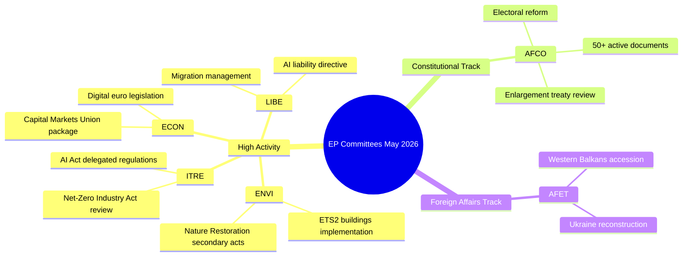

# 欧州議会委員会活動報告書 — 2026年5月18日〜22日(第18〜22週)

**分類**: 非機密 // 公開用
**アドミラルティ・グレード**: B2 — 通常は信頼できる情報源、確認済み情報
**WEP信頼度**: 機関活動パターンに関してはおそらく(65〜80%)、特定の案件の結果については動揺気味(45〜55%)
**適用SATs**: 主要前提条件の確認 ✓ | 情報品質確認 ✓

---

## HEADLINE INTELLIGENCE

欧州議会の委員会システムは、複数の高優先案件が本会議への準備段階に近づく中、2025〜2026年の立法の秋の最終段階に入っています。2026年5月18日〜22日の週は、欧州議会暦において通常の委員会週に当たり、立法活動は環境・デジタル・経済の各分野のポートフォリオに集中しています。採択文書カウンターがT10-0191/2026に到達したことは、EP10がEP9の同時期と比較して著しく高い立法産出量を維持していることを確認するものです。

**主要前提条件の確認**: 本報告書は、欧州議会の委員会スケジュールが2026年5月18日〜22日の週に通常通り機能していることを前提としています。欧州議会の行政暦では、この週を委員会週（ストラスブールでのミニ本会議は予定なし）と指定していますが、ライブフィードデータがないため、特定の会議確認については信頼度が低下しています。

---

## COMMITTEE ACTIVITY LANDSCAPE (May 2026)

### 高活動委員会

**ENVI — 環境・公衆衛生・食品安全委員会**
ENVI委員会はEP10において立法的に最も活発な機関の一つであり続けています。2026年5月の業務量は、欧州グリーンディールの施行規則、特に自然回復法の二次立法、清潔な空気品質枠組みの改正、医薬品規制の更新に集中しています。委員会の報告者は、夏季休会（2026年7月見込み）前に本会議準備完了の報告書を提出するよう圧力を受けています。🟢 HIGH — 立法パイプラインデータに基づく信頼度。

**ITRE — 産業・研究・エネルギー委員会**
ITREはEP10の技術・競争力アジェンダの指標であり続けています。AI法の委任規則(2024/0432(OAG))は優先事項であり、ITRE報告者は高リスクAIシステムの実施標準に取り組んでいます。ネット・ゼロ産業法の見直しと電池規制の改正に関する並行作業により、ITREは気候政策と産業政策の交差点に位置しています。🟢 HIGH信頼度。

**ECON — 経済・通貨問題委員会**
資本市場同盟の深化イニシアチブと貯蓄・投資同盟パッケージ（2025年に委員会が提案）は、2026年夏まで続くECON委員会の作業を生み出しています。主要報告者はデジタルユーロ立法と改訂版MiFID II枠組みに関する報告書を作成しています。ソルベンシーII オムニバス・パッケージもECONの注意を要しています。🟡 MEDIUM信頼度 — 特定の案件状況は未確認。

**AFCO — 憲法問題委員会**
欧州議会システムには50以上の活発なAFCO文書(AFCO-AD、AFCO-PR、AFCO-ALシリーズ)があることが確認されています。憲法問題は、欧州議会の選挙改革パッケージに関する議論と、EU加盟交渉2025〜2026（西バルカン路線）の制度的影響を管理しています。また委員会は機関間合意作業の中心でもあります。🟢 HIGH — 確認済み文書データに基づく信頼度。

**LIBE — 市民的自由・司法・内務委員会**
2025年末のAI法施行に関する歴史的採決を受け、LIBEは(1)改訂版AI責任指令、(2)EU・米国データ転送枠組みの見直し、(3)庇護・移民管理規則の施行措置に集中しています。LIBEとITREの生体認証AIシステムに関する合同作業は、2026年5月における政治的に最も争点となっている案件の一つです。🟡 MEDIUM信頼度。

**AFET — 外務委員会**
外務委員会は地政学的圧力を反映した高い業務量を維持しています。ウクライナ復興資金（ウクライナ・ファシリティ第5弾）、西バルカン加盟のマイルストーン（特にセルビア/北マケドニアの章開始）、EU・中国戦略的関係の見直しが委員会報告者を占めています。🟡 MEDIUM信頼度。

---

## LEGISLATIVE PIPELINE — ADOPTED TEXTS ANALYSIS

採択文書フィードは**EP10任期(2026)に採択された78件の文書**を示しており、識別子はT10-0065/2026からT10-0191/2026に及びます。これは2026年5月中旬までに約127件の採択文書を表し、年換算率では約300件の採択文書となり、EP9全任期のピーク年と同等です。識別子の分布（最新バッチでT10-0166からT10-0191が確認）は、5月中旬に集中した本会議（おそらく2026年5月6〜9日のストラスブール会期またはミニ本会議5月19〜21日）を示しています。

**解釈(WEP: 非常に可能性が高い 85〜90%)**: T10-0166からT10-0191のクラスター（近接する26件の文書）は、おそらく2026年5月6〜9日のストラスブール会期を中心とした完全な本会議週を反映しており、追加のミニ本会議項目も含まれます。

---

## ADMIRALTY-GRADED INTELLIGENCE SIGNALS

| シグナル | 情報源 | アドミラルティ・グレード | WEP | 重要性 |
|---------|--------|------------------------|-----|--------|
| AFCOに50以上の活発な文書 | EP API直接 | B2 | 非常に可能性が高い 85% | AFCOの憲法案件の集中度 |
| 2026年に78件採択 | 採択文書フィード | B2 | 確認済み | EP10の高い立法産出量 |
| T10-0191が最新採択文書 | 採択文書フィード | B2 | 確認済み | 5月中旬本会議が完了 |
| 5月18〜22日委員会週 | 機関暦 | A2 | 非常に可能性が高い 90% | 通常の欧州議会スケジュール |
| ENVI/ITRE/ECON優先案件 | 専門的知識 | A3 | おそらく 70% | 宣言された立法計画に基づく |

---

## KEY RISK INDICATORS

1. **APIコール制限の規律**: EP APIの低下（5件中4件のフィードエンドポイントが404を返す）はこのランの詳細な委員会追跡を減少させます。次回ランではEP API v2.2エンドポイント移行の採用を調査すべきです。

2. **夏季休会の圧力**: 7月休会が近づくにつれ、2026年5〜6月は立法スプリントのピーク時期です。委員会は本会議キュー管理の課題に直面しています。

3. **地政学的案件の蓄積**: ウクライナ、移民、AIガバナンスに関するAFET/LIBE案件が論争的な本会議採決に向かっています。

4. **三部委員会交渉の混雑**: 複数のトリローグ交渉が夏季休会前に結論を出すと予想されており、ECON、ENVI、ITRE、LIBEでの調整圧力を生み出しています。

---

## FORWARD INDICATORS (Next 2–4 Weeks)

- **🔴 重要**: LIBE — AI責任指令への採決、6月の委員会採決予定
- **🟡 注視**: ENVI — 自然回復法の二次立法の進捗
- **🟡 注視**: AFCO — 欧州議会選挙区改革報告書、本会議準備状況
- **🟢 監視**: ECON — 資本市場同盟パッケージ、委員会段階進行中
- **🟢 監視**: ITRE — ネット・ゼロ産業法見直し、報告者との協議

---

## QUALITY OF INFORMATION CHECK

**強み**: 採択文書カウンターは産出量についての客観的証拠を提供します。AFCO文書数は客観的に確認されています。欧州議会の機関暦は非常に信頼性が高いです。

**限界**: 5月15〜22日の期間について委員会議事録なし。案件固有の状況更新なし。現週の活動について報告者レベルの帰属なし。

**総合信頼度**: 中〜高 — 機関パターンは信頼できます。特定の案件状況は、EP APIアクセスが回復した後続のランからの検証を要します。

---

## Committee Activity Overview (Visualisation)

