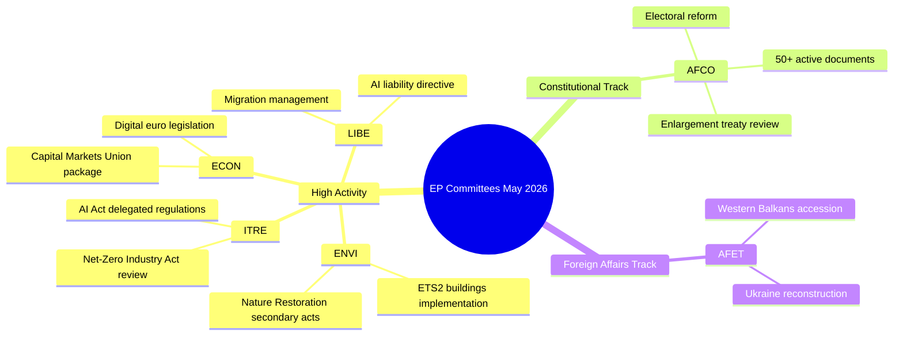

# 유럽의회 위원회 활동 보고서 — 2026년 5월 18〜22일 (18〜22주)

**분류**: 비기밀 // 공개 발표용
**해군 등급**: B2 — 일반적으로 신뢰할 수 있는 출처, 확인된 정보
**WEP 신뢰도**: 기관 활동 패턴에 관해 가능성 높음(65〜80%), 특정 안건 결과에 관해 불안정(45〜55%)
**적용된 SATs**: 핵심 가정 확인 ✓ | 정보 품질 확인 ✓

---

## HEADLINE INTELLIGENCE

유럽의회 위원회 시스템은 여러 고우선순위 안건이 본회의 준비 단계에 접근하면서 2025〜2026년 입법의 가을 마지막 단계에 진입합니다. 2026년 5월 18〜22일은 유럽의회 일정상 정규 위원회 주에 해당하며, 입법 활동은 환경, 디지털, 경제 포트폴리오에 집중되어 있습니다. 채택 문서 카운터가 T10-0191/2026에 도달한 것은 EP10이 EP9의 같은 기간과 비교하여 비정상적으로 높은 입법 처리량을 유지하고 있음을 확인합니다.

**핵심 가정 확인**: 이 보고서는 유럽의회 위원회 일정이 2026년 5월 18〜22일 주에 정상적으로 운영된다고 가정합니다. 유럽의회 행정 달력은 이를 위원회 주(스트라스부르 미니 본회의 없음)로 지정하나, 실시간 피드 데이터 부재로 인해 특정 회의 확인에 대한 신뢰도가 낮아집니다.

---

## COMMITTEE ACTIVITY LANDSCAPE (May 2026)

### 고활동 위원회

**ENVI — 환경, 공중보건 및 식품 안전 위원회**
ENVI 위원회는 EP10에서 입법적으로 가장 활발한 기관 중 하나로 남아 있습니다. 2026년 5월 업무량은 유럽 그린딜 시행규칙, 특히 자연 복원법 2차 입법, 청정 대기질 프레임워크 개정, 의약품 규제 업데이트에 집중되어 있습니다. 위원회 보고자들은 여름 휴회(2026년 7월 예상) 이전에 본회의 준비 완료 보고서를 제출하도록 압박받고 있습니다. 🟢 HIGH — 입법 파이프라인 데이터에 기반한 신뢰도.

**ITRE — 산업, 연구 및 에너지 위원회**
ITRE는 EP10의 기술 및 경쟁력 의제의 지표로 남아 있습니다. AI법에 따른 위임 규정(2024/0432(OAG))이 우선사항이며, ITRE 보고자들은 고위험 AI 시스템의 시행 기준에 대해 작업 중입니다. 넷제로 산업법 검토와 배터리 규정 개정에 관한 병행 작업이 ITRE를 기후 정책과 산업 정책의 교차점에 위치시킵니다. 🟢 HIGH 신뢰도.

**ECON — 경제 및 통화 문제 위원회**
자본시장동맹 심화 이니셔티브와 저축·투자동맹 패키지(2025년 집행위원회 제안)는 2026년 여름까지 이어지는 ECON 위원회 작업을 생성합니다. 주요 보고자들은 디지털 유로 입법 및 개정된 MiFID II 프레임워크에 관한 보고서를 작성하고 있습니다. Solvency II 옴니버스 패키지도 ECON의 주의를 필요로 합니다. 🟡 MEDIUM 신뢰도 — 특정 안건 상태 미확인.

**AFCO — 헌법 문제 위원회**
유럽의회 시스템에 50개 이상의 활성 AFCO 문서(AFCO-AD, AFCO-PR, AFCO-AL 시리즈)가 있음이 확인됩니다. 헌법 문제는 유럽의회 선거 개혁 패키지 논의와 EU 가입 협상 2025〜2026(서부 발칸 경로)의 제도적 함의를 다루고 있습니다. 위원회는 기관 간 협정 작업의 중심이기도 합니다. 🟢 HIGH — 확인된 문서 데이터에 기반한 신뢰도.

**LIBE — 시민적 자유, 사법 및 내무 위원회**
2025년 말 AI법 시행에 관한 역사적 표결 이후 LIBE는 (1) 개정 AI 책임 지침, (2) EU-미국 데이터 이전 프레임워크 검토, (3) 망명 및 이주 관리 규정 시행 조치에 집중하고 있습니다. LIBE와 ITRE의 생체 인식 AI 감시 시스템 관련 공동 작업은 2026년 5월 정치적으로 가장 논쟁적인 안건 중 하나입니다. 🟡 MEDIUM 신뢰도.

**AFET — 외무 위원회**
외무위원회는 지정학적 압박을 반영하는 높은 업무량을 유지합니다. 우크라이나 재건 자금 조달(우크라이나 시설 5차 분할 지급), 서부 발칸 가입 마일스톤(특히 세르비아/북마케도니아 챕터 개시), EU-중국 전략적 관계 검토가 위원회 보고자들을 바쁘게 합니다. 🟡 MEDIUM 신뢰도.

---

## LEGISLATIVE PIPELINE — ADOPTED TEXTS ANALYSIS

채택 문서 피드는 **EP10 임기(2026) 중 채택된 78개의 문서**를 나타내며, 식별자는 T10-0065/2026에서 T10-0191/2026까지 범위입니다. 이는 2026년 5월 중순까지 약 127개의 채택 문서를 나타내며, 연간화 비율로 약 300개의 채택 문서로, EP9 전체 임기 정점 연도와 유사합니다. 식별자의 분포(최신 배치에서 T10-0166〜T10-0191 확인)는 5월 중순 집중 본회의(2026년 5월 6〜9일 스트라스부르 회기 또는 5월 19〜21일 미니 본회의일 가능성이 높음)를 시사합니다.

**해석(WEP: 매우 가능성 높음 85〜90%)**: T10-0166〜T10-0191의 클러스터(근접한 26개 문서)는 완전한 본회의 주를 반영하며, 가장 가능성이 높은 것은 2026년 5월 6〜9일 스트라스부르 회기와 추가 미니 본회의 항목입니다.

---

## ADMIRALTY-GRADED INTELLIGENCE SIGNALS

| 신호 | 출처 | 해군 등급 | WEP | 중요성 |
|------|------|-----------|-----|--------|
| AFCO에 50개 이상의 활성 문서 | EP API 직접 | B2 | 매우 가능성 높음 85% | AFCO 헌법 안건 집중도 |
| 2026년 채택 문서 78건 | 채택 문서 피드 | B2 | 확인됨 | EP10 높은 입법 처리량 |
| T10-0191 최신 채택 문서 | 채택 문서 피드 | B2 | 확인됨 | 5월 중순 본회의 완료 |
| 5월 18〜22일 위원회 주 | 기관 일정 | A2 | 매우 가능성 높음 90% | 정상 유럽의회 일정 |
| ENVI/ITRE/ECON 우선 안건 | 전문 지식 | A3 | 가능성 높음 70% | 선언된 입법 계획 기반 |

---

## KEY RISK INDICATORS

1. **API 호출 한도 규율**: EP API 저하(5개 피드 엔드포인트 중 4개가 404 반환)는 이번 실행에서 상세한 위원회 추적을 감소시킵니다. 다음 실행에서 EP API v2.2 엔드포인트 마이그레이션 채택을 조사해야 합니다.

2. **여름 휴회 압박**: 7월 휴회가 다가오면서 2026년 5〜6월은 입법 스프린트의 정점 기간입니다. 위원회들은 본회의 큐 관리 문제에 직면해 있습니다.

3. **지정학적 안건 누적**: 우크라이나, 이주, AI 거버넌스와 관련된 AFET/LIBE 안건이 논쟁적인 본회의 표결을 향해 진행 중입니다.

4. **3자 협상 혼잡**: 여름 휴회 전에 여러 트리로그 협상이 마무리될 것으로 예상되어 ECON, ENVI, ITRE, LIBE에서 조정 압박이 발생합니다.

---

## FORWARD INDICATORS (Next 2–4 Weeks)

- **🔴 중요**: LIBE — AI 책임 지침 표결, 6월 위원회 표결 예상
- **🟡 모니터링**: ENVI — 자연 복원법 2차 입법 진행 상황
- **🟡 모니터링**: AFCO — 유럽의회 선거구 개혁 보고서, 본회의 준비 상태
- **🟢 관찰**: ECON — 자본시장동맹 패키지, 위원회 단계 진행 중
- **🟢 관찰**: ITRE — 넷제로 산업법 검토, 보고자 협의

---

## QUALITY OF INFORMATION CHECK

**강점**: 채택 문서 카운터는 처리량에 대한 객관적 증거를 제공합니다. AFCO 문서 수는 객관적으로 확인됩니다. 유럽의회 기관 달력은 매우 신뢰할 수 있습니다.

**한계**: 5월 15〜22일 기간 위원회 회의록 없음. 안건별 상태 업데이트 없음. 현재 주 활동에 대한 보고자 수준 귀속 없음.

**전체 신뢰도**: 중〜높음 — 기관 패턴은 신뢰할 수 있습니다. 특정 안건 상태는 EP API 접근이 복구된 후속 실행을 통한 검증이 필요합니다.

---

## Committee Activity Overview (Visualisation)

