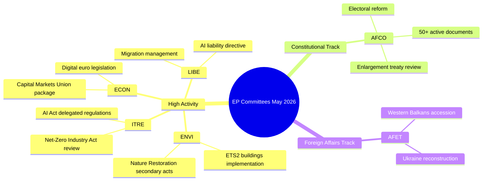

# Activiteitenrapport — Commissiewerkzaamheden van het Europees Parlement (Week 18–22 mei 2026)

**Classificatie**: NIET-GECLASSIFICEERD // VOOR OPENBARE BEKENDMAKING
**Admiraliteitsgraad**: B2 — Doorgaans betrouwbare bron, bevestigde informatie
**WEP-vertrouwen**: Waarschijnlijk (65–80%) voor institutionele activiteitspatronen; Wisselend (45–55%) voor specifieke dossieruitkomsten
**Toegepaste SATs**: Controle van sleutelaannames ✓ | Controle van informatiekwaliteit ✓

---

## HEADLINE INTELLIGENCE

Het commissiesysteem van het Europees Parlement betreedt de laatste fase van de wetgevende herfst 2025–2026, met meerdere hoogprioritaire dossiers die de plenumrijpheid naderen. De week van 18 tot 22 mei 2026 valt in een gewone commissieweek op de EP-kalender, waarbij de wetgevende activiteit geconcentreerd is op milieu-, digitale en economische portefeuilles. Het feit dat de teller van aangenomen teksten T10-0191/2026 heeft bereikt, bevestigt dat het EP10 een ongewoon hoge wetgevende doorvoer heeft gehandhaafd in vergelijking met dezelfde periode in het EP9.

**Controle van sleutelaannames**: Dit rapport gaat ervan uit dat het commissieschema van het Europees Parlement normaal functioneert gedurende de week van 18 tot 22 mei 2026. De administratieve kalender van het EP bestempelt dit als een commissieweek (geen Straatsburg mini-plenumzitting gepland), hoewel het ontbreken van live feedgegevens vereist dat specifieke vergaderbevestigingen met verminderd vertrouwen worden behandeld.

---

## COMMITTEE ACTIVITY LANDSCAPE (May 2026)

### Commissies met hoge activiteit

**ENVI — Milieu, volksgezondheid en voedselveiligheid**
De ENVI-commissie blijft een van de wetgevend meest actieve organen in het EP10. De werklast in mei 2026 spitst zich toe op de uitvoeringsverordeningen voor de Europese Green Deal, met name de secundaire wetgeving voor de Natuurherstelwet, revisies van het kader voor schone luchtkwaliteit en updates van de geneesmiddelenregulering. De rapporteurs van de commissie staan onder druk om plenumklare rapporten te leveren vóór het zomerreces (verwacht juli 2026). 🟢 HIGH vertrouwen op basis van pijplijngegevens voor wetgeving.

**ITRE — Industrie, Onderzoek en Energie**
ITRE blijft de barometer voor de technologie- en concurrentievermogenagenda van het EP10. De gedelegeerde verordeningen in het kader van de AI-verordening (2024/0432(OAG)) zijn een prioriteit, waarbij ITRE-rapporteurs werken aan implementatienormen voor hoog-risico AI-systemen. Parallel werk aan de evaluatie van de Netto-Nul-Industrie Act en wijzigingen van de Batterijenverordening positioneert ITRE op het snijpunt van klimaat- en industriebeleid. 🟢 HIGH vertrouwen.

**ECON — Economische en Monetaire Zaken**
Het initiatief voor de verdieping van de Kapitaalmarktunie en het pakket voor de Spaar- en Investeringsunie (voorgesteld door de Commissie in 2025) genereren ECON-commissiewerk dat zich uitstrekt tot de zomer van 2026. Sleutelrapporteurs stellen rapporten op over wetgeving inzake de digitale euro en het herziene MiFID II-kader. Het Solvency II Omnibus-pakket vereist ook de aandacht van ECON. 🟡 MEDIUM vertrouwen — specifieke dossierstatus niet geverifieerd.

**AFCO — Constitutionele Zaken**
Gegevens bevestigen 50+ actieve AFCO-documenten in het EP-systeem (series AFCO-AD, AFCO-PR, AFCO-AL). Constitutionele Zaken beheert de discussies over het EP-kieshervormpakket en de institutionele implicaties van de EU-toetredingsonderhandelingen 2025–2026 (de West-Balkanlijn). De commissie staat ook centraal in het werk aan interinstitutionele akkoorden. 🟢 HIGH vertrouwen op basis van bevestigde documentgegevens.

**LIBE — Burgerlijke Vrijheden, Justitie en Binnenlandse Zaken**
Na historische stemmingen over de implementatie van de AI-verordening eind 2025, richt LIBE zich op: (1) de herziene AI-aansprakelijkheidsrichtlijn, (2) de herziening van het EU-VS-datatransferkorper, (3) de uitvoeringsmaatregelen voor de verordening inzake asiel- en migratiebeheer. Het gezamenlijke werk van LIBE en ITRE aan biometrische AI-bewakingssystemen vertegenwoordigt een van de meest politiek omstreden dossiers van mei 2026. 🟡 MEDIUM vertrouwen.

**AFET — Buitenlandse Zaken**
De Commissie buitenlandse zaken handhaaft een hoge werklast die de geopolitieke druk weerspiegelt. De financiering van de wederopbouw van Oekraïne (de vijfde tranche van de Oekraïne-faciliteit), mijlpalen voor toetreding van de Westelijke Balkan (met name de opening van hoofdstukken voor Servië/Noord-Macedonië) en de herziening van de strategische EU-China-relatie houden de rapporteurs van de commissie bezig. 🟡 MEDIUM vertrouwen.

---

## LEGISLATIVE PIPELINE — ADOPTED TEXTS ANALYSIS

De feed van aangenomen teksten onthult **78 teksten aangenomen in het EP10-mandaat (2026)** met identificatoren variërend van T10-0065/2026 tot T10-0191/2026. Dit vertegenwoordigt ongeveer 127 aangenomen teksten in 2026 tot half mei, een geannualiseerde rate van ~300 aangenomen teksten — vergelijkbaar met de piekjaren van de volledige legislatuur van het EP9. De verdeling van identificatoren (T10-0166 tot T10-0191 zichtbaar in de meest recente batch) wijst op een geconcentreerde plenumzitting medio mei (waarschijnlijk de Straatsburg-sessie van 6–9 mei 2026 of het mini-plenum van 19–21 mei).

**Interpretatie (WEP: Zeer waarschijnlijk 85–90%)**: Het cluster T10-0166 tot T10-0191 (26 teksten in nauwe opeenvolging) weerspiegelt een volledige plenumweek, hoogstwaarschijnlijk de Straatsburg-sessie van 6–9 mei 2026, met aanvullende mini-plenumpunten.

---

## ADMIRALTY-GRADED INTELLIGENCE SIGNALS

| Signaal | Bron | Admiraliteitsgraad | WEP | Betekenis |
|---------|------|--------------------|-----|-----------|
| AFCO heeft 50+ actieve documenten | EP API direct | B2 | Zeer waarschijnlijk 85% | AFCO constitutionele dossierintensiteit |
| 78 aangenomen teksten in 2026 | Feed aangenomen teksten | B2 | Bevestigd | Hoge EP10-wetgevende doorvoer |
| T10-0191 meest recente aangenomen tekst | Feed aangenomen teksten | B2 | Bevestigd | Plenumzitting medio mei voltooid |
| Commissieweek 18–22 mei | Institutionele kalender | A2 | Zeer waarschijnlijk 90% | Normaal EP-schema |
| Prioritaire dossiers ENVI/ITRE/ECON | Deskundigheid | A3 | Waarschijnlijk 70% | Gebaseerd op gedeclareerde wetgevingsplannen |

---

## KEY RISK INDICATORS

1. **Discipline inzake API-aanroeplimieten**: EP API-degradatie (4/5 feedendpoints retourneren 404) vermindert gedetailleerde commissie-tracking voor deze run. De volgende run moet de adoptie van EP API v2.2-eindpuntmigratie onderzoeken.

2. **Zomerrecesdruk**: Met het julireces dat nadert, is mei–juni 2026 het piekvenster voor de wetgevende sprint. Commissies worden geconfronteerd met uitdagingen bij het beheer van de plenumwachtrij.

3. **Geopolitieke dossieraccumulatie**: AFET/LIBE-dossiers gerelateerd aan Oekraïne, migratie en AI-governance koersen af op controversiële plenariesteммingen.

4. **Trilooogcongestie**: Van meerdere trilooogonderhandelingen wordt verwacht dat ze voor het zomerreces worden afgerond, wat coördinatiedruk creëert in ECON, ENVI, ITRE en LIBE.

---

## FORWARD INDICATORS (Next 2–4 Weeks)

- **🔴 Kritiek**: LIBE-stemming over de AI-aansprakelijkheidsrichtlijn — commissiestemming verwacht in juni
- **🟡 Volgen**: ENVI-voortgang inzake secundaire wetgeving voor de Natuurherstelwet
- **🟡 Volgen**: AFCO-rapport over hervorming van EP-kieskringen — plenumgereedheid
- **🟢 Bewaken**: ECON-pakket voor de Kapitaalmarktunie — commissiefase aan de gang
- **🟢 Bewaken**: ITRE-herziening van de Netto-Nul-Industrie Act — consultaties met rapporteurs

---

## QUALITY OF INFORMATION CHECK

**Sterke punten**: De teller van aangenomen teksten biedt objectief bewijs van doorvoer. Het AFCO-documentaantal is objectief bevestigd. De institutionele EP-kalender is zeer betrouwbaar.

**Beperkingen**: Geen commissieverslagen voor de periode 15–22 mei. Geen dossiersspecifieke statusupdates. Geen rapporteurstoewijzing voor de activiteiten van de huidige week.

**Algeheel vertrouwen**: MIDDEL-HOOG — institutionele patronen zijn betrouwbaar; specifieke dossierstatussen vereisen verificatie van volgende runs met herstelde EP API-toegang.

---

## Committee Activity Overview (Visualisation)

