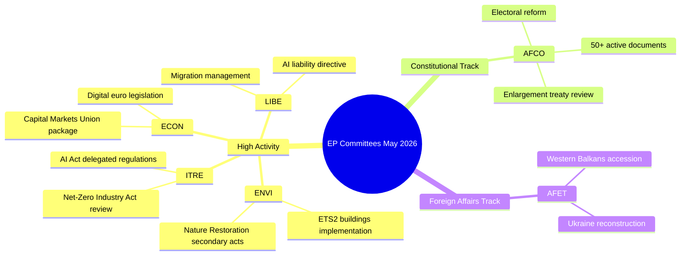

# Aktivitetsoversikt — Europaparlamentets utvalgsarbeid (Uke 18–22. mai 2026)

**Klassifisering**: UGRADERT // FOR OFFENTLIG UTGIVELSE
**Admiralitetskvalitet**: B2 — Vanligvis pålitelig kilde, bekreftet informasjon
**WEP-konfidens**: Sannsynlig (65–80%) for institusjonelle aktivitetsmønstre; Vippende (45–55%) for spesifikke sakutfall
**SATs anvendt**: Kontroll av nøkkelforutsetninger ✓ | Kontroll av informasjonskvalitet ✓

---

## HEADLINE INTELLIGENCE

Europaparlamentets utvalgssystem går inn i den siste fasen av den lovgivningsmessige høsten 2025–2026 med flere høyt prioriterte saker som nærmer seg plenary-beredskap. Uken 18.–22. mai 2026 faller innenfor en ordinær utvalgsuke i EP-kalenderen, med lovgivningsaktivitet konsentrert innenfor miljø-, digitale og økonomiske porteføljer. Det faktum at telleren for vedtatte tekster har nådd T10-0191/2026, bekrefter at EP10 har opprettholdt en uvanlig høy lovgivningsgjennomstrømning sammenlignet med samme periode i EP9.

**Kontroll av nøkkelforutsetninger**: Denne rapporten forutsetter at Europaparlamentets utvalgsplan fungerer normalt i uken 18.–22. mai 2026. EP-administrasjonens kalender betegner dette som en utvalgsuke (ingen Strasbourg mini-plenary planlagt), men fraværet av direktedata-feeder krever at spesifikke møtebekreftelser bæres med redusert konfidens.

---

## COMMITTEE ACTIVITY LANDSCAPE (May 2026)

### Utvalg med høy aktivitet

**ENVI — Miljø, folkehelse og mattrygghet**
ENVI-utvalget fortsetter å være et av de lovgivningsmessig mest aktive organene i EP10. Arbeidsmengden i mai 2026 sentrerer seg om gjennomføringsforordningene for den europeiske grønne giv, særlig sekundærlovgivningen for naturrestaurasjonsloven, revisjoner av rammeverket for ren luftkvalitet og oppdateringer av legemiddelreguleringen. Utvalgets ordførere er under press for å levere plenarklare rapporter før sommerferien (forventet juli 2026). 🟢 HIGH konfidens basert på data fra lovgivningspipelinen.

**ITRE — Industri, forskning og energi**
ITRE forblir barometeret for EP10's teknologi- og konkurranseevneagenda. AI-forordningens delegerte forordninger (2024/0432(OAG)) er en prioritet, og ITRE-ordførere arbeider med gjennomføringsstandarder for høyrisiko-AI-systemer. Parallelt arbeid med gjennomgangen av netto-nullindustriakten og endringer av batteriforordningen plasserer ITRE i skjæringspunktet mellom klima- og industripolitikk. 🟢 HIGH konfidens.

**ECON — Økonomi og valutaspørsmål**
Initiativet for å fordype kapitalmarkedsunionen og pakken for sparing og investeringsunionen (foreslått av Kommisjonen i 2025) genererer utvalgsarbeid i ECON som strekker seg inn i sommeren 2026. Nøkkelordførere utarbeider rapporter om lovgivning om den digitale euroen og det reviderte MiFID II-rammeverket. Solvency II Omnibus-pakken krever også ECON's oppmerksomhet. 🟡 MEDIUM konfidens — spesifikke sakstatuser ubekreftet.

**AFCO — Konstitusjonelle spørsmål**
Data bekrefter 50+ aktive AFCO-dokumenter i EP's system (serier AFCO-AD, AFCO-PR, AFCO-AL). Konstitusjonelle spørsmål håndterer diskusjonene om EP's valgpakke og institusjonelle konsekvenser av EU's tiltredelseforhandlinger 2025–2026 (Vest-Balkan-sporet). Utvalget er også sentralt for det interinstitusjonelle avtalearbeidet. 🟢 HIGH konfidens basert på bekreftet dokumentdata.

**LIBE — Borgerlige friheter, rettferdighet og indre anliggender**
Etter historiske voteringer om gjennomføringen av AI-forordningen i slutten av 2025, fokuserer LIBE på: (1) det reviderte AI-ansvarsdirektivet, (2) gjennomgangen av EU–USA-dataoverføringsrammeverket, (3) gjennomføringstiltakene for forordningen om asyl- og migrasjonshåndtering. Det felles arbeidet mellom LIBE og ITRE om biometriske AI-overvåkingssystemer representerer en av de politisk mest omstridte sakene i mai 2026. 🟡 MEDIUM konfidens.

**AFET — Utenrikssaker**
Utenrikskomiteen opprettholder en høy arbeidsmengde som gjenspeiler geopolitisk press. Ukrainas gjenoppbyggingsfinansiering (den femte tranchen av Ukraina-fasiliteten), milepæler for Vest-Balkan-tiltredelse (særlig åpning av kapitler for Serbia/Nord-Makedonia) og gjennomgangen av EU–Kinas strategiske relasjon opptar utvalgets ordførere. 🟡 MEDIUM konfidens.

---

## LEGISLATIVE PIPELINE — ADOPTED TEXTS ANALYSIS

Feeden for vedtatte tekster viser **78 tekster vedtatt i EP10-valgperioden (2026)** med identifikatorer som spenner fra T10-0065/2026 til T10-0191/2026. Dette representerer ca. 127 vedtatte tekster i 2026 frem til midten av mai, en annualisert rate på ~300 vedtatte tekster — sammenlignbar med EP9's toppår gjennom hele mandatperioden. Fordelingen av identifikatorer (T10-0166 til T10-0191 synlig i den nyeste batchen) tyder på en konsentrert plenarsesjon i midten av mai (sannsynligvis Strasbourg-sesjonen 6.–9. mai 2026 eller mini-plenaret 19.–21. mai).

**Tolkning (WEP: Svært sannsynlig 85–90%)**: Klyngen T10-0166 til T10-0191 (26 tekster i tett rekkefølge) gjenspeiler en full plenaruke, mest sannsynlig Strasbourg-sesjonen 6.–9. mai 2026, med ytterligere mini-plenar-elementer.

---

## ADMIRALTY-GRADED INTELLIGENCE SIGNALS

| Signal | Kilde | Admiralitetskvalitet | WEP | Betydning |
|--------|-------|----------------------|-----|-----------|
| AFCO har 50+ aktive dokumenter | EP API direkte | B2 | Svært sannsynlig 85% | AFCO's intensitet i konstitusjonelle saker |
| 78 vedtatte tekster i 2026 | Feed for vedtatte tekster | B2 | Bekreftet | Høy lovgivningsgjennomstrømning i EP10 |
| T10-0191 nyeste vedtatte tekst | Feed for vedtatte tekster | B2 | Bekreftet | Plenarsesjon i midten av mai avsluttet |
| Utvalgsuke 18.–22. mai | Institusjonell kalender | A2 | Svært sannsynlig 90% | Normalt EP-skjema |
| Prioriterte saker i ENVI/ITRE/ECON | Ekspertkunnskap | A3 | Sannsynlig 70% | Basert på erklærte lovgivningsplaner |

---

## KEY RISK INDICATORS

1. **Disiplin rundt API-kallsgrensen**: EP API-degradering (4/5 feed-endepunkter returnerer 404) reduserer detaljert utvalgsovervåking for denne kjøringen. Neste kjøring bør undersøke adopsjon av EP API v2.2-endepunktsmigrasjon.

2. **Sommerferiepress**: Med juliferien nærmer seg, er mai–juni 2026 den mest intensive lovgivningssprintperioden. Utvalgene står overfor utfordringer med håndtering av plenarkøen.

3. **Akkumulering av geopolitiske saker**: AFET/LIBE-saker relatert til Ukraina, migrasjon og AI-styring er på vei mot kontroversielle plenarvoteringer.

4. **Trengsel i triloger**: Flere triloge-forhandlinger forventes å avsluttes før sommerferien, noe som skaper koordineringspress i ECON, ENVI, ITRE og LIBE.

---

## FORWARD INDICATORS (Next 2–4 Weeks)

- **🔴 Kritisk**: LIBE's votering om AI-ansvarsdirektivet — forventet utvalgsvotering i juni
- **🟡 Følg med på**: ENVI's fremgang med sekundærlovgivning for naturrestaurasjonsloven
- **🟡 Følg med på**: AFCO's rapport om reform av EP's valgkretser — plenarberedskap
- **🟢 Overvåk**: ECON's pakke for kapitalmarkedsunionen — utvalgsphase pågår
- **🟢 Overvåk**: ITRE's gjennomgang av netto-nullindustriakten — konsultasjoner med ordførere

---

## QUALITY OF INFORMATION CHECK

**Styrker**: Telleren for vedtatte tekster gir objektive bevis på gjennomstrømning. AFCO's dokumentantall er objektivt bekreftet. EP's institusjonelle kalender er svært pålitelig.

**Begrensninger**: Ingen utvalgsreferater for perioden 15.–22. mai. Ingen saksspesifikke statusoppdateringer. Ingen ordføreratribusjon for inneværende ukes aktiviteter.

**Samlet konfidens**: MIDDEL-HØY — institusjonelle mønstre er pålitelige; spesifikke sakstatuser krever verifisering fra påfølgende kjøringer med gjenopprettet EP API-tilgang.

---

## Committee Activity Overview (Visualisation)

