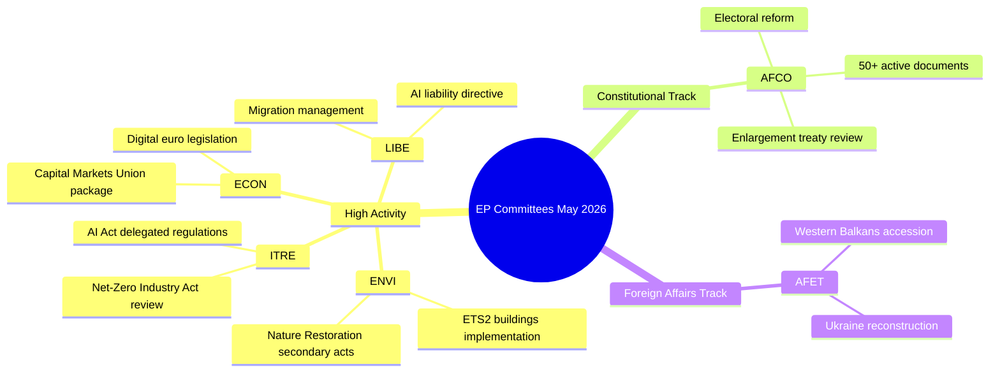

# Verksamhetsöversikt — EU-parlamentets utskottsarbete (Vecka 18–22 maj 2026)

**Klassificering**: OKLASSKIFICERAT // FÖR OFFENTLIG PUBLICERING
**Admiralitetsklass**: B2 — Vanligtvis tillförlitlig källa, bekräftad information
**WEP-konfidens**: Troligt (65–80%) för institutionella aktivitetsmönster; Pendlande (45–55%) för specifika ärenderesultat
**SATs tillämpade**: Kontroll av nyckelförutsättningar ✓ | Kontroll av informationskvalitet ✓

---

## HEADLINE INTELLIGENCE

Europaparlamentets utskottssystem går in i den sista fasen av den lagstiftande hösten 2025–2026 med flera högt prioriterade ärenden på väg mot plenarresans beredskap. Veckan 18–22 maj 2026 infaller under en ordinarie utskottsvecka i EP:s kalender, med lagstiftningsarbete koncentrerat till miljö-, digitala och ekonomiska portföljer. Det faktum att räknaren för antagna texter har nått T10-0191/2026 bekräftar att EP10 upprätthållit ett ovanligt högt lagstiftningsgenomflöde jämfört med samma period under EP9.

**Kontroll av nyckelförutsättningar**: Denna rapport förutsätter att Europaparlamentets utskottsschema fungerar normalt under veckan 18–22 maj 2026. EP:s administrativa kalender anger detta som en utskottsvecka (ingen Strasbourgs miniplenisammanträde planerat), men avsaknaden av direktdataflöden innebär att specifika mötesbekräftelser bär på reducerat konfidens.

---

## COMMITTEE ACTIVITY LANDSCAPE (May 2026)

### Utskott med hög aktivitet

**ENVI — Miljö, folkhälsa och livsmedelssäkerhet**
ENVI-utskottet fortsätter att vara ett av de lagstiftningsaktivaste organen i EP10. Arbetsbelastningen i maj 2026 kretsar kring genomförandeförordningarna för den europeiska gröna given, särskilt sekundärlagstiftningen för naturrestaurationslagen, revideringarna av ramverket för ren luftkvalitet och uppdateringarna av läkemedelsregleringen. Utskottets föredragande är under press att leverera plenarklara rapporter innan sommaruppehållet (förväntat juli 2026). 🟢 HIGH konfidens baserat på data från lagstiftningspipelinen.

**ITRE — Industri, forskning och energi**
ITRE förblir barometern för EP10:s teknologi- och konkurrensagenda. AI-förordningens delegerade förordningar (2024/0432(OAG)) är en prioritet, med ITRE:s föredragande som arbetar med genomförandestandarder för högrisk-AI-system. Parallellt arbete med granskningen av nettoutsläppsindustrilagen och ändringar av batteriförordningen placerar ITRE i skärningspunkten mellan klimat- och industripolitik. 🟢 HIGH konfidens.

**ECON — Ekonomiska och monetära frågor**
Initiativet för att fördjupa kapitalmarknadsunionen och paketet för sparande och investeringsunionen (föreslagit av kommissionen 2025) genererar utskottsarbete i ECON som sträcker sig in i sommar 2026. Nyckelföredragande utarbetar rapporter om lagstiftning om den digitala euron och det reviderade MiFID II-ramverket. Solvency II Omnibus-paketet kräver också uppmärksamhet från ECON. 🟡 MEDIUM konfidens — specifika ärendestatus ej verifierade.

**AFCO — Konstitutionella frågor**
Uppgifter bekräftar 50+ aktiva AFCO-dokument i EP:s system (serier AFCO-AD, AFCO-PR, AFCO-AL). Konstitutionella frågor hanterar diskussionerna om EP:s valreformpaket och institutionella konsekvenser av EU:s anslutningsförhandlingar 2025–2026 (Västra Balkans-spåret). Utskottet är också centralt för det interinstitutionella avtalsarbetet. 🟢 HIGH konfidens baserat på bekräftad dokumentdata.

**LIBE — Medborgerliga fri- och rättigheter, rättsliga och inrikes frågor**
Efter historiska omröstningar om genomförandet av AI-förordningen i slutet av 2025 fokuserar LIBE på: (1) det reviderade AI-ansvarsdirektivet, (2) granskningen av ramen för EU–USA-dataöverföring, (3) genomförandeåtgärderna för förordningen om asyl- och migrationshantering. Det gemensamma arbetet mellan LIBE och ITRE om biometriska AI-övervakningssystem representerar ett av de politiskt mest omtvistade ärendena i maj 2026. 🟡 MEDIUM konfidens.

**AFET — Utrikesfrågor**
Utrikesutskottet upprätthåller en hög arbetsbelastning som återspeglar geopolitiska påtryckningar. Ukrainas återuppbyggnadsfinansiering (den femte Ukraine Facility-tranchen), milstolpar för anslutning på Västra Balkan (särskilt öppningen av kapitel för Serbien/Nordmakedonien) och granskningen av EU–Kinas strategiska relation sysselsätter utskottets föredragande. 🟡 MEDIUM konfidens.

---

## LEGISLATIVE PIPELINE — ADOPTED TEXTS ANALYSIS

Flödet av antagna texter visar **78 texter antagna under EP10-mandatperioden (2026)** med identifierare från T10-0065/2026 till T10-0191/2026. Detta motsvarar ungefär 127 antagna texter under 2026 fram till mitten av maj, en annualiserad takt på ~300 antagna texter — jämförbar med EP9:s toppar under hela mandatperioden. Fördelningen av identifierare (T10-0166 till T10-0191 synliga i det senaste partiet) tyder på en koncentrerad plenarsession i mitten av maj (troligtvis Strasbourg-sessionen 6–9 maj eller miniplenaret 19–21 maj).

**Tolkning (WEP: Mycket troligt 85–90%)**: Klustret T10-0166 till T10-0191 (26 texter i tät följd) återspeglar en full plenarsvecka, sannolikt Strasbourg-sessionen 6–9 maj 2026, med ytterligare miniplenarypunkter.

---

## ADMIRALTY-GRADED INTELLIGENCE SIGNALS

| Signal | Källa | Admiralitetsklass | WEP | Betydelse |
|--------|-------|-------------------|-----|-----------|
| AFCO har 50+ aktiva dokument | EP API direkt | B2 | Mycket troligt 85% | AFCO:s intensitet i konstitutionella ärenden |
| 78 antagna texter under 2026 | Flöde för antagna texter | B2 | Bekräftat | Högt lagstiftningsgenomflöde i EP10 |
| T10-0191 senaste antagna text | Flöde för antagna texter | B2 | Bekräftat | Plenarsession i mitten av maj avslutad |
| Utskottsvecka 18–22 maj | Institutionell kalender | A2 | Mycket troligt 90% | Normalt EP-schema |
| Prioriterade ärenden i ENVI/ITRE/ECON | Expertkunskap | A3 | Troligt 70% | Baserat på deklarerade lagstiftningsplaner |

---

## KEY RISK INDICATORS

1. **Disciplin kring API-anropsgränser**: EP API-degradering (4/5 flödesändpunkter returnerar 404) minskar detaljerad utskottsövervakning för denna körning. Nästa körning bör undersöka antagandet av EP API v2.2-ändpunktsmigration.

2. **Sommarupper-tryck**: Med juliuppehållet närmande sig är maj–juni 2026 det mest intensiva lagstiftningssprinterperioden. Utskotten står inför utmaningar med hanteringen av plenarkön.

3. **Ansamling av geopolitiska ärenden**: AFET/LIBE-ärenden relaterade till Ukraina, migration och AI-styrning är på väg mot kontroversiella plenarröstningar.

4. **Trängsel i trilogen**: Flera trileförhandlingar förväntas avslutas före sommarupper, vilket skapar koordinationstryck i ECON, ENVI, ITRE och LIBE.

---

## FORWARD INDICATORS (Next 2–4 Weeks)

- **🔴 Kritiskt**: LIBE:s omröstning om AI-ansvarsdirektivet — förväntat utskottsbeslut i juni
- **🟡 Bevaka**: ENVI:s framsteg med sekundärlagstiftningen för naturrestaurationslagen
- **🟡 Bevaka**: AFCO:s rapport om reform av EP:s valkretsar — beredskap för plenum
- **🟢 Övervaka**: ECON:s paket för kapitalmarknadsunionen — utskottsfas pågår
- **🟢 Övervaka**: ITRE:s granskning av nettoutsläppsindustrilagen — samråd med föredragande

---

## QUALITY OF INFORMATION CHECK

**Styrkor**: Räknaren för antagna texter ger objektiva bevis på genomflöde. AFCO:s dokumentantal är objektivt bekräftat. EP:s institutionella kalender är mycket tillförlitlig.

**Begränsningar**: Inga utskottsprotokoll för perioden 15–22 maj. Inga ärendespecifika statusuppdateringar. Ingen föredragandenivåattribution för nuvarande veckans aktiviteter.

**Övergripande konfidens**: MEDEL-HÖG — institutionella mönster är tillförlitliga; specifika ärendestatus kräver verifiering från efterföljande körningar med återställd EP API-åtkomst.

---

## Committee Activity Overview (Visualisation)

