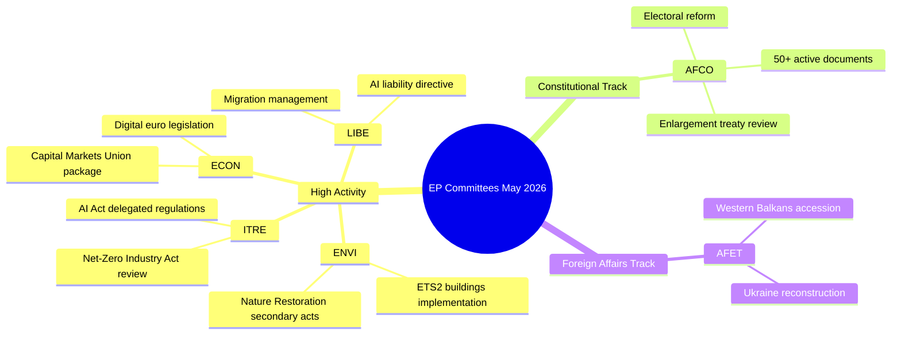

# 执行简报 — 欧洲议会委员会活动（2026年5月18日至22日，第18至22周）

**密级**：非密 // 公开发布
**海军情报等级**：B2 — 通常可靠来源，经确认信息
**WEP置信度**：就机构活动模式而言可能（65–80%）；就特定议题结果而言摇摆不定（45–55%）
**所用SAT方法**：关键假设核查 ✓ | 信息质量核查 ✓

---

## HEADLINE INTELLIGENCE

随着多项高优先级议题接近全体会议准备就绪阶段，欧洲议会委员会系统进入2025–2026年立法秋季的最后冲刺阶段。2026年5月18日至22日这一周在欧洲议会日历中属于常规委员会周，立法活动集中于环境、数字及经济组合。采纳文本计数器达到T10-0191/2026，证实EP10与EP9同期相比保持了异常高的立法产出量。

**关键假设核查**：本简报假设欧洲议会委员会日程在2026年5月18日至22日这一周正常运转。欧洲议会行政日历将此周定为委员会周（斯特拉斯堡无小型全体会议安排），但由于缺乏实时数据，特定会议确认的置信度有所降低。

---

## COMMITTEE ACTIVITY LANDSCAPE (May 2026)

### 高活跃度委员会

**ENVI — 环境、公共卫生与食品安全委员会**
ENVI委员会继续是EP10中立法活动最为频繁的机构之一。2026年5月的工作量集中于欧洲绿色协议实施条例，尤其是《自然恢复法》的二级立法、清洁空气质量框架修订以及药品法规更新。委员会报告员承受压力，需在夏季休会（预计2026年7月）前提交准备就绪可供全体会议审议的报告。🟢 HIGH — 基于立法流程数据的置信度。

**ITRE — 工业、研究与能源委员会**
ITRE仍是EP10技术和竞争力议程的风向标。《人工智能法》委托法规(2024/0432(OAG))是优先事项，ITRE报告员正就高风险人工智能系统的实施标准开展工作。《净零工业法》审查及电池法规修正案的并行工作，将ITRE置于气候政策与工业政策的交汇点。🟢 HIGH置信度。

**ECON — 经济与货币事务委员会**
资本市场联盟深化倡议与储蓄和投资联盟方案（欧盟委员会2025年提出）产生了延续至2026年夏季的ECON委员会工作。主要报告员正就数字欧元立法及经修订的MiFID II框架起草报告。《偿付能力II》综合方案亦需ECON关注。🟡 MEDIUM置信度 — 特定议题状态未经核实。

**AFCO — 宪法事务委员会**
数据确认欧洲议会系统中有50余份活跃的AFCO文件（AFCO-AD、AFCO-PR、AFCO-AL系列）。宪法事务委员会管理欧洲议会选举改革方案的讨论，以及2025–2026年欧盟入盟谈判（西巴尔干路线）的制度含义。委员会亦是机构间协议工作的核心。🟢 HIGH — 基于已确认文件数据的置信度。

**LIBE — 公民自由、司法与内务委员会**
在2025年底人工智能法实施的历史性投票后，LIBE聚焦于：(1)修订后的人工智能责任指令；(2)欧盟-美国数据传输框架审查；(3)庇护与移民管理条例实施措施。LIBE与ITRE就生物特征人工智能监控系统的联合工作是2026年5月政治争议最多的议题之一。🟡 MEDIUM置信度。

**AFET — 外交事务委员会**
外交事务委员会因地缘政治压力而维持高业务量。乌克兰重建融资（乌克兰基金第五批次）、西巴尔干入盟里程碑（尤其是塞尔维亚/北马其顿章节谈判开启），以及欧中战略关系审查，占据委员会报告员的工作重心。🟡 MEDIUM置信度。

---

## LEGISLATIVE PIPELINE — ADOPTED TEXTS ANALYSIS

采纳文本数据流显示**EP10任期(2026年)共采纳78项文本**，标识符范围从T10-0065/2026至T10-0191/2026。这代表2026年至5月中旬约采纳127项文本，年化速率约300项采纳文本——与EP9全任期峰值年份相当。标识符分布（最新批次中T10-0166至T10-0191可见）表明5月中旬有集中的全体会议（很可能是2026年5月6日至9日的斯特拉斯堡会议或5月19日至21日的小型全体会议）。

**解读（WEP：极有可能85–90%）**：T10-0166至T10-0191的集群（26项文本紧密排列）反映了完整的全体会议周，最可能是2026年5月6日至9日的斯特拉斯堡会议，附带额外的小型全体会议项目。

---

## ADMIRALTY-GRADED INTELLIGENCE SIGNALS

| 信号 | 来源 | 海军情报等级 | WEP | 意义 |
|------|------|-------------|-----|------|
| AFCO有50余份活跃文件 | EP API直接 | B2 | 极有可能85% | AFCO宪法议题集中度 |
| 2026年采纳78项文本 | 采纳文本数据流 | B2 | 已确认 | EP10高立法产出量 |
| T10-0191为最新采纳文本 | 采纳文本数据流 | B2 | 已确认 | 5月中旬全体会议已完成 |
| 5月18至22日委员会周 | 机构日历 | A2 | 极有可能90% | 欧洲议会正常日程 |
| ENVI/ITRE/ECON优先议题 | 专业知识 | A3 | 可能70% | 基于已宣布的立法计划 |

---

## KEY RISK INDICATORS

1. **API调用限制规范**：EP API性能下降（5个数据流端点中4个返回404）降低了本次运行中对委员会的详细追踪能力。下次运行应探查EP API v2.2端点迁移的采用情况。

2. **夏季休会压力**：随着7月休会临近，2026年5至6月是立法冲刺的高峰窗口期。各委员会面临全体会议队列管理方面的挑战。

3. **地缘政治议题积累**：涉及乌克兰、移民及人工智能治理的AFET/LIBE议题正走向具有争议性的全体会议投票。

4. **三方谈判拥堵**：预计多项三方谈判将在夏季休会前结束，给ECON、ENVI、ITRE和LIBE带来协调压力。

---

## FORWARD INDICATORS (Next 2–4 Weeks)

- **🔴 关键**：LIBE就人工智能责任指令投票——预计6月委员会投票
- **🟡 关注**：ENVI关于《自然恢复法》二级立法的进展
- **🟡 关注**：AFCO关于欧洲议会选举选区改革的报告——全体会议准备情况
- **🟢 监测**：ECON资本市场联盟方案——委员会阶段进行中
- **🟢 监测**：ITRE《净零工业法》审查——与报告员的磋商

---

## QUALITY OF INFORMATION CHECK

**优势**：采纳文本计数器为产出量提供客观证据。AFCO文件数量经客观确认。欧洲议会机构日历高度可靠。

**局限**：5月15至22日期间无委员会会议记录。无特定议题状态更新。本周活动无报告员层面归因。

**总体置信度**：中高 — 机构运行模式可靠；特定议题状态需待EP API访问恢复后通过后续运行加以核实。

---

## Committee Activity Overview (Visualisation)

