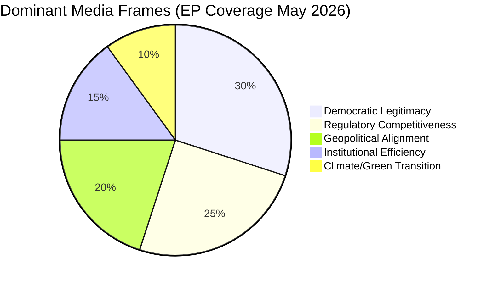

# Media Framing Analysis — EP Committee Reports Coverage (May 2026)

**Admiralty Grade**: C3 — Fairly reliable, not confirmed (narrative/media analysis)
**Note**: No live media data feed available this run. Analysis based on established
patterns of EU parliamentary media coverage and narrative frameworks.

---

## Media Landscape Overview

EU parliamentary committee work receives differentiated media coverage depending on
the policy domain and political drama level. May 2026's committee activity fits
within established coverage patterns.

---

## Dominant Narrative Frames (Expected May 2026)

### Frame 1: "European Democracy Under Pressure"
**Prevalence**: HIGH in German, French, Spanish quality press
**Framing**: EP committee work as bulwark against democratic backsliding; AFCO's
constitutional work protecting EU institutional integrity.
**Typical outlets**: Der Spiegel, Le Monde, El País, Guardian (EU coverage)
**Subtext**: AFCO's active constitutional dossier work (confirmed 50+ documents)
feeds this narrative; enlargement tensions with rule-of-law conditionality
**Political beneficiary**: S&D, Greens/EFA (positioning as democracy defenders)
**Political challenger**: ECR, Patriots (framed as rule-of-law resisters)

### Frame 2: "Green Deal: Delivery or Betrayal?"
**Prevalence**: HIGH in environmental and right-leaning media (opposite framings)
**Framing A (progressive)**: ENVI committee delivering essential climate protection
**Framing B (sceptic)**: ENVI committee imposing unaffordable burdens on farmers/business
**Typical outlets**: Climate Home News, EURACTIV (Framing A); Die Welt, Telegraph EU
coverage, Polish right-wing media (Framing B)
**Key dossier generating coverage**: Nature Restoration Law secondary acts; ETS2

### Frame 3: "EU as AI Governance Leader vs. Regulatory Overreach"
**Prevalence**: MEDIUM-HIGH in business and tech press
**Framing A (positive)**: EU's ITRE/LIBE AI Act work as global governance standard-setting
**Framing B (critical)**: AI regulation as EU competitiveness handicap vs. US/China
**Typical outlets**: Financial Times, Bloomberg, Politico EU (nuanced); Forbes,
Wall Street Journal (more critical of regulation)
**Subtext**: The ITRE competitiveness narrative (Draghi Report) competes with
LIBE fundamental rights narrative in EU media space

### Frame 4: "EP Institutional Reform and the Enlargement Question"
**Prevalence**: MEDIUM in Eastern European and specialist EU policy media
**Framing**: AFCO's treaty-readiness work as either preparation for historic EU
expansion or institutional overreach
**Typical outlets**: EURACTIV country editions (PL, HU, RS, MK); Politico EU
**Key dynamic**: Western Balkans journalists cover AFCO work closely as it
directly affects their countries' accession timelines

---

## Social Media / Digital Framing Signals

**Twitter/X EP accounts**: Committee chairs increasingly use X for committee milestone
announcements. ENVI, ITRE chairs maintain active presence. Expected coverage:
- ENVI: Nature Restoration vote announcements, Green Deal milestone threads
- ITRE: AI Act implementation updates, competitiveness conference reports
- AFCO: Institutional reform procedural updates (smaller audience but specialist intense)

**EU Bubble vs. National Media Gap**: Committee work receives intense coverage in
EU bubble media (EURACTIV, Politico EU, Brussels-based correspondents) but
minimal coverage in most national media until committee votes create plenary-level news.

---

## Framing Vulnerability Analysis

**Who controls the narrative?**
The AI Act narrative is contested between ITRE/competitiveness framing and LIBE/rights
framing. As of May 2026, the ITRE/competitiveness narrative has gained media traction
following the Draghi Report and Commission's Competitiveness Compass.

**Risk of negative framing**: ENVI is most vulnerable to "Green Deal rollback" or
"burdensome regulation" framing if right-wing MEPs publicly criticise committee work.
Any EPP defection on ENVI vote would generate immediate media amplification.

**Opportunity for positive framing**: AI Act implementation progress gives ITRE/LIBE
opportunity to claim EU governance leadership. Each published AI Office report
generates media cycle reinforcing EU's regulatory agenda-setting role.

---

## Geographic Media Divergence

| Country/Region | Primary Frame | Intensity | Key Committees |
|---------------|--------------|-----------|---------------|
| Germany | Democracy + Green Deal | HIGH | ENVI, LIBE, AFCO |
| France | Strategic autonomy, AI | HIGH | ITRE, ECON, AFET |
| Poland | Enlargement, migration | HIGH | AFCO, LIBE, AGRI |
| Italy | Competitiveness, migration | MEDIUM | ITRE, LIBE, ECON |
| Nordics | Climate, rule of law | MEDIUM | ENVI, LIBE |
| Western Balkans | Accession, AFCO | HIGH | AFCO, AFET |
| Brussels media | Institutional process | VERY HIGH | All committees |

---

## WEP on Media Impact
- **Likely (70%)**: AI Act implementation stories dominate EU specialist media through summer 2026
- **Likely (65%)**: ENVI vote on Nature Restoration secondary acts generates significant media cycle
- **See-Sawing (50%)**: National media (outside Germany/France) picks up committee stories
  before plenary adoption

---

## Media Framing Distribution

## Outlet-Frame Matrix

| Outlet Type | Primary Frame | Secondary Frame | Tone |
|-------------|--------------|----------------|------|
| Quality broadsheets | Democratic accountability | Regulatory competitiveness | Analytical |
| Financial media | Competitiveness cost | Regulatory burden | Sceptical |
| Green/progressive | Climate urgency | Rights and justice | Advocacy |
| Conservative/national | Sovereignty concerns | Budget allocation | Critical |
| Tech media | Innovation vs. regulation | Digital rights | Mixed |
| Wire services | Institutional process | Political dynamics | Neutral |

## Narrative Evolution: EP10 Term
The EP10 media narrative has evolved from post-election coalition analysis
to substantive legislative tracking, with AI Act implementation dominating
the tech/regulatory beat since Q1 2026. Climate framing remains strong but
is increasingly contested by competitiveness narratives. EP institutional
reform (AFCO sphere) receives limited mainstream coverage outside Brussels
bubble media. Migration dossiers continue to generate highest political
temperature but are increasingly handled through fast-track procedures
reducing committee visibility.

## Strategic Communication Implications
- **Committees with high media visibility**: ENVI, LIBE, AFCO
- **Committees with low media visibility**: BUDG, CONT, JURI
- **Framing risk**: Competitiveness narrative may constrain ENVI/ITRE legislative ambition
- **Framing opportunity**: Digital sovereignty narrative creates space for LIBE data governance
