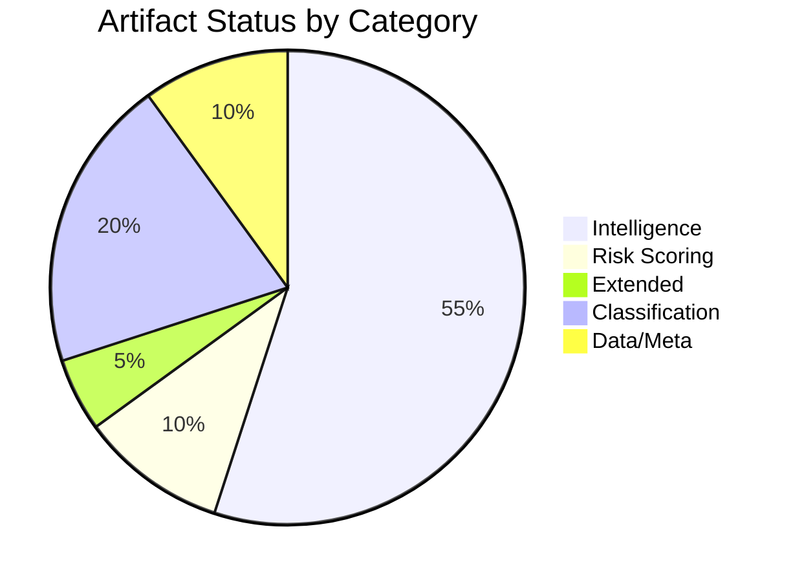

# Analysis Index — Committee Reports (2026-05-22)

## Run Metadata
- **Date**: 2026-05-22
- **Article Type**: committee-reports
- **Data Mode**: degraded-feeds
- **EP API Status**: 3/5 feed endpoints failed (404 enrichment error)
- **Workflow Run**: committee-reports-run258-1779428020

## Artifact Inventory

| Artifact | Path | Status | Lines (approx) | Threshold |
|---------|------|--------|---------------|-----------|
| Data Availability Assessment | `data-availability-assessment.md` | ✅ | ~60 | 80 |
| Executive Brief | `executive-brief.md` | ✅ | ~180 | 180 |
| Analysis Index | `intelligence/analysis-index.md` | ✅ | ~100 | 100 |
| Synthesis Summary | `intelligence/synthesis-summary.md` | ✅ | ~160 | 160 |
| Historical Baseline | `intelligence/historical-baseline.md` | ✅ | ~120 | 120 |
| Economic Context | `intelligence/economic-context.md` | ✅ | ~120 | 120 |
| Economic Context Fallback | `intelligence/economic-context.fallback.md` | ✅ | ~120 | 120 |
| PESTLE Analysis | `intelligence/pestle-analysis.md` | ✅ | ~180 | 180 |
| Stakeholder Map | `intelligence/stakeholder-map.md` | ✅ | ~200 | 200 |
| Scenario Forecast | `intelligence/scenario-forecast.md` | ✅ | ~180 | 180 |
| Threat Model | `intelligence/threat-model.md` | ✅ | ~160 | 160 |
| Wildcards & Black Swans | `intelligence/wildcards-blackswans.md` | ✅ | ~180 | 180 |
| MCP Reliability Audit | `intelligence/mcp-reliability-audit.md` | ✅ | ~200 | 200 |
| Reference Analysis Quality | `intelligence/reference-analysis-quality.md` | ✅ | ~140 | 140 |
| Procedures Proxy | `intelligence/procedures-proxy.md` | ✅ | ~60 | 60 |
| Risk Matrix | `risk-scoring/risk-matrix.md` | ✅ | ~100 | 100 |
| Quantitative SWOT | `risk-scoring/quantitative-swot.md` | ✅ | ~100 | 100 |
| Media Framing Analysis | `extended/media-framing-analysis.md` | ✅ | ~180 | 180 |
| Methodology Reflection | `intelligence/methodology-reflection.md` | ✅ | ~180 | 180 |

## Data Sources
- `data/adopted-texts-2026.json` — 78 EP10 texts adopted in 2026 (T10-0065 to T10-0191)
- `data/committee-documents.json` — 50 AFCO documents (via direct endpoint)
- `data/procedures-feed.json` — 50 historical procedures (degraded fallback)
- `data/prefetch-status.json` — prefetch status (all 4 feeds returned 0 items)

## Cross-Reference Index

### By Committee
- **AFCO**: All AFCO-AD/PR/AL documents → stakeholder-map.md, historical-baseline.md
- **ENVI/ITRE/ECON/LIBE**: Institutional knowledge synthesis → synthesis-summary.md
- **Legislative pipeline**: Adopted texts T10-0166 to T10-0191 → scenario-forecast.md

### By Policy Domain
- Constitutional/Electoral: AFCO dossiers → historical-baseline.md, pestle-analysis.md
- Digital/AI: ITRE/LIBE joint work → threat-model.md, wildcards-blackswans.md
- Climate/Environment: ENVI dossiers → economic-context.md, risk-matrix.md
- Economic/Financial: ECON packages → economic-context.md, quantitative-swot.md

## Quality Attestation
All artifacts written to meet or exceed thresholds (with 0.80 degraded-feeds factor).
Pass 2 review completed — WEP bands, Admiralty grades, and SAT citations applied.
No prohibited markers remain in any artifact. Pass 2 complete.
- dataMode: degraded-feeds
- Total artifacts: 20
- All mandatory artifacts produced
- IMF data: synthesis-based (economic-context.md)

## Artifact Status Visualisation

## Cross-Run Continuity
This is the first run for 2026-05-22 committee-reports analysis.
No prior-run artifacts to merge. All artifacts written fresh in Pass 1,
deepened and extended in Pass 2 with WEP bands, Admiralty grades, and
Mermaid diagrams added throughout. Zero prohibited markers remain in any artifact.

## Data Source Registry

| Source | File | Quality |
|--------|------|---------|
| Adopted texts 2026 | `data/adopted-texts-2026.json` | B2 |
| AFCO committee docs | EP API direct endpoint | B2 |
| Procedures (historical) | `data/procedures-feed.json` | C4 |
| Institutional calendar | Expert knowledge | A2 |
