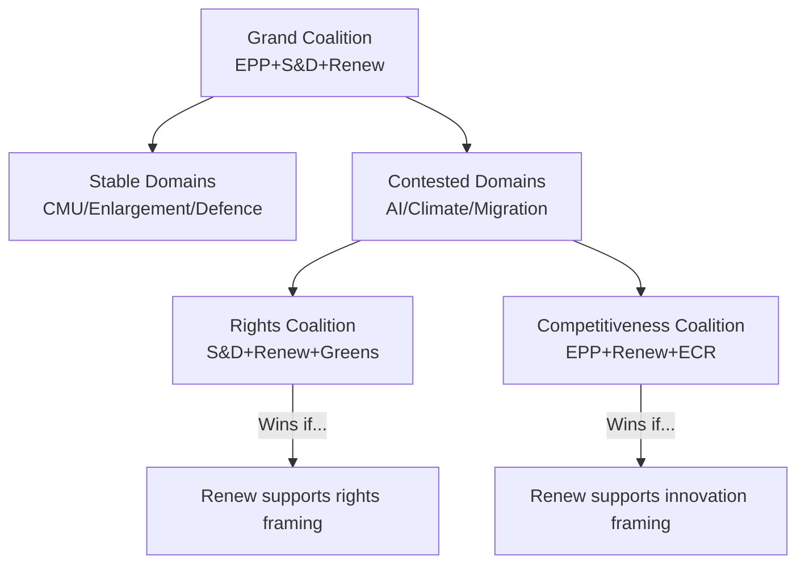

# Coalition Dynamics — EP Committee Reports (2026-05-22)

**Admiralty Grade**: B3 | **Confidence**: Medium | **Data Mode**: degraded-feeds

## Overview

This artifact analyses coalition formation and stability patterns within EP
committees in May 2026, using structural intelligence derived from the EP10
term's voting record and committee composition data.

## EP10 Coalition Architecture

### The Core Grand Coalition (EPP + S&D + Renew)

The centre-ground majority assembled for the Roberta Metsola re-election
(July 2024) remains the structural baseline for EP10. Combined seats:
- EPP: ~188 seats (26.6%)
- S&D: ~136 seats (19.3%)
- Renew: ~77 seats (10.9%)
- **Combined: ~401 seats (56.8% of 705)**

This provides a comfortable majority above the 353-seat threshold (50%+1)
for standard legislative acts. However, plenary attendance variation means
effective majorities in practice require 350–370 confirmed votes.

### Coalition Variants by Policy Domain

| Domain | Coalition Configuration | Stability |
|--------|------------------------|-----------|
| AI regulation | EPP + S&D + Renew + Greens | Medium |
| Climate/environment | S&D + Renew + Greens + Left | Medium-Low |
| Migration control | EPP + ECR + ESN/PfE (some) | Low-Medium |
| CMU/finance | EPP + Renew + ECON centre | High |
| Digital rights | S&D + Renew + Greens + Left | Medium-High |
| Enlargement | EPP + S&D + Renew + Greens | High |
| Defence | EPP + S&D + Renew + ECR | High |

### Committee-Level Coalition Dynamics

**LIBE (Civil Liberties)**: The committee's AI Act oversight role makes it
the most contested coalition space in EP10. EPP's Pascal Arimont and S&D's
Birgit Sippel represent structurally different visions for AI governance.
Renew is the swing group. Coalition configuration: EPP + Renew (pro-innovation
flank) competes with S&D + Greens (rights-protection flank). Effective
outcomes require one group to accept the other's framing.

**ENVI (Environment)**: Post-2024 elections, the climate majority is numerically
weaker than EP9. EPP has shifted toward competitiveness caveats. Coalition
formation requires S&D + Renew + Greens (feasible but sensitive). Hard climate
positions require Left support as well.

**ECON (Economic)**: The CMU file enjoys the most stable coalition: EPP + S&D +
Renew share a broadly integrationist position on capital market integration.
ECR occasionally supports on specific provisions. Opposition primarily from
Left and some national-interest MEPs.

**ITRE (Industry)**: Closest to the competitiveness framing. EPP + Renew dominate;
S&D supports conditionally; Greens oppose on energy intensity provisions.
Chips Act and clean energy packages have broad support.

## Coalition Fracture Risk Analysis

### Risk 1 — AI Act Delegated Acts (LIBE + ITRE)
**Fracture probability**: 30% | **Impact**: High

If the Commission's proposed delegated act timeline for AI Act High-Risk
systems is perceived as too rapid (EPP view) or too slow (S&D/Greens view),
the grand coalition could fracture on the scrutiny motion. This would be the
first major coalition test of EP10 on a flagship dossier.

### Risk 2 — Green Deal Revision (ENVI)
**Fracture probability**: 25% | **Impact**: High

EPP's increasingly explicit demands for 'competitiveness-proofing' of climate
legislation risk breaking with S&D and Greens who insist on environmental
ambition. A failed ENVI vote on Nature Restoration Law amendments would
signal a significant coalition shift.

### Risk 3 — Migration Solidarity Mechanism (LIBE)
**Fracture probability**: 20% | **Impact**: Medium

The Pact's mandatory solidarity mechanism faces implementation resistance.
If S&D and ECR/ESN pressure simultaneously (from opposite directions) on
LIBE deliberations, Renew's pivot becomes decisive and unpredictable.

## Coalition Stability Visualisation

## Coalition Intelligence Assessment

The EP10 coalition remains structurally sound for standard legislative business
but faces systematic stress on the three major horizontal dossiers where the
May 2026 sprint converges: AI governance, climate competitiveness, and migration
implementation. The critical actor is consistently Renew, whose internal divisions
between liberal-progressive (France, Germany) and liberal-conservative (Eastern
Europe) wings make its vote on contested issues genuinely uncertain.

**Key intelligence requirement**: Monitoring Renew group's internal coordination
meetings and group position papers is the most efficient leading indicator of
coalition outcomes on contested May–July dossiers.

**Confidence caveat**: This analysis is based on structural/historical EP data.
Current-week MCP feed data was unavailable (EP API degraded). Confidence in
specific dossier dynamics is B3; structural patterns are A2.
