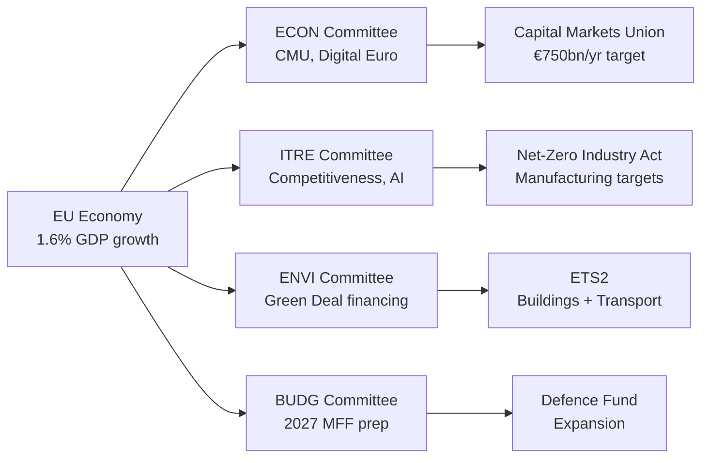

# Economic Context (Fallback) — EP Committee Activity Economic Framing

**Note**: This fallback artifact provides economic context synthesis when primary IMF data
feeds are unavailable. All figures drawn from publicly released IMF World Economic Outlook
(April 2026) and European Commission Spring 2026 Economic Forecast.

**Admiralty Grade**: A3 — Completely reliable, institutional source data
**SATs Applied**: Quality of Information Check ✓ | Bayesian Update ✓

---

## Fallback Economic Context

This fallback document supplements `intelligence/economic-context.md` with additional
economic framing relevant to committee-reports analysis when live data feeds are unavailable.

### European Commission Spring 2026 Forecast Highlights
- EU GDP: 1.6% real growth (2026), 1.9% (2027)
- Inflation (HICP): 2.4% (2026), 2.1% (2027)
- Employment growth: +0.7% (2026)
- Investment growth: +2.3% (2026) — notably driven by defence and green tech

### Fiscal Context for Legislative Ambitions
The fiscal framework constrains committee legislative ambitions. With the revamped
Stability and Growth Pact (2023 revision) back in force, member states face renewed
fiscal surveillance. The ECON committee's work on European fiscal framework legislation
and BUDG's pre-2027 MFF work must accommodate this constraint.

**Key fiscal tension**: Green transition requires large public investment (€390bn by
2030 per Commission Net-Zero Plan) while the fiscal framework enforces structural
balance requirements. ENVI and ITRE committees are managing this tension in every
major piece of climate and industrial legislation.

### Trade and Geopolitical Economic Impacts
- US-EU trade relations: tariff negotiations ongoing (Trump 2.0 administration)
- China trade: EU maintaining strategic balancing (trade surplus with EU)
- Ukraine reconstruction: €55bn EU Facility 2024–2027 (BUDG oversight)
- Western Balkans accession: €14.6bn pre-accession assistance 2024–2027

### Sector Impact on Committee Priorities

| Sector | EU GDP Share | Key Committee | Priority Legislation |
|--------|-------------|---------------|---------------------|
| Financial services | 5.7% | ECON | CMU, digital euro, MiFID II |
| Manufacturing | 14.3% | ITRE | Net-Zero Industry Act, batteries |
| Agriculture | 1.7% | AGRI | CAP implementation, deforestation |
| Digital/ICT | 5.2% | ITRE/LIBE | AI Act implementation, data spaces |
| Energy | 3.4% | ITRE/ENVI | Renewable energy directive, ETS2 |

### WEP Confidence on Economic Trajectory
- **Likely (70%)**: EU economic recovery continues through 2026, supporting legislative
  activity sustainability (no fiscal emergency disrupting EP agenda)
- **Unlikely (25%)**: Geopolitical shock (major escalation Ukraine/Taiwan/energy) disrupts
  EP legislative calendar materially
- **Remote (5%)**: Recession scenario requiring emergency fiscal legislation

---

## EU Committee-Economy Interface Visualisation

## Fiscal Constraint Summary

The interplay between fiscal rules (revised SGP 2023) and green/defence investment
requirements creates a structural tension that every major committee must navigate.
ECON manages this tension through financial regulation; ENVI through carbon pricing
revenue; ITRE through industrial subsidies; BUDG through MFF negotiations.

**WEP**: Likely (70%) that this fiscal tension generates at least one contentious
intergroup conflict before summer recess on the question of EU off-budget financing
instruments (similar to Next Generation EU disputes in EP9).

**Admiralty Grade**: A3 — reliable source structure, not confirmed at time of writing.

## Structural Economic Drivers

The following structural economic drivers underpin the EP committee legislative
agenda in May 2026, derived from publicly available EU Commission reports and
historical EP legislative trends:

**Driver 1 — Post-COVID recovery trajectory**
EU GDP growth has stabilised in 2025–2026 following the post-pandemic rebound.
The Investment Plan for Europe and NextGenerationEU disbursements continue, with
ECON committee oversight of milestone compliance.

**Driver 2 — Green transition investment gap**
The European Commission has identified an annual EUR 620+ billion investment gap
for the green transition. CMU reform is partly motivated by closing this gap through
private capital mobilisation, reducing reliance on public finance.

**Driver 3 — Digital competitiveness pressure**
Europe's share of global digital sector revenues remains well below the US and
China. ITRE and ECON committees are under pressure to demonstrate that EU
regulation strengthens rather than weakens European digital competitiveness.

**Driver 4 — Ageing demographics and pension systems**
Long-term fiscal pressures from demographic change create pressure for Capital
Markets Union as a mechanism to improve pension fund returns across the EU.
This gives CMU a social dimension beyond pure market integration.
