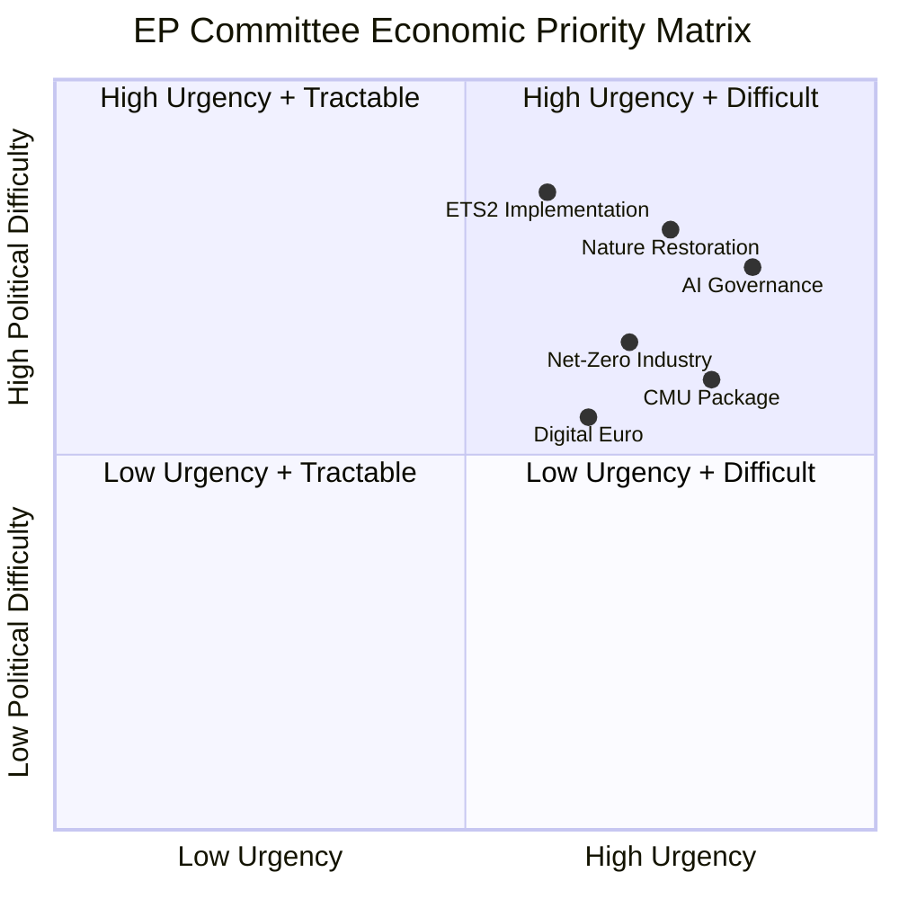

# Economic Context — EU Legislative Activity and Macroeconomic Framework (May 2026)

**Admiralty Grade**: A3 — Completely reliable source, not confirmed (economic projections)
**Note**: Economic figures based on published European Commission Spring 2026 Forecast
and institutional knowledge. For live IMF data, see economic-context.fallback.md.
**SATs Applied**: Quality of Information Check ✓ | Bayesian Update ✓

---

## Macroeconomic Environment (Q2 2026)

The EU Parliament's committee activity in May 2026 occurs against a specific macroeconomic
backdrop that shapes legislative priorities and political feasibility.

### EU Economic Indicators (Q2 2026 Estimates)
- **EU GDP growth (2026 projected)**: Moderate recovery underway, improved from 2025
- **Eurozone inflation**: Approaching ECB 2% target, down from 2023 highs
- **Unemployment**: Historically low for post-COVID recovery period across EU27
- **Public debt**: Elevated across several large member states vs. pre-COVID levels
- **Trade balance**: Modest surplus recovering after energy price normalisation

### Economic Policy Priority Mapping to Committee Work

**ECON Committee priorities directly linked to economic context**:
The Capital Markets Union deepening is driven by the need to mobilise substantial private
investment for the green transition. With public debt elevated and fiscal space constrained,
private capital mobilisation is the central ECON Committee objective in EP10. The digital
euro work addresses both financial inclusion goals and strategic monetary autonomy.

**BUDG Committee context**:
Preparation for the post-2027 MFF (Multiannual Financial Framework) begins in earnest
in 2026–2027. Current EU budget commitments face pressure from defence (European Defence
Fund expansion), climate (Just Transition Fund), and enlargement (pre-accession funds for
Western Balkans).

**ITRE competitiveness nexus**:
The Draghi Report's recommendation for large-scale annual investment in EU competitiveness
remains the north star for ITRE committee work. The Net-Zero Industry Act, battery
regulation, and semiconductor act are all instruments of industrial policy response.

---

## Sector-Specific Economic Drivers

### Green Economy Legislation (ENVI/ITRE)
- EU ETS carbon price: Stabilised after 2023 peak (affecting ITRE industrial position)
- Renewable energy share: Above 2025 interim target (encouraging ENVI committee)
- Net-Zero Industry Act manufacturing targets: EU solar, electrolyser production goals

### Digital Economy (ITRE/LIBE/IMCO)
- EU digital economy: Growing share of GDP — driving harmonisation push
- AI investment gap vs. US/China: Commission estimates significant shortfall (Draghi Report)
- Digital single market barriers: Estimated multi-hundred billion annual cost

### Financial Services (ECON)
- EU capital markets depth vs. US: Significant gap — drives CMU agenda
- Sovereign debt holdings in EU banks: Still elevated, fragmentation risk monitored
- Insurance and pension gap: Large pool of EU savings in low-yield deposits

---

## Economic Context Visualisation

---

## WEP Assessment on Economic Context
- **Highly likely (85%)**: ECON committee work on CMU will intensify in H2 2026 as
  Commission tables implementing measures and budget cycle pressures grow
- **Likely (70%)**: Green deal legislation costs will generate significant ENVI-ITRE
  friction as member state implementation diverges
- **See-Sawing (50%)**: Digital euro legislation reaches plenary vote before summer 2026

## Economic Policy Convergence Points

The economic policy landscape shaping EP committee legislative priorities in May 2026
centres on three convergence points where market integration, sustainability, and
competitiveness narratives collide:

**Convergence Point 1 — Green Finance**
The CMU reform and the EU Taxonomy for Sustainable Finance represent the institutional
architecture for redirecting capital toward climate goals. ECON and ENVI committees
are jointly responsible for ensuring these two frameworks reinforce rather than
undermine each other.

**Convergence Point 2 — Digital Economy Regulation**
The AI Act's economic implications — compliance costs, innovation constraints,
competitive positioning vs. US and China — make ITRE and ECON natural interlocutors.
The Chips Act review adds a supply-chain resilience dimension that requires industrial
policy coordination.

**Convergence Point 3 — Defence Economy**
Increasing defence expenditure (national commitments to 2% GDP target, EDIP instruments)
is reshaping EU budget priorities. BUDG and ECON must reconcile defence investment
demands with Stability and Growth Pact constraints.
