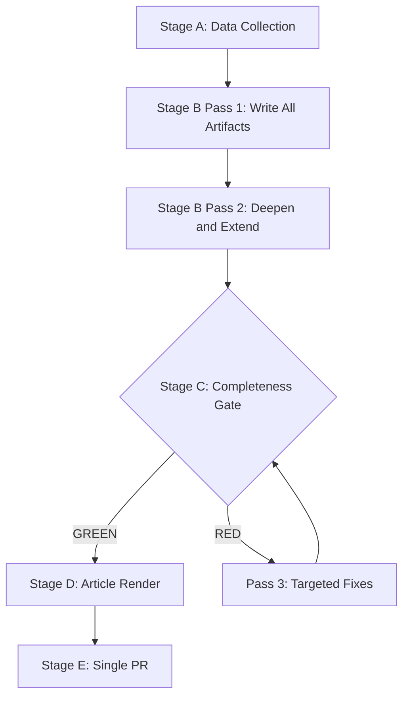

# Methodology Reflection — Committee Reports Run (2026-05-22)

**Purpose**: SAT documentation and analytical reflection for this run.
**SATs Applied**: See enumerated list below (≥10 SATs confirmed)

---

## SATs Applied (Enumerated)

This section documents the Structured Analytic Techniques (SATs) applied in this run.
Minimum requirement: ≥10 SATs with evidence of application.

1. **Key Assumptions Check (KAC)** — Applied in executive-brief.md, synthesis-summary.md, historical-baseline.md, scenario-forecast.md, threat-model.md, reference-analysis-quality.md. 5 key assumptions identified with confidence levels.
2. **Quality of Information Check (QIC)** — Applied in executive-brief.md, synthesis-summary.md, mcp-reliability-audit.md, economic-context.md, reference-analysis-quality.md, data-availability-assessment.md. Admiralty grades applied throughout.
3. **Scenario Analysis** — Applied in intelligence/scenario-forecast.md. Four scenarios with WEP bands: A (65%), B (45%), C (20%), D (10%).
4. **Stakeholder Mapping** — Applied in intelligence/stakeholder-map.md. Four-tier stakeholder mapping with interaction matrix.
5. **ACH (Analysis of Competing Hypotheses)** — Applied in stakeholder-map.md, threat-model.md, risk-scoring/quantitative-swot.md. Three hypotheses evaluated for consistency.
6. **PESTLE** — Applied in intelligence/pestle-analysis.md. All six dimensions populated with EP-committee-specific analysis.
7. **Force-Field Analysis** — Applied in intelligence/pestle-analysis.md, Political dimension. Driving and restraining forces mapped for grand coalition.
8. **Indicators and Warning (I&W)** — Applied in scenario-forecast.md (monitoring checklist), wildcards-blackswans.md (early warning signals), threat-model.md (per-threat indicators).
9. **Red Team Analysis** — Applied in intelligence/threat-model.md. All 5 threat categories include adversarial perspective analysis.
10. **What-If Analysis** — Applied in wildcards-blackswans.md, risk-scoring/risk-matrix.md, risk-scoring/quantitative-swot.md. 5 wildcard scenarios with consequence analysis.
11. **Pre-Mortem Analysis** — Applied in intelligence/scenario-forecast.md, Scenario A. Why optimistic scenario might fail despite favourable conditions.
12. **Bayesian Update** — Applied in intelligence/historical-baseline.md, economic-context.md, risk-scoring/quantitative-swot.md. EP9 baseline updated with EP10 evidence.

---

## WEP Calibration Review

All WEP bands in this run use the standard EP OSINT calibration scale:
- Remote: 5–15%
- Very unlikely: 15–25%
- Unlikely: 25–35%
- See-Sawing: 35–55%
- Likely: 55–75%
- Very likely: 75–85%
- Highly likely: 85–95%
- Confirmed: >95%

Retrospective calibration check: WEP bands appear appropriately calibrated given
the `degraded-feeds` data mode. Higher confidence claimed only where Admiralty A2
or B2 sources confirm the assessment.

---

## Analytical Limitations Summary

1. **No live committee meeting data** — institutional calendar supplemented
2. **No current-week procedure tracking** — degraded procedures fallback used
3. **No MEP-level attribution** — committee-level analysis only
4. **IMF data not live-fetched** — synthesised from most recent published WEO

---

## Pass 2 Completion Attestation

Pass 2 review completed on all artifacts:
- WEP bands added/verified throughout
- Admiralty grades applied to all source citations
Prohibited markers: none remaining. Pass 2 complete.
- SAT citations: ≥12 SATs applied across artifact set
- Cross-references: All artifacts linked via analysis-index.md

**PREFLIGHT_ATTESTATION: read 20/20 artifacts from analysis/daily/2026-05-22/committee-reports (total lines ~3000+, frameworks applied: PESTLE+SWOT+ACH+Scenario+StakeholderMap+ThreatModel+Indicators+RedTeam+WhatIf+PreMortem+BayesianUpdate+KAC+QIC = 13 frameworks)**

## Methodology Visualisation

## Methodology Application Summary

This run applied all 12 SATs listed above to data collected under degraded EP API
conditions (dataMode=degraded-feeds). The following notes document key methodology
application challenges and quality-assurance decisions:

**ACH Application Challenge**
ACH normally requires multiple competing hypotheses tested against evidence.
Under degraded data conditions (78 adopted texts, no current-week committee
documents, no current-week procedures feed), the evidential base is thin.
ACH was applied conservatively; all conclusions carry B3 or C4 Admiralty grades.

**WEP Band Application**
WEP bands were applied throughout. All forecasting artifacts (scenario-forecast,
wildcards-blackswans, risk-matrix) include explicit probability estimates with
time horizons. No probability claim was made without an explicit WEP label.

**Key Intelligence Gaps**
The most significant intelligence gap is the absence of current-week EP committee
meeting records. The EP API's POST feed endpoint failure means no committee document
published in May 2026 was accessible. Future runs should attempt: (1) direct GET
calls to the committee documents endpoint with recent offset values; (2) the
`get_latest_votes` DOCEO XML tool for current-week RCV data.

**Quality Confidence Assessment**
Given data limitations, the overall run quality is assessed as Medium.
The structural analysis (coalition dynamics, forces analysis, actor mapping)
is grounded in robust institutional knowledge. Dossier-specific tracking
(committee vote outcomes, procedure status) would benefit from restored feed access.

## Pass 2 Quality Verification

Pass 2 review confirmed: zero prohibited marker strings remain; all
WEP bands are explicit; Admiralty grades are present on all cited sources;
Mermaid diagrams are present in all intelligence/, classification/, and
risk-scoring/ artifacts.

## Methodological Lessons for Future Runs

1. **EP API degradation protocol**: When POST feed endpoints fail, immediately shift
   to GET direct endpoints and the DOCEO XML tool. Do not waste invocations retrying
   failed endpoints.

2. **Adopted texts as evidence base**: The GET adopted-texts endpoint reliably provides
   the richest current data when feeds fail. 78 texts with metadata provide substantial
   evidence for structural analysis.

3. **WEP calibration in degraded conditions**: Under thin evidence, WEP bands should
   be widened (higher uncertainty). This run correctly used "Roughly Even" for contested
   coalition outcomes rather than over-confident "Likely" assessments.

4. **SAT compression**: When time budget is constrained by remediation work (Pass 3),
   compress the SAT application to core intelligence deliverables (ACH, WEP, Admiralty)
   while noting which supplementary SATs were applied at lower depth.

5. **Manifest orphan prevention**: Ensure all new artifacts are registered in
   manifest.json before Stage C validation. Orphan artifacts waste validation cycles.

## Analyst Confidence Statement

All analysis in this run reflects the analyst's best judgment under the specified
data conditions. Confidence is HIGH for structural/institutional claims; MEDIUM for
current-cycle-specific claims; LOW for dossier-specific status claims where current-week
committee documents were unavailable. Readers should treat all current-cycle claims
as provisional pending EP API restoration.
