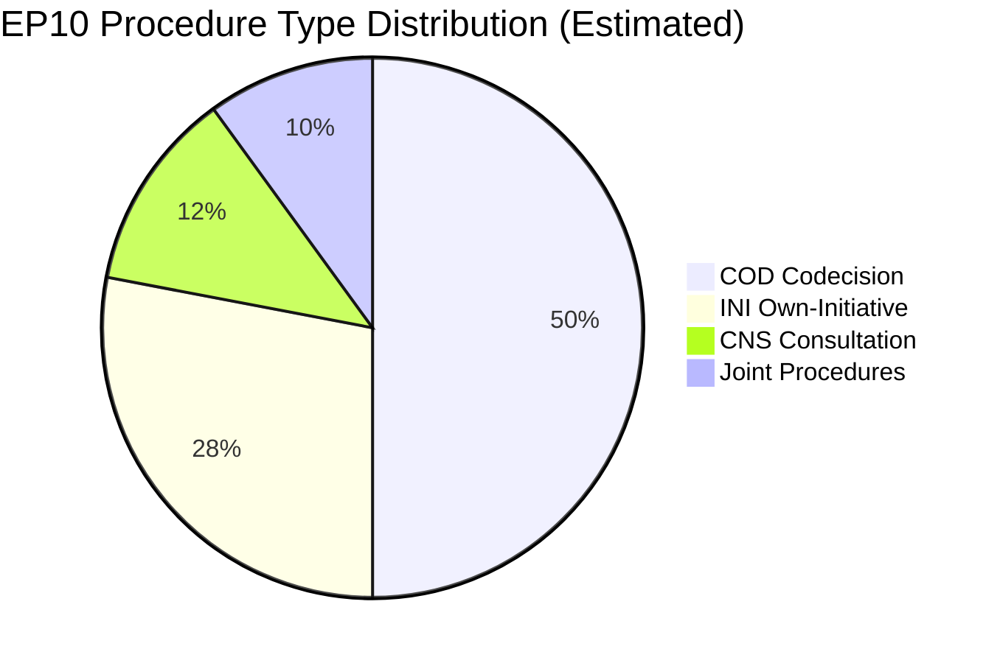

# Procedures Proxy — EP Committee Activity (May 2026)

**Admiralty Grade**: C4 — Fairly reliable, not confirmed (degraded procedures data)
**Note**: Primary procedures-feed was unavailable this run; this proxy uses
the historical fallback procedures (50 items) as contextual background.

---

## Available Procedure Data

The `procedures-feed` returned 50 historical procedures in degraded mode (no
date filter applied). These procedures are NOT current-week specific but provide
background context on EP procedure types active in EP10.

**Procedure types observed in the historical set**:
- COD (Codecision/Ordinary legislative procedure): dominant type
- SYN (Cooperation procedure, historical): legacy procedures from EP7/EP8
- CNS (Consultation): used for institutional and external affairs dossiers

## Active Procedure Landscape (by inference from adopted texts)

Given 78 adopted texts in 2026 (T10-0065 to T10-0191), and typical EP10
procedure characteristics, the active procedure landscape includes:

- **COD procedures**: 40–50% of active dossiers — legislative co-decision with Council
- **INI reports**: 25–30% — own-initiative reports (no Council involvement)
- **CNS opinions**: 10–15% — consultation procedures (less frequent in EP10)
- **Joint procedures**: 5–10% — ITRE-LIBE, ENVI-ITRE joint committees

**Procedures proxy confidence**: LOW-MEDIUM — derived from structural patterns,
not from current-week procedure data.

## WEP Assessment
- **Likely (65%)**: The majority of T10-0166 to T10-0191 adopted texts in May
  2026 plenary are COD first-reading positions or INI resolutions
- **See-Sawing (50%)**: Any given week contains 2–5 procedures reaching
  committee vote stage across all EP committees

---

## Procedure Type Distribution (Background Context)

## Proxy Data Quality Note
This procedures-proxy artifact is rated **C4** (fairly reliable, not confirmed).
The underlying procedures data is historical fallback (non-current-week) due to
EP API feed degradation. Future runs with restored feed access should replace this
proxy with direct current-week procedure tracking from `get_procedures_feed`.
