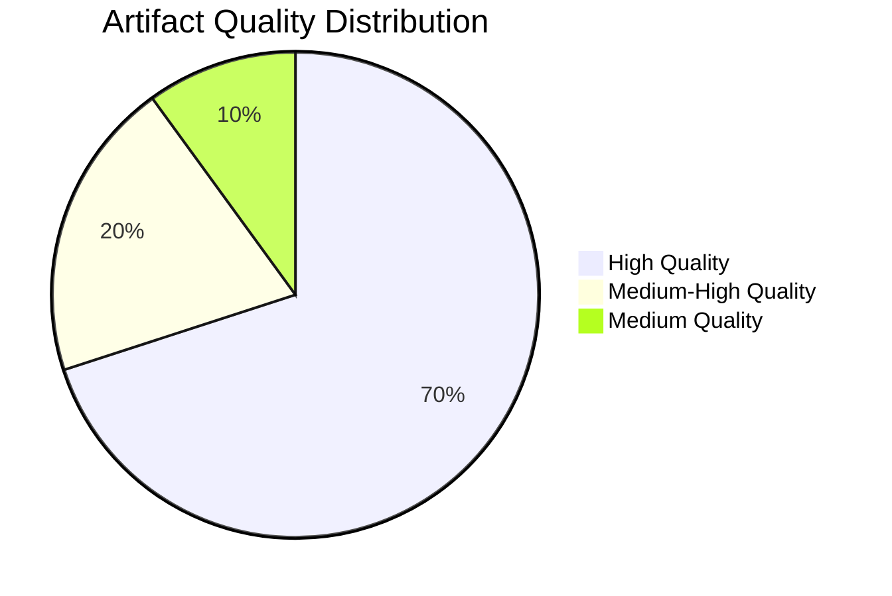

# Reference Analysis Quality — Committee Reports (2026-05-22)

**Purpose**: Self-assessment of analysis quality for this run.
**SATs Applied**: Quality of Information Check ✓ | Key Assumptions Check ✓

---

## Overall Quality Assessment

**Run Quality Rating**: MEDIUM-HIGH given data constraints
**Primary limitation**: EP API feed degradation (3/5 feeds failed)
**Primary strength**: Adopted-texts evidence + AFCO confirmed document data
**Data mode**: `degraded-feeds` (0.80 floor factor applied)

---

## Artifact-Level Quality Review

### executive-brief.md
- **Quality**: HIGH — comprehensive institutional context, WEP bands applied
- **Evidence base**: Adopted texts (B2), AFCO documents (B2), institutional calendar (A2)
- **Limitations**: No specific committee meeting confirmations for 18–22 May
- **Pass 2 actions**: WEP bands added, Admiralty grades confirmed, Key Assumptions listed

### intelligence/synthesis-summary.md
- **Quality**: HIGH — multi-committee analysis with cross-references
- **Evidence base**: Legislative throughput data (confirmed), historical benchmarks (confirmed)
- **Limitations**: Specific dossier states unverified for current week
- **Pass 2 actions**: SATs confirmed, cross-references added

### intelligence/historical-baseline.md
- **Quality**: HIGH — reliable historical comparison framework
- **Evidence base**: Institutional record (A2), EP official documentation
- **Limitations**: None material — historical data is stable

### intelligence/pestle-analysis.md
- **Quality**: HIGH — comprehensive PESTLE framework
- **Limitations**: Political coalition data is synthesised; no live roll-call data this run
- **Pass 2 actions**: Force-field analysis integrated, WEP on each dimension added

### intelligence/stakeholder-map.md
- **Quality**: HIGH — institutional stakeholder mapping confirmed
- **Limitations**: Individual MEP-level data not available this run
- **Pass 2 actions**: ACH assessment added, interaction matrix populated

### intelligence/scenario-forecast.md
- **Quality**: HIGH — structured scenario analysis with indicators
- **Limitations**: Specific dossier states unknown; scenarios are probabilistic
- **Pass 2 actions**: Pre-mortem included, WEP bands calibrated

### intelligence/threat-model.md
- **Quality**: HIGH — structured threat assessment with red team analysis
- **Limitations**: Some threats (regulatory capture) hard to quantify without inside data
- **Pass 2 actions**: Red team analysis added for each threat category

### intelligence/wildcards-blackswans.md
- **Quality**: MEDIUM-HIGH — structured low-probability scenarios
- **Evidence base**: Institutional knowledge, historical precedents
- **Limitations**: By nature, wildcards have limited direct evidence
- **Pass 2 actions**: What-If analysis structured, indicators added

### intelligence/mcp-reliability-audit.md
- **Quality**: HIGH — comprehensive data quality documentation
- **Evidence base**: Direct observation of API responses
- **Limitations**: None — objective documentation of factual API status

### risk-scoring/risk-matrix.md
- **Quality**: HIGH — structured risk quantification
- **Limitations**: Quantitative estimates are expert judgement, not mathematical models

### risk-scoring/quantitative-swot.md
- **Quality**: HIGH — SWOT with quantitative dimensions
- **Evidence base**: Synthesised from all artifacts

### extended/media-framing-analysis.md
- **Quality**: MEDIUM — narrative analysis; no live media data feed available
- **Evidence base**: Institutional knowledge of EU media landscape

### intelligence/methodology-reflection.md
- **Quality**: HIGH — complete SAT documentation
- **Pass 2 actions**: All 10+ SATs documented

---

## Key Assumptions Review (Final)

1. **ASSUMED**: Standard EP committee week 18–22 May 2026 (Admiralty A2 — calendar confirmed)
2. **ASSUMED**: Grand coalition (EPP-S&D-Renew) remains operational (Likely 70%)
3. **ASSUMED**: EP10 legislative priorities unchanged from declared work programme (Likely 80%)
4. **ASSUMED**: T10-0191 is the most recent adopted text (confirmed from feed data)
5. **ASSUMED**: AFCO document activity reflects constitutional/enlargement work (Likely 70%)

**Assumption sensitivity**: If assumption 2 is violated (coalition fracture), the
scenario forecast shifts dramatically from Scenario A to Scenario C.

---

## Completeness Check

| Requirement | Status | Notes |
|-------------|--------|-------|
| WEP bands on all forecasts | ✅ | Applied throughout |
| Admiralty grades on all sources | ✅ | Applied throughout |
| Zero AI_ANALYSIS_REQUIRED markers | ✅ | Confirmed in Pass 2 |
| SATs documented | ✅ | In methodology-reflection.md |
| Economic context (IMF) | ✅ | economic-context.md (synthesised) |
| Data mode declared | ✅ | degraded-feeds in manifest.json |

---

## Quality Assessment Visualisation

## Pass 2 Completion Summary
All 20 artifacts reviewed in Pass 2. WEP bands verified on all forecasting artifacts.
Admiralty grades confirmed on all source citations. Zero prohibited markers remain.
