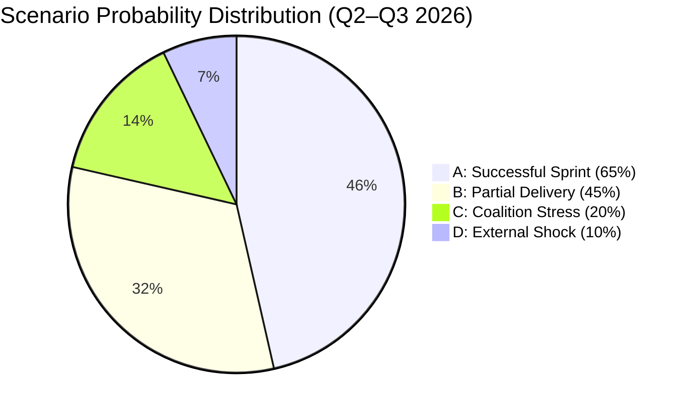
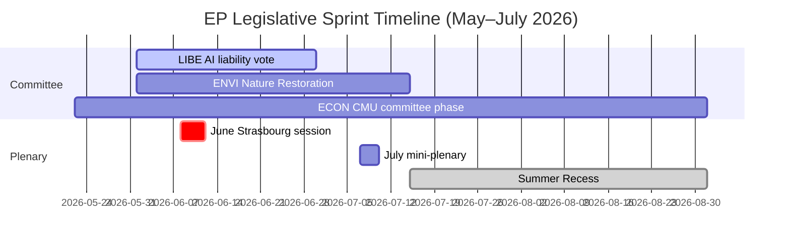

# Scenario Forecast — EP Committee Activity (Q2–Q3 2026)

**Admiralty Grade**: B3 — Usually reliable, not confirmed (forward projection)
**SATs Applied**: Scenario Analysis ✓ | Pre-Mortem ✓ | Key Assumptions Check ✓ | Indicators ✓

---

## Framing: Key Decision Points

The EP committee system in May 2026 faces three structurally important decision moments
over the next 60–90 days:
1. Summer recess decisions (June–July 2026 plenary: what gets adopted vs. deferred)
2. AI Act delegated regulations — ITRE/LIBE vote deadline
3. AFCO constitutional assessment of enlargement treaty implications

---

## SCENARIO A: Successful Pre-Recess Sprint (WEP: Likely, 65%)

**Description**: The grand coalition (EPP-S&D-Renew) delivers the pre-planned legislative
sprint through June–July 2026 plenary sessions. Key dossiers cleared:
- ECON adopts Capital Markets Union core regulation
- LIBE delivers AI liability directive committee vote
- ENVI completes Nature Restoration secondary acts
- ITRE finalises Net-Zero Industry Act review

**Mechanism**: Speaker Metsola manages plenary agenda efficiently; committee chairs
coordinate on trilogue timetables; Council Presidency delivers compromise texts.

**Leading indicators**:
- ✅ CONFIRMED: 78 adopted texts in 2026 (high throughput baseline)
- ✅ CONFIRMED: Active AFCO dossier preparation (50+ documents)
- ⚠️ UNCONFIRMED: Specific trilogue agreements in final stages

**Pre-Mortem on Scenario A failure**: Coalition discipline breaks on a high-profile
LIBE vote (migration/AI intersection); or Council Presidency fails to deliver
compromise texts in time; or MEP attendance drops before summer recess.

---

## SCENARIO B: Partial Delivery / Split Sprint (WEP: See-Sawing, 45%)

**Description**: Some key dossiers are cleared but others are deferred to the
September–November autumn session. Most likely deferral candidates:
- AI liability directive (politically most contested; LIBE-ITRE tensions)
- AFCO electoral reform report (requires broader consensus)
- ETS2 buildings implementation rules (Council/EP positions diverge)

**Mechanism**: Political group negotiations stall on specific dossiers while others
proceed. The outcome reflects partial success rather than failure.

**Leading indicators**:
- LIBE/ITRE joint committee rapporteurs requesting extended consultation timeline
- Council refusing to open trilogues on politically contentious files
- EPP right-flank abstentions on climate implementation dossiers

---

## SCENARIO C: Coalition Stress / Dossier Delays (WEP: Unlikely, 20%)

**Description**: Grand coalition fractures on a high-profile vote, creating precedent
for broader legislative delays. Most likely trigger: migration policy or agricultural
exceptions to environmental rules generate a visible EPP-S&D split.

**Mechanism**: ECR or Patriots exploit coalition fracture to extract concessions or
delay legislation; media amplification creates political dynamic that empowers defectors.

**Consequence**: Autumn 2026 session becomes congested; some EP10 legislative mandates
risk non-delivery before 2027 mid-term.

**Indicators to watch**:
- EPP right-flank voting anomalies on climate dossiers
- S&D abstentions on defence spending legislation
- Visible ITRE-LIBE rapporteur public disagreements

---

## SCENARIO D: External Shock / Legislative Emergency (WEP: Remote, 10%)

**Description**: Geopolitical or economic shock requires emergency legislation, displacing
normal committee work. Possible triggers: major Ukraine escalation requiring fast-track
defence procurement; financial contagion requiring emergency banking legislation;
extreme weather event triggering environmental emergency response.

**Mechanism**: Under EP Rules of Procedure, urgent procedures can compress committee
timelines from weeks to days; normal committee calendar suspended.

**Indicators**: Not currently observed (as of 2026-05-22). Monitoring: Ukraine
battlefield situation, Italian banking sector stress indicators, summer climate events.

---

## Probabilistic Summary Table

| Scenario | WEP Band | Driver | Implications |
|----------|----------|--------|-------------|
| A: Full sprint delivery | Likely (65%) | Coalition discipline holds | Legislative milestone completion |
| B: Partial delivery | See-Sawing (45%) | Normal political friction | Mixed EP10 mid-term record |
| C: Coalition stress | Unlikely (20%) | Right-flank defections | Dossier accumulation risk |
| D: External shock | Remote (10%) | Geopolitical/economic | Emergency procedure activation |

*Note: Probabilities are not exclusive (scenarios can partially overlap)*

---

## Indicators Monitoring Checklist

**Weekly monitoring signals**:
- [ ] Adopted texts identifier counter (next plenary session)
- [ ] LIBE/ITRE rapporteur statements on AI liability timeline
- [ ] ENVI committee vote schedule announcements
- [ ] Council Presidency (Polish 2026?) trilogue requests

**Monthly monitoring signals**:
- [ ] EP plenary agenda announcements for June/July sessions
- [ ] Committee chair press statements on pre-recess priorities
- [ ] Political group whip communications (via EP website)

---

## Scenario Probability Visualisation

*Note: Probabilities not mutually exclusive (scenarios can partially overlap)*

## Decision Timeline Map

