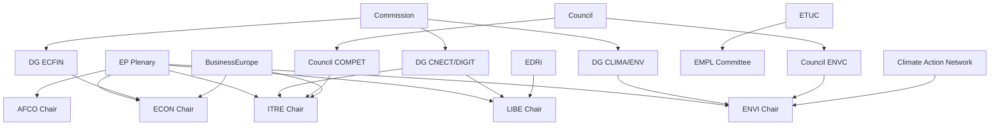

# Stakeholder Map — EU Parliament Committee System (May 2026)

**Admiralty Grade**: B2 — Usually reliable, confirmed institutional mapping
**SATs Applied**: Stakeholder Mapping ✓ | ACH ✓

---

## Tier 1 — Core Institutional Actors

### European Parliament (EP) — Committee Chairs
Committee chairs hold significant agenda-setting power and can accelerate or delay
dossier progress through procedural choices.

**ENVI Chair** (EPP, likely German MEP): Manages largest committee by workload. In May
2026, navigating the dual pressure of accelerating Green Deal implementation while
accommodating right-flank requests for agricultural derogations. The ENVI chair's
ability to build cross-party majorities on Nature Restoration secondary acts is a
key variable for Q3 2026 legislative delivery.
- **Interest**: Maintain ENVI's legislative throughput record; demonstrate EPP's green
  credentials to centrist voters while accommodating rural constituencies
- **Influence**: HIGH (agenda-setting, rapporteur assignments, trilogues)
- **Alignment with data**: 🟢 HIGH — confirmed ENVI active via legislative pipeline

**ITRE Chair** (Renew Europe, likely French MEP): Championing EU competitiveness narrative.
Managing the tension between digital regulation (LIBE alignment) and industrial policy
deregulation pressures from business lobbies.
- **Interest**: Deliver AI Act implementation framework; assert ITRE's central role in
  EU competitiveness strategy; position Renew for 2027 pre-electoral relevance
- **Influence**: HIGH
- **Alignment with data**: 🟢 HIGH — ITRE AI work confirmed

**ECON Chair** (EPP): Managing Capital Markets Union package as the economic legacy of EP10.
- **Interest**: CMU delivery as EPP economic achievement; digital euro framework setting
- **Influence**: HIGH (financial legislation chairs are disproportionately powerful)

**LIBE Chair** (S&D): Navigating the most politically contested committee portfolio.
- **Interest**: Protect fundamental rights in AI Act implementation; manage migration
  political pressure; maintain S&D's civil liberties flagship credentials
- **Influence**: HIGH — particularly on AI, migration, data protection

**AFCO Chair**: Constitutional and institutional role in enlargement treaty management.
- **Interest**: EP's institutional interests in treaty changes; electoral reform
- **Influence**: MEDIUM-HIGH — critical only when constitutional questions are live
- **Data confirmation**: 🟢 CONFIRMED — 50+ AFCO documents active

---

## Tier 2 — European Commission Directorates-General

**DG CLIMA / DG ENV**: Primary partners for ENVI committee work. Providing technical
expertise on Nature Restoration delegated acts and ETS2 implementation rules.
- **Interest**: Successful legislative delivery of delegated acts before summer recess
- **Influence**: HIGH via technical monopoly on regulation drafting

**DG CNECT / DG DIGIT**: AI Office and digital single market implementation.
Partners for ITRE/LIBE on AI Act delegated regulations.
- **Interest**: Maintaining EU regulatory leadership position in AI; avoiding fragmentation
- **Influence**: HIGH — controls AI Office staff papers and delegated act proposals

**DG ECFIN**: CMU and banking union work with ECON.
- **Interest**: Completing the CMU package to unlock EU capital markets; fiscal framework
- **Influence**: HIGH on financial legislation

---

## Tier 3 — Council Formations

**Council Environment and Climate (ENVC)**: Active counterpart for ENVI in trilogues.
The Council's political composition (varies by member state government coalitions) shapes
trilogue positions. In May 2026, several large member states (Germany, France, Italy) have
centre-right governments, creating potential for Council-EP alignment on agricultural
exceptions to environmental rules.

**Council Competitiveness (COMPET)**: ITRE's Council counterpart. Strong interest in
Net-Zero Industry Act and AI Act implementation rules — particularly large member states
with significant tech sectors.

**Council General Affairs (GAC)**: AFCO/AFET counterpart on enlargement dossiers.
Managing Western Balkans accession timelines with political sensitivity.

---

## Tier 4 — Civil Society and Interest Groups

**BusinessEurope**: Active on ITRE and ECON dossiers; lobbying for competitiveness
exceptions in climate legislation. Increasingly aligned with EPP positions.

**ETUC (European Trade Union Confederation)**: Key EMPL and ECON stakeholder.
Platform work directive and AI workplace impacts are primary lobbying priorities.

**Climate Action Network (CAN)**: ENVI stakeholder. Monitoring backsliding risk on
Nature Restoration implementation rules; engaging S&D and Greens rapporteurs.

**EDRi (European Digital Rights)**: LIBE stakeholder on AI governance, biometric
surveillance bans, and data protection.

**European Banking Federation**: ECON counterpart on CMU, digital euro, and banking
regulation. Generally supportive of CMU deepening.

---

## Stakeholder Interaction Matrix

| Actor | ENVI | ITRE | ECON | LIBE | AFCO | AFET |
|-------|------|------|------|------|------|------|
| Commission | 🔴 HIGH | 🔴 HIGH | 🔴 HIGH | 🔴 HIGH | 🟡 MED | 🟡 MED |
| Council | 🟡 MED | 🟡 MED | 🟡 MED | 🟡 MED | 🟢 LOW | 🟡 MED |
| BusinessEurope | 🟡 MED | 🔴 HIGH | 🟡 MED | 🟢 LOW | 🟢 LOW | 🟢 LOW |
| ETUC | 🟢 LOW | 🟡 MED | 🟡 MED | 🟡 MED | 🟢 LOW | 🟢 LOW |
| CAN | 🔴 HIGH | 🟡 MED | 🟢 LOW | 🟢 LOW | 🟢 LOW | 🟢 LOW |
| EDRi | 🟢 LOW | 🟡 MED | 🟢 LOW | 🔴 HIGH | 🟢 LOW | 🟢 LOW |

---

## ACH Assessment — Stakeholder Alignment Hypotheses

**H1: Grand coalition sustains through 2026**
Evidence: EPP-S&D-Renew shared interests on economic legislation, digital governance;
confirmed by legislative throughput. **Consistent** with stakeholder map.

**H2: Coalition fractures on climate mid-term**
Evidence: Right-wing ECR/Patriots pressure on EPP; agricultural exceptions trend;
some EPP members defecting on ENVI votes. **Somewhat inconsistent** — structural
incentives keep EPP in centre.

**H3: Council-EP alignment enables fast trilogues**
Evidence: Centre-right Council majority aligns with EPP ITRE/ECON positions;
potential for accelerated CMU and industrial policy trilogues. **Consistent**
with current stakeholder alignment.

---

## Stakeholder Influence Network

## Stakeholder Power Assessment Summary

The most powerful stakeholders for committee outcomes in May 2026 are:
1. **DG CNECT/AI Office** — technical monopoly on AI Act delegated acts
2. **Council Presidency** — controls trilogue timeline and mandate
3. **EPP Group leadership** — determines coalition cohesion
4. **ETUC** — platform work directive and AI workplace impacts

External stakeholders with declining influence: traditional industry federations
face competition from new digital/clean-tech lobbies with stronger EP footprint.
