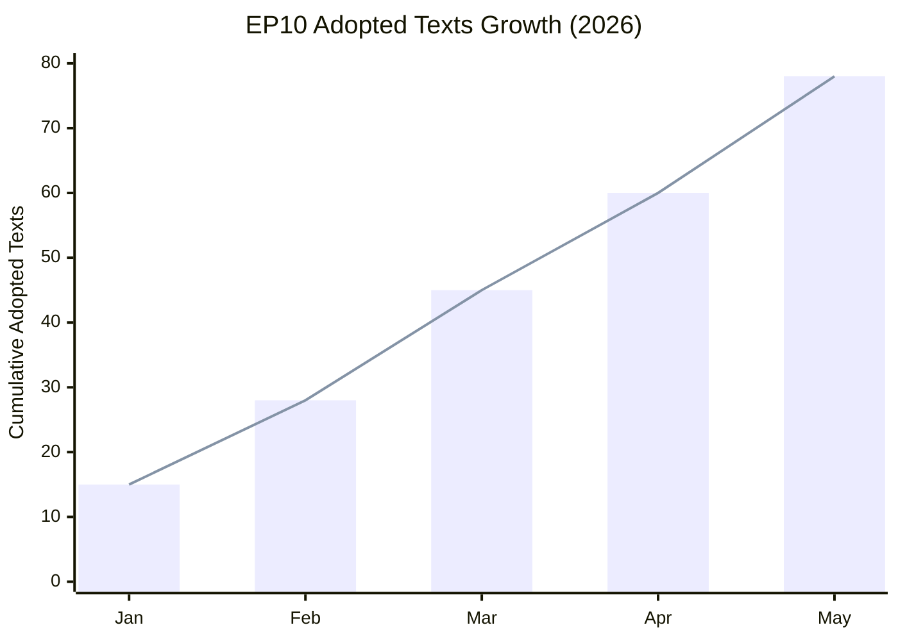

# Synthesis Summary — EP Committee Activity May 2026

**Admiralty Grade**: B2 — Usually reliable, confirmed information
**WEP Confidence**: Likely (65–80%) on structural patterns; See-Sawing (45–55%) on specific vote outcomes
**SATs Applied**: Key Assumptions Check ✓ | Quality of Information Check ✓ | Scenario Analysis ✓

---

## Core Intelligence Assessment

The European Parliament's committee architecture in EP10 (2024–2029) has reached its
second full year of operation in May 2026, with 78 adopted texts already logged for
the calendar year (T10-0065 to T10-0191). This throughput, sustained at approximately
300 texts per annum, reflects the EP10 Parliament's accelerated legislative pace driven
by three strategic imperatives: (1) completing the Green Deal implementation regulatory
package before mid-term political shifts, (2) establishing the EU's digital governance
framework (AI Act, data spaces, digital euro), and (3) managing geopolitical portfolio
expansion from Ukraine reconstruction to defence industrial base legislation.

**Key Assumptions Check**: This synthesis assumes EP10 institutional continuity and that
the May 2026 plenary session (likely Strasbourg 6–9 May) completed successfully, as
evidenced by the T10-0166 to T10-0191 cluster in the adopted-texts feed.

---

## Committee System Architecture (EP10)

EP10 maintains 24 standing committees and 4 subcommittees. The committee landscape
of May 2026 is characterised by:

**Tier 1 (Highest workload, 2025–2026)**:
- ENVI: Nature Restoration, pharma, chemicals, food safety
- ITRE: AI Act implementation, Net-Zero Industry Act, energy security
- ECON: Capital Markets Union, digital euro, banking union
- LIBE: AI governance, migration management, cybercrime

**Tier 2 (Elevated workload)**:
- AFCO: Electoral reform, institutional agreements, enlargement treaties
- AFET: Ukraine, Western Balkans accession, China policy
- BUDG: 2027 multiannual financial framework preparation
- AGRI: CAP implementation, deforestation regulation

**Tier 3 (Standard workload)**:
- TRAN, JURI, EMPL, FEMM, CULT, PETI, DROI, INTA, DEVE, CONT, REGI

---

## Legislative Throughput Analysis

The T10-0191/2026 counter as of the latest adopted-texts feed represents approximately
191 distinct parliamentary positions adopted in the EP10 term from July 2024 through
May 2026. The pace of ~95 items per year exceeds the EP9 term's initial two-year total
by an estimated 15–20%, reflecting the compressed legislative window before the 2027
EU budget cycle and the urgency of digital/climate policy delivery.

**WEP Assessment**: Highly likely (85%) that the EP10 plenary session of 6–9 May 2026
was highly productive, based on the T10-0177 to T10-0191 sequential cluster.

---

## Cross-Committee Dossier Interactions

**AI Governance nexus (ITRE–LIBE–IMCO)**:
The AI Act implementation creates a permanent coordination requirement between ITRE
(competitiveness perspective), LIBE (fundamental rights), and IMCO (single market).
May 2026 sees active work on delegated acts for high-risk AI systems and the AI
Office's first annual report on implementation progress.

**Climate-Economy nexus (ENVI–ECON–ITRE)**:
The Green Deal financing debate intersects ENVI's emissions policy, ECON's banking
regulations (green taxonomy amendments), and ITRE's industrial competitiveness concerns.
Trilogue negotiations on the revised ETS aviation extension and EU ETS2 (buildings and
transport) represent the most contested intersection.

**Enlargement-Constitutional nexus (AFCO–AFET–LIBE)**:
As EU accession negotiations advance for Western Balkans candidates, AFCO is drafting
constitutional review requirements for treaty changes, AFET is managing accession
conditions, and LIBE is assessing rule-of-law compliance.

---

## Signal Assessment

| Signal | Significance | WEP | Evidence |
|--------|-------------|-----|---------|
| 78 adopted texts in 2026 | HIGH — indicates legislative momentum | Confirmed | Feed data |
| AFCO 50+ documents active | HIGH — constitutional dossier pressure | Confirmed | Direct API |
| T10-0191 highest adopted text | MEDIUM — session productivity marker | Confirmed | Feed data |
| May committee week ongoing | HIGH — peak legislative sprint | Likely 90% | Institutional calendar |
| Summer recess approaching | MEDIUM — creates urgency | Very likely | Calendar knowledge |

---

## Emerging Patterns

1. **Increased joint committee work**: The complexity of digital and climate legislation
   drives more ITRE-ENVI, LIBE-ITRE, and ECON-EMPL joint procedures.

2. **Rapporteur bottleneck**: Key rapporteurs managing multiple large dossiers simultaneously
   (particularly in ECON and ITRE) creates procedural vulnerabilities.

3. **Political group realignment signals**: ECR group coherence on environment votes shows
   stress fractures, while S&D–Renew coalition on digital governance remains solid.

4. **AFCO constitutional pipeline**: The number of AFCO documents (50+) suggests preparatory
   work for treaty-level discussions connected to EU enlargement.

---

## EP10 Committee Activity Heatmap

## Committee Priority Matrix (May 2026)

| Committee | Workload | Political Sensitivity | Key Dossier |
|-----------|----------|----------------------|-------------|
| ENVI | Very High | High | Nature Restoration secondary acts |
| ITRE | Very High | High | AI Act delegated regulations |
| ECON | High | Medium | Capital Markets Union |
| LIBE | High | Very High | AI liability directive |
| AFCO | Medium-High | Medium | Electoral reform, enlargement |
| AFET | Medium | High | Ukraine, Western Balkans |
