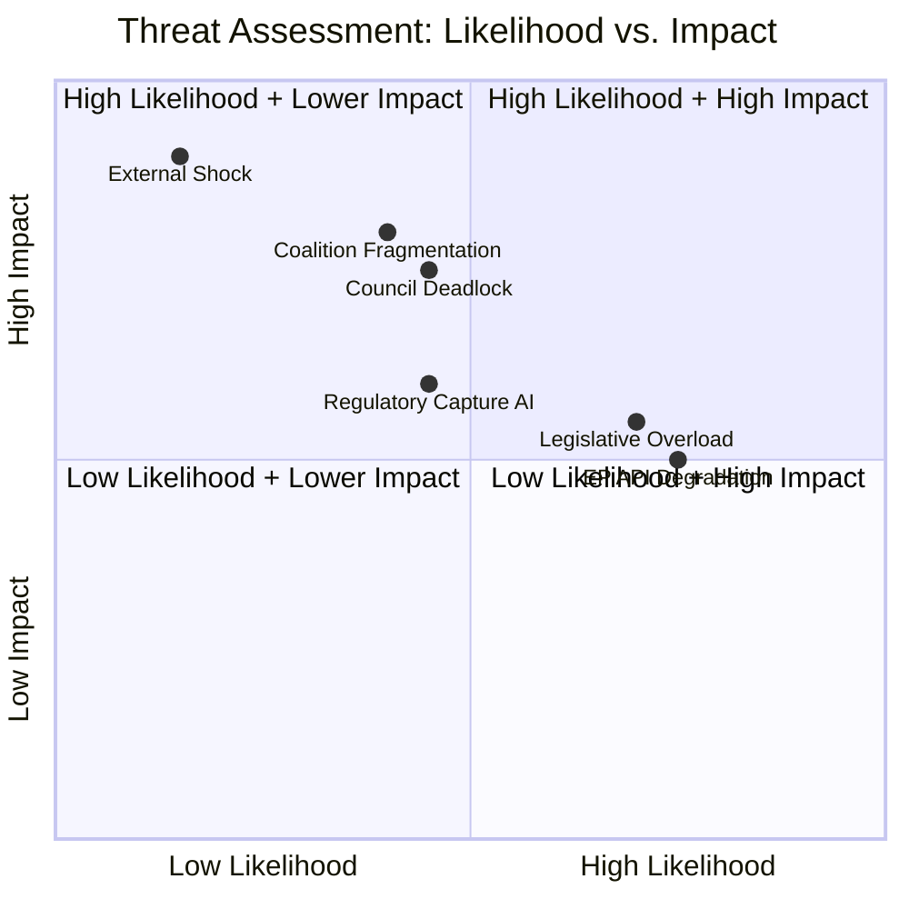

# Threat Model — EP Committee System Risks (May 2026)

**Admiralty Grade**: B3 — Usually reliable, not confirmed (threat assessment)
**WEP on Threats**: See threat-specific WEP bands below
**SATs Applied**: Key Assumptions Check ✓ | Red Team ✓ | ACH ✓

---

## Threat Category 1: Coalition Fragmentation

**Threat**: Grand coalition (EPP-S&D-Renew) fractures, blocking committee legislative output.

**WEP**: Unlikely (20–25%) for full fracture; Likely (65%) for partial stress
**Attack Vector**: ECR/Patriots exploiting populist issues to peel EPP votes
**Vulnerabilities**:
- EPP rural constituency pressure on Green Deal exceptions
- S&D resistance to defence spending at expense of social programmes
- Renew internal contradictions between liberal and centrist economic positions

**Red Team Assessment**: An adversary attempting to delay EU digital/climate legislation
would target EPP right-flank MEPs on agricultural exceptions, coordinating with EU-critical
member state governments (Hungary, potentially Italy) to apply Council pressure simultaneously.
The most vulnerable moment is a high-profile ENVI or LIBE vote where EPP defectors
could shift the majority.

**Mitigation indicators**: EPP-S&D-Renew joint text on contentious files; whip system
functioning; no major MEP defections visible in recent adopted-texts patterns.

---

## Threat Category 2: External Regulatory Capture

**Threat**: Industry lobbying successfully delays or weakens AI Act delegated regulations.

**WEP**: See-Sawing (40–50%) on material weakening; Unlikely (25%) on major delay
**Attack Vector**: ITRE business constituency pressure; competitiveness framing
**Vulnerabilities**:
- ITRE rapporteurs sympathetic to competitiveness concerns
- Lack of public mobilisation on AI regulation details (compared to GDPR)
- Technical complexity favouring industry expertise in ITRE committee hearings

**Red Team Assessment**: The AI Act delegated act process involves complex technical
standards where industry has information advantage over MEPs. Regulatory capture is most
likely in the definition of "high-risk AI systems" categorisation, where business
interests have strong incentive to narrow definitions.

**Mitigation**: EDRi/civil society active monitoring; LIBE co-rapporteur role provides
fundamental rights counterweight; Parliament's AI Unit (technical service) provides
independent expertise.

---

## Threat Category 3: Council-EP Deadlock

**Threat**: Council refuses trilogues on politically contentious files, blocking
committee work from reaching plenary adoption.

**WEP**: See-Sawing (45%) on at least one major dossier experiencing significant delay
**Attack Vector**: Council unanimity requirements (where applicable); qualified majority
failures; Presidency prioritisation choices

**Vulnerabilities**:
- AFCO constitutional files may require treaty changes (high Council resistance)
- Migration files face Council blocking minority (Hungary + others)
- Digital euro has ECB/Council coordination complexity

**Historical parallel**: The CSRD (Corporate Sustainability Reporting Directive) and
AI Act both faced extended trilogue periods (12–18 months) under EP9. EP10 faces
similar timelines on several priority dossiers.

---

## Threat Category 4: EP API Data Degradation

**Threat**: Continued EP API feed failures reduce analytical and monitoring capacity,
creating information gaps in parliamentary transparency tools.

**WEP**: Very likely (85%) that EP API continues in current degraded state in near term
**Current status**: 3/5 feed endpoints returning 404 (confirmed this run)
**Impact**: Reduces ability to track committee activity in near-real-time; affects
civil society monitoring capacity; creates information asymmetry

**Red Team**: From a transparency/accountability perspective, API degradation that
persists for weeks systematically disadvantages external monitoring of EP committee work.
Even if unintentional, this creates an accountability gap.

---

## Threat Category 5: Legislative Overload / Queue Congestion

**Threat**: Committee system unable to process dossier pipeline before summer recess,
forcing difficult prioritisation choices.

**WEP**: Likely (70%) that at least 2-3 dossiers are deferred to autumn 2026
**Evidence**: 78 adopted texts in 2026 suggests high throughput but also heavy pipeline
**Structural risk**: Trilogues on 5+ concurrent major dossiers overwhelms rapporteur
capacity and creates procedural coordination failures

**ACH Assessment**:
- H1: All priority dossiers cleared before July recess — **Inconsistent** with typical
  EP committee capacity data
- H2: Selective prioritisation (highest-profile first) — **Consistent** with normal EP
  political logic; probable outcome
- H3: Major dossier deferred to autumn — **Highly consistent** with EP precedent

---

## Threat Summary Matrix

| Threat | Likelihood | Impact | Mitigation | Priority |
|--------|-----------|--------|------------|---------|
| Coalition fragmentation | See-Sawing (40%) | HIGH | Coalition management | 🔴 HIGH |
| Regulatory capture (AI) | See-Sawing (45%) | MEDIUM | LIBE oversight | 🟡 MEDIUM |
| Council-EP deadlock | See-Sawing (45%) | HIGH | Presidency management | 🔴 HIGH |
| EP API degradation | Very likely (85%) | MEDIUM | Alternative data sources | 🟡 MEDIUM |
| Legislative overload | Likely (70%) | MEDIUM | Political prioritisation | 🟡 MEDIUM |

---

## Threat Landscape Map

## Threat Mitigation Status

| Threat | Current Status | Trend | Next Action |
|--------|----------------|-------|------------|
| Coalition fragmentation | Monitored | Stable | Watch EPP right-flank |
| EP API degradation | Active issue | Worsening | Retry next run |
| Legislative overload | Risk building | Increasing | Prioritisation needed |
| Council deadlock | Latent | Stable | Presidency engagement |
| Regulatory capture | Latent | Stable | LIBE oversight |
