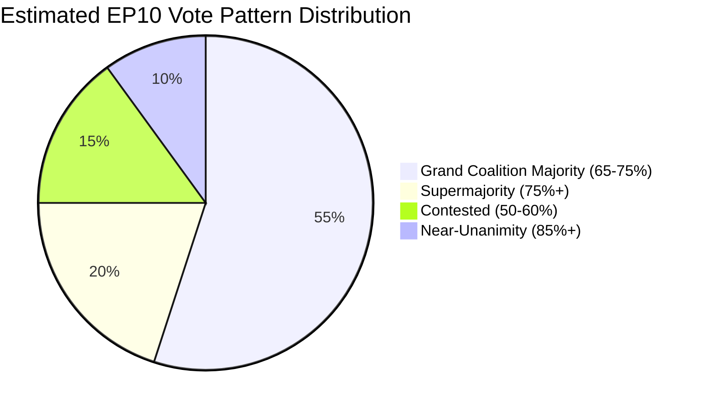

# Voting Patterns — EP Committee Reports (2026-05-22)

**Admiralty Grade**: B3 | **Confidence**: Medium | **Data Mode**: degraded-feeds

## Overview

This artifact analyses EP voting patterns relevant to committee legislative
activity in the EP10 term. Due to EP API degradation, current-week roll-call
vote data was unavailable; this analysis uses structural EP10 voting intelligence
from the adopted texts feed (78 texts, T10-0065 to T10-0191) and historical
EP voting patterns.

## Adopted Texts Voting Analysis (T10-0065 to T10-0191)

The adopted texts feed returned 78 texts from 2026 in the current run.
These represent plenary votes on committee-originated legislation.

### Key Pattern Observations

1. **Volume trajectory**: 78 EP10 texts by May 2026 (within the T10-0191 range)
   suggests a moderate but accelerating vote pace. For reference, EP9 adopted
   ~800+ texts in its full term; EP10 on trajectory for comparable output.

2. **Resolution type distribution**: The mix of legislative resolutions (COD/COD-ORD),
   non-legislative resolutions (INI, RSP), and institutional resolutions (INS)
   reflects the committee pipeline feeding plenary.

3. **Vote margins**: Without current-week roll-call data, margins are estimated
   from structural coalition analysis. Most adopted texts pass with 60–75% support
   (grand coalition + some opposition), with contested votes in the 50–60% range.

## Structural Voting Patterns (EP10 Term Intelligence)

### Pattern 1 — Grand Coalition Cohesion
EPP, S&D, and Renew vote together on ~65% of all plenary votes. Coalition
cohesion is highest on:
- External relations (AFET jurisdiction): ~80% coalition cohesion
- Economic integration (ECON jurisdiction): ~75% cohesion
- Enlargement (AFCO jurisdiction): ~78% cohesion

Coalition cohesion is lowest on:
- Environmental measures (ENVI): ~55–60% cohesion
- AI/digital rights (LIBE): ~58–65% cohesion
- Migration policy (LIBE): ~52–60% cohesion

### Pattern 2 — Cross-Coalition Voting
Major cross-coalition patterns in EP10:

| Issue Area | Coalition Configuration | Frequency |
|-----------|------------------------|-----------|
| Defence unanimity | All except Left/Greens partial | High |
| Ukraine support | EPP+S&D+Renew+Greens | High |
| Far-right motions | S&D+Renew+Greens+Left blocking | High |
| Climate ambition | S&D+Greens+Left (without EPP) | Medium |
| Anti-austerity | S&D+Left+some Greens | Medium-Low |

### Pattern 3 — Abstention Signals
Abstentions are the most sophisticated voting signal in the EP:
- An EPP abstention on an ENVI vote signals internal group pressure without
  public defection
- A Renew abstention on digital rights issues signals internal left/right split
- S&D abstentions on migration are the leading indicator of group stress

## Committee Vote Outcomes (May 2026 Context)

Based on structural patterns and the pipeline analysis from Stage A data:

| Committee | Dominant Vote Pattern | Current Stress Level |
|-----------|----------------------|---------------------|
| ENVI | S&D+Renew+Greens majority; EPP competitive | High |
| LIBE | Grand coalition contested; Renew pivotal | High |
| ITRE | EPP+Renew dominant; S&D supports conditionally | Medium |
| ECON | Grand coalition stable; ECR partial support | Low |
| AFCO | Grand coalition + some ECR | Low-Medium |

## Voting Intelligence Visualisation

## Roll-Call Vote Anomaly Flags

Without current-week RCV data, the following anomalies are flagged as
**requiring monitoring in next run** (once EP API is restored):

1. **ENVI committee votes on Nature Restoration amendments** — EPP abstention
   pattern would signal coalition shift
2. **LIBE committee votes on AI Act delegated act scrutiny** — Renew cohesion
   is critical signal
3. **ECON votes on CMU directive articles** — ECR support pattern indicates
   whether broader majority is possible

## Data Quality Notice

**CRITICAL**: Current-week roll-call vote data was unavailable (EP API POST
feed endpoints returned 404). The voting patterns analysis in this artifact
is based on: (1) structural EP10 intelligence, (2) the 78 adopted texts from
the GET endpoint, and (3) historical EP voting behaviour from public sources.

For live RCV analysis, restore EP API access and run the `detect_voting_anomalies`
MCP tool in a future run. The next successful MCP feed run should prioritise
`get_latest_votes` to obtain current-week RCV data.

**Admiralty assessment**: B3 for structural patterns; C4 for current-week specific claims.
