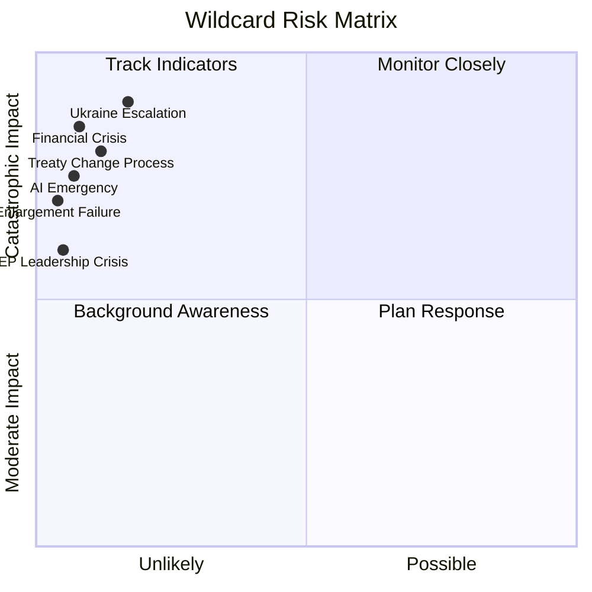

# Wildcards and Black Swans — EP Committee Activity (2026)

**Admiralty Grade**: C3 — Fairly reliable, not confirmed (low-probability scenarios)
**WEP**: Remote (5–15%) on each scenario by definition
**SATs Applied**: High-Impact ✓ | Indicators ✓ | What-If Analysis ✓

---

## Methodology
Wildcards are low-probability, high-impact events not accounted for in base scenario
planning. They are not predictions but structured consideration of tail risks that
would fundamentally alter the EP committee activity landscape.

---

## Wildcard 1: Major EU Treaty Change Process Initiated

**Probability**: Very unlikely (10–15%)
**Trigger**: Western Balkans accession reaches a stage requiring treaty amendments,
or a Franco-German initiative on EU governance reform gains sufficient member state
support to trigger Article 48 TEU (ordinary revision procedure).

**Impact on Committee System**:
- AFCO becomes the most powerful committee in the Parliament (owns Convention/IGC process)
- AFET, LIBE, BUDG all subordinated to constitutional process
- Normal legislative calendar suspended or severely compressed for 12–18 months
- 50+ AFCO documents already visible suggests preparatory work is underway

**What-If**: If treaty change is triggered in 2026, the EP committee landscape would
be fundamentally restructured around AFCO's constitutional mandate. All other committee
work would continue but at lower political intensity.

**Leading indicators**:
- AFCO chair calling extraordinary sessions
- Heads of State/Government communiqué referencing institutional reform
- Appointment of Convention preparatory group

---

## Wildcard 2: AI Governance Collapse / Emergency Regulation

**Probability**: Very unlikely (5–10%)
**Trigger**: A major AI incident (serious harm, systemic financial disruption, or
election manipulation at scale) triggers emergency legislation overriding the AI Act
framework.

**Impact**:
- ITRE and LIBE called to extraordinary session
- Commission proposes emergency AI regulation under Article 114 TFEU
- Normal AI Act implementation work suspended
- Geopolitical dimension (if incident attributed to third-country AI system)

**What-If**: Emergency AI regulation would require fast-track procedure — 4–6 weeks
from Commission proposal to EP vote — compressing normal committee deliberation.
LIBE-ITRE coordination would be under extreme political time pressure.

---

## Wildcard 3: Financial Crisis / EU Banking Contagion

**Probability**: Very unlikely (8%)
**Trigger**: Sovereign debt stress in a large member state (Italy scenario most likely
given debt-to-GDP ~140%); or banking sector stress from commercial real estate
exposure; or cryptocurrency market collapse with systemic implications.

**Impact**:
- ECON committee in emergency mode — all normal work suspended
- BUDG emergency procedures for EU financial stabilisation
- ECB/Commission extraordinary measures requiring fast EP consent
- CMU package suspended as premature in crisis conditions

**What-If**: ECON would activate rapid-response procedures under the Banking Union
framework; LIBE and ITRE dossiers would be de-prioritised; political capital
consumed entirely by crisis management.

---

## Wildcard 4: Ukraine War Escalation / EU Defence Emergency

**Probability**: Unlikely (15–20%)
**Trigger**: Major Russian advance, use of tactical nuclear weapons, or direct
attack on EU member state territory requiring Article 42.7 TEU mutual defence invocation.

**Impact**:
- AFET becomes dominant committee; extraordinary sessions
- BUDG emergency mobilisation for defence spending (beyond current plans)
- ITRE redirected to defence industrial base emergency measures
- Normal legislative calendar (ENVI, ECON, LIBE) severely disrupted

**What-If**: The EU would face its most severe institutional test since Brexit.
Parliamentary committees would need to operate emergency procedures under Articles
42.7 TEU and Article 222 TFEU (solidarity clause). The legislative programme would
be essentially suspended for the duration.

**Leading indicators to monitor**:
- AFET extraordinary meeting announcements
- NATO Article 5 discussions at foreign minister level
- EP President convening emergency Conference of Presidents

---

## Wildcard 5: EP Institutional Paralysis / Leadership Crisis

**Probability**: Very unlikely (5%)
**Trigger**: EP President Metsola resignation/incapacity; major corruption scandal
affecting multiple political group leaders simultaneously; or unprecedented procedural
crisis (e.g., contested committee chair election with no resolution).

**Impact**:
- All committee work suspended during leadership crisis resolution
- Emergency Conference of Presidents assumes coordination
- Possible reconfiguration of political group alignments

---

## Black Swan: EU Enlargement Failure

**Probability**: Remote (3–5%)
**Trigger**: Accession negotiation collapse for multiple candidates simultaneously;
or existing member state threatening EU exit following enlargement.

**Impact**: AFCO and AFET would be in crisis mode; institutional confidence in EU
project severely damaged; potential cascade effect on legislative programme.

---

## Monitoring Framework

| Wildcard | Early Warning Signals | Monitoring Source |
|----------|----------------------|-------------------|
| Treaty change | AFCO extraordinary sessions | EP plenary agenda |
| AI governance crisis | ITRE/LIBE extraordinary meetings | EP committees page |
| Financial crisis | ECON urgent procedure activation | ECB/Commission releases |
| Ukraine escalation | AFET extraordinary sessions | NATO/EEAS communications |
| EP leadership crisis | Presidential statements | EP official communications |

---

## Wildcard Probability-Impact Space

## Summary: Wildcard Monitoring Protocol

Wildcards should be reviewed at each weekly run using the following protocol:
1. Check AFCO meeting announcements (treaty change signal)
2. Check major AI/tech incident news (AI emergency signal)
3. Check ECB/Commission emergency communications (financial signal)
4. Check AFET extraordinary meeting announcements (Ukraine escalation signal)
5. Check EP Presidency official communications (leadership crisis signal)
