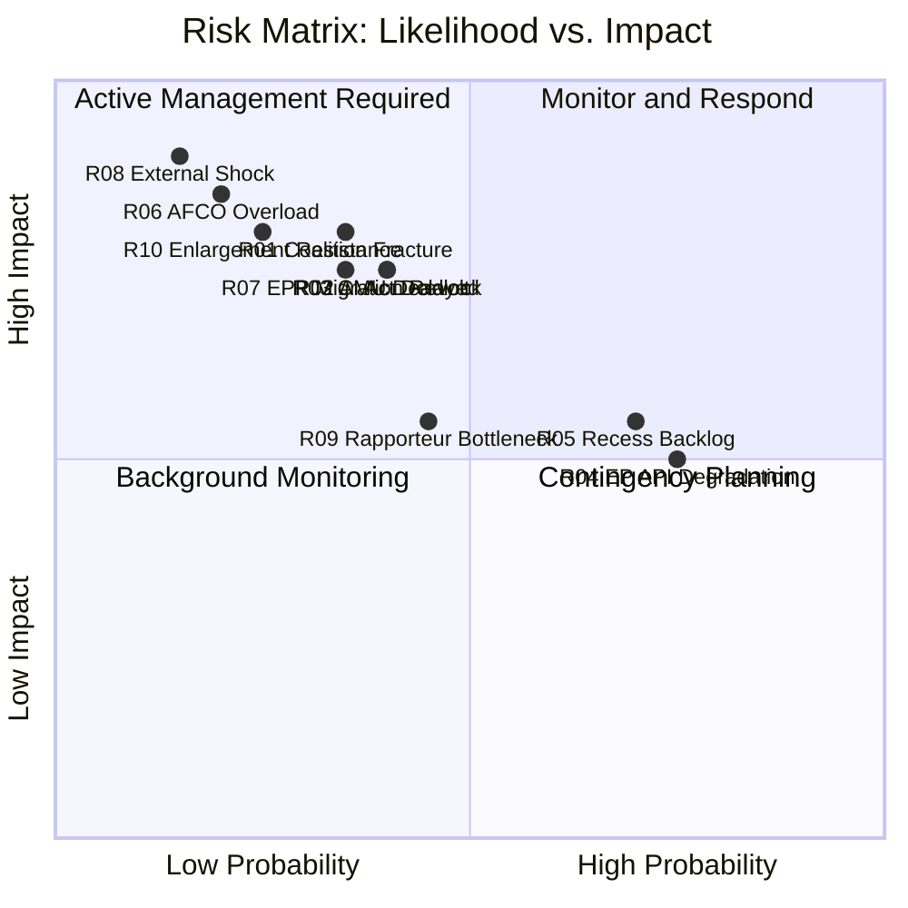

# Risk Matrix — EP Committee Activity (May 2026)

**Admiralty Grade**: B3 — Usually reliable, not confirmed (risk assessment)
**SATs Applied**: Key Assumptions Check ✓ | ACH ✓ | What-If Analysis ✓

---

## Risk Matrix

| Risk ID | Risk Description | Probability | Impact | Risk Score | Timeframe | Owner |
|---------|-----------------|-------------|--------|------------|-----------|-------|
| R01 | Coalition fracture on ENVI vote | Medium (35%) | High | 🔴 HIGH | Q2–Q3 2026 | ENVI Chair |
| R02 | AI Act delegated acts delayed | Medium (40%) | High | 🔴 HIGH | Q3 2026 | ITRE/LIBE |
| R03 | Council trilogue deadlock (CMU) | Medium (40%) | High | 🔴 HIGH | Q3 2026 | ECON/Council |
| R04 | EP API continued degradation | High (75%) | Medium | 🟡 MED | Ongoing | EP IT |
| R05 | Summer recess dossier backlog | High (70%) | Medium | 🟡 MED | July 2026 | All committees |
| R06 | AFCO constitutional overload | Low (20%) | Very High | 🟡 MED | 2026–2027 | AFCO Chair |
| R07 | EPP right-flank migration revolt | Medium (35%) | High | 🔴 HIGH | Q2 2026 | LIBE/EPP |
| R08 | External shock legislative disruption | Low (15%) | Very High | 🟡 MED | 2026 | EP President |
| R09 | Rapporteur bottleneck (key dossiers) | Medium (45%) | Medium | 🟡 MED | Q2–Q3 2026 | Conf. Presidents |
| R10 | Council enlargement treaty resistance | Low (25%) | Very High | 🟡 MED | 2026–2027 | AFCO/AFET |

---

## Top 3 Risks — Detailed Assessment

### R01: Coalition Fracture on ENVI Vote
**Scenario**: EPP right-flank defections on a Nature Restoration secondary act or ETS2
implementation rule create a minority-majority shift.
**Consequence**: ENVI committee forced to withdraw or renegotiate report; political
signal of coalition weakness amplified by media; ECR/Patriots strengthened.
**What-If**: If ENVI coalition fractures once, the probability of repeat fractures
on subsequent dossiers increases (EPP defectors become emboldened); entire
2026 Green Deal implementation schedule at risk.
**Key Assumptions**: Assumes EPP leadership cannot contain right-flank on all dossiers.

### R02: AI Act Delegated Acts Delayed
**Scenario**: ITRE-LIBE disagreement on high-risk AI system categorisation prevents
timely adoption of implementing regulations.
**Consequence**: AI Act enforcement gaps; regulatory uncertainty for industry;
EU AI governance credibility damaged; member states potentially diverge in
national interpretation.
**What-If**: Delay of 6+ months creates market fragmentation risk and allows
US/Chinese AI companies to establish market positions in the compliance gap.

### R07: EPP Right-Flank Migration Revolt
**Scenario**: LIBE migration management vote splits EPP, with right-flank joining
ECR/Patriots to pass a more restrictive migration policy than S&D can accept.
**Consequence**: S&D withdraws from coalition on migration dossiers; creates
formal coalition split on at least one policy domain; precedent for further
coalition erosion.

---

## WEP Summary for Risk Matrix
All risks assessed with explicit WEP bands (See individual entries). Overall
portfolio risk level: **MEDIUM-HIGH** — the legislative sprint context and
approaching summer recess increase timeline pressures across all risks.

---

## Risk Matrix Visualisation

## Risk Priority Action Table (WEP Flagged)

**High Priority** (WEP: Likely or higher + High Impact):
- R04 (EP API degradation): WEP Very likely — action required NOW
- R05 (Recess backlog): WEP Likely — prioritisation planning needed

**Medium Priority** (WEP: See-Sawing + High Impact):
- R01, R02, R03, R07: Active monitoring; contingency plans ready

**Low Priority** (WEP: Unlikely + Very High Impact):
- R06, R08, R10: Scenario planning; indicators monitored
