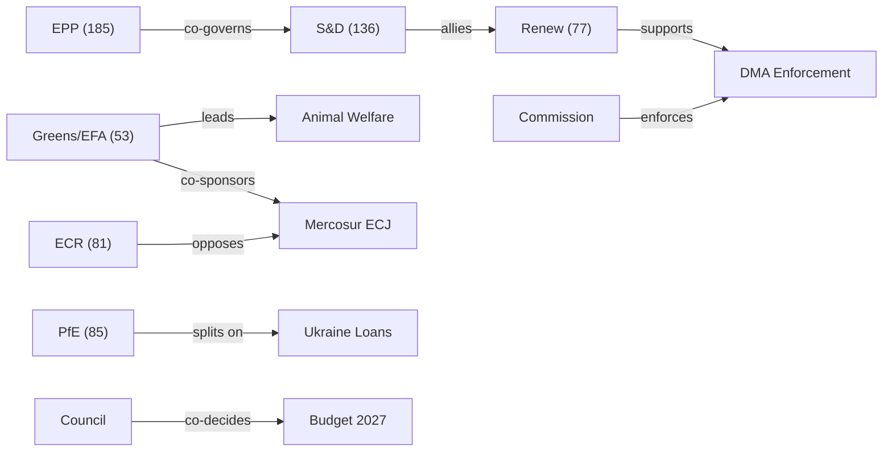
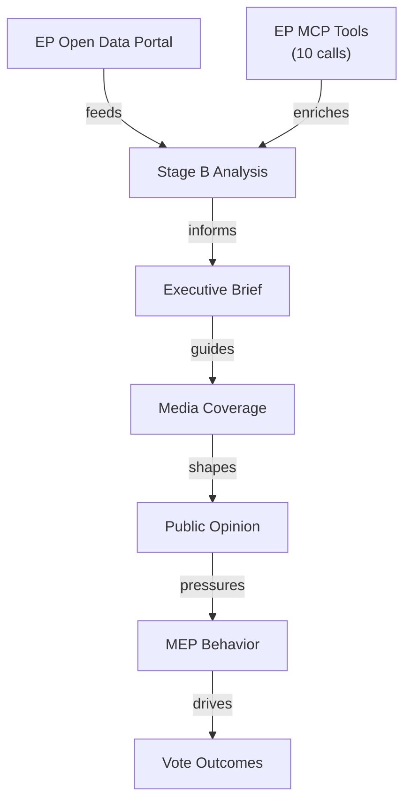

# Actor Mapping — EU Parliament Legislative Propositions
**Date:** 2026-05-22 | **Admiralty Grade:** B2 | **Data Mode:** degraded-feeds

## 1️⃣ Actor Roster

| Actor | Type | Seat Share / Role | Influence Weight | Key File |
|-------|------|------------------|-----------------|---------|
| EPP (185 MEPs) | Political Group | 25.7% | HIGH | DMA, Ukraine, Budget |
| S&D (136 MEPs) | Political Group | 18.9% | HIGH | Ukraine, Animal Welfare |
| PfE (85 MEPs) | Political Group | 11.8% | MEDIUM | Ukraine (split) |
| ECR (81 MEPs) | Political Group | 11.3% | MEDIUM | Anti-Mercosur |
| Renew Europe (77 MEPs) | Political Group | 10.7% | MEDIUM-HIGH | DMA lead |
| Greens/EFA (53 MEPs) | Political Group | 7.4% | MEDIUM | Mercosur, Animal Welfare |
| The Left (45 MEPs) | Political Group | 6.3% | LOW-MEDIUM | Animal Welfare, Mercosur |
| NI (30 MEPs) | Non-attached | 4.2% | LOW | Fragmented |
| ESN (27 MEPs) | Political Group | 3.8% | LOW | Far-right opposition |
| European Commission (DG COMP) | Institution | Enforcement authority | HIGH | DMA |
| European Commission (DG TRADE) | Institution | Negotiation mandate | HIGH | Mercosur |
| Council Presidency (Poland) | Institution | Co-decision partner | MEDIUM | Budget |
| ECJ (Grand Chamber) | Judicial Body | Opinion jurisdiction | HIGH (legal) | Mercosur |
| COPA-COGECA | Lobby | Agricultural interests | MEDIUM | Mercosur |
| BEUC | Civil Society | Consumer advocacy | LOW | DMA |

## 2️⃣ Influence × Position Grid

| Actor | DMA Enforcement | Mercosur ECJ | Ukraine Loans | Animal Welfare | Budget 2027 |
|-------|----------------|-------------|--------------|----------------|------------|
| EPP | 🟢 SUPPORT | 🔴 SPLIT | 🟢 SUPPORT | 🟢 SUPPORT | 🟡 CONDITIONAL |
| S&D | 🟢 STRONG | 🟢 SUPPORT | 🟢 STRONG | 🟢 STRONG | 🟡 SPLIT (N-S) |
| Renew | 🟢 LEADS | 🔴 OPPOSES | 🟢 SUPPORT | 🟡 CONDITIONAL | 🟡 CONDITIONAL |
| Greens/EFA | 🟢 SUPPORT | 🟢 LEADS | 🟢 SUPPORT | 🟢 STRONG | 🟢 CLIMATE+ |
| ECR | 🔴 OPPOSES | 🔴 OPPOSES | 🟡 SPLIT | 🟡 NEUTRAL | 🔴 CUTS |
| PfE | 🔴 OPPOSES | 🔴 OPPOSES | 🔴 SPLITS | 🟡 NEUTRAL | 🔴 CUTS |
| The Left | 🟢 SUPPORT | 🟢 SUPPORT | 🟢 SUPPORT | 🟢 STRONG | 🟢 SOCIAL+ |
| Commission | 🟡 CONTESTED | 🟡 DEFENDS | 🟢 CO-AUTHORS | N/A | 🟡 PROPOSES |
| Council | N/A | 🔴 DELAYS | 🟢 CO-DECIDES | 🟡 TRANSPOSES | 🔴 FISCAL HAWK |

## 3️⃣ Alliance & Tension Network

**Primary governing coalition**: EPP (185) + S&D (136) + Renew (77) = 398/719 (55.4%)
This coalition is stable on: Ukraine, DMA enforcement, Budget (at guidelines level).
It is stressed on: Mercosur (Renew opposes ECJ referral), Animal Welfare (EPP split).

**Tension pairs**:
- EPP vs. Greens/EFA on Mercosur trade provisions (high tension)
- S&D vs. Council net-payer bloc on Budget 2027 spending levels
- Commission vs. EP on DMA enforcement autonomy (institutional tension)
- PfE internal split: French RN pro-Ukraine vs. Hungarian Fidesz anti-Ukraine

## 4️⃣ Top-3 Power Brokers — Profiles

**Power Broker 1: EPP Group** (185 seats, ~26% of Parliament)
EPP holds the swing vote on nearly every file in this cycle. On Mercosur, EPP is internally
divided between agricultural-producing delegations (Spain, Poland) that support the ECJ
referral and trade-oriented delegations (Germany, Netherlands) that oppose delays. EPP's
Ursula von der Leyen Commission connection creates an institutional leverage channel. On DMA,
EPP supports enforcement but prefers a Commission-led approach (not EP-led Article 265 threat).

**Power Broker 2: European Commission (DG COMP + DG TRADE)**
The Commission is simultaneously defender of DMA enforcement autonomy (resisting EP's
Article 265 threat), Mercosur deal champion (defending the trade agreement against ECJ
referral), and Ukraine loan co-author. Its dual role as both proposing and defending institution
makes it the most consequential single actor in the current legislative cycle.

**Power Broker 3: ECR Group** (81 seats)
ECR is the key opposition force that determines whether the governing coalition needs to reach
beyond its 398-seat floor. On Ukraine, ECR is split (Polish PiS supports; Hungarian interests
oppose). On Mercosur, ECR consistently opposes (agricultural constituencies). ECR's position
is particularly important on Budget 2027 where it could form a blocking minority with PfE+ESN
against progressive spending plans.

## 5️⃣ Information-Flow Map

Key information flows relevant to current files:
- Commission publishes DMA investigation timelines → EP monitors compliance deadlines
- ECJ Advocate General signals anticipated via legal community → shapes Mercosur narrative
- IMF WEO figures → inform Budget 2027 fiscal space discussions
- Ukrainian government requests → shape loan conditionality discussions

## 6️⃣ Reader Briefing

The European Parliament is currently governed by an effective three-party coalition of EPP,
S&D, and Renew Europe, controlling 398 of 719 seats. This coalition is sufficient to pass
most legislation but is showing stress points on trade policy (Mercosur) and faces a large
opposition bloc from the nationalist right (ECR+PfE+ESN = 193 seats).

For citizens: The key actors to watch are (1) EPP's internal cohesion on trade and budget
issues — if EPP splits, coalition math breaks down; (2) the Commission's response to EP
pressure on DMA enforcement — this will set the precedent for EP-Commission relations in
EP10; and (3) PfE's internal Ukraine split — if Marine Le Pen's RN faction separates from
Orbán's Fidesz formally, the right-wing landscape changes dramatically.

| Admiralty | B2 | Reliable source; likely true |
|-----------|----|-----------------------------|
